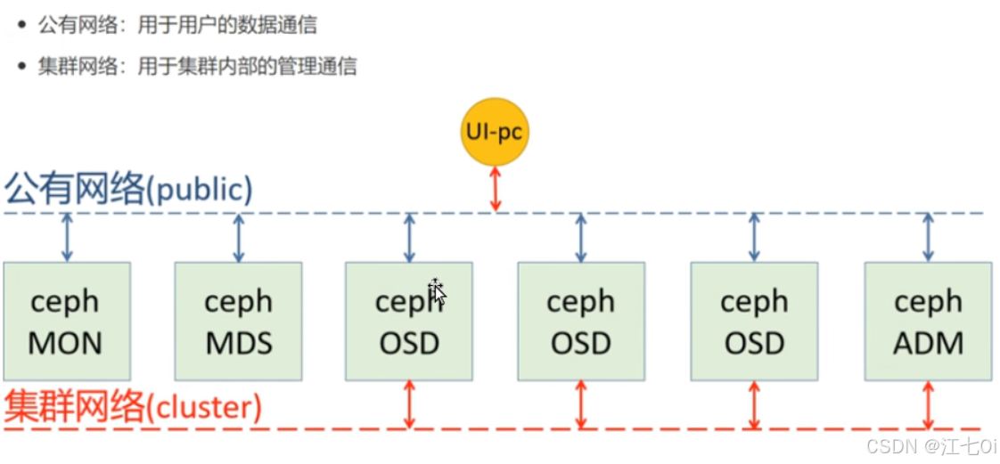

# Ceph简介

# 部署Ceph集群的三种方法

### ceph-deploy

- 一个集群自动化部署工具，使用较久，成熟稳定，被很多自动化工具所集成，可用于生产部署

### cephadm

- 从 Octopus 和较新的版本版本后使用 cephadm 来部署 ceph 集群，使用容器和 systemd 安装和管理 Ceph 集群。**目前不建议用于生产环境**

### 二进制

- 手动部署，一步步部署 Ceph 集群，支持较多定制化和了解部署细节，安装难度较大

# Ceph生产环境推荐

- 存储集群全采用万兆网络
- 集群网络（cluster-network，用于集群内部通讯）与公共网络（public-network，用于外部访问Ceph集群）分离
- mon、mds 与 osd 分离部署在不同主机上（测试环境中可以让一台主机节点运行多个组件）
- OSD 使用 SATA 亦可
- 根据容量规划集群
- 至强E5 2620 V3或以上 CPU，64GB或更高内存
- 集群主机分散部署，避免机柜的电源或者网络故障

# 部署Ceph实验（基于ceph-deploy）

---

​	Ceph基于一个名为RADOS的[对象存储](https://so.csdn.net/so/search?q=%E5%AF%B9%E8%B1%A1%E5%AD%98%E5%82%A8&spm=1001.2101.3001.7020)系统，使用一系列API将数据以**块(block)、文件(file)和对象(object)**的形式展现。Ceph存储系统的拓扑结构围绕着副本与信息分布，这使得该系统能够有效保障数据的完整性。

​	Ceph 的数据分布机制主要依赖于 **PG（Placement Group）和 CRUSH 算法**。PG 就像是一个 “数据小管家”，它是 Ceph 中数据分布和管理的基本单元，是对象的集合，每个对象都会被映射到一个 PG 中。而 CRUSH 算法则根据集群的拓扑结构、存储设备的状态等信息，将 PG 均匀地分布到各个 OSD 上，确保数据在集群中的均衡存储 。这种方式使得 Ceph 在数据分布上非常灵活，能够适应不同的集群规模和拓扑结构。

​	**Ceph 客户端直接与 OSD 通信**，这种直接交互的方式减少了中间层的开销，提高了数据读写的效率。客户端通过获取集群的映射信息，直接定位到存储数据的 OSD，然后进行数据的读写操作，就像直接找到仓库中的货物一样快捷 。例如，在云计算环境中，虚拟机通过 Ceph 客户端直接访问 OSD 上的块存储，大大提高了虚拟机的 I/O 性能。

​	Ceph 具有出色的扩展性，它采用 CRUSH 算法实现动态扩容。当集群中添加新的节点时，CRUSH 算法会自动重新计算数据分布，将数据均衡地迁移到新节点上，无需人工手动干预，就像一个智能的调度员，自动完成资源的分配和调整 。然而，Ceph 的运维相对复杂，需要维护 Monitor、OSD、MDS 等多个组件，对运维团队的技术要求较高。

- **RADOS**(Reliable, Autonomic、Distributed Object Store)：即可靠的、自动化的、分布式对象存储系统，是Ceph系统的基础，这一层本身就是一个完整的对象存储系统，包括**Cehp的基础服务(MDS，OSD，Monitor)**，所有存储在Ceph系统中的**用户数据**事实上最终都是由这一层来存储的。而Ceph的高可靠、高可扩展、高性能、高自动化等等特性本质上也是由这一层所提供的。

- **OSD**（Object Storage Device）：负责物理存储，与磁盘一一对应，是城堡中负责实际存储物资的仓库。它承载着数据存储、复制、平衡与恢复等重任，直接响应客户端数据请求。每一个 OSD 都至关重要，多个 OSD 协同工作，保证了数据的可靠存储和高效访问。

- **Monitor**：组成小集群，通过 Paxos 协议同步数据，如同城堡中的瞭望塔和指挥中心。它严密监控集群运行状态，维护各类 Map 视图，如监视器映射、OSD 映射、PG（Placement Group）映射、CRUSH 映射等，这些映射是 Ceph 守护进程相互协调所需的关键集群状态，保障了集群的健康稳定运行。

- **MDS**：（Metadata Server ）：专注于 CephFS 的**元数据管理，维护文件系统目录结构**。当我们使用 CephFS 时，MDS 就像是城堡中管理文件目录的图书管理员，为客户端提供文件系统的元数据操作服务，如创建、重命名和删除文件等。若不使用 CephFS，则无需部署 MDS 。

### （一）Ceph 的舞台

### 	云存储

​	在云存储领域，Ceph 凭借其高度可扩展性和强大的数据分发与冗余机制，成为众多云服务提供商的首选。以某知名公有云平台为例，它采用 Ceph RBD 为虚拟机提供存储支持，实现了百万级 IOPS 的块存储服务，能够满足大量用户对云主机存储性能的高要求。Ceph 还支持动态扩容和自动负载均衡，当用户量和数据量快速增长时，云服务提供商可以轻松地添加存储节点，Ceph 会自动将数据均衡地分布到新节点上，保证存储服务的稳定性和高性能，实现弹性的云存储架构 。

### 	大数据分析

​	Ceph 的分布式架构和数据分发机制使其与大数据分析场景完美适配。在传统的大数据环境中，存储往往是性能瓶颈，而 Ceph 可以并行地处理和分析存储在多个节点上的数据，大大提高了数据处理效率和性能。例如，某大型互联网公司在进行用户行为分析时，每天会产生海量的日志数据，这些数据被存储在 Ceph 集群中。通过与 Hadoop、Spark 等大数据处理框架集成，Ceph 能够快速地为这些框架提供数据，使得数据分析师可以高效地对这些数据进行挖掘和分析，为公司的决策提供有力支持 。

### 	虚拟化环境

​	在虚拟化环境中，Ceph 的高可用性和可靠性为虚拟机的稳定运行提供了保障。虚拟机的磁盘镜像存储在 Ceph 集群中，并且可以在多个节点上进行复制和分发，当某个节点出现故障时，虚拟机可以迅速切换到其他副本节点，确保业务的连续性。此外，Ceph 还支持动态存储容量管理和快照功能，管理员可以方便地为虚拟机分配和调整存储资源，通过快照功能可以快速备份虚拟机状态，便于在需要时进行恢复和回滚，大大提高了虚拟化环境的管理效率 。

