# HBase 学习指南

薛倩 2020年8月24日 http://dblab.xmu.edu.cn/blog/install-hbase/

---

本指南介绍了HBase，并详细指引读者安装HBase. 前面[第二章学习指南](http://dblab.xmu.edu.cn/blog/285/)已经指导大家安装Linux操作系统，并安装配置了Hadoop，但是这只表明我们已经安装好了Hadoop分布式文件系统，而HBase需要另外下载安装，本指南就是详细指导大家安装并配置HBase，完成后大家可以结合[厦门大学林子雨编著的《大数据技术原理与应用》](http://dblab.xmu.edu.cn/post/bigdata/)第4章节进行深入学习。
本教程使用的系统环境是Ubuntu系统，如果读者使用Mac系统，请访问教程：[Mac 安装Hbase-伪分布式配置](http://dblab.xmu.edu.cn/blog/822-2/)

## 一、HBase介绍

```
HBase是一个分布式的、面向列的开源数据库,源于Google的一篇论文《BigTable：一个结构化数据的分布式存储系统》。HBase以表的形式存储数据，表有行和列组成，列划分为若干个列族/列簇(column family)。欲了解HBase的官方资讯，请访问 [HBase官方网站](http://hbase.apache.org/)。

HBase的运行有三种模式：单机模式、伪分布式模式、分布式模式。
    单机模式：在一台计算机上安装和使用HBase，不涉及数据的分布式存储；
    伪分布式模式：在一台计算机上模拟一个小的集群；
    分布式模式：使用多台计算机实现物理意义上的分布式存储。
这里出于学习目的，我们只重点讨论单机模式和伪分布式模式。
```

本教程运行环境是在Ubuntu-64位系统下，HBase版本为hbase-1.1.2，这是目前已经发行的已经编译好的稳定的版本，带有src的文件是未编译的版本，这里我们只要下载bin版本hbase-1.1.2-bin.tar.gz就好了。hbase-1.1.2-bin.tar.gz.mds是用来校验文件hbase-1.1.2-bin.tar.gz是否完整，一般不需要校验，如果您想要校验可以参考[Hadoop安装教程](http://dblab.xmu.edu.cn/blog/install-hadoop/) 中对Hadoop的校验。

1. 如果读者是使用虚拟机方式安装Ubuntu系统的用户，请用虚拟机中的Ubuntu自带firefox浏览器访问本指南，再点击下面的地址，才能把HBase文件下载虚拟机Ubuntu中。请不要使用Windows系统下的浏览器下载，文件会被下载到Windows系统中，虚拟机中的Ubuntu无法访问外部Windows系统的文件，造成不必要的麻烦。
2. 如果读者是使用双系统方式安装Ubuntu系统的用户，请运行Ubuntu系统，在Ubuntu系统打开firefox浏览器访问本指南，再点击下面的地址下载（2016.5已经更新到1.2.1版本，最新版本向下兼容，本教程同样适用）
   [HBase下载地址](http://archive.apache.org/dist/hbase/)
### [hbase 和 hadoop 版本关系表](http://hbase.apache.org/book.html#java)

# java–hbase

hbase 2.X 的版本 至少需要java8的支持：
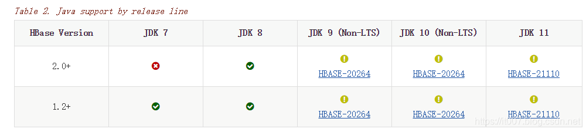

# hbase–hadoop

打对号的是官方测试过的，功能齐全的，可放心使用。

我们只需要使用打对号的即可，不要去尝试使用其他的版本，否则你可能会遇到一些意外的惊喜。
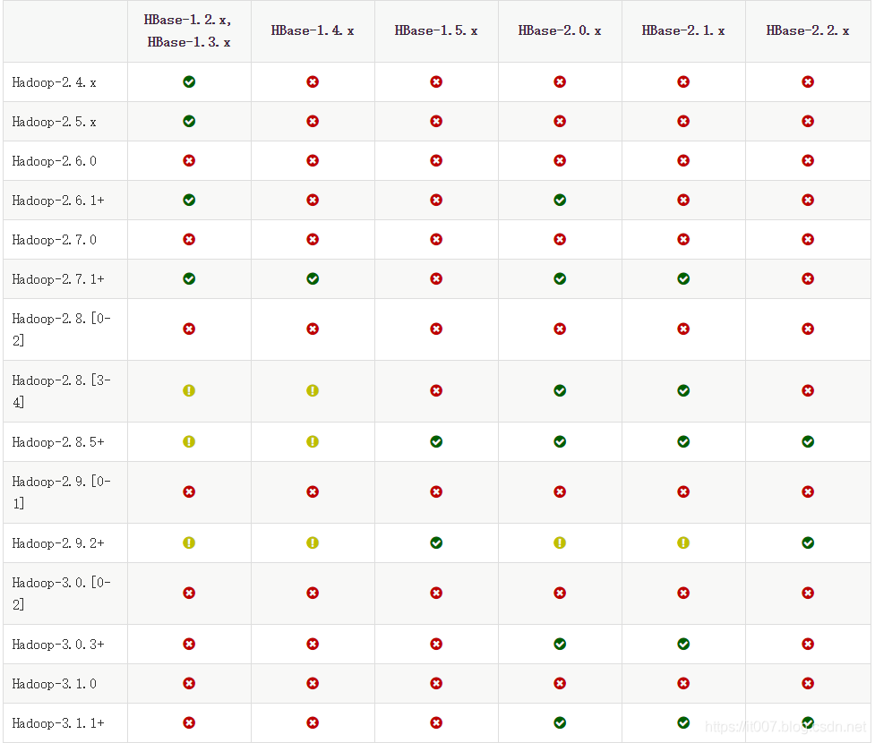

2021-08-26更新版本

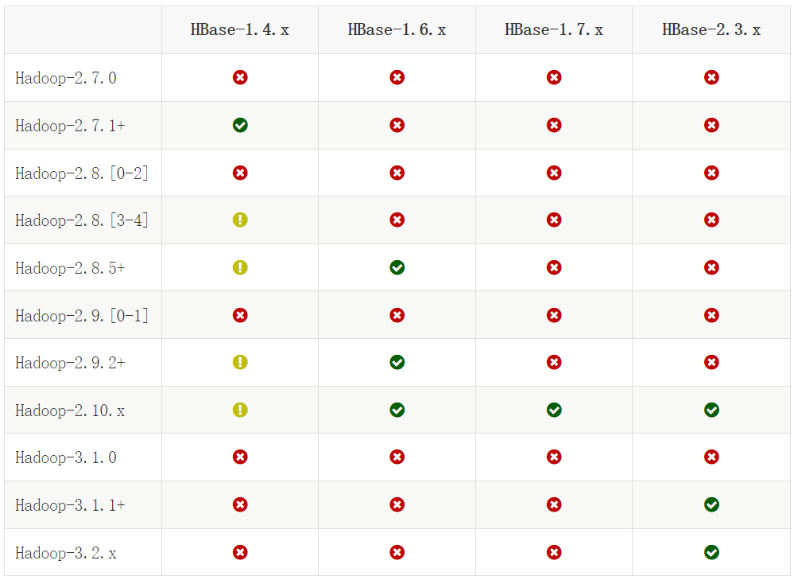

## 二、安装并配置HBase

说明：HBase的版本一定要和之前已经安装的Hadoop的版本保持兼容，不能随便选择版本。HBase1.1.2 和Hadoop2.7.1（或Hadoop2.6.0或Hadoop2.7.3）兼容，而HBase2.2.2和Hadoop3.1.3兼容。
本教程安装HBase1.1.2，并且假设你之前已经安装了Hadoop2.7.1（或Hadoop2.6.0或Hadoop2.7.3，[查看安装指南](http://dblab.xmu.edu.cn/blog/install-hadoop/)）。
如果要安装HBase2.2.2（假设你之前已经安装了Hadoop3.1.3），请参考[HBase2.2.2安装教程](http://dblab.xmu.edu.cn/blog/2442-2/)。
《大数据技术原理与应用（第2版）》教材请安装HBase1.1.2，《大数据技术原理与应用（第3版）》教材请安装HBase2.2.2。

### 1. HBase1.1.2安装

1.1 解压安装包hbase-1.1.2-bin.tar.gz至路径 /usr/local，命令如下：

```bash
$ sudo tar -zxf ~/下载/hbase-1.1.2-bin.tar.gz -C /usr/local
```


1.2 将解压的文件名hbase-1.1.2改为hbase，以方便使用，命令如下：

```bash
$ sudo mv /usr/local/hbase-1.1.2 /usr/local/hbase
```

1.3 配置环境变量
将hbase下的bin目录添加到path中，这样，启动hbase就无需到/usr/local/hbase目录下，大大的方便了hbase的使用。教程下面的部分还是切换到了/usr/local/hbase目录操作，有助于初学者理解运行过程，熟练之后可以不必切换。
编辑~/.bashrc文件

```bash
$ vi ~/.bashrc
```

如果没有引入过PATH请在~/.bashrc文件尾行添加如下内容：

```shell
export PATH=$PATH:/usr/local/hbase/bin
```

如果已经引入过PATH请在export PATH这行追加/usr/local/hbase/bin，这里的 “:” 是分隔符。

编辑完成后，再执行source命令使上述配置在当前终端立即生效，命令如下：

```bash
$ source ~/.bashrc
```

扩展阅读: [设置Linux环境变量的方法和区别](http://dblab.xmu.edu.cn/blog/linux-environment-variable/)

1.4 添加HBase权限

```bash
$ cd /usr/local
#将hbase下的所有文件的所有者改为hadoop，hadoop是当前用户的用户名。
$ sudo chown -R hadoop:hadoop ./hbase       
```

1.5 查看HBase版本，确定hbase安装成功,命令如下：

```bash
$ /usr/local/hbase/bin/hbase version
```

命令执行后，输出信息截图如下：

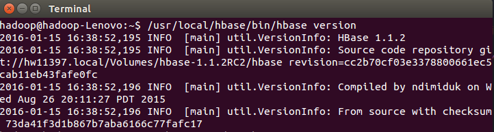

看到以上输出消息表示HBase已经安装成功，接下来将分别进行HBase单机模式和伪分布式模式的配置。

### 2. HBase配置

HBase有三种运行模式，单机模式、伪分布式模式、分布式模式。作为学习，我们重点讨论单机模式和伪分布式模式。

> 以下先决条件很重要，比如没有配置JAVA_HOME环境变量，就会报错。
> – jdk
> – Hadoop( 单机模式不需要，伪分布式模式和分布式模式需要)
> – SSH

以上三者如果没有安装，请回到[第二章的指南](http://dblab.xmu.edu.cn/blog/285/)参考如何安装。

#### 2.1单机模式配置

1. 配置/usr/local/hbase/conf/hbase-env.sh 。配置JAVA环境变量，并添加配置HBASE_MANAGES_ZK为true，用vi命令打开并编辑hbase-env.sh，命令如下：

```bash
$ vi /usr/local/hbase/conf/hbase-env.sh
```

配置JAVA环境变量，jdk的安装目录默认是 /usr/lib/jvm/java-1.7.0-openjdk， 则JAVA _HOME =/usr/lib/jvm/java-7-openjdk-amd64，其中java-1.7.0-openjdk是你的jdk版本；**配置HBASE_MANAGES_ZK为true，表示由hbase自己管理zookeeper，不需要单独的zookeeper。**hbase-env.sh中本来就存在这些变量的配置，大家只需要删除前面的#并修改配置内容即可(#代表注释)：

```shell
export JAVA_HOME=/usr/lib/jvm/java-7-openjdk-amd64
export HBASE_MANAGES_ZK=true 
```

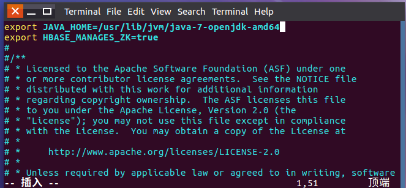

​										配置hbase-env.sh

添加完成后保存退出即可。

2. 配置/usr/local/hbase/conf/hbase-site.xml
   打开并编辑hbase-site.xml，命令如下：

```bash
$ vi /usr/local/hbase/conf/hbase-site.xml
```

在启动HBase前需要设置属性hbase.rootdir，用于指定HBase数据的存储位置，**因为如果不设置的话，hbase.rootdir默认为/tmp/hbase-${user.name},这意味着每次重启系统都会丢失数据**。此处设置为HBase安装目录下的 hbase-tmp 文件夹即（/usr/local/hbase/hbase-tmp）,添加配置如下：

```xml
<configuration>
    <property>
        <name>hbase.rootdir</name>
        <value>file:///usr/local/hbase/hbase-tmp</value>
    </property>
</configuration>
```

3. 接下来测试运行。首先切换目录至HBase安装目录/usr/local/hbase；再启动HBase。命令如下：

```bash
$ cd /usr/local/hbase
$ bin/start-hbase.sh
$ bin/hbase shell
```

上述三条命令中，sudo bin/start-hbase.sh 用于启动HBase，bin/hbase shell用于打开shell命令行模式，用户可以通过输入shell命令操作HBase数据库。
成功启动HBase，截图如下：


停止HBase运行,命令如下：

```bash
$ bin/stop-hbase.sh
```

> 注意：如果在操作HBase的过程中发生错误，可以通过{HBASE_HOME}目录（/usr/local/hbase）下的logs子目录中的日志文件查看错误原因。
>

#### 2.2 伪分布式模式配置

1. **配置/usr/local/hbase/conf/hbase-env.sh。**

   命令如下：

```bash
$ vi /usr/local/hbase/conf/hbase-env.sh
```

配置JAVA_HOME，HBASE_CLASSPATH，HBASE_MANAGES_ZK.
**HBASE_CLASSPATH 设置为本机Hadoop安装目录下的conf目录（即/usr/local/hadoop/conf）**

```shell
export JAVA_HOME=/usr/lib/jvm/java-7-openjdk-amd64
# export HBASE_CLASSPATH=/usr/local/hadoop/conf 应该改成
export HBASE_CLASSPATH=/jrtz/hadoop/etc/hadoop
export HBASE_MANAGES_ZK=true
```

截图如下：

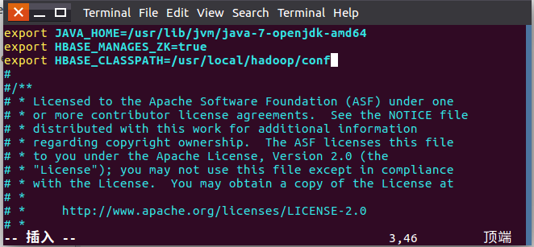

2. **配置/usr/local/hbase/conf/hbase-site.xml**
   用命令vi打开并编辑hbase-site.xml，命令如下：

```bash
$ vi /usr/local/hbase/conf/hbase-site.xml
```

修改hbase.rootdir，指定HBase数据在HDFS上的存储路径；将属性hbase.cluter.distributed设置为true。假设当前Hadoop集群运行在伪分布式模式下，在本机上运行，且NameNode运行在9000端口。

```xml
<configuration>
    <property>
        <name>hbase.rootdir</name>
        <value>hdfs://vmsrv-010-225:9000/hbase</value>
    </property>
    <property>
        <name>hbase.cluster.distributed</name>
        <value>true</value>
    </property>
    <!-- 真正分布式添加如下内容
    <property>
        <name>hbase.zookeeper.quorum</name>
        <value>vmsrv-010-225,vmsrv-010-214,vmsrv-010-148</value>
    </property>
    -->
</configuration>
```

- hbase.rootdir 指定HBase在HDFS上的存储目录；

- hbase.cluster.distributed设置集群处于分布式模式.

3. **接下来测试运行HBase。**
   **第一步：启动hadoop**

   首先登陆ssh，之前设置了无密码登陆，因此这里不需要密码；再切换目录至/usr/local/hadoop ；再启动hadoop，如果已经启动hadoop请跳过此步骤。命令如下：

```bash
$ ssh localhost
$ cd /usr/local/hadoop
$ ./sbin/start-dfs.sh
```

输入命令jps，能看到NameNode,DataNode和SecondaryNameNode都已经成功启动，表示hadoop启动成功，截图如下：

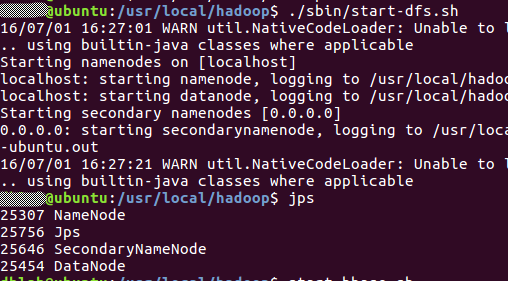

**第二步：启动 Hbase**

主节点上启动HBase

```bash
$ cd /usr/local/hbase
$ bin/start-hbase.sh
```

- zookeeper 端口检查
  1、2181
  2、3888
  3、2888 - leader节点端口

输入命令jps，看到以下界面说明hbase启动成功

在mater上有两个进程，HMaster和 HQuorumPeer；

数据节点上有两个进程，HRegionServer 和HQuorumPeer。

```bash
[root@vmsrv-010-225 ~]# jps
18950 HMaster
18817 HQuorumPeer
5664 ResourceManager
5475 SecondaryNameNode
29785 Jps
8121 Master
5118 NameNode
-----------------------------
[root@vmsrv-010-214 ~]# jps
24569 HRegionServer
24415 HQuorumPeer
14161 NodeManager
13867 DataNode
3372 Jps
2461 Worker
-----------------------------
[hadoop@vmsrv-010-148 hbase]$ jps
18638 HRegionServer
18473 HQuorumPeer
12305 NodeManager
12099 DataNode
7492 Worker
29079 Jps
```

- 进入shell界面：

```bash
[hadoop@vmsrv-010-225 hbase]$ bin/hbase shell
SLF4J: Class path contains multiple SLF4J bindings.
SLF4J: Found binding in [jar:file:/jrtz/hbase/lib/slf4j-log4j12-1.7.10.jar!/org/slf4j/impl/StaticLoggerBinder.class]
SLF4J: Found binding in [jar:file:/jrtz/hadoop/share/hadoop/common/lib/slf4j-log4j12-1.7.10.jar!/org/slf4j/impl/StaticLoggerBinder.class]
SLF4J: See http://www.slf4j.org/codes.html#multiple_bindings for an explanation.
SLF4J: Actual binding is of type [org.slf4j.impl.Log4jLoggerFactory]
HBase Shell
Use "help" to get list of supported commands.
Use "exit" to quit this interactive shell.
Version 1.4.9, rd625b212e46d01cb17db9ac2e9e927fdb201afa1, Wed Dec  5 11:54:10 PST 2018

hbase(main):001:0> 
```

- 进入UI界面  192.168.10.225:16010

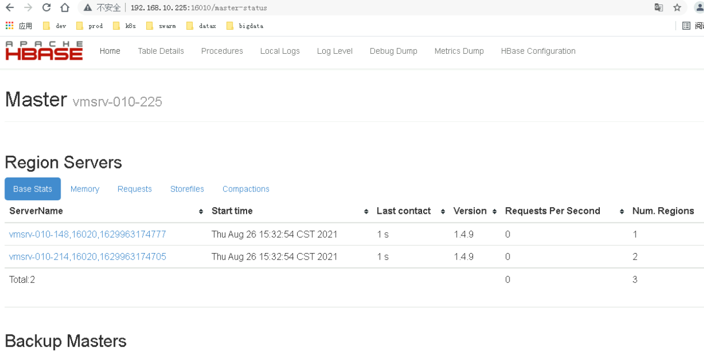

4. **停止 HBase**

   命令如下：

```bash
$ bin/stop-hbase.sh
```

**注意：如果在操作HBase的过程中发生错误，可以通过{HBASE_HOME}目录（/usr/local/hbase）下的logs子目录中的日志文件查看错误原因。**
**这里启动关闭Hadoop和HBase的顺序一定是：**

```bash
启动Hadoop —> 启动HBase —> 关闭HBase —> 关闭Hadoop
```

## 三、 编程实践

### 1. 利用Shell命令

#### 1.1 HBase中创建表

HBase中用create命令创建表，具体如下：

```bash
$ create 'student','Sname','Ssex','Sage','Sdept','course'
0 row(s) in 1.4810 seconds

=> Hbase::Table - student
```

此时，即创建了一个“student”表，属性有：Sname,Ssex,Sage,Sdept,course。因为HBase的表中会有一个系统默认的属性作为行键，无需自行创建，默认为put命令操作中表名后第一个数据。创建完“student”表后，可通过describe命令查看“student”表的基本信息。命令

```bash
$ describe 'student'
```

执行截图如下：

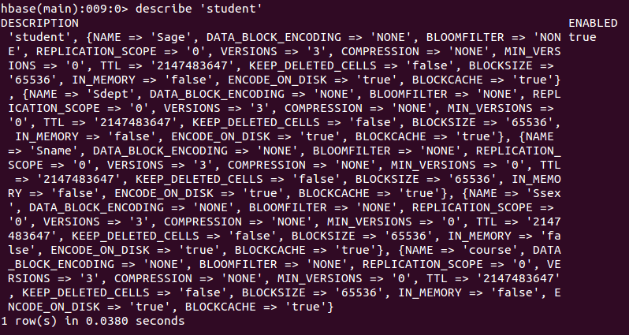

#### 1.2 HBase数据库基本操作

本小节主要介绍HBase的增、删、改、查操作。在添加数据时，HBase会自动为添加的数据添加一个时间戳，故在需要修改数据时，只需直接添加数据，HBase即会生成一个新的版本，从而完成“改”操作，旧的版本依旧保留，系统会定时回收垃圾数据，只留下最新的几个版本，保存的版本数可以在创建表的时候指定。

- 添加数据
  HBase中用put命令添加数据，**注意：一次只能为一个表的一行数据的一个列，也就是一个单元格添加一个数据，所以直接用shell命令插入数据效率很低，在实际应用中，一般都是利用编程操作数据。**
  当运行命令：put ‘student’,’95001’,’Sname’,’LiYing’时，即为student表添加了学号为95001，名字为LiYing的一行数据，其行键为95001。

```bash
$ put 'student','95001','Sname','LiYing'
```

命令执行截图如下，即为student表添加了学号为95001，名字为LiYing的一行数据，其行键为95001。


```bash
$ put 'student','95001','course:math','80'
```

命令执行截图如下，即为95001行下的course列族的math列添加了一个数据。

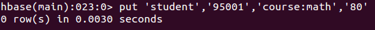

- 删除数据

在HBase中用delete以及deleteall命令进行删除数据操作，它们的区别是：1. delete用于删除一个数据，是put的反向操作；2. deleteall操作用于删除一行数据。

1. delete命令

```bash
$ delete 'student','95001','Ssex'
```

命令执行截图如下， 即删除了student表中95001行下的Ssex列的所有数据。

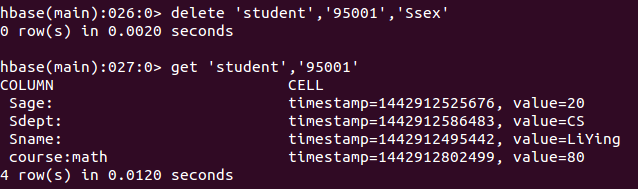

2. deleteall命令

```bash
$ deleteall 'student','95001'
```

命令执行截图如下，即删除了student表中的95001行的全部数据。

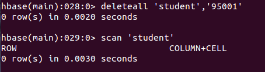

- 查看数据
  HBase中有两个用于查看数据的命令：
  1. get命令，用于查看表的某一行数据；
  2. scan命令用于查看某个表的全部数据

1. get命令

```bash
$ get 'student','95001'
```

命令执行截图如下， 返回的是‘student’表‘95001’行的数据。

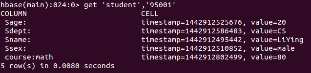

2. scan命令

```bash
$ scan 'student'
```

命令执行截图如下， 返回的是‘student’表的全部数据。

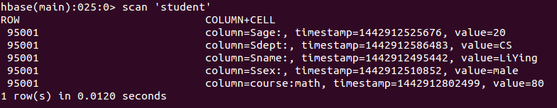

- 删除表
  删除表有两步，第一步先让该表不可用，第二步删除表。

```bash
$ disable 'student'  
$ drop 'student'
```

命令执行截图如下：

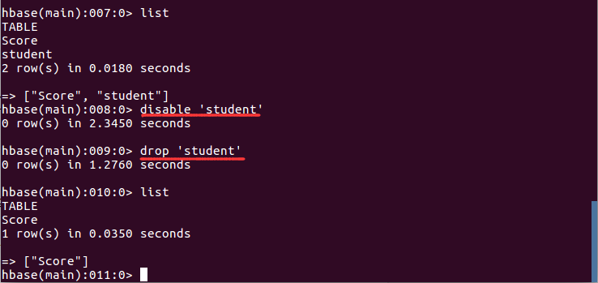

#### 1.3 查询表历史数据

查询表的历史版本，需要两步。
1、在创建表的时候，指定保存的版本数（假设指定为5）

```bash
$ create 'teacher',{NAME=>'username',VERSIONS=>5}
```

2、插入数据然后更新数据，使其产生历史版本数据，**注意：这里插入数据和更新数据都是用put命令**

```bash
$ put 'teacher','91001','username','Mary'
$ put 'teacher','91001','username','Mary1'
$ put 'teacher','91001','username','Mary2'
$ put 'teacher','91001','username','Mary3'
$ put 'teacher','91001','username','Mary4'  
$ put 'teacher','91001','username','Mary5'
```

3、查询时，指定查询的历史版本数。默认会查询出最新的数据。（有效取值为1到5）

```bash
$ get 'teacher','91001',{COLUMN=>'username',VERSIONS=>5}
```

查询结果截图如下：

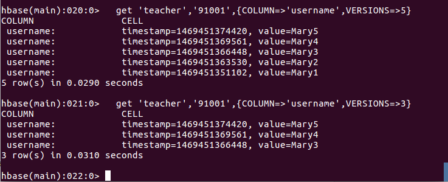

#### 1.4 退出HBase数据库表操作

最后退出数据库操作，输入exit命令即可退出，注意：这里退出HBase数据库是退出对数据库表的操作，而不是停止启动HBase数据库后台运行。

```bash
$ exit
```

### 2. Java API编程实例

本实例使用Eclipse编写java程序，来对HBase数据库进行增删改查等操作，Eclipse可以在Ubuntu软件中心搜索下载并安装。
**第一步：启动hadoop，启动hbase**

```bash
$ cd /usr/local/hadoop
$ ./sbin/start-dfs.sh
$ cd /usr/local/hbase
$ ./bin/start-hbase.sh
```

**第二步，新建Java Project——>新建Class**

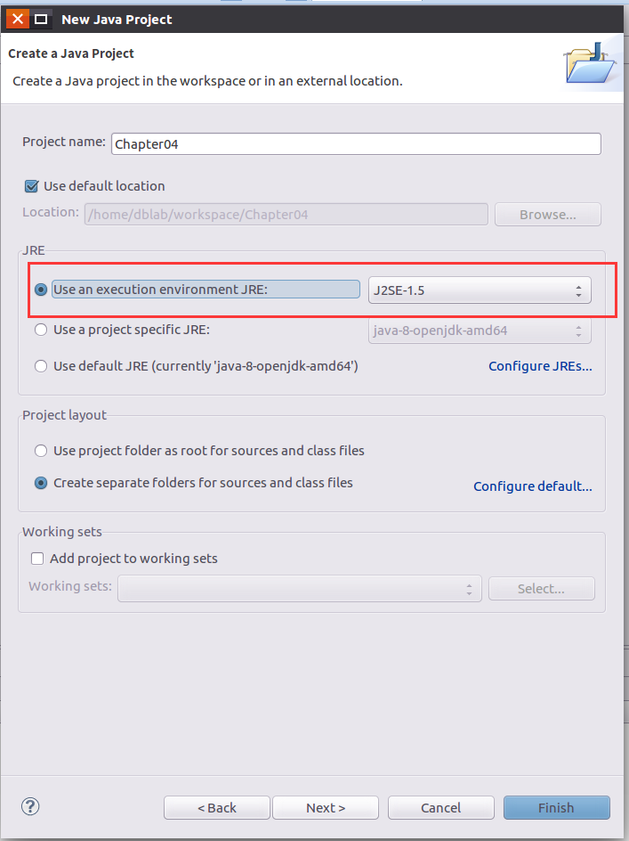
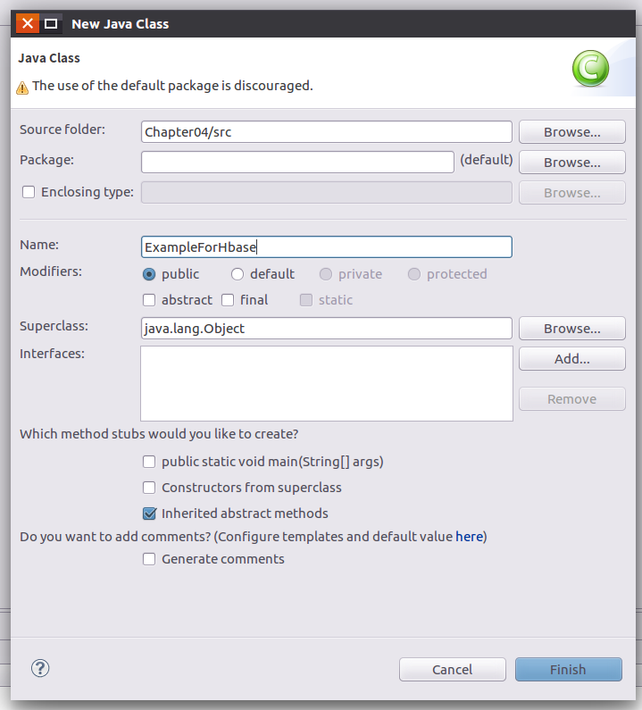

**第三步：在工程中导入外部jar包：**
这里只需要导入hbase安装目录中的lib文件中的所有jar包。
新版的Hbase 1.1.2的java api已经发生变化，旧版的部分api已经停止使用，教材上第四章编程实例部分，请以本教程为准。

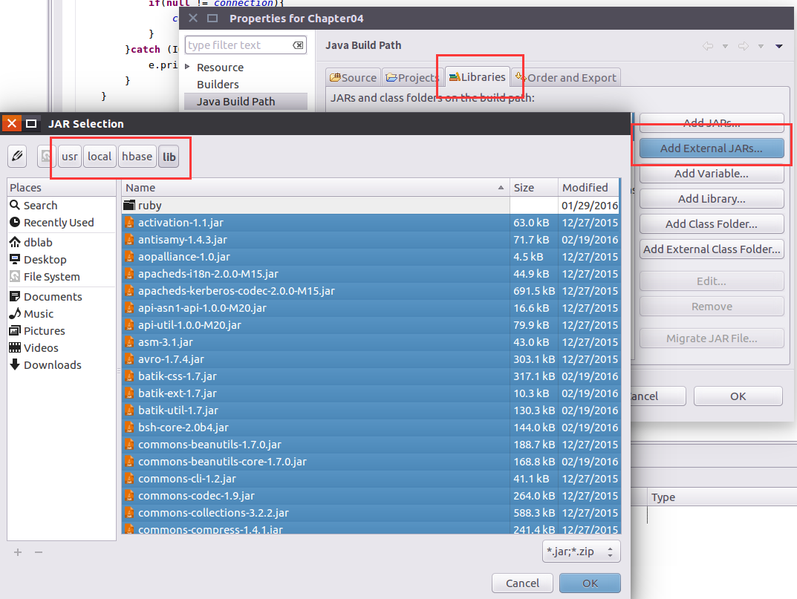
这里给出一个编程实例,，以下是源代码：

```java
import org.apache.hadoop.conf.Configuration;
import org.apache.hadoop.hbase.*;
import org.apache.hadoop.hbase.client.*;
import java.io.IOException;
 
public class ExampleForHbase{
    public static Configuration configuration;
    public static Connection connection;
    public static Admin admin;
 
    //主函数中的语句请逐句执行，只需删除其前的//即可，如：执行insertRow时请将其他语句注释
    public static void main(String[] args)throws IOException{
        //创建一个表，表名为Score，列族为sname,course
        createTable("Score",new String[]{"sname","course"});
 
        //在Score表中插入一条数据，其行键为95001,sname为Mary（因为sname列族下没有子列所以第四个参数为空）
        //等价命令：put 'Score','95001','sname','Mary'
        //insertRow("Score", "95001", "sname", "", "Mary");
        //在Score表中插入一条数据，其行键为95001,course:Math为88（course为列族，Math为course下的子列）
        //等价命令：put 'Score','95001','score:Math','88'
        //insertRow("Score", "95001", "course", "Math", "88");
        //在Score表中插入一条数据，其行键为95001,course:English为85（course为列族，English为course下的子列）
        //等价命令：put 'Score','95001','score:English','85'
        //insertRow("Score", "95001", "course", "English", "85");
 
        //1、删除Score表中指定列数据，其行键为95001,列族为course，列为Math
        //执行这句代码前请deleteRow方法的定义中，将删除指定列数据的代码取消注释注释，将删除制定列族的代码注释
        //等价命令：delete 'Score','95001','score:Math'
        //deleteRow("Score", "95001", "course", "Math");
 
        //2、删除Score表中指定列族数据，其行键为95001,列族为course（95001的Math和English的值都会被删除）
        //执行这句代码前请deleteRow方法的定义中，将删除指定列数据的代码注释，将删除制定列族的代码取消注释
        //等价命令：delete 'Score','95001','score'
        //deleteRow("Score", "95001", "course", "");
 
        //3、删除Score表中指定行数据，其行键为95001
        //执行这句代码前请deleteRow方法的定义中，将删除指定列数据的代码注释，以及将删除制定列族的代码注释
        //等价命令：deleteall 'Score','95001'
        //deleteRow("Score", "95001", "", "");
 
        //查询Score表中，行键为95001，列族为course，列为Math的值
        //getData("Score", "95001", "course", "Math");
        //查询Score表中，行键为95001，列族为sname的值（因为sname列族下没有子列所以第四个参数为空）
        //getData("Score", "95001", "sname", "");
 
        //删除Score表
        //deleteTable("Score");
    }
 
    //建立连接
    public static void init(){
        configuration  = HBaseConfiguration.create();
        configuration.set("hbase.rootdir","hdfs://localhost:9000/hbase");
        try{
            connection = ConnectionFactory.createConnection(configuration);
            admin = connection.getAdmin();
        }catch (IOException e){
            e.printStackTrace();
        }
    }
    //关闭连接
    public static void close(){
        try{
            if(admin != null){
                admin.close();
            }
            if(null != connection){
                connection.close();
            }
        }catch (IOException e){
            e.printStackTrace();
        }
    }
 
    /**
     * 建表。HBase的表中会有一个系统默认的属性作为主键，主键无需自行创建，默认为put命令操作中表名后第一个数据，因此此处无需创建id列
     * @param myTableName 表名
     * @param colFamily 列族名
     * @throws IOException
     */
    public static void createTable(String myTableName,String[] colFamily) throws IOException {
 
        init();
        TableName tableName = TableName.valueOf(myTableName);
 
        if(admin.tableExists(tableName)){
            System.out.println("talbe is exists!");
        }else {
            HTableDescriptor hTableDescriptor = new HTableDescriptor(tableName);
            for(String str:colFamily){
                HColumnDescriptor hColumnDescriptor = new HColumnDescriptor(str);
                hTableDescriptor.addFamily(hColumnDescriptor);
            }
            admin.createTable(hTableDescriptor);
            System.out.println("create table success");
        }
        close();
    }
    /**
     * 删除指定表
     * @param tableName 表名
     * @throws IOException
     */
    public static void deleteTable(String tableName) throws IOException {
        init();
        TableName tn = TableName.valueOf(tableName);
        if (admin.tableExists(tn)) {
            admin.disableTable(tn);
            admin.deleteTable(tn);
        }
        close();
    }
 
    /**
     * 查看已有表
     * @throws IOException
     */
    public static void listTables() throws IOException {
        init();
        HTableDescriptor hTableDescriptors[] = admin.listTables();
        for(HTableDescriptor hTableDescriptor :hTableDescriptors){
            System.out.println(hTableDescriptor.getNameAsString());
        }
        close();
    }
    /**
     * 向某一行的某一列插入数据
     * @param tableName 表名
     * @param rowKey 行键
     * @param colFamily 列族名
     * @param col 列名（如果其列族下没有子列，此参数可为空）
     * @param val 值
     * @throws IOException
     */
    public static void insertRow(String tableName,String rowKey,String colFamily,String col,String val) throws IOException {
        init();
        Table table = connection.getTable(TableName.valueOf(tableName));
        Put put = new Put(rowKey.getBytes());
        put.addColumn(colFamily.getBytes(), col.getBytes(), val.getBytes());
        table.put(put);
        table.close();
        close();
    }
 
    /**
     * 删除数据
     * @param tableName 表名
     * @param rowKey 行键
     * @param colFamily 列族名
     * @param col 列名
     * @throws IOException
     */
    public static void deleteRow(String tableName,String rowKey,String colFamily,String col) throws IOException {
        init();
        Table table = connection.getTable(TableName.valueOf(tableName));
        Delete delete = new Delete(rowKey.getBytes());
        //删除指定列族的所有数据
        //delete.addFamily(colFamily.getBytes());
        //删除指定列的数据
        //delete.addColumn(colFamily.getBytes(), col.getBytes());
 
        table.delete(delete);
        table.close();
        close();
    }
    /**
     * 根据行键rowkey查找数据
     * @param tableName 表名
     * @param rowKey 行键
     * @param colFamily 列族名
     * @param col 列名
     * @throws IOException
     */
    public static void getData(String tableName,String rowKey,String colFamily,String col)throws  IOException{
        init();
        Table table = connection.getTable(TableName.valueOf(tableName));
        Get get = new Get(rowKey.getBytes());
        get.addColumn(colFamily.getBytes(),col.getBytes());
        Result result = table.get(get);
        showCell(result);
        table.close();
        close();
    }
    /**
     * 格式化输出
     * @param result
     */
    public static void showCell(Result result){
        Cell[] cells = result.rawCells();
        for(Cell cell:cells){
            System.out.println("RowName:"+new String(CellUtil.cloneRow(cell))+" ");
            System.out.println("Timetamp:"+cell.getTimestamp()+" ");
            System.out.println("column Family:"+new String(CellUtil.cloneFamily(cell))+" ");
            System.out.println("row Name:"+new String(CellUtil.cloneQualifier(cell))+" ");
            System.out.println("value:"+new String(CellUtil.cloneValue(cell))+" ");
        }
    }
}
```

每次执行完，都可以回到shell界面查看是否执行成功，如：执行完插入数据后，在shell界面中执行`scan 'Score'`。截图如下:

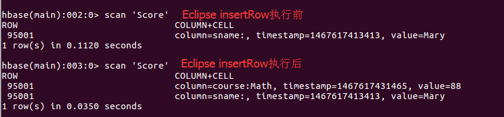