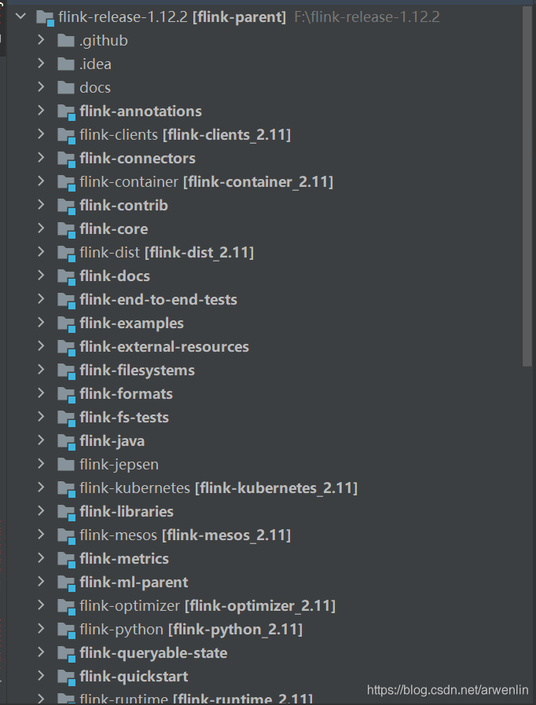

# FLINK 1.12.2 jdbc实现oracle或sqlserver连接器

https://blog.csdn.net/arwenlin/article/details/116986258 2021-05-18

---

Flink SQL Connector JDBC目前只支持Mysql，Derby和Postgres，但是oracle和sqlserver可以通过JDBC connector自己扩展。目前只能修改重编FLINK源码实现扩展，社区正在积极对此进行抽象和改造，未来应该会有更好的接口扩展方式。

## 1. 编译FLINK源码
从flink官网提供的github链接下载源码，因为我是用IDE编译所以直接[下载zip包](https://codeload.github.com/apache/flink/zip/refs/tags/release-1.12.2)，解压后直接用IDE打开就行。



 

所有Flink的组件都在，maven加载依赖需要比较长时间。依赖包可能无法一次顺利下载完成，中间会报某些包（尤其是maven插件）下载失败。

找到flink-connectors下面的flink-connector-jdbc这个工程，我们只编译它。（当然你也可以都编译，只是时间比较长。）未修改先编译一次的目的是为了排除修改后编译不通过的原因是源码本身导致的。

看到BUILD-SECCESS说明编译成功了。

**中途遇到两个问题：**

1. **依赖下载失败**

删除本地maven仓库中的jar包目录后会重新下载，直到所有包都下载完成。对于访问外网有麻烦的童鞋可以换成阿里云的maven仓库地址https://maven.aliyun.com/repository/apache-snapshots。

2. **要求代码格式化**

应该是Flink源码中要求的，编译会提示使用mvn spotless进行格式化。但是IDE中默认maven仓库地址是10.10.xx，总是执行失败。查询该命令后发现可以指定自己的setting.xml，命令如下：

```bash
mvn spotless:apply -s C:\Users\xxx\.m2\settings.xml
```


从终端进入flink-connector-jdbc的目录后，顺利执行，再次编译即可。

## 2. SQLSERVER JDBC扩展示例
### 2.1 Flink JDBC源码简介
通过源码浏览发现Flink将实现的connector接口注册在org.apache.flink.connector.jdbc.dialect.JdbcDialects中：

```java
private static final List<JdbcDialect> DIALECTS = Arrays.asList(
    new DerbyDialect(),
    new MySQLDialect(),
    new PostgresDialect(),
);
```

每个Dialect都扩展自AbstractDialect，比如MySQL的：

```java
/** JDBC dialect for MySQL. */

public class MySQLDialect extends AbstractDialect
```

而 AbstractDialect 继承自 JdbcDialect，JdbcDialect中已经实现了通用的CURD接口：

- getSelectFromStatement

- getDeleteStatement

- getUpdateStatement

- getInsertIntoStatement

**MySQLDialect自己重写了getUpsertStatement实现upsert。**

### 2.2 Flink JDBC扩展思路
根据上面的介绍，只要仿照MySQLDialect编写SQLServerDialect。需要实现2个类，分别是SQLServerDialect和SQLServerRowConverter，SQLServerDialect会引用SQLServerRowConverter，并重写getUpsertStatement实现upsert。最后将SQLServerDialect注册到JdbcDialects中即可。Oracle的实现过程也是一样的。

### 2.3 Flink JDBC SQLServer connector实现
#### 1. 实现SQLServerRowConverter
在包 org.apache.flink.connector.jdbc.internal.converter 中新建 SQLServerRowConverter，可以直接复制MySQL的，只要把 convert 的名字换成 sqlserver。

```java
@Override
public String converterName() {
	return "SQLServer";
}
```

#### 2.实现SQLServerDialect并重写getUpsertStatement
在包org.apache.flink.connector.jdbc.dialect中新建SQLServerDialect，直接复制MySQLDialect修改相关内容，getUpsertStatement接口也可以不写，这样Flink对upsert的操作会回退成delete+insert。代码如下：
```java
package org.apache.flink.connector.jdbc.dialect;

import org.apache.flink.connector.jdbc.internal.converter.JdbcRowConverter;
import org.apache.flink.connector.jdbc.internal.converter.SQLServerRowConverter;
import org.apache.flink.table.types.logical.LogicalTypeRoot;
import org.apache.flink.table.types.logical.RowType;
import org.apache.commons.lang3.StringUtils;
import java.util.Arrays;
import java.util.List;
import java.util.Optional;
import java.util.stream.Collectors;

/** JDBC dialect for Oracle. hyl 2021.05.11 */
public class SQLServerDialect extends AbstractDialect {
    private static final long serialVersionUID = -4300268922986141379L;

    // Define MAX/MIN precision of TIMESTAMP type according to Mysql docs:
    // https://dev.mysql.com/doc/refman/8.0/en/fractional-seconds.html
     
    private static final int MAX_TIMESTAMP_PRECISION = 6;
    private static final int MIN_TIMESTAMP_PRECISION = 1;

    // Define MAX/MIN precision of DECIMAL type according to Mysql docs:
    // https://dev.mysql.com/doc/refman/8.0/en/fixed-point-types.html
     
    private static final int MAX_DECIMAL_PRECISION = 65;
    private static final int MIN_DECIMAL_PRECISION = 1;

    private static final String SQL_DEFAULT_PLACEHOLDER = " @";

    @Override 
    public boolean canHandle(String url) {
        return url.startsWith("jdbc:sqlserver:");  
    }

    @Override
    public JdbcRowConverter getRowConverter(RowType rowType) {
        return new SQLServerRowConverter(rowType);
    }

    @Override
    public Optional<String> defaultDriverName() {
        return Optional.of("com.microsoft.sqlserver.jdbc.SQLServerDriver");
    }

    @Override
    public String quoteIdentifier(String identifier) {
        return "" + identifier + "";
    }


    /**
    * Mysql upsert query use DUPLICATE KEY UPDATE.
    * <p>NOTE: It requires Mysql's primary key to be consistent with pkFields.
    * <p>We don't use REPLACE INTO, if there are other fields, we can keep their previous     values.
    */ 
    @Override
    public Optional<String> getUpsertStatement(String tableName, String[] fieldNames, String[] uniqueKeyFields) {
        /* 使用MERGE语句，将待upsert的数据作为source，merge到目标表，如下语句：
        MERGE mytable WITH (serializable) AS T1
        USING (SELECT @ID AS ID) AS T2
        ON T1.ID = T2.ID
        WHEN MATCHED THEN
        UPDATE SET T1.value = T2.value
        WHEN NOT MATCHED THEN
        INSERT ( ID, Value ) VALUES (T2.ID, T2.value);
        */
        StringBuilder mergeIntoSql = new StringBuilder();
        mergeIntoSql
            .append("MERGE INTO " + tableName + " WITH (serializable) AS T1 USING (")
            .append(buildDualQueryStatement(fieldNames))
            .append(") AS T2 ON (")
            .append(buildConnectionConditions(uniqueKeyFields) + ") ");

        String updateSql = buildUpdateConnection(fieldNames, uniqueKeyFields);

        if (StringUtils.isNotEmpty(updateSql)) {
            mergeIntoSql.append(" WHEN MATCHED THEN UPDATE SET ");
            mergeIntoSql.append(updateSql);
        }

        mergeIntoSql
            .append(" WHEN NOT MATCHED THEN ")
            .append("INSERT (")
            .append(Arrays.stream(fieldNames)
                    .map(col -> quoteIdentifier(col))
                    .collect(Collectors.joining(",")))
                    .append(") VALUES (")
            .append(
                Arrays.stream(fieldNames)
                .map(col -> "T2." + quoteIdentifier(col))
                .collect(Collectors.joining(",")))
                .append(")");

        return Optional.of(mergeIntoSql.toString());
    }

   /**
    * build select sql , such as (SELECT ? AS "A",? AS "B").
    *
    * @param column destination column
    * @return
    */
    public String buildDualQueryStatement(String[] column) {
        StringBuilder sb = new StringBuilder("SELECT ");
        String collect = Arrays.stream(column)
                .map(col ->
                    wrapperPlaceholder(col)
                    + quoteIdentifier(col)
                    + " AS "
                    + quoteIdentifier(col))
                .collect(Collectors.joining(", "));
        return sb.toString();
    }

   /**
    * char type is wrapped with rpad.
    *
    * @param fieldName
    * @return
    */
    public String wrapperPlaceholder(String fieldName) {
        return SQL_DEFAULT_PLACEHOLDER + fieldName + " ";
    }

   /**
    * build condition sql , such as (T1.ID = T2.ID).   
    *
    * @param uniqueKeyFields
    * @return
    */  
    private String buildConnectionConditions(String[] uniqueKeyFields) {
        return Arrays.stream(uniqueKeyFields)
            .map(col ->
                "T1."
                + quoteIdentifier(col.trim())
                + "=T2."
                + quoteIdentifier(col.trim()))
            .collect(Collectors.joining(" and "));
    }

   /**
    * build update sql , such as (T1.ID = T2.ID).
    *
    * @param uniqueKeyFields
    * @return
    */  
    private String buildUpdateConnection(String[] fieldNames, String[] uniqueKeyFields) {
        List<String> uniqueKeyList = Arrays.asList(uniqueKeyFields);
        String updateConnectionSql =
            Arrays.stream(fieldNames)
                .filter(
                    col -> {
                    boolean bbool =
                    uniqueKeyList.contains(col.toLowerCase())
                    || uniqueKeyList.contains(
                        col.toUpperCase())
                        ? false
                        : true;
                    return bbool;
                })
                .map(col ->
                    quoteIdentifier("T1")
                    + "." 
                    + quoteIdentifier(col)
                    + " = " 
                    + quoteIdentifier("T2") 
                    + "."  
                    + quoteIdentifier(col))
                    .collect(Collectors.joining(","));
         return updateConnectionSql;
    }


    @Override   
    public String dialectName() {
        return "SQLServer";
    }

    @Override 
    public int maxDecimalPrecision() {
        return MAX_DECIMAL_PRECISION;
    }

    @Override
    public int minDecimalPrecision() {
        return MIN_DECIMAL_PRECISION; 
    }

    @Override
    public int maxTimestampPrecision() {
        return MAX_TIMESTAMP_PRECISION;
    }

    @Override
    public int minTimestampPrecision() {
        return MIN_TIMESTAMP_PRECISION;
    }

    @Override
    public List<LogicalTypeRoot> unsupportedTypes() {
        // The data types used in Mysql are list at:
        // https://dev.mysql.com/doc/refman/8.0/en/data-types.html
        // TODO: We can't convert BINARY data type to
        // PrimitiveArrayTypeInfo.BYTE_PRIMITIVE_ARRAY_TYPE_INFO in
        // LegacyTypeInfoDataTypeConverter.
        return Arrays.asList(
            LogicalTypeRoot.BINARY,
            LogicalTypeRoot.TIMESTAMP_WITH_LOCAL_TIME_ZONE,
            LogicalTypeRoot.TIMESTAMP_WITH_TIME_ZONE,
            LogicalTypeRoot.INTERVAL_YEAR_MONTH,
            LogicalTypeRoot.INTERVAL_DAY_TIME,
            LogicalTypeRoot.ARRAY,
            LogicalTypeRoot.MULTISET,
            LogicalTypeRoot.MAP,
            LogicalTypeRoot.ROW,
            LogicalTypeRoot.DISTINCT_TYPE,
            LogicalTypeRoot.STRUCTURED_TYPE,
            LogicalTypeRoot.NULL,
            LogicalTypeRoot.RAW,
            LogicalTypeRoot.SYMBOL,
            LogicalTypeRoot.UNRESOLVED);
    }
}
```
重点解释一下这里getUpsertStatement的实现。SQLServer实现upsert有3种方式，第一种是先delete再insert，第二种是判断一下是update还是insert，第三种是使用MERGE语句，将待upsert的数据作为source，merge到目标表，语句如下：

```sql
MERGE mytable WITH (serializable) AS T1
USING (SELECT @ID AS ID) AS T2
ON T1.ID = T2.ID
WHEN MATCHED THEN
UPDATE SET T1.value = T2.value
WHEN NOT MATCHED THEN
INSERT ( ID, Value ) VALUES (T2.ID, T2.value);
```

出于性能考虑，这里getUpsertStatement实现的是第三种。

#### 3.将SQLServerDialect注册到JdbcDialects中
```java
private static final List<JdbcDialect> DIALECTS = Arrays.asList(
    new DerbyDialect(),
    new MySQLDialect(),
    new PostgresDialect(),
    new SQLServerDialect() // SQLServer jdbc arwenlin
);
```

以上就是扩展Flink jdbc connector的所有内容修改。

#### 4.调用jdbc connector链接oracle/sqlserver
重新打包flink-connector-jdbc替换Flink集群/lib下面原生的jar包，放入oracle或者sqlserver的驱动，代码调用方式与mysql没有什么不同，具体方法参见[《FLINK 1.12.2 jdbc读写mysql》](https://blog.csdn.net/arwenlin/article/details/116784898)

我在调用oracle时遇到两个问题记录在[《FLINK1.12.2 使用问题记录 （持续更新）》](https://blog.csdn.net/arwenlin/article/details/116750726)中，欢迎大家多交流指正。