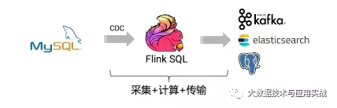

# 深入解读flink sql cdc的使用以及源码分析

https://mp.weixin.qq.com/s/Xh_AbDD8BhGtMb6i3s0ZFw  *2020-09-14*

---

# 前言

CDC:  Change Data Capture，变更数据获取的简称，使用CDC我们可以从数据库中获取已提交的更改并将这些更改发送到下游，供下游使用。这些变更可以包括INSERT,DELETE,UPDATE等.

用户可以在如下的场景使用cdc：

- **实时数据同步：比如我们将mysql库中的数据同步到我们的数仓中。**
- **数据库的实时物化视图。**

# flink消费cdc数据

在以前的数据同步中，比如我们想实时获取数据库的数据，一般采用的架构就是采用第三方工具，比如canal、debezium等，实时采集数据库的变更日志，然后将数据发送到kafka等消息队列。然后再通过其他的组件，比如flink、spark等等来消费kafka的数据，计算之后发送到下游系统。整体的架构如下所示：



对于上面的这种架构，flink承担的角色是计算层，目前flink提供的format有两种格式：canal-json和debezium-json，下面我们简单的介绍下。

## canal format

在国内，用的比较多的是阿里巴巴开源的canal，我们可以使用canal订阅mysql的binlog日志，canal会将mysql库的变更数据组织成它固定的JSON或protobuf 格式发到kafka，以供下游使用。

canal解析后的json数据格式如下：

```json
{
  "data": [
    {
      "id": "111",
      "name": "scooter",
      "description": "Big 2-wheel scooter",
      "weight": "5.18"
    }
  ],
  "database": "inventory",
  "es": 1589373560000,
  "id": 9,
  "isDdl": false,
  "mysqlType": {
    "id": "INTEGER",
    "name": "VARCHAR(255)",
    "description": "VARCHAR(512)",
    "weight": "FLOAT"
  },
  "old": [
    {
      "weight": "5.15"
    }
  ],
  "pkNames": [
    "id"
  ],
  "sql": "",
  "sqlType": {
    "id": 4,
    "name": 12,
    "description": 12,
    "weight": 7
  },
  "table": "products",
  "ts": 1589373560798,
  "type": "UPDATE"
}
```

简单讲下几个核心的字段:

- type : 描述操作的类型，包括‘UPDATE’, 'INSERT', 'DELETE'。
- data : 代表操作的数据。如果为'INSERT'，则表示行的内容；如果为'UPDATE'，则表示行的更新后的状态；如果为'DELETE'，则表示删除前的状态。
- old ：可选字段，如果存在，则表示更新之前的内容，如果不是update操作，则为 null。

完整的语义如下;

```java
    private String                    destination;      // 对应canal的实例或者MQ的topic
    private String                    groupId;          // 对应mq的group id
    private String                    database;         // 数据库或schema
    private String                    table;            // 表名
    private List<String>              pkNames;
    private Boolean                   isDdl;
    private String                    type;             // 类型: INSERT UPDATE DELETE
    // binlog executeTime
    private Long                      es;               // 执行耗时
    // dml build timeStamp
    private Long                      ts;               // 同步时间
    private String                    sql;              // 执行的sql, dml sql为空
    private List<Map<String, Object>> data;             // 数据列表
    private List<Map<String, Object>> old; // 旧数据列表, 用于update, size和data的size一一对应
```

在flink sql中，消费这个数据的sql如下：

```sql
CREATE TABLE topic_products (
  id BIGINT,
  name STRING,
  description STRING,
  weight DECIMAL(10, 2)
) WITH (
 'connector' = 'kafka',
 'topic' = 'products_binlog',
 'properties.bootstrap.servers' = 'localhost:9092',
 'properties.group.id' = 'testGroup',
 'format' = 'canal-json'  -- using canal-json as the format
)
```

其中DDL中的表的字段和类型要和mysql中的字段及类型能匹配的上，接下来我们就可以写flink sql来查询我们定义的topic_products了。

## debezium format

在国外，比较有名的类似canal的开源工具有debezium，它的功能较canal更加强大一些，不仅仅支持mysql。还支持其他的数据库的同步，比如 PostgreSQL、Oracle等，目前debezium支持的序列化格式为 JSON 和 Apache Avro 。

debezium提供的格式如下：

```json
{
 "before": {
   "id": 111,
   "name": "scooter",
   "description": "Big 2-wheel scooter",
   "weight": 5.18
 },
 "after": {
   "id": 111,
   "name": "scooter",
   "description": "Big 2-wheel scooter",
   "weight": 5.15
 },
 "source": {...},
 "op": "u",
 "ts_ms": 1589362330904,
 "transaction": null
}
```

同样，使用flink sql来消费的时候，sql和上面使用canal类似，只需要把foramt改成debezium-json即可。

## CanalJson反序列化源码解析

接下来我们看下flink的源码中canal-json格式的实现。canal 格式作为一种flink的格式，而且是source，所以也就是涉及到读取数据的时候进行反序列化，我们接下来就简单看看CanalJson的反序列化的实现。具体的实现类是CanalJsonDeserializationSchema。

我们看下这个最核心的反序列化方法：

```java
	@Override
	public void deserialize(byte[] message, Collector<RowData> out) throws IOException {
		try {
		    //使用json反序列化器将message反序列化成RowData
			RowData row = jsonDeserializer.deserialize(message);
			
			//获取type字段，用于下面的判断
			String type = row.getString(2).toString();
			if (OP_INSERT.equals(type)) {
				// 如果操作类型是insert，则data数组表示的是要插入的数据，则循环遍历data，然后添加一个标识INSERT，构造RowData对象，发送下游。
				ArrayData data = row.getArray(0);
				for (int i = 0; i < data.size(); i++) {
					RowData insert = data.getRow(i, fieldCount);
					insert.setRowKind(RowKind.INSERT);
					out.collect(insert);
				}
			} else if (OP_UPDATE.equals(type)) {
				// 如果是update操作，从data字段里获取更新后的数据、
				ArrayData data = row.getArray(0);
				// old字段获取更新之前的数据
				ArrayData old = row.getArray(1);
				for (int i = 0; i < data.size(); i++) {
					// the underlying JSON deserialization schema always produce GenericRowData.
					GenericRowData after = (GenericRowData) data.getRow(i, fieldCount);
					GenericRowData before = (GenericRowData) old.getRow(i, fieldCount);
					for (int f = 0; f < fieldCount; f++) {
						if (before.isNullAt(f)) {
							//如果old字段非空，则说明进行了数据的更新，如果old字段是null，则说明更新前后数据一样，这个时候把before的数据也设置成after的，也就是发送给下游的before和after数据一样。
							before.setField(f, after.getField(f));
						}
					}
					before.setRowKind(RowKind.UPDATE_BEFORE);
					after.setRowKind(RowKind.UPDATE_AFTER);
					//把更新前后的数据都发送下游
					out.collect(before);
					out.collect(after);
				}
			} else if (OP_DELETE.equals(type)) {
				// 如果是删除操作，data字段里包含将要被删除的数据，把这些数据组织起来发送给下游
				ArrayData data = row.getArray(0);
				for (int i = 0; i < data.size(); i++) {
					RowData insert = data.getRow(i, fieldCount);
					insert.setRowKind(RowKind.DELETE);
					out.collect(insert);
				}
			} else {
				if (!ignoreParseErrors) {
					throw new IOException(format(
						"Unknown \"type\" value \"%s\". The Canal JSON message is '%s'", type, new String(message)));
				}
			}
		} catch (Throwable t) {
			// a big try catch to protect the processing.
			if (!ignoreParseErrors) {
				throw new IOException(format(
					"Corrupt Canal JSON message '%s'.", new String(message)), t);
			}
		}
	}
```

# flink cdc connector

## 背景

对于上面的架构，我们需要部署canal（debezium）+ kafka，然后flink再从kafka消费数据，这种架构下我们需要部署多个组件，并且数据也需要落地到kafka，有没有更好的方案来精简下这个流程呢？我们接下来讲讲flink提供的cdc connector。

这个connector并没有包含在flink的代码里，具体的地址是在https://github.com/ververica/flink-cdc-connectors里，详情大家可以看下这里面的内容。

这种架构下，flink直接消费数据库的增量日志，替代了原来作为数据采集层的canal（debezium），然后直接进行计算，经过计算之后，将计算结果 发送到下游。整体架构如下：


使用这种架构是好处有：

- 减少canal和kafka的维护成本，链路更短，延迟更低
- flink提供了exactly once语义
- 可以从指定position读取
- 去掉了kafka，减少了消息的存储成本

## mysql-cdc

目前flink支持两种内置的connector，PostgreSQL和mysql，接下来我们以mysql为例简单讲讲。

在使用之前，我们需要引入相应的pom，mysql的pom如下：

```xml
<dependency>
  <groupId>com.alibaba.ververica</groupId>
  <!-- add the dependency matching your database -->
  <artifactId>flink-connector-mysql-cdc</artifactId>
  <version>1.1.0</version>
</dependency>
```

如果是sql客户端使用，需要下载 flink-sql-connector-mysql-cdc-1.1.0.jar 并且放到<FLINK_HOME>/lib/下面

连接mysql数据库的示例sql如下：

```sql
CREATE TABLE mysql_binlog (
 id INT NOT NULL,
 name STRING,
 description STRING,
 weight DECIMAL(10,3)
) WITH (
 'connector' = 'mysql-cdc',
 'hostname' = 'localhost',
 'port' = '3306',
 'username' = 'flinkuser',
 'password' = 'flinkpw',
 'database-name' = 'inventory',
 'table-name' = 'products'
)
```

如果订阅的是postgres数据库，我们需要把connector替换成postgres-cdc，DDL中表的schema和数据库一一对应。

更加详细的配置参见：

https://github.com/ververica/flink-cdc-connectors/wiki/MySQL-CDC-Connector

## mysql-cdc connector源码解析

接下来我们以mysql-cdc为例，看看源码层级是怎么实现的。既然作为一个sql的connector，那么就首先会有一个对应的TableFactory，然后在工厂类里面构造相应的source，最后将消费下来的数据转成flink认识的RowData格式，发送到下游。

我们按照这个思路来看看flink cdc源码的实现。

在flink-connector-mysql-cdc module中，找到其对应的工厂类：MySQLTableSourceFactory，进入createDynamicTableSource(Context context)方法，在这个方法里，使用从ddl中的属性里获取的host、dbname等信息构造了一个MySQLTableSource类。

### MySQLTableSource

在MySQLTableSource#getScanRuntimeProvider方法里，我们看到，首先构造了一个用于序列化的对象RowDataDebeziumDeserializeSchema，**这个对象主要是用于将Debezium获取的SourceRecord格式的数据转化为flink认识的RowData对象**。 我们看下RowDataDebeziumDeserializeSchem#deserialize方法，这里的操作主要就是先判断下进来的数据类型（insert 、update、delete），然后针对不同的类型（short、int等）分别进行转换，

最后我们看到用于flink用于获取数据库变更日志的Source函数是DebeziumSourceFunction，且最终返回的类型是RowData。

也就是说flink底层是采用了Debezium工具从mysql、postgres等数据库中获取的变更数据。

```java
	@SuppressWarnings("unchecked")
	@Override
	public ScanRuntimeProvider getScanRuntimeProvider(ScanContext scanContext) {
		RowType rowType = (RowType) physicalSchema.toRowDataType().getLogicalType();
		TypeInformation<RowData> typeInfo = (TypeInformation<RowData>) scanContext.createTypeInformation(physicalSchema.toRowDataType());
		DebeziumDeserializationSchema<RowData> deserializer = new RowDataDebeziumDeserializeSchema(
			rowType,
			typeInfo,
			((rowData, rowKind) -> {}),
			serverTimeZone);
		MySQLSource.Builder<RowData> builder = MySQLSource.<RowData>builder()
			.hostname(hostname)
			..........
		DebeziumSourceFunction<RowData> sourceFunction = builder.build();

		return SourceFunctionProvider.of(sourceFunction, false);
	}
```

### DebeziumSourceFunction

我们接下来看看DebeziumSourceFunction类

```java
@PublicEvolving
public class DebeziumSourceFunction<T> extends RichSourceFunction<T> implements
		CheckpointedFunction,
		ResultTypeQueryable<T> {
		    .............
		}
```

我们看到DebeziumSourceFunction类继承了RichSourceFunction，并且实现了CheckpointedFunction接口，也就是说这个类是flink的一个SourceFunction，会从源端（run方法）获取数据，发送给下游。此外这个类还实现了CheckpointedFunction接口，也就是会通过checkpoint的机制来保证exactly once语义。

接下来我们进入run方法，看看是如何获取数据库的变更数据的。

```java
	@Override
	public void run(SourceContext<T> sourceContext) throws Exception {
        ...........................
		// DO NOT include schema change, e.g. DDL
		properties.setProperty("include.schema.changes", "false");
         ...........................
        //将所有的属性信息打印出来，以便排查。
		// dump the properties
		String propsString = properties.entrySet().stream()
			.map(t -> "\t" + t.getKey().toString() + " = " + t.getValue().toString() + "\n")
			.collect(Collectors.joining());
		LOG.info("Debezium Properties:\n{}", propsString);
		
		//用于具体的处理数据的逻辑
		this.debeziumConsumer = new DebeziumChangeConsumer<>(
			sourceContext,
			deserializer,
			restoredOffsetState == null, // DB snapshot phase if restore state is null
			this::reportError);

		// create the engine with this configuration ...
		this.engine = DebeziumEngine.create(Connect.class)
			.using(properties)
			.notifying(debeziumConsumer)  // 数据发给上面的debeziumConsumer
			.using((success, message, error) -> {
				if (!success && error != null) {
					this.reportError(error);
				}
			})
			.build();

		if (!running) {
			return;
		}

		// run the engine asynchronously
		executor.execute(engine);

        //循环判断，当程序被打断，或者有错误的时候，打断engine，并且抛出异常
		// on a clean exit, wait for the runner thread
		try {
			while (running) {
				if (executor.awaitTermination(5, TimeUnit.SECONDS)) {
					break;
				}
				if (error != null) {
					running = false;
					shutdownEngine();
					// rethrow the error from Debezium consumer
					ExceptionUtils.rethrow(error);
				}
			}
		}
		catch (InterruptedException e) {
			// may be the result of a wake-up interruption after an exception.
			// we ignore this here and only restore the interruption state
			Thread.currentThread().interrupt();
		}
	}
```

在函数的开始，设置了很多的properties，比如include.schema.changes 设置为false，也就是不包含表的DDL操作，表结构的变更是不捕获的。我们这里只关注数据的增删改。

接下来构造了一个DebeziumChangeConsumer对象，这个类实现了DebeziumEngine.ChangeConsumer接口，主要就是将获取到的一批数据进行一条条的加工处理。

接下来定一个DebeziumEngine对象，这个对象是真正用来干活的，它的底层使用了kafka的connect-api来进行获取数据，得到的是一个org.apache.kafka.connect.source.SourceRecord对象。通过notifying方法将得到的数据交给上面定义的DebeziumChangeConsumer来来覆盖缺省实现以进行复杂的操作。

接下来通过一个线程池ExecutorService来异步的启动这个engine。

最后，做了一个循环判断，当程序被打断，或者有错误的时候，打断engine，并且抛出异常。

总结一下，就是在Flink的source函数里，使用Debezium 引擎获取对应的数据库变更数据（SourceRecord），经过一系列的反序列化操作，最终转成了flink中的RowData对象，发送给下游。

# changelog format

## 使用场景

当我们从mysql-cdc获取数据库的变更数据，或者写了一个group by的查询的时候，这种结果数据都是不断变化的，我们如何将这些变化的数据发到只支持append mode的kafka队列呢?

于是flink提供了一种changelog format，其实我们非常简单的理解为，flink对进来的RowData数据进行了一层包装，然后加了一个数据的操作类型，包括以下几种 INSERT,DELETE, UPDATE_BEFORE,UPDATE_AFTER。这样当下游获取到这个数据的时候，就可以根据数据的类型来判断下如何对数据进行操作了。

比如我们的原始数据格式是这样的。

```json
{"day":"2020-06-18","gmv":100}
```

经过changelog格式的加工之后，成为了下面的格式：

```json
{"data":{"day":"2020-06-18","gmv":100},"op":"+I"}
```

也就是说changelog format对原生的格式进行了包装，添加了一个op字段，表示数据的操作类型，目前有以下几种：

- +I：插入操作。
- -U ：更新之前的数据内容：
- +U ：更新之后的数据内容。
- -D ：删除操作。

## 示例

使用的时候需要引入相应的pom

```xml
<dependency>
  <groupId>com.alibaba.ververica</groupId>
  <artifactId>flink-format-changelog-json</artifactId>
  <version>1.1.0</version>
</dependency>
```

使用flink sql操作的方式如下：

```sql
CREATE TABLE kafka_gmv (
  day_str STRING,
  gmv DECIMAL(10, 5)
) WITH (
    'connector' = 'kafka',
    'topic' = 'kafka_gmv',
    'scan.startup.mode' = 'earliest-offset',
    'properties.bootstrap.servers' = 'localhost:9092',
    'format' = 'changelog-json'
);
```

我们定义了一个 format 为 changelog-json 的kafka connector，之后我们就可以对其进行写入和查询了。

完整的代码和配置请参考：
https://github.com/ververica/flink-cdc-connectors/wiki/Changelog-JSON-Format

## 源码浅析

作为一种flink的format ，我们主要看下其序列化和发序列化方法，changelog-json 使用了flink-json包进行json的处理。

### 反序列化

反序列化用的是ChangelogJsonDeserializationSchema类，在其构造方法里，我们看到主要是构造了一个json的序列化器jsonDeserializer用于对数据进行处理。

```java
	public ChangelogJsonDeserializationSchema(
			RowType rowType,
			TypeInformation<RowData> resultTypeInfo,
			boolean ignoreParseErrors,
			TimestampFormat timestampFormatOption) {
		this.resultTypeInfo = resultTypeInfo;
		this.ignoreParseErrors = ignoreParseErrors;
		this.jsonDeserializer = new JsonRowDataDeserializationSchema(
			createJsonRowType(fromLogicalToDataType(rowType)),
			// the result type is never used, so it's fine to pass in Debezium's result type
			resultTypeInfo,
			false, // ignoreParseErrors already contains the functionality of failOnMissingField
			ignoreParseErrors,
			timestampFormatOption);
	}
```

其中createJsonRowType方法指定了changelog的format是一种Row类型的格式，我们看下代码：

```java
private static RowType createJsonRowType(DataType databaseSchema) {
		DataType payload = DataTypes.ROW(
			DataTypes.FIELD("data", databaseSchema),
			DataTypes.FIELD("op", DataTypes.STRING()));
		return (RowType) payload.getLogicalType();
	}
```

在这里，指定了这个row格式有两个字段，一个是data，表示数据的内容，一个是op，表示操作的类型。

最后看下最核心的ChangelogJsonDeserializationSchema#deserialize(byte[] bytes, Collector<RowData> out>)

```java
	@Override
	public void deserialize(byte[] bytes, Collector<RowData> out) throws IOException {
		try {
			GenericRowData row = (GenericRowData) jsonDeserializer.deserialize(bytes);
			GenericRowData data = (GenericRowData) row.getField(0);
			String op = row.getString(1).toString();
			RowKind rowKind = parseRowKind(op);
			data.setRowKind(rowKind);
			out.collect(data);
		} catch (Throwable t) {
			// a big try catch to protect the processing.
			if (!ignoreParseErrors) {
				throw new IOException(format(
					"Corrupt Debezium JSON message '%s'.", new String(bytes)), t);
			}
		}
	}
```

使用jsonDeserializer对数据进行处理，然后对第二个字段op进行判断，添加对应的RowKind。

### 序列化

序列化的方法我们看下方法：ChangelogJsonSerializationSchema#serialize

```java
@Override
public byte[] serialize(RowData rowData) {
    reuse.setField(0, rowData);
    reuse.setField(1, stringifyRowKind(rowData.getRowKind()));
    return jsonSerializer.serialize(reuse);
}
	
```

这块没有什么难度，就是将flink的RowData使用jsonSerializer序列化成字节数组。

参考：
[1].https://www.bilibili.com/video/BV1zt4y1D7kt
[2].https://github.com/ververica/flink-cdc-connectors