# 大数据技术原理与应用 第三章 分布式文件系统HDFS 学习指南

Ruan Rongcheng 2018年3月26日 http://dblab.xmu.edu.cn/blog/290-2/

---

本指南介绍Hadoop分布式文件系统HDFS，并详细指引读者对HDFS文件系统的操作实践。请务必仔细阅读完[厦门大学林子雨编著的《大数据技术原理与应用》](http://dblab.xmu.edu.cn/post/bigdata/)第3章节，再结合本指南进行学习。

Hadoop分布式文件系统（Hadoop Distributed File System,HDFS）是Hadoop核心组件之一，如果已经安装了Hadoop，其中就已经包含了HDFS组件，不需要另外安装。

> 学习本指南需要在Linux系统安装好Hadoop.如果机器上没有安装Linux和Hadoop,请返回[大数据技术原理与应用 第二章 学习指南](http://dblab.xmu.edu.cn/blog/285/)，根据指南学习并安装。

第3章涉及到很多的理论知识点，主要的理论知识点包括：分布式文件系统、HDFS简介、HDFS的相关概念、HDFS体系结构、HDFS的存储原理、HDFS的数据读写过程。这些理论知识点，请自己依靠[厦门大学林子雨编著的《大数据技术原理与应用》](http://dblab.xmu.edu.cn/post/bigdata/)第3章节进行学习，本指南不再重复表述。

接下来介绍Linux操作系统中关于HDFS文件操作的常用Shell命令，利用Web界面查看和管理Hadoop文件系统，以及利用Hadoop提供的Java API进行基本的文件操作。

在学习HDFS编程实践前，我们需要启动Hadoop。执行如下命令

```bash
$ cd /usr/local/hadoop
$ ./sbin/start-dfs.sh #启动hadoop
```


## 一、利用Shell命令与HDFS进行交互

Hadoop支持很多Shell命令，其中fs是HDFS最常用的命令，利用fs可以查看HDFS文件系统的目录结构、上传和下载数据、创建文件等。

> 注意
>
> 教材《大数据技术原理与应用》的命令是以”./bin/hadoop dfs”开头的Shell命令方式，实际上有三种shell命令方式。
> 1. hadoop fs
> 2. hadoop dfs
> 3. hdfs dfs
>
> hadoop fs 适用于任何不同的文件系统，比如本地文件系统和HDFS文件系统
> hadoop dfs 只能适用于HDFS文件系统
> hdfs dfs 跟hadoop dfs的命令作用一样，也只能适用于HDFS文件系统

我们可以在终端输入如下命令，查看fs总共支持了哪些命令

```bash
$ ./bin/hadoop fs
```

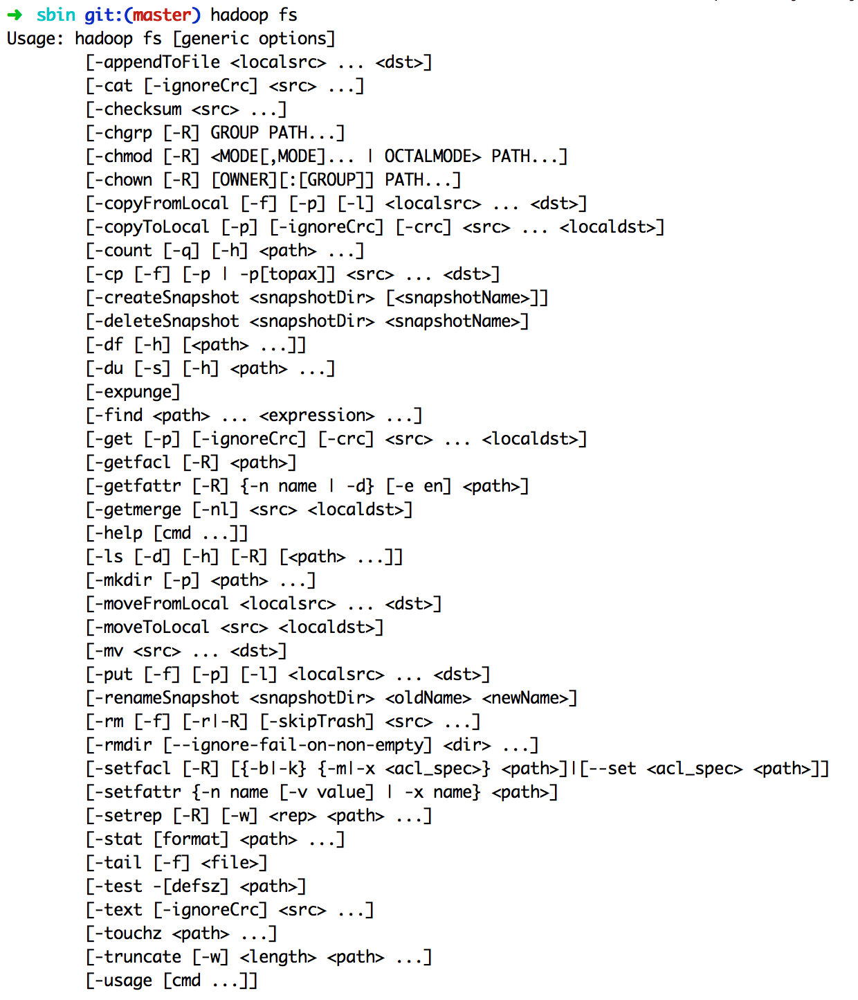

在终端输入如下命令，可以查看具体某个命令的作用

例如：我们查看put命令如何使用，可以输入如下命令

```bash
$ ./bin/hadoop fs -help put
```

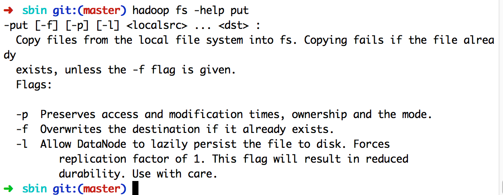

由于Hadoop支持的命令众多，想更多了解Hadoop命令，请参照《大数据技术原理与应用（第2版）》3.7小节学习。

### 1.目录操作

需要注意的是，Hadoop系统安装好以后，第一次使用HDFS时，需要首先在HDFS中创建用户目录。本教程全部采用hadoop用户登录Linux系统，因此，需要在HDFS中为hadoop用户创建一个**用户目录**，命令如下：

```bash
$ cd /usr/local/hadoop
$ ./bin/hdfs dfs -mkdir -p /user/hadoop
```

该命令中表示在HDFS中创建一个“/user/hadoop”目录，“–mkdir”是创建目录的操作，“-p”表示如果是多级目录，则父目录和子目录一起创建，这里“/user/hadoop”就是一个多级目录，因此必须使用参数“-p”，否则会出错。
“/user/hadoop”目录就成为hadoop用户对应的用户目录，可以使用如下命令显示HDFS中与当前用户hadoop对应的用户目录下的内容：

```bash
$ ./bin/hdfs dfs -ls .
```

该命令中，“-ls”表示列出HDFS某个目录下的所有内容，“.”表示HDFS中的当前用户目录，也就是“/user/hadoop”目录，因此，上面的命令和下面的命令是等价的：

```bash
$ ./bin/hdfs dfs -ls /user/hadoop
```

如果要列出HDFS上的所有目录，可以使用如下命令：

```bash
./bin/hdfs dfs -ls
```

下面，可以使用如下命令创建一个input目录：

```bash
$ ./bin/hdfs dfs -mkdir input
```

在创建个input目录时，采用了相对路径形式，实际上，这个input目录创建成功以后，它在HDFS中的完整路径是“/user/hadoop/input”。如果要在HDFS的根目录下创建一个名称为input的目录，则需要使用如下命令：

```bash
$ ./bin/hdfs dfs -mkdir /input
```

可以使用rm命令删除一个目录，比如，可以使用如下命令删除刚才在HDFS中创建的“/input”目录（不是“/user/hadoop/input”目录）：

```bash
$ ./bin/hdfs dfs –rm –r /input
```

上面命令中，“-r”参数表示如果删除“/input”目录及其子目录下的所有内容，如果要删除的一个目录包含了子目录，则必须使用“-r”参数，否则会执行失败。

- 给用户授权

hdfs dfs -chown 用户组:用户名 /user/用户名

```bash
$ ./bin/hdfs dfs -chown -r lenovo:hdfs /user/lenovo
```


### 2.文件操作

在实际应用中，经常需要从本地文件系统向HDFS中上传文件，或者把HDFS中的文件下载到本地文件系统中。
首先，使用vim编辑器，在本地Linux文件系统的“/home/hadoop/”目录下创建一个文件myLocalFile.txt，里面可以随意输入一些单词，比如，输入如下三行：

```
Hadoop
Spark
XMU DBLAB
```

然后，可以使用如下命令把本地文件系统的“/home/hadoop/myLocalFile.txt”上传到HDFS中的当前用户目录的input目录下，也就是上传到HDFS的“/user/hadoop/input/”目录下：

```bash
$ ./bin/hdfs dfs -put /home/hadoop/myLocalFile.txt  input
```

可以使用ls命令查看一下文件是否成功上传到HDFS中，具体如下：

```bash
$ ./bin/hdfs dfs –ls input
```

该命令执行后会显示类似如下的信息：

```
Found 1 items   
-rw-r--r--   1 hadoop supergroup         36 2017-01-02 23:55 input/ myLocalFile.txt
```

下面使用如下命令查看HDFS中的myLocalFile.txt这个文件的内容：

```bash
$ ./bin/hdfs dfs –cat input/myLocalFile.txt
```

下面把HDFS中的myLocalFile.txt文件下载到本地文件系统中的“/home/hadoop/下载/”这个目录下，命令如下：

```bash
$ ./bin/hdfs dfs -get input/myLocalFile.txt  /home/hadoop/下载
```

可以使用如下命令，到本地文件系统查看下载下来的文件myLocalFile.txt：

```bash
$ cd ~
$ cd 下载
$ ls
$ cat myLocalFile.txt
```

最后，了解一下如何把文件从HDFS中的一个目录拷贝到HDFS中的另外一个目录。比如，如果要把HDFS的“/user/hadoop/input/myLocalFile.txt”文件，拷贝到HDFS的另外一个目录“/input”中（注意，这个input目录位于HDFS根目录下），可以使用如下命令：

```bash
$ ./bin/hdfs dfs -cp input/myLocalFile.txt /input
```


## 二、利用Web界面管理HDFS

打开Linux自带的Firefox浏览器，点击此链接[HDFS的Web界面](http://localhost:50070/)，即可看到HDFS的web管理界面

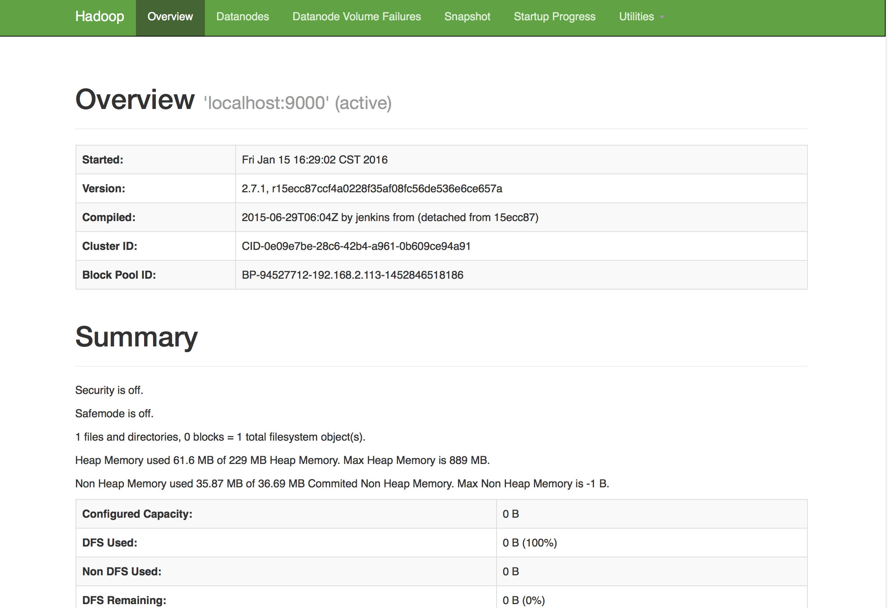

## 三、利用Java API与HDFS进行交互

Hadoop不同的文件系统之间通过调用Java API进行交互，上面介绍的Shell命令，本质上就是Java API的应用。下面提供了Hadoop官方的Hadoop API文档，想要深入学习Hadoop，可以访问如下网站，查看各个API的功能。

[Hadoop API文档](http://hadoop.apache.org/docs/stable/api/)

利用Java API进行交互，需要利用软件Eclipse编写Java程序。

### (一) 在Ubuntu中安装Eclipse

利用Ubuntu左侧边栏自带的软件中心安装软件，在Ubuntu左侧边栏打开软件中心


打开软件中心后，呈现如下界面


在软件中心搜索栏输入“ec”，软件中心会自动搜索相关的软件
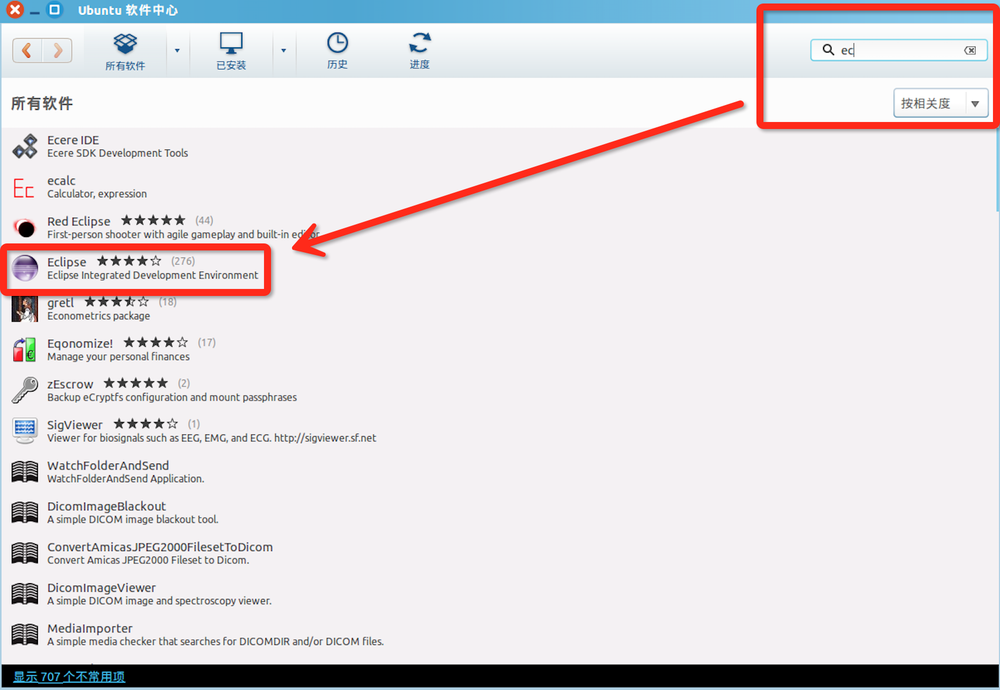

点击如下图中Eclipse，进行安装
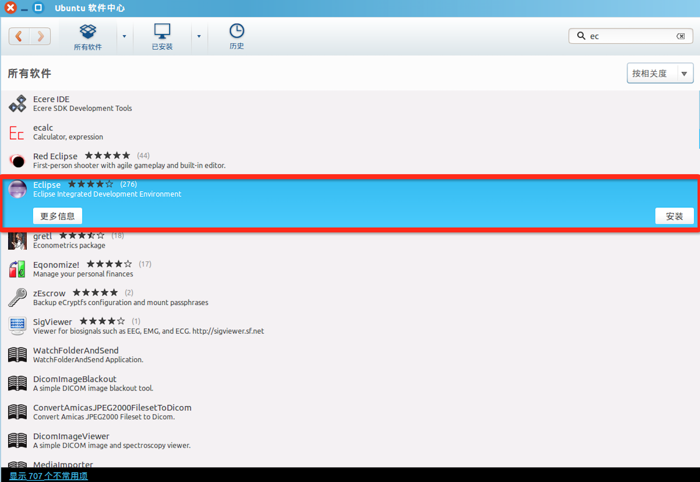

安装需要管理员权限，Ubuntu系统需要用户认证，弹出“认证”窗口，请输入当前用户的登录密码


ubuntu便会进入如下图的安装过程中,安装结束后安装进度条便会消失。
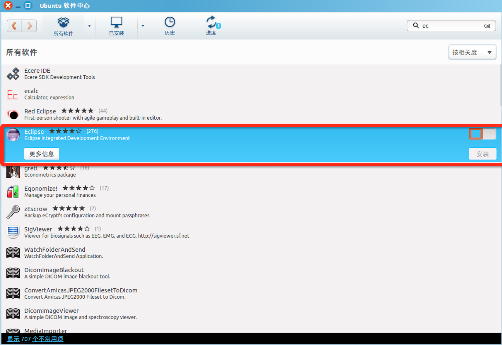

点击Ubuntu左侧边栏的搜索工具，输入“ec”，自动搜索已经安装好的相关软件,打开Eclipse


### （二）在Eclipse创建项目

第一次打开Eclipse,需要填写workspace(工作空间)，用来保存程序所在的位置，这里按照默认，不需要改动，如下图
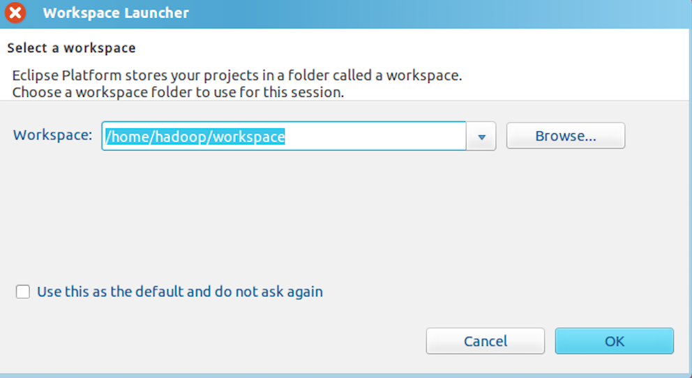

点击“OK”按钮，进入Eclipse软件。

**（备注：2017年11月21日上午11点30分作者正在更新本博客内容，所以，可能出现内容暂时错乱，很快会恢复正常）**

可以看出，由于当前是采用hadoop用户登录了Linux系统，因此，默认的工作空间目录位于hadoop用户目录“/home/hadoop”下。
Eclipse启动以后，会呈现如图4-3所示的界面。

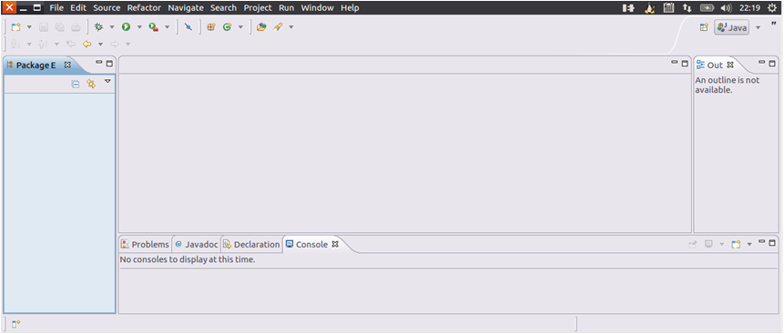
选择“File->New->Java Project”菜单，开始创建一个Java工程，会弹出如图4-4所示界面。

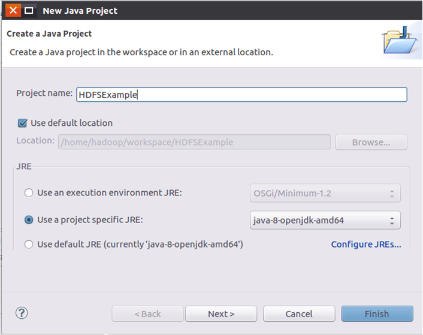

在“Project name”后面输入工程名称“HDFSExample”，选中“Use default location”，让这个Java工程的所有文件都保存到“/home/hadoop/workspace/HDFSExample”目录下。

在“JRE”这个选项卡中，可以选择当前的Linux系统中已经安装好的JDK，比如java-8-openjdk-amd64。然后，点击界面底部的“Next>”按钮，进入下一步的设置。

### （三）为项目添加需要用到的JAR包

进入下一步的设置以后，会弹出如图4-5所示界面。

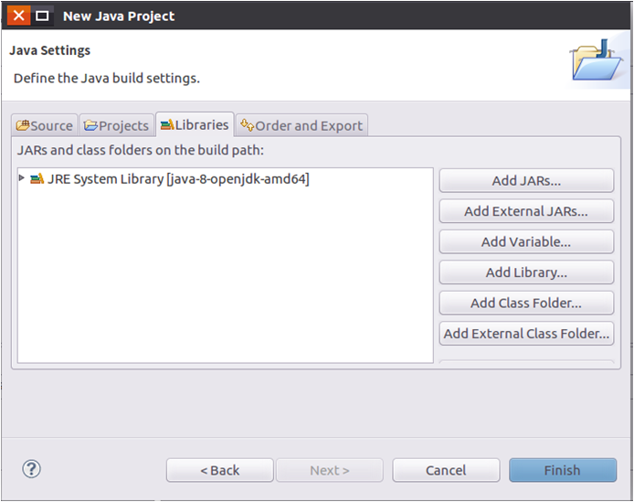

需要在这个界面中加载该Java工程所需要用到的JAR包，这些JAR包中包含了可以访问HDFS的Java API。这些JAR包都位于Linux系统的Hadoop安装目录下，对于本教程而言，就是在“/usr/local/hadoop/share/hadoop”目录下。点击界面中的“Libraries”选项卡，然后，点击界面右侧的“Add External JARs…”按钮，会弹出如图4-6所示界面。

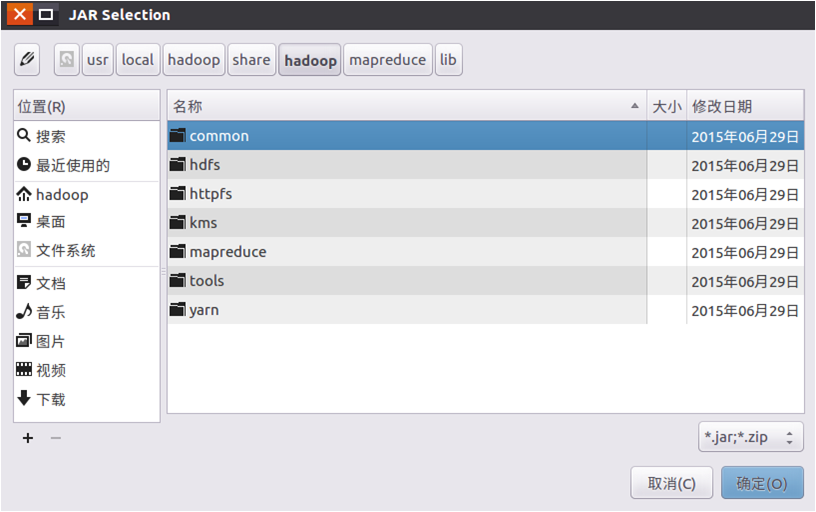

在该界面中，上面的一排目录按钮（即“usr”、“local”、“hadoop”、“share”、“hadoop”、“mapreduce”和“lib”），当点击某个目录按钮时，就会在下面列出该目录的内容。
为了编写一个能够与HDFS交互的Java应用程序，一般需要向Java工程中添加以下JAR包：
（1）”/usr/local/hadoop/share/hadoop/common”目录下的hadoop-common-2.7.1.jar和haoop-nfs-2.7.1.jar；
（2）/usr/local/hadoop/share/hadoop/common/lib”目录下的所有JAR包；
（3）“/usr/local/hadoop/share/hadoop/hdfs”目录下的haoop-hdfs-2.7.1.jar和haoop-hdfs-nfs-2.7.1.jar；
（4）“/usr/local/hadoop/share/hadoop/hdfs/lib”目录下的所有JAR包。
比如，如果要把“/usr/local/hadoop/share/hadoop/common”目录下的hadoop-common-2.7.1.jar和haoop-nfs-2.7.1.jar添加到当前的Java工程中，可以在界面中点击目录按钮，进入到common目录，然后，界面会显示出common目录下的所有内容（如图4-7所示）。

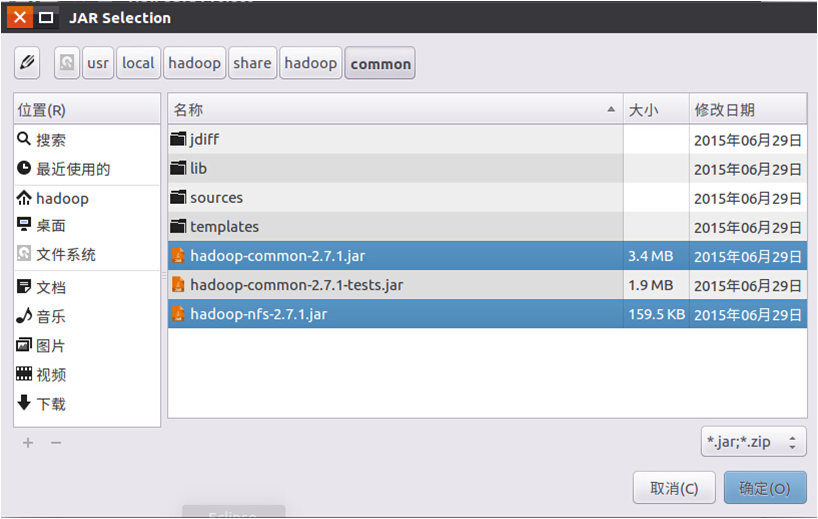

请在界面中用鼠标点击选中hadoop-common-2.7.1.jar和haoop-nfs-2.7.1.jar，然后点击界面右下角的“确定”按钮，就可以把这两个JAR包增加到当前Java工程中，出现的界面如图4-8所示。

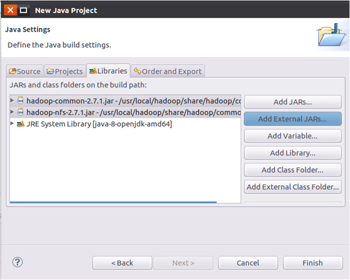
从这个界面中可以看出，hadoop-common-2.7.1.jar和haoop-nfs-2.7.1.jar已经被添加到当前Java工程中。然后，按照类似的操作方法，可以再次点击“Add External JARs…”按钮，把剩余的其他JAR包都添加进来。需要注意的是，当需要选中某个目录下的所有JAR包时，可以使用“Ctrl+A”组合键进行全选操作。全部添加完毕以后，就可以点击界面右下角的“Finish”按钮，完成Java工程HDFSExample的创建。

### （四）编写Java应用程序代码

下面编写一个Java应用程序，用来检测HDFS中是否存在一个文件。
请在Eclipse工作界面左侧的“Package Explorer”面板中（如图4-9所示），找到刚才创建好的工程名称“HDFSExample”，然后在该工程名称上点击鼠标右键，在弹出的菜单中选择“New->Class”菜单。

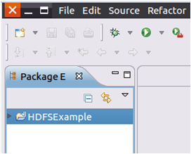

选择“New->Class”菜单以后会出现如图4-10所示界面。

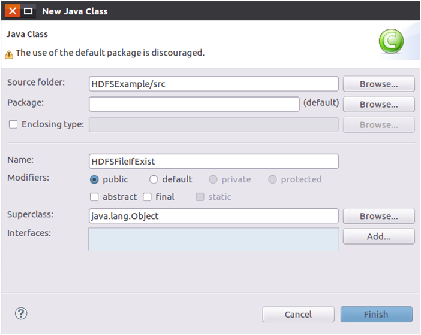

在该界面中，只需要在“Name”后面输入新建的Java类文件的名称，这里采用名称“HDFSFileIfExist”，其他都可以采用默认设置，然后，点击界面右下角“Finish”按钮，出现如图4-11所示界面。

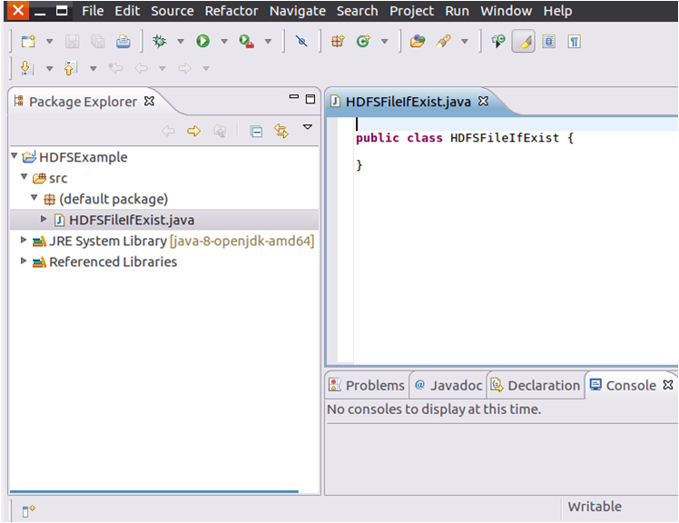

可以看出，Eclipse自动创建了一个名为“HDFSFileIfExist.java”的源代码文件，请在该文件中输入以下代码：

```java
import org.apache.hadoop.conf.Configuration;
import org.apache.hadoop.fs.FileSystem;
import org.apache.hadoop.fs.Path;
public class HDFSFileIfExist {
    public static void main(String[] args){
        try{
            String fileName = "test";
            Configuration conf = new Configuration();
            conf.set("fs.defaultFS", "hdfs://localhost:9000");
            conf.set("fs.hdfs.impl", "org.apache.hadoop.hdfs.DistributedFileSystem");
            FileSystem fs = FileSystem.get(conf);
            if(fs.exists(new Path(fileName))){
                System.out.println("文件存在");
            }else{
                System.out.println("文件不存在");
            }
 
        }catch (Exception e){
            e.printStackTrace();
        }
    }
}
```

该程序用来测试HDFS中是否存在一个文件，其中有一行代码：

```
String fileName = "test"
```

这行代码给出了需要被检测的文件名称是“test”，没有给出路径全称，表示是采用了相对路径，实际上就是测试当前登录Linux系统的用户hadoop，在HDFS中对应的用户目录下是否存在test文件，也就是测试HDFS中的“/user/hadoop/”目录下是否存在test文件。

### （五）编译运行程序

在开始编译运行程序之前，请一定确保Hadoop已经启动运行，如果还没有启动，需要打开一个Linux终端，输入以下命令启动Hadoop：

```bash
$ cd /usr/local/hadoop
$ ./sbin/start-dfs.sh
```

现在就可以编译运行上面编写的代码。可以直接点击Eclipse工作界面上部的运行程序的快捷按钮，当把鼠标移动到该按钮上时，在弹出的菜单中选择“Run As”，继续在弹出来的菜单中选择“Java Application”，如图4-12所示。

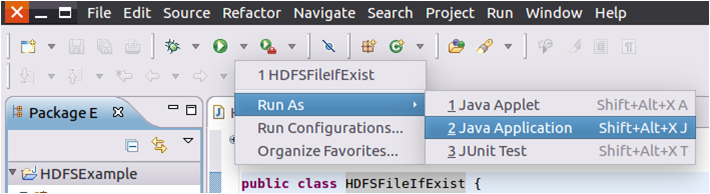


然后，会弹出如图4-13所示界面。

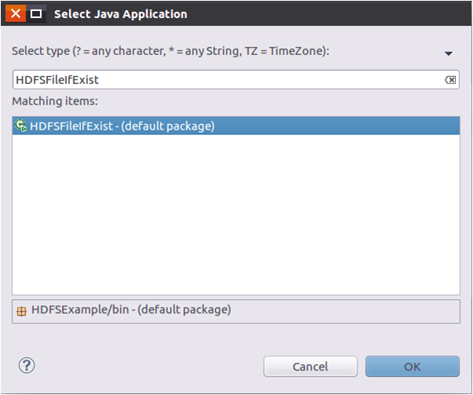

在该界面中，需要在“Select type”下面的文本框中输入“HDFSFileIfExist”，Eclipse就会自动找到相应的类“HDFSFileIfExist-(default package)”（注意：这个类在后面的导出JAR包操作中的Launch configuration中会被用到），然后，点击界面右下角的“OK”按钮，开始运行程序。

程序运行结束后，会在底部的“Console”面板中显示运行结果信息（如图4-14所示）。由于目前HDFS的“/user/hadoop”目录下还没有test文件，因此，程序运行结果是“文件不存在”。同时，“Console”面板中还会显示一些类似“log4j:WARN…”的警告信息，可以不用理会。

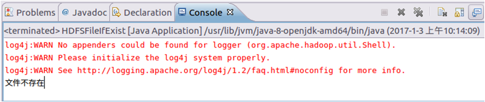

### （六）应用程序的部署

下面介绍如何把Java应用程序生成JAR包，部署到Hadoop平台上运行。首先，在Hadoop安装目录下新建一个名称为myapp的目录，用来存放我们自己编写的Hadoop应用程序，可以在Linux的终端中执行如下命令：

```bash
$ cd /usr/local/hadoop
$ mkdir myapp
```

然后，请在Eclipse工作界面左侧的“Package Explorer”面板中，在工程名称“HDFSExample”上点击鼠标右键，在弹出的菜单中选择“Export”，如图4-15所示。

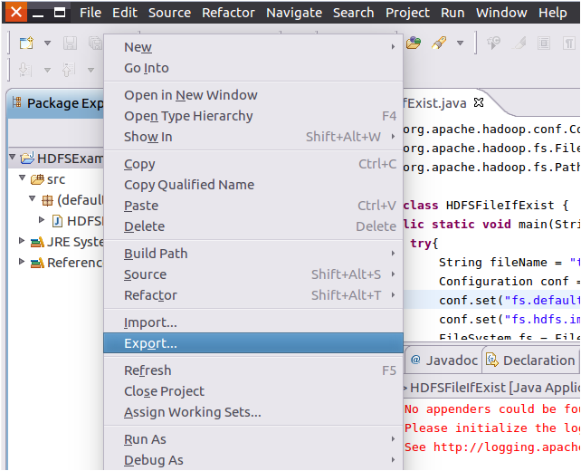

然后，会弹出如图4-16所示界面。

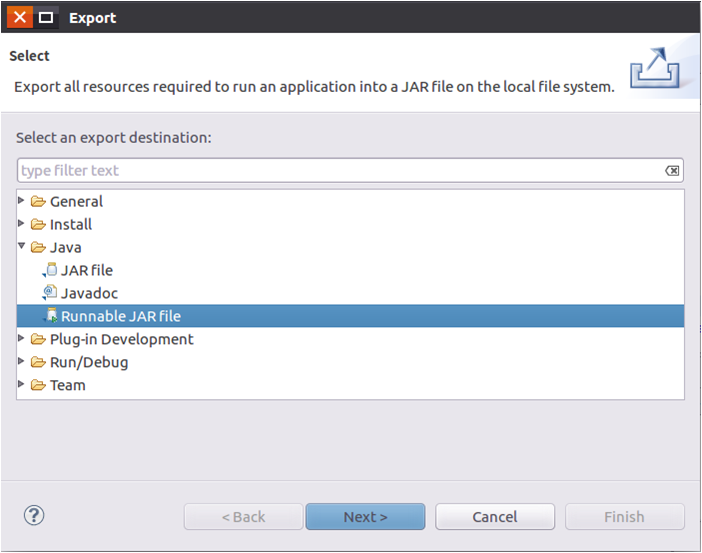

在该界面中，选择“Runnable JAR file”，然后，点击“Next>”按钮，弹出如图4-17所示界面。

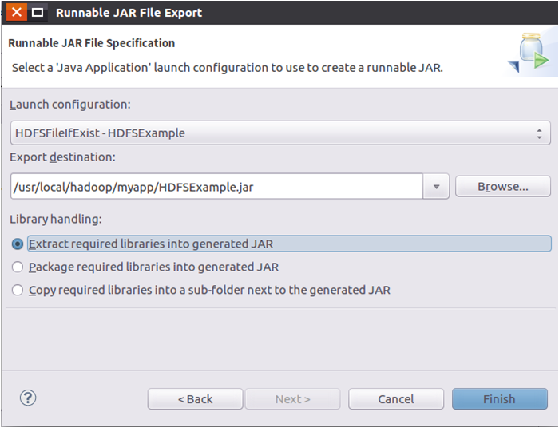

在该界面中，“Launch configuration”用于设置生成的JAR包被部署启动时运行的主类，需要在下拉列表中选择刚才配置的类“HDFSFileIfExist-HDFSExample”。在“Export destination”中需要设置JAR包要输出保存到哪个目录，比如，这里设置为“/usr/local/hadoop/myapp/HDFSExample.jar”。在“Library handling”下面选择“Extract required libraries into generated JAR”。然后，点击“Finish”按钮，会出现如图4-18所示界面。

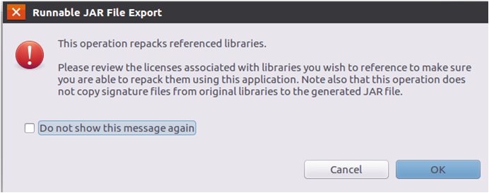

可以忽略该界面的信息，直接点击界面右下角的“OK”按钮，启动打包过程。打包过程结束后，会出现一个警告信息界面，如图4-19所示。

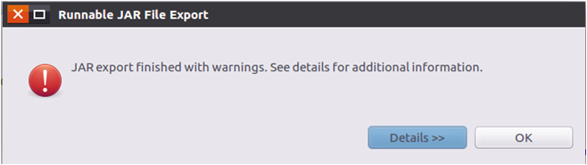

可以忽略该界面的信息，直接点击界面右下角的“OK”按钮。至此，已经顺利把HDFSExample工程打包生成了HDFSExample.jar。可以到Linux系统中查看一下生成的HDFSExample.jar文件，可以在Linux的终端中执行如下命令：

```bash
$ cd /usr/local/hadoop/myapp
$ ls
```

可以看到，“/usr/local/hadoop/myapp”目录下已经存在一个HDFSExample.jar文件。现在，就可以在Linux系统中，使用hadoop jar命令运行程序，命令如下：

```bash
$ cd /usr/local/hadoop
$ ./bin/hadoop jar ./myapp/HDFSExample.jar
```

或者也可以使用如下命令运行程序：

```bash
$ cd /usr/local/hadoop
$ java -jar ./myapp/HDFSExample.jar
```

命令执行结束后，会在屏幕上显示执行结果“文件不存在”。
至此，检测HDFS文件是否存在的程序，就顺利部署完成了。

## 附录：自己练习用的代码文件

下面给出几个代码文件，供读者自己练习。

### 1.写入文件

```java
import org.apache.hadoop.conf.Configuration;  
import org.apache.hadoop.fs.FileSystem;
import org.apache.hadoop.fs.FSDataOutputStream;
import org.apache.hadoop.fs.Path;

public class Chapter3 {    
    public static void main(String[] args) { 
        try {
            Configuration conf = new Configuration();  
            conf.set("fs.defaultFS","hdfs://localhost:9000");
            conf.set("fs.hdfs.impl","org.apache.hadoop.hdfs.DistributedFileSystem");
            FileSystem fs = FileSystem.get(conf);
            byte[] buff = "Hello world".getBytes(); // 要写入的内容
            String filename = "test"; //要写入的文件名
            FSDataOutputStream os = fs.create(new Path(filename));
            os.write(buff,0,buff.length);
            System.out.println("Create:"+ filename);
            os.close();
            fs.close();
        } catch (Exception e) {  
            e.printStackTrace();  
        }  
    }  
}
```

### 2.判断文件是否存在

```java
import org.apache.hadoop.conf.Configuration;
import org.apache.hadoop.fs.FileSystem;
import org.apache.hadoop.fs.Path;

public class Chapter3 {
    public static void main(String[] args) {
        try {
            String filename = "test";

            Configuration conf = new Configuration();
            conf.set("fs.defaultFS","hdfs://localhost:9000");
            conf.set("fs.hdfs.impl","org.apache.hadoop.hdfs.DistributedFileSystem");
            FileSystem fs = FileSystem.get(conf);
            if(fs.exists(new Path(filename))){
                System.out.println("文件存在");
            }else{
                System.out.println("文件不存在");
            }
            fs.close();
        } catch (Exception e) {
            e.printStackTrace();
        }
    }
} 
```

### 3.读取文件

```java
import java.io.BufferedReader;
import java.io.InputStreamReader;

import org.apache.hadoop.conf.Configuration;
import org.apache.hadoop.fs.FileSystem;
import org.apache.hadoop.fs.Path;
import org.apache.hadoop.fs.FSDataInputStream;

public class Chapter3 {
    public static void main(String[] args) {
        try {
            Configuration conf = new Configuration();
            conf.set("fs.defaultFS","hdfs://localhost:9000");
            conf.set("fs.hdfs.impl","org.apache.hadoop.hdfs.DistributedFileSystem");
            FileSystem fs = FileSystem.get(conf);
            Path file = new Path("test"); 
            FSDataInputStream getIt = fs.open(file);
            BufferedReader d = new BufferedReader(new InputStreamReader(getIt));
            String content = d.readLine(); //读取文件一行
            System.out.println(content);
            d.close(); //关闭文件
            fs.close(); //关闭hdfs
        } catch (Exception e) {
            e.printStackTrace();
        }
    }
}
```

