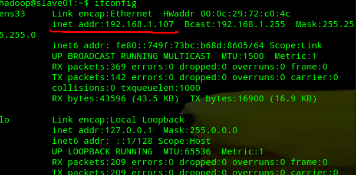
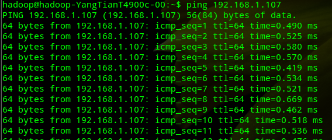
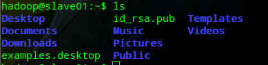
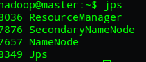
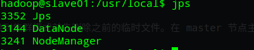
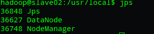

# Hadoop 2.7分布式集群环境搭建

Ruan Rongcheng  2016年12月12日 http://dblab.xmu.edu.cn/blog/1177-2/

---

Hadoop是一个能够让用户轻松架构和使用的分布式计算平台。为了更好演示集群分布，本文没有使用一台电脑上构建多个虚拟机的方法来模拟集群，而是使用三台电脑来搭建一个小型分布式集群环境安装。本文记录如何搭建并配置Hadoop分布式集群环境。

# 集群机器

一台Ubuntu主机系统作Master,一台Ubuntu主机系统做slave01,一台Ubuntu主机系统做slave02。三台主机机器处于同一局域网下。
这里使用三台主机搭建分布式集群环境，更多台机器同样可以使用如下配置。
IP在不同局域网环境下有可能不同，可以用 ifconfig 命令查看当前主机打IP。

```bash
$ ifconfig
```

即可获得当前主机的IP在局域网地址，如下图：

三台机器的名称和IP如下,

| 主机名称 | IP地址        |
| -------- | ------------- |
| master   | 192.168.1.104 |
| slave01  | 192.168.1.107 |
| slave02  | 192.168.1.108 |

三台电脑主机的用户名均为hadoop.
三台机器可以ping双方的ip来测试三台电脑的连通性。
在master节点主机上的Shell中运行如下命令,测试能否连接到slave01节点主机

```bash
$ ping 192.168.1.107
```

如果出现如下图，说明连接成功



为了更好的在Shell中区分三台主机，修改其显示的主机名，执行如下命令

```bash
$ sudo vim /etc/hostname
```

master的/etc/hostname添加如下配置：

```properties
master
```

同样slave01的/etc/hostname添加如下配置：

```properties
slave01
```

同样slave02的/etc/hostname添加如下配置：

```properties
slave02
```

重启三台电脑，重启后在终端Shell中才会看到机器名的变化,如下图：


修改三台机器的/etc/hosts文件,添加同样的配置：

```bash
$ sudo vim /etc/hosts
```

配置如下：

```properties
127.0.0.1 localhost
192.168.1.104 master
192.168.1.107 slave01
192.168.1.108 slave02
```

# 配置ssh无密码登录本机和访问集群机器

三台主机电脑分别运行如下命令，测试能否连接到本地localhost

```bash
$ ssh localhost
```

登录成功会显示如下结果：

```properties
Last login: Mon Feb 29 18:29:55 2016 from ::1
```

如果不能登录本地，请运行如下命令，安装openssh-server,并生成ssh公钥。

```bash
$ sudo apt-get openssh-server
$ ssh-keygen -t rsa -P ""
$ cat $HOME/.ssh/id_rsa.pub >> $HOME/.ssh/authorized_keys
$ chmod 600 $HOME/.ssh/authorized_keys    # 修改文件权限
```

在保证了三台主机电脑都能连接到本地 localhost 后，还需要让master主机免密码登录slave01和slave02主机。在master执行如下命令，将master的id_rsa.pub传送给两台slave主机。

```bash
$ scp ~/.ssh/id_rsa.pub hadoop@slave01:/home/hadoop/
$ scp ~/.ssh/id_rsa.pub hadoop@slave02:/home/hadoop/
```

在slave01,slave02主机上分别运行ls命令

```bash
$ ls ~
```

可以看到slave01、slave02主机分别接收到 id_rsa.pub 文件



接着在slave01、slave02主机上将master的公钥加入各自的节点上,在slave01和slave02执行如下命令:

```bash
$ cat ~/id_rsa.pub >> ~/.ssh/authorized_keys
$ rm ~/id_rsa.pub
```

如果master主机和slave01、slave02主机的用户名一样，那么在master主机上直接执行如下测试命令，即可让master主机免密码登录slave01、slave02主机。

```bash
$ ssh slave01
```

如果master主机和slave01主机的用户名不一样，还需要在master修改~/.ssh/config文件，如果没有此文件，自己创建文件。

```properties
Host master
  user Ruanrc
Host slave01
  user hadoop
```

然后master主机再执行免密码登录：

```bash
$ ssh slave01
```

# JDK和Hadoop安装配置

分别在master主机和slave01、slave02主机上安装JDK和Hadoop，并加入环境变量。

## 安装JDK(方式不推荐)

分别在master主机和slave01,slave02主机上执行安装JDK的操作

```bash
$ sudo apt-get install default-jdk
```

编辑~/.bashrc文件，添加如下内容：

```properties
export JAVA_HOME=/usr/lib/jvm/default-java
```

接着让环境变量生效，执行如下代码：

```bash
$ source ~/.bashrc
```

## 安装Hadoop

先在master主机上做安装Hadoop，暂时不需要在slave01,slave02主机上安装Hadoop.稍后会把master配置好的Hadoop发送给slave01,slave02.
在master主机执行如下操作：

```bash
$ sudo tar -zxf ~/下载/hadoop-2.7.3.tar.gz -C /usr/local    # 解压到/usr/local中
$ cd /usr/local/
$ sudo mv ./hadoop-2.7.3/ ./hadoop            # 将文件夹名改为hadoop
$ sudo chown -R hadoop ./hadoop       # 修改文件权限
```

编辑~/.bashrc文件，添加如下内容：

```properties
export HADOOP_HOME=/usr/local/hadoop
export PATH=$PATH:$HADOOP_HOME/bin:$HADOOP_HOME/sbin
```

接着让环境变量生效，执行如下代码：

```bash
$ source ~/.bashrc
```

# Hadoop集群配置

修改master主机修改Hadoop如下配置文件，这些配置文件都位于/usr/local/hadoop/etc/hadoop目录下。
修改slaves：
这里把DataNode的主机名写入该文件，每行一个。这里让master节点主机仅作为NameNode使用。

```properties
slave01
slave02
```

修改core-site.xml

```xml
  <configuration>
      <property>
          <name>hadoop.tmp.dir</name>
          <value>file:/usr/local/hadoop/tmp</value>
          <description>Abase for other temporary directories.</description>
      </property>
      <property>
          <name>fs.defaultFS</name>
          <value>hdfs://master:9000</value>
      </property>
  </configuration>
```

修改hdfs-site.xml：

```xml
<configuration>
    <property>
        <name>dfs.replication</name>
        <value>3</value>
    </property>
    <property>
        <name>dfs.namenode.name.dir</name>
        <value>file:/jrtz/hadoop/tmp/dfs/name</value>
    </property>
    <property>
        <name>dfs.datanode.data.dir</name>
        <value>file:/jrtz/hadoop/tmp/dfs/data</value>
    </property>
</configuration>
```

修改mapred-site.xml(复制mapred-site.xml.template,再修改文件名)

```xml
  <configuration>
    <property>
        <name>mapreduce.framework.name</name>
        <value>yarn</value>
    </property>
  </configuration>
```

修改yarn-site.xml

```xml
 <configuration>
  <!-- Site specific YARN configuration properties -->
      <property>
          <name>yarn.nodemanager.aux-services</name>
          <value>mapreduce_shuffle</value>
      </property>
      <property>
          <name>yarn.resourcemanager.hostname</name>
          <value>master</value>
      </property>
  </configuration>
```

配置好后，将 master 上的 /usr/local/Hadoop 文件夹复制到各个节点上。之前有跑过伪分布式模式，建议在切换到集群模式前先删除之前的临时文件。在 master 节点主机上执行：

```bash
$ cd /usr/local/
$ rm -rf ./hadoop/tmp   # 删除临时文件
$ rm -rf ./hadoop/logs/*   # 删除日志文件
$ tar -zcf ~/hadoop.master.tar.gz ./hadoop
$ cd ~
$ scp ./hadoop.master.tar.gz slave01:/home/hadoop
$ scp ./hadoop.master.tar.gz slave02:/home/hadoop
```

在slave01,slave02节点上执行：

```bash
$ sudo rm -rf /usr/local/hadoop/
$ sudo tar -zxf ~/hadoop.master.tar.gz -C /usr/local
$ sudo chown -R hadoop /usr/local/hadoop
```

# 启动hadoop集群

在master主机上执行如下命令：

```bash
$ cd /usr/local/hadoop
$ bin/hdfs namenode -format
$ sbin/start-all.sh
```

运行后，在master，slave01,slave02运行jps命令，查看：

```bash
$ jps
```

master运行jps后，如下图：



slave01、slave02运行jps，如下图：



