# Hadoop安装教程-单机/伪分布式配置-Hadoop2.6.0(2.7.1)/Ubuntu14.04(16.04)

 给力星 2020年8月24日 http://dblab.xmu.edu.cn/blog/install-hadoop/

---

当开始着手实践 Hadoop 时，安装 Hadoop 往往会成为新手的一道门槛。尽管安装其实很简单，书上有写到，官方网站也有 Hadoop 安装配置教程，但由于对 Linux 环境不熟悉，书上跟官网上简略的安装步骤新手往往 Hold 不住。加上网上不少教程也甚是坑，导致新手折腾老几天愣是没装好，很是打击学习热情。

本教程由[厦门大学数据库实验室](http://dblab.xmu.edu.cn/) / [给力星](http://www.powerxing.com/)出品，转载请注明。**本教程适合于原生 Hadoop 2，包括 Hadoop 2.6.0, Hadoop 2.7.1 等版本**，主要参考了[官方安装教程](http://hadoop.apache.org/docs/stable/hadoop-project-dist/hadoop-common/SingleCluster.html)，步骤详细，辅以适当说明，**相信按照步骤来，都能顺利安装并运行Hadoop**。另外有[Hadoop安装配置简略版](http://dblab.xmu.edu.cn/blog/install-hadoop-simplify/)方便有基础的读者快速完成安装。此外，希望读者们能多去了解一些 Linux 的知识，以后出现问题时才能自行解决。

为了方便学习本教程，请读者们利用Linux系统中自带的firefox浏览器打开本指南进行学习。
Hadoop安装文件，可以到Hadoop官网下载，也可以[点击这里从百度云盘下载](https://pan.baidu.com/s/1mUR3M2U_lbdBzyV_p85eSA)（提取码：99bg），进入该百度云盘链接后，找到Hadoop安装文件hadoop-2.7.1.tar.gz（本教程也可以用于安装Hadoop 2.7.1版本）。

## 环境

本教程使用 **Ubuntu 14.04 64位** 作为系统环境（Ubuntu 12.04，Ubuntu16.04 也行，32位、64位均可），请自行安装系统（可参考[使用VirtualBox安装Ubuntu](http://dblab.xmu.edu.cn/blog/337-2/)）。

如果用的是 CentOS/RedHat 系统，请查看相应的[CentOS安装Hadoop教程_单机伪分布式配置](http://dblab.xmu.edu.cn/blog/install-hadoop-in-centos/)。

本教程基于原生 Hadoop 2，在 **Hadoop 2.6.0 (stable)** 版本下验证通过，可适合任何 Hadoop 2.x.y 版本，如 Hadoop 2.7.1、2.6.3、2.4.1等。

> 使用本教程请确保系统处于联网状态下，部分高校使用星网锐捷连接网络，可能导致虚拟机无法联网，那么建议您使用双系统安装ubuntu,然后再使用本教程！

> **Hadoop版本**
>
> Hadoop 有两个主要版本，Hadoop 1.x.y 和 Hadoop 2.x.y 系列，比较老的教材上用的可能是 0.20 这样的版本。Hadoop 2.x 版本在不断更新，本教程均可适用。如果需安装 0.20，1.2.1这样的版本，本教程也可以作为参考，主要差别在于配置项，配置请参考官网教程或其他教程。
>
> 新版是兼容旧版的，书上旧版本的代码应该能够正常运行（我自己没验证，欢迎验证反馈）。

装好了 Ubuntu 系统之后，在安装 Hadoop 前还需要做一些必备工作。

## 创建hadoop用户

如果你安装 Ubuntu 的时候不是用的 “hadoop” 用户，那么需要增加一个名为 hadoop 的用户。

首先按 **ctrl+alt+t** 打开终端窗口，输入如下命令创建新用户 :

```bash
$ sudo useradd -m hadoop -s /bin/bash
```


这条命令创建了可以登陆的 hadoop 用户，并使用 /bin/bash 作为 shell。

> sudo命令
>
> 本文中会大量使用到sudo命令。sudo是ubuntu中一种权限管理机制，管理员可以授权给一些普通用户去执行一些需要root权限执行的操作。当使用sudo命令时，就需要输入您当前用户的密码.

> 密码
>
> 在Linux的终端中输入密码，终端是不会显示任何你当前输入的密码，也不会提示你已经输入了多少字符密码。而在windows系统中,输入密码一般都会以“*”表示你输入的密码字符

> 输入法中英文切换
>
> ubuntu中终端输入的命令一般都是使用英文输入。linux中英文的切换方式是使用键盘“shift”键来切换，也可以点击顶部菜单的输入法按钮进行切换。ubuntu自带的Sunpinyin中文输入法已经足够读者使用。

> Ubuntu终端复制粘贴快捷键
>
> 在Ubuntu终端窗口中，复制粘贴的快捷键需要加上 shift，即粘贴是 ctrl+shift+v。

接着使用如下命令设置密码，可简单设置为 hadoop，按提示输入两次密码：

```bash
$ sudo passwd hadoop
```


可为 hadoop 用户增加管理员权限，方便部署，避免一些对新手来说比较棘手的权限问题：

```bash
$ sudo adduser hadoop sudo
```


最后注销当前用户（点击屏幕右上角的齿轮，选择注销），返回登陆界面。在登陆界面中选择刚创建的 hadoop 用户进行登陆。

## 更新apt

用 hadoop 用户登录后，我们先更新一下 apt，后续我们使用 apt 安装软件，如果没更新可能有一些软件安装不了。按 ctrl+alt+t 打开终端窗口，执行如下命令：

```bash
$ sudo apt-get update
```


若出现如下 “Hash校验和不符” 的提示，可通过更改软件源来解决。若没有该问题，则不需要更改。从软件源下载某些软件的过程中，可能由于网络方面的原因出现没法下载的情况，那么建议更改软件源。在学习Hadoop过程中，即使出现“Hash校验和不符”的提示，也不会影响Hadoop的安装。

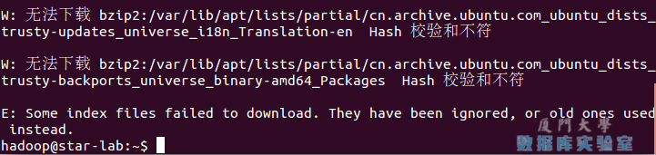

Ubuntu更新软件源时遇到Hash校验和不符的问题

### 如何更改软件源

- 首先点击左侧任务栏的【系统设置】（齿轮图标），选择【软件和更新】


Ubuntu更新软件源

- 点击 “下载自” 右侧的方框，选择【其他节点】

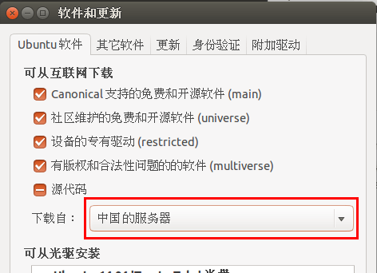

Ubuntu更新软件源-选择服务器

- 在列表中选中【mirrors.aliyun.com】，并点击右下角的【选择服务器】，会要求输入用户密码，输入即可。

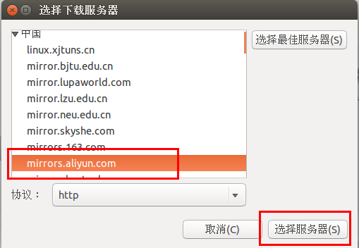

Ubuntu更新软件源-选择服务器

- 接着点击关闭。

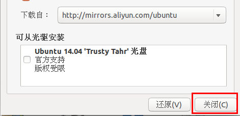

Ubuntu更新软件源-关闭窗口

- 此时会提示列表信息过时，点击【重新载入】，


Ubuntu更新软件源-重新载入

- 最后耐心等待更新缓存即可。更新完成会自动关闭【软件和更新】这个窗口。如果还是提示错误，请选择其他服务器节点如 mirrors.163.com 再次进行尝试。更新成功后，再次执行 `sudo apt-get update` 就正常了。

后续需要更改一些配置文件，我比较喜欢用的是 vim（vi增强版，基本用法相同），建议安装一下（如果你实在还不会用 vi/vim 的，请将后面用到 vim 的地方改为 gedit，这样可以使用文本编辑器进行修改，并且每次文件更改完成后请关闭整个 gedit 程序，否则会占用终端）：

```bash
$ sudo apt-get install vim
```


安装软件时若需要确认，在提示处输入 y 即可。

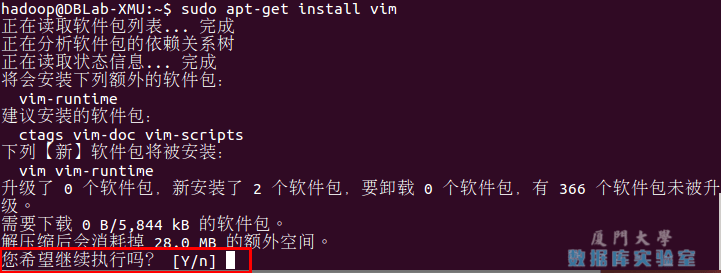

通过命令行安装软件

> vim简单操作指南
>
> vim的常用模式有分为命令模式，插入模式，可视模式，正常模式。本教程中，只需要用到正常模式和插入模式。二者间的切换即可以帮助你完成本指南的学习。
>
> 1. 正常模式
>    正常模式主要用来浏览文本内容。一开始打开vim都是正常模式。在任何模式下按下Esc键就可以返回正常模式
> 2. 插入编辑模式
>    插入编辑模式则用来向文本中添加内容的。在正常模式下，输入i键即可进入插入编辑模式
> 3. 退出vim
>    如果有利用vim修改任何的文本，一定要记得保存。Esc键退回到正常模式中，然后输入:wq即可保存文本并退出vim

## 安装SSH、配置SSH无密码登陆

集群、单节点模式都需要用到 SSH 登陆（类似于远程登陆，你可以登录某台 Linux 主机，并且在上面运行命令），Ubuntu 默认已安装了 SSH client，此外还需要安装 SSH server：

```bash
$ sudo apt-get install openssh-server
```


安装后，可以使用如下命令登陆本机：

```bash
$ ssh localhost
```


此时会有如下提示(SSH首次登陆提示)，输入 yes 。然后按提示输入密码 hadoop，这样就登陆到本机了。

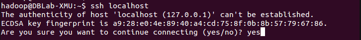

SSH首次登陆提示

但这样登陆是需要每次输入密码的，我们需要配置成SSH无密码登陆比较方便。

首先退出刚才的 ssh，就回到了我们原先的终端窗口，然后利用 ssh-keygen 生成密钥，并将密钥加入到授权中：

```bash
$ exit                           # 退出刚才的 ssh localhost
$ cd ~/.ssh/                     # 若没有该目录，请先执行一次ssh localhost
$ ssh-keygen -t rsa              # 会有提示，都按回车就可以
$ cat ./id_rsa.pub >> ./authorized_keys  # 加入授权
```


> ~的含义
>
> 在 Linux 系统中，~ 代表的是用户的主文件夹，即 “/home/用户名” 这个目录，如你的用户名为 hadoop，则 ~ 就代表 “/home/hadoop/”。 此外，命令中的 # 后面的文字是注释，只需要输入前面命令即可。

此时再用 `ssh localhost` 命令，无需输入密码就可以直接登陆了，如下图所示。

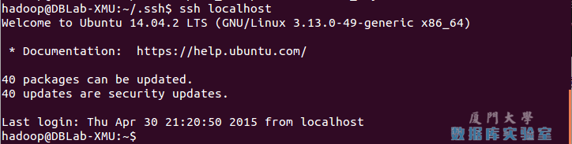

SSH无密码登录

## 安装Java环境

下面有三种安装JDK的方式，可以任选一种。推荐直接使用第1种安装方式。

**（1）第1种安装JDK方式（手动安装，推荐采用本方式）**

需要按照下面步骤来自己手动安装JDK1.8。
我们已经把JDK1.8的安装包jdk-8u162-linux-x64.tar.gz放在了百度云盘，[可以点击这里到百度云盘下载JDK1.8安装包](https://pan.baidu.com/s/1mUR3M2U_lbdBzyV_p85eSA)（提取码：99bg）。请把压缩格式的文件jdk-8u162-linux-x64.tar.gz下载到本地电脑，假设保存在“/home/linziyu/Downloads/”目录下。

在Linux命令行界面中，执行如下Shell命令（注意：当前登录用户名是hadoop）：

```bash
$ cd /usr/lib
$ sudo mkdir jvm #创建/usr/lib/jvm目录用来存放JDK文件
$ cd ~ #进入hadoop用户的主目录
$ cd Downloads  #注意区分大小写字母，刚才已经通过FTP软件把JDK安装包jdk-8u162-linux-x64.tar.gz上传到该目录下
$ sudo tar -zxvf ./jdk-8u162-linux-x64.tar.gz -C /usr/lib/jvm  #把JDK文件解压到/usr/lib/jvm目录下
```

上面使用了解压缩命令tar，如果对Linux命令不熟悉，可以参考[常用的Linux命令用法](http://dblab.xmu.edu.cn/blog/1624-2/)。

JDK文件解压缩以后，可以执行如下命令到/usr/lib/jvm目录查看一下：

```bash
$ cd /usr/lib/jvm
$ ls
```

可以看到，在/usr/lib/jvm目录下有个jdk1.8.0_162目录。
下面继续执行如下命令，设置环境变量：

```bash
$ cd ~
$ vim ~/.bashrc
```

上面命令使用vim编辑器（[查看vim编辑器使用方法](http://dblab.xmu.edu.cn/blog/1607-2/)）打开了hadoop这个用户的环境变量配置文件，请在这个文件的开头位置，添加如下几行内容：

```bash
export JAVA_HOME=/usr/lib/jvm/jdk1.8.0_162
export JRE_HOME=${JAVA_HOME}/jre
export CLASSPATH=.:${JAVA_HOME}/lib:${JRE_HOME}/lib
export PATH=${JAVA_HOME}/bin:$PATH
```

保存.bashrc文件并退出vim编辑器。然后，继续执行如下命令让.bashrc文件的配置立即生效：

```bash
$ source ~/.bashrc
```

这时，可以使用如下命令查看是否安装成功：

```bash
$ java -version
```

如果能够在屏幕上返回如下信息，则说明安装成功：

```bash
hadoop@ubuntu:~$ java -version
java version "1.8.0_162"
Java(TM) SE Runtime Environment (build 1.8.0_162-b12)
Java HotSpot(TM) 64-Bit Server VM (build 25.162-b12, mixed mode)
```

（2）第2种安装JDK方式（不推荐）：

```bash
$ sudo apt-get install openjdk-7-jre openjdk-7-jdk
```


安装好 OpenJDK 后，需要找到相应的安装路径，这个路径是用于配置 JAVA_HOME 环境变量的。执行如下命令：

```bash
$ dpkg -L openjdk-7-jdk | grep '/bin/javac'
```


该命令会输出一个路径，除去路径末尾的 “/bin/javac”，剩下的就是正确的路径了。如输出路径为 /usr/lib/jvm/java-7-openjdk-amd64/bin/javac，则我们需要的路径为 /usr/lib/jvm/java-7-openjdk-amd64。

接着需要配置一下 JAVA_HOME 环境变量，为方便，我们在 ~/.bashrc 中进行设置（扩展阅读: [设置Linux环境变量的方法和区别](http://dblab.xmu.edu.cn/blog/linux-environment-variable/)）：

```bash
$ vim ~/.bashrc
```


在文件最前面添加如下单独一行（注意 = 号前后不能有空格），将“JDK安装路径”改为上述命令得到的路径，并保存：

```shell
export JAVA_HOME=JDK安装路径
```

如下图所示（该文件原本可能不存在，内容为空，这不影响）：

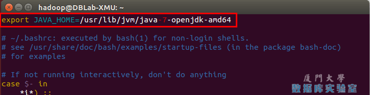

配置JAVA_HOME变量

接着还需要让该环境变量生效，执行如下代码：

```bash
$ source ~/.bashrc    # 使变量设置生效
```


设置好后我们来检验一下是否设置正确：

```bash
$ echo $JAVA_HOME     # 检验变量值
$ java -version
$ $JAVA_HOME/bin/java -version  # 与直接执行 java -version 一样
```


如果设置正确的话，`$JAVA_HOME/bin/java -version` 会输出 java 的版本信息，且和 `java -version` 的输出结果一样，如下图所示：

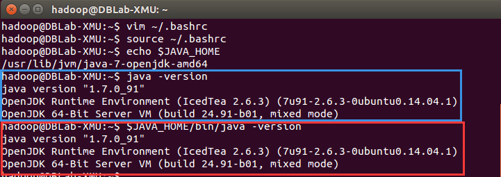

成功配置JAVA_HOME变量

这样，Hadoop 所需的 Java 运行环境就安装好了。

（3）第3种安装JDK方式（不推荐）
根据大量电脑安装Java环境的情况我们发现，部分电脑按照上述的第一种安装方式会出现安装失败的情况，这时，可以采用这里介绍的另外一种安装方式，命令如下：

```bash
$ sudo apt-get install default-jre default-jdk
```


上述安装过程需要访问网络下载相关文件，请保持联网状态。安装结束以后，需要配置JAVA_HOME环境变量，请在Linux终端中输入下面命令打开当前登录用户的环境变量配置文件.bashrc：

```bash
$ vim ~/.bashrc
```


在文件最前面添加如下单独一行（注意，等号“=”前后不能有空格），然后保存退出：

```bash
export JAVA_HOME=/usr/lib/jvm/default-java
```

接下来，要让环境变量立即生效，请执行如下代码：

```bash
$ source ~/.bashrc    # 使变量设置生效
```


执行上述命令后，可以检验一下是否设置正确：

```bash
$ echo $JAVA_HOME     # 检验变量值
$ java -version
$ $JAVA_HOME/bin/java -version  # 与直接执行java -version一样
```


至此，就成功安装了Java环境。下面就可以进入Hadoop的安装。

## 安装 Hadoop 2

Hadoop 2 可以通过 <http://mirror.bit.edu.cn/apache/hadoop/common/> 或者 <http://mirrors.cnnic.cn/apache/hadoop/common/> 下载，一般选择下载最新的稳定版本，即下载 “stable” 下的 **hadoop-2.x.y.tar.gz** 这个格式的文件，这是编译好的，另一个包含 src 的则是 Hadoop 源代码，需要进行编译才可使用。

Hadoop安装文件，可以到Hadoop官网下载，也可以[点击这里从百度云盘下载](https://pan.baidu.com/s/1mUR3M2U_lbdBzyV_p85eSA)（提取码：99bg），进入该百度云盘链接后，找到Hadoop安装文件hadoop-2.7.1.tar.gz（本教程也可以用于安装Hadoop 2.7.1版本）。

> 截止到2015年12月9日，Hadoop官方网站已经更新到2.7.1版本。对于2.6.0以上版本的Hadoop，仍可以参照此教程学习，可放心下载官网最新版本的Hadoop。
>
> 1. 如果读者是使用虚拟机方式安装Ubuntu系统的用户，请用虚拟机中的Ubuntu自带firefox浏览器访问本指南，再点击下面的地址，才能把hadoop文件下载虚拟机ubuntu中。请不要使用Windows系统下的浏览器下载，文件会被下载到Windows系统中，虚拟机中的Ubuntu无法访问外部Windows系统的文件，造成不必要的麻烦。
> 2. 如果读者是使用双系统方式安装Ubuntu系统的用户，请进去Ubuntu系统，在Ubuntu系统打开firefox浏览器访问本指南，再点击下面的地址下载：[hadoop-2.7.1下载地址](http://mirrors.hust.edu.cn/apache/hadoop/common/hadoop-2.7.1/hadoop-2.7.1.tar.gz)

下载完 Hadoop 文件后一般就可以直接使用。但是如果网络不好，可能会导致下载的文件缺失，可以使用 md5 等检测工具可以校验文件是否完整。

### 如何校验下载的文件是否完整

下载官方网站提供的 **hadoop-2.x.y.tar.gz.mds** 这个文件，该文件包含了检验值可用于检查 hadoop-2.x.y.tar.gz 的完整性，否则若文件发生了损坏或下载不完整，Hadoop 将无法正常运行。

本文涉及的文件均通过浏览器下载，默认保存在 “下载” 目录中（若不是请自行更改 tar 命令的相应目录）。另外，本教程选择的是 2.6.0 版本，如果你用的不是 2.6.0 版本，则将所有命令中出现的 2.6.0 更改为你所使用的版本。

```bash
$ cat ~/下载/hadoop-2.6.0.tar.gz.mds | grep 'MD5' # 列出md5检验值
$ # head -n 6 ~/下载/hadoop-2.7.1.tar.gz.mds # 2.7.1版本格式变了，可以用这种方式输出
$ md5sum ~/下载/hadoop-2.6.0.tar.gz | tr "a-z" "A-Z" # 计算md5值，并转化为大写，方便比较
```

若文件不完整则这两个值一般差别很大，可以简单对比下前几个字符跟后几个字符是否相等即可，如下图所示，如果两个值不一样，请务必重新下载。

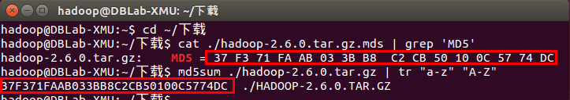

检验文件完整性

---

我们选择将 Hadoop 安装至 /usr/local/ 中：

```bash
$ sudo tar -zxf ~/下载/hadoop-2.6.0.tar.gz -C /usr/local    # 解压到/usr/local中
$ cd /usr/local/
$ sudo mv ./hadoop-2.6.0/ ./hadoop            # 将文件夹名改为hadoop
$ sudo chown -R hadoop ./hadoop       # 修改文件权限
```


Hadoop 解压后即可使用。输入如下命令来检查 Hadoop 是否可用，成功则会显示 Hadoop 版本信息：

```bash
$ cd /usr/local/hadoop
$ ./bin/hadoop version
```


> **相对路径与绝对路径**
>
> 请务必注意命令中的相对路径与绝对路径，本文后续出现的 `./bin/...`，`./etc/...` 等包含 ./ 的路径，均为相对路径，以 /usr/local/hadoop 为当前目录。例如在 /usr/local/hadoop 目录中执行 `./bin/hadoop version` 等同于执行 `/usr/local/hadoop/bin/hadoop version`。可以将相对路径改成绝对路径来执行，但如果你是在主文件夹 ~ 中执行 `./bin/hadoop version`，执行的会是 `/home/hadoop/bin/hadoop version`，就不是我们所想要的了。

## Hadoop单机配置(非分布式)

Hadoop 默认模式为非分布式模式（本地模式），无需进行其他配置即可运行。非分布式即单 Java 进程，方便进行调试。

现在我们可以执行例子来感受下 Hadoop 的运行。Hadoop 附带了丰富的例子（运行 `./bin/hadoop jar ./share/hadoop/mapreduce/hadoop-mapreduce-examples-2.6.0.jar` 可以看到所有例子），包括 wordcount、terasort、join、grep 等。

在此我们选择运行 grep 例子，我们将 input 文件夹中的所有文件作为输入，筛选当中符合正则表达式 dfs[a-z.]+ 的单词并统计出现的次数，最后输出结果到 output 文件夹中。

```bash
$ cd /usr/local/hadoop
$ mkdir ./input
$ cp ./etc/hadoop/*.xml ./input   # 将配置文件作为输入文件
$ ./bin/hadoop jar ./share/hadoop/mapreduce/hadoop-mapreduce-examples-*.jar grep ./input ./output 'dfs[a-z.]+'
$ cat ./output/*          # 查看运行结果
```


执行成功后如下所示，输出了作业的相关信息，输出的结果是符合正则的单词 dfsadmin 出现了1次

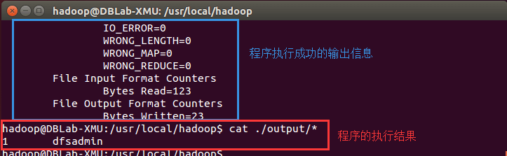

Hadoop单机模式运行grep的输出结果

**注意**，Hadoop 默认不会覆盖结果文件，因此再次运行上面实例会提示出错，需要先将 `./output` 删除。

```bash
$ rm -r ./output
```


## Hadoop伪分布式配置

Hadoop 可以在单节点上以伪分布式的方式运行，Hadoop 进程以分离的 Java 进程来运行，节点既作为 NameNode 也作为 DataNode，同时，读取的是 HDFS 中的文件。

Hadoop 的配置文件位于 /usr/local/hadoop/etc/hadoop/ 中，伪分布式需要修改2个配置文件 **core-site.xml** 和 **hdfs-site.xml** 。Hadoop的配置文件是 xml 格式，每个配置以声明 property 的 name 和 value 的方式来实现。

修改配置文件 **core-site.xml** (通过 gedit 编辑会比较方便: `gedit ./etc/hadoop/core-site.xml`)，将当中的

```xml
<configuration>
</configuration>
```

修改为下面配置：

```xml
<configuration>    
    <property>        
        <name>hadoop.tmp.dir</name>        
        <value>file:/usr/local/hadoop/tmp</value>        
        <description>Abase for other temporary directories.</description>    
    </property>    
    <property>        
        <name>fs.defaultFS</name>        
        <value>hdfs://localhost:9000</value>    
    </property>
</configuration>
```

同样的，修改配置文件 **hdfs-site.xml**：

```xml
<configuration>    
    <property>        
        <name>dfs.replication</name>        
        <value>1</value>    
    </property>    
    <property>        
        <name>dfs.namenode.name.dir</name>    
        <value>file:/usr/local/hadoop/tmp/dfs/name</value>    
    </property>    
    <property>        
        <name>dfs.datanode.data.dir</name>      
        <value>file:/usr/local/hadoop/tmp/dfs/data</value>    
    </property>
</configuration>
```

> **Hadoop配置文件说明**
>
> Hadoop 的运行方式是由配置文件决定的（运行 Hadoop 时会读取配置文件），因此如果需要从伪分布式模式切换回非分布式模式，需要删除 core-site.xml 中的配置项。
>
> 此外，伪分布式虽然只需要配置 fs.defaultFS 和 dfs.replication 就可以运行（官方教程如此），不过若没有配置 hadoop.tmp.dir 参数，则默认使用的临时目录为 /tmp/hadoo-hadoop，而这个目录在重启时有可能被系统清理掉，导致必须重新执行 format 才行。所以我们进行了设置，同时也指定 dfs.namenode.name.dir 和 dfs.datanode.data.dir，否则在接下来的步骤中可能会出错。

配置完成后，执行 NameNode 的格式化:

```bash
$ cd /usr/local/hadoop
$ ./bin/hdfs namenode -format
```


成功的话，会看到 “successfully formatted” 和 “Exitting with status 0” 的提示，若为 “Exitting with status 1” 则是出错。

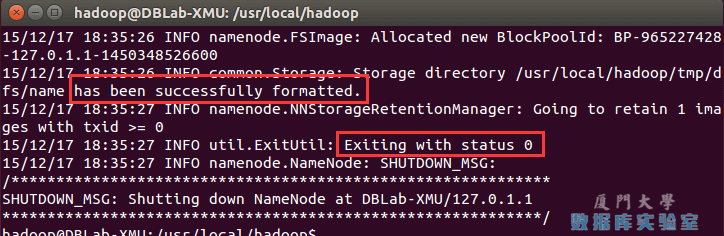

执行 namenode 格式化

如果在这一步时提示 **Error: JAVA_HOME is not set and could not be found.** 的错误，则说明之前设置 JAVA_HOME 环境变量那边就没设置好，请按教程先设置好 JAVA_HOME 变量，否则后面的过程都是进行不下去的。如果已经按照前面教程在.bashrc文件中设置了JAVA_HOME，还是出现 **Error: JAVA_HOME is not set and could not be found.** 的错误，那么，请到hadoop的安装目录修改配置文件“/usr/local/hadoop/etc/hadoop/hadoop-env.sh”，在里面找到“export JAVA_HOME=${JAVA_HOME}”这行，然后，把它修改成JAVA安装路径的具体地址，比如，“export JAVA_HOME=/usr/lib/jvm/default-java”，然后，再次启动Hadoop。

接着开启 NameNode 和 DataNode 守护进程。

```bash
$ cd /usr/local/hadoop
$ ./sbin/start-dfs.sh  #start-dfs.sh是个完整的可执行文件，中间没有空格
```


若出现如下SSH提示，输入yes即可。

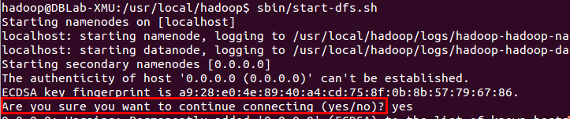

启动Hadoop时的SSH提示

启动时可能会出现如下 WARN 提示：WARN util.NativeCodeLoader: Unable to load native-hadoop library for your platform… using builtin-java classes where applicable WARN 提示可以忽略，并不会影响正常使用。

> **启动 Hadoop 时提示 Could not resolve hostname**
>
> 如果启动 Hadoop 时遇到输出非常多“ssh: Could not resolve hostname xxx”的异常情况，如下图所示：
>
> 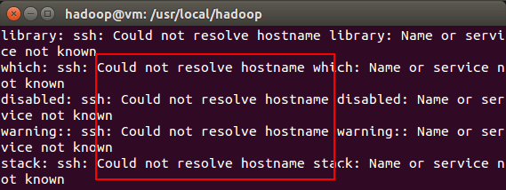
>
> 启动Hadoop时的异常提示
>
> 这个并不是 ssh 的问题，可通过设置 Hadoop 环境变量来解决。首先按键盘的 **ctrl + c** 中断启动，然后在 ~/.bashrc 中，增加如下两行内容（设置过程与 JAVA_HOME 变量一样，其中 HADOOP_HOME 为 Hadoop 的安装目录）：
>
> ```shell
> export HADOOP_HOME=/usr/local/hadoopexport HADOOP_COMMON_LIB_NATIVE_DIR=$HADOOP_HOME/lib/native
> ```
>
> 保存后，务必执行 `source ~/.bashrc` 使变量设置生效，然后再次执行 `./sbin/start-dfs.sh` 启动 Hadoop。

启动完成后，可以通过命令 `jps` 来判断是否成功启动，若成功启动则会列出如下进程: “NameNode”、”DataNode” 和 “SecondaryNameNode”（如果 SecondaryNameNode 没有启动，请运行 sbin/stop-dfs.sh 关闭进程，然后再次尝试启动尝试）。如果没有 NameNode 或 DataNode ，那就是配置不成功，请仔细检查之前步骤，或通过查看启动日志排查原因。

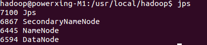

通过jps查看启动的Hadoop进程

> **Hadoop无法正常启动的解决方法**
>
> 一般可以查看启动日志来排查原因，注意几点：
>
> - 启动时会提示形如 “DBLab-XMU: starting namenode, logging to /usr/local/hadoop/logs/hadoop-hadoop-namenode-DBLab-XMU.out”，其中 DBLab-XMU 对应你的机器名，但其实启动日志信息是记录在 /usr/local/hadoop/logs/hadoop-hadoop-namenode-DBLab-XMU.log 中，所以应该查看这个后缀为 **.log** 的文件；
> - 每一次的启动日志都是追加在日志文件之后，所以得拉到最后面看，对比下记录的时间就知道了。
> - 一般出错的提示在最后面，通常是写着 Fatal、Error、Warning 或者 Java Exception 的地方。
> - 可以在网上搜索一下出错信息，看能否找到一些相关的解决方法。
>
> 此外，**若是 DataNode 没有启动**，可尝试如下的方法（注意这会删除 HDFS 中原有的所有数据，如果原有的数据很重要请不要这样做）：
>
> ```bash
> $ # 针对 DataNode 没法启动的解决方法
> $ cd /usr/local/hadoop
> $ ./sbin/stop-dfs.sh   # 关闭
> $ rm -r ./tmp     # 删除 tmp 文件，注意这会删除 HDFS 中原有的所有数据
> $ ./bin/hdfs namenode -format   # 重新格式化 NameNode
> $ ./sbin/start-dfs.sh  # 重启
> ```
>
> 成功启动后，可以访问 Web 界面 [http://localhost:50070](http://localhost:50070/) 查看 NameNode 和 Datanode 信息，还可以在线查看 HDFS 中的文件。

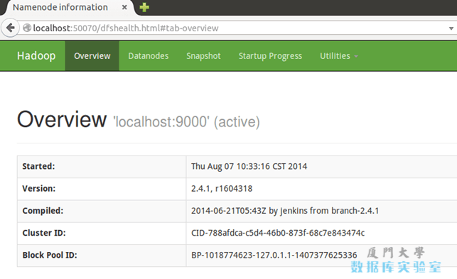

Hadoop的Web界面

## 运行Hadoop伪分布式实例

上面的单机模式，grep 例子读取的是本地数据，伪分布式读取的则是 HDFS 上的数据。要使用 HDFS，首先需要在 HDFS 中创建用户目录：

```bash
./bin/hdfs dfs -mkdir -p /user/hadoop
```


> **注意**
>
> 教材《大数据技术原理与应用》的命令是以”./bin/hadoop dfs”开头的Shell命令方式，实际上有三种shell命令方式。
>
> 1. hadoop fs
> 2. hadoop dfs
> 3. hdfs dfs
>
> hadoop fs 适用于任何不同的文件系统，比如本地文件系统和HDFS文件系统
> hadoop dfs 只能适用于HDFS文件系统
> hdfs dfs 跟hadoop dfs的命令作用一样，也只能适用于HDFS文件系统

接着将 ./etc/hadoop 中的 xml 文件作为输入文件复制到分布式文件系统中，即将 /usr/local/hadoop/etc/hadoop 复制到分布式文件系统中的 /user/hadoop/input 中。我们使用的是 hadoop 用户，并且已创建相应的用户目录 /user/hadoop ，因此在命令中就可以使用相对路径如 input，其对应的绝对路径就是 /user/hadoop/input:

```bash
$ ./bin/hdfs dfs -mkdir input
$ ./bin/hdfs dfs -put ./etc/hadoop/*.xml input
```

复制完成后，可以通过如下命令查看文件列表：

```bash
$ ./bin/hdfs dfs -ls input
```

伪分布式运行 MapReduce 作业的方式跟单机模式相同，区别在于伪分布式读取的是HDFS中的文件（可以将单机步骤中创建的本地 input 文件夹，输出结果 output 文件夹都删掉来验证这一点）。

```bash
$ ./bin/hadoop jar ./share/hadoop/mapreduce/hadoop-mapreduce-examples-*.jar grep input output 'dfs[a-z.]+'
```

查看运行结果的命令（查看的是位于 HDFS 中的输出结果）：

```bash
$ ./bin/hdfs dfs -cat output/*
```

结果如下，注意到刚才我们已经更改了配置文件，所以运行结果不同。

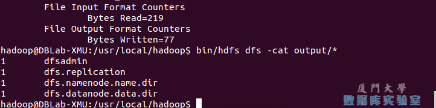

Hadoop伪分布式运行grep结果

我们也可以将运行结果取回到本地：

```bash
$ rm -r ./output    # 先删除本地的 output 文件夹（如果存在）
$ ./bin/hdfs dfs -get output ./output     # 将 HDFS 上的 output 文件夹拷贝到本机
$ cat ./output/*
```

Hadoop 运行程序时，输出目录不能存在，否则会提示错误 

```
“org.apache.hadoop.mapred.FileAlreadyExistsException: Output directory hdfs://localhost:9000/user/hadoop/output already exists” 
```

因此若要再次执行，需要执行如下命令删除 output 文件夹:

```bash
$ ./bin/hdfs dfs -rm -r output    # 删除 output 文件夹
```

> **运行程序时，输出目录不能存在**
>
> 运行 Hadoop 程序时，为了防止覆盖结果，程序指定的输出目录（如 output）不能存在，否则会提示错误，因此运行前需要先删除输出目录。在实际开发应用程序时，可考虑在程序中加上如下代码，能在每次运行时自动删除输出目录，避免繁琐的命令行操作：
>
> ```java
> Configuration conf = new Configuration();
> Job job = new Job(conf); 
> 
> /* 删除输出目录 */
> Path outputPath = new Path(args[1]);
> outputPath.getFileSystem(conf).delete(outputPath, true);
> ```
>

若要关闭 Hadoop，则运行

```bash
$ ./sbin/stop-dfs.sh
```

> **注意**
>
> 下次启动 hadoop 时，无需进行 NameNode 的初始化，只需要运行 `./sbin/start-dfs.sh` 就可以！
>

## YARN

YARN 是 Hadoop 2.x 中的内容，使用林子雨编写的[大数据技术原理与应用](http://dblab.xmu.edu.cn/post/bigdata/)教材的读者，可不用学习YARN内容。

如果对这方便的内容感兴趣，可点击下方查看。

### 启动YARN

（伪分布式不启动 YARN 也可以，一般不会影响程序执行）

有的读者可能会疑惑，怎么启动 Hadoop 后，见不到书上所说的 JobTracker 和 TaskTracker，这是因为新版的 Hadoop 使用了新的 MapReduce 框架（MapReduce V2，也称为 YARN，Yet Another Resource Negotiator）。

YARN 是从 MapReduce 中分离出来的，负责资源管理与任务调度。YARN 运行于 MapReduce 之上，提供了高可用性、高扩展性，YARN 的更多介绍在此不展开，有兴趣的可查阅相关资料。

上述通过 `./sbin/start-dfs.sh` 启动 Hadoop，仅仅是启动了 MapReduce 环境，我们可以启动 YARN ，让 YARN 来负责资源管理与任务调度。

首先修改配置文件 **mapred-site.xml**，这边需要先进行重命名：

```bash
$ mv ./etc/hadoop/mapred-site.xml.template ./etc/hadoop/mapred-site.xm
```

然后再进行编辑，同样使用 gedit 编辑会比较方便些 `gedit ./etc/hadoop/mapred-site.xml` ：

```xml
<configuration>    
    <property>        
        <name>mapreduce.framework.name</name>        
        <value>yarn</value>    
    </property>
</configuration>
```

接着修改配置文件 **yarn-site.xml**：

```xml
<configuration>    
    <property>        
        <name>yarn.nodemanager.aux-services</name>   
        <value>mapreduce_shuffle</value>        
    </property>
</configuration>
```

然后就可以启动 YARN 了（需要先执行过 `./sbin/start-dfs.sh`）：

```bash
$ ./sbin/start-yarn.sh      # 启动YARN
$ ./sbin/mr-jobhistory-daemon.sh start historyserver  # 开启历史服务器，才能在Web中查看任务运行情况
```

开启后通过 `jps` 查看，可以看到多了 NodeManager 和 ResourceManager 两个后台进程，如下图所示。

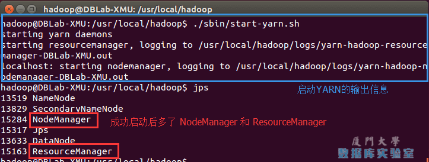

开启YARN

启动 YARN 之后，运行实例的方法还是一样的，仅仅是资源管理方式、任务调度不同。观察日志信息可以发现，不启用 YARN 时，是 “mapred.LocalJobRunner” 在跑任务，启用 YARN 之后，是 “mapred.YARNRunner” 在跑任务。启动 YARN 有个好处是可以通过 Web 界面查看任务的运行情况：，如下图所示。

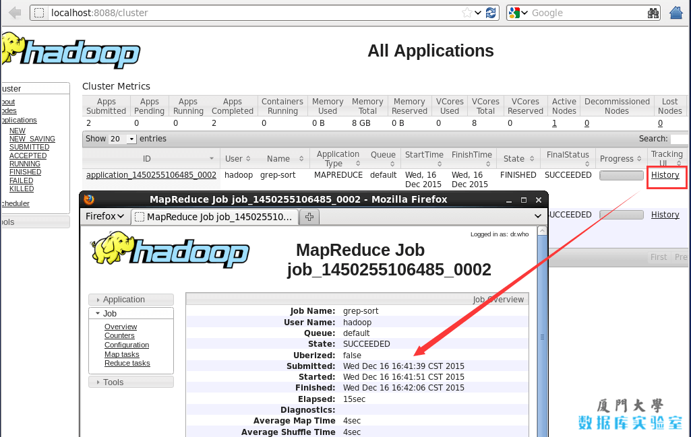

开启YARN后可以查看任务运行信息

但 YARN 主要是为集群提供更好的资源管理与任务调度，然而这在单机上体现不出价值，反而会使程序跑得稍慢些。因此在单机上是否开启 YARN 就看实际情况了。

> **不启动 YARN 需重命名 mapred-site.xml**
>
> 如果不想启动 YARN，务必把配置文件 **mapred-site.xml** 重命名，改成 mapred-site.xml.template，需要用时改回来就行。否则在该配置文件存在，而未开启 YARN 的情况下，运行程序会提示 “Retrying connect to server: 0.0.0.0/0.0.0.0:8032” 的错误，这也是为何该配置文件初始文件名为 mapred-site.xml.template。

同样的，关闭 YARN 的脚本如下：

```bash
$ ./sbin/stop-yarn.sh
$ ./sbin/mr-jobhistory-daemon.sh stop historyserver
```

自此，你已经掌握 Hadoop 的配置和基本使用了。安装好的Hadoop项目中已经包含了第三章的HDFS，继续学习第3章HDFS文件系统，请参考如下学习指南：[大数据技术原理与应用 第三章 学习指南](http://dblab.xmu.edu.cn/blog/290-2/)

## 附加教程: 配置PATH环境变量

在这里额外讲一下 PATH 这个环境变量（可执行 `echo $PATH` 查看，当中包含了多个目录）。例如我们在主文件夹 ~ 中执行 `ls` 这个命令时，实际执行的是 `/bin/ls` 这个程序，而不是 `~/ls` 这个程序。系统是根据 PATH 这个环境变量中包含的目录位置，逐一进行查找，直至在这些目录位置下找到匹配的程序（若没有匹配的则提示该命令不存在）。

上面的教程中，我们都是先进入到 /usr/local/hadoop 目录中，再执行 `sbin/hadoop`，实际上等同于运行 `/usr/local/hadoop/sbin/hadoop`。我们可以将 Hadoop 命令的相关目录加入到 PATH 环境变量中，这样就可以直接通过 `start-dfs.sh` 开启 Hadoop，也可以直接通过 `hdfs` 访问 HDFS 的内容，方便平时的操作。

同样我们选择在 ~/.bashrc 中进行设置（`vim ~/.bashrc`，与 JAVA_HOME 的设置相似），在文件最前面加入如下单独一行:

```bash
export PATH=$PATH:/usr/local/hadoop/sbin:/usr/local/hadoop/bin
```

添加后执行 `source ~/.bashrc` 使设置生效，生效后，在任意目录中，都可以直接使用 `hdfs` 等命令了，读者不妨现在就执行 `hdfs dfs -ls input` 查看 HDFS 文件试试看。

## 安装Hadoop集群

在平时的学习中，我们使用伪分布式就足够了。如果需要安装 Hadoop 集群，请查看[Hadoop集群安装配置教程](http://dblab.xmu.edu.cn/blog/install-hadoop-cluster/)。

## 相关教程

- [使用Eclipse编译运行MapReduce程序](http://dblab.xmu.edu.cn/blog/hadoop-build-project-using-eclipse/): 使用 Eclipse 可以方便的开发、运行 MapReduce 程序，还可以直接管理 HDFS 中的文件。
- [使用命令行编译打包运行自己的MapReduce程序](http://dblab.xmu.edu.cn/blog/hadoop-build-project-by-shell/): 有时候需要直接通过命令来编译、打包 MapReduce 程序。

## 参考资料

- <http://hadoop.apache.org/docs/stable/hadoop-project-dist/hadoop-common/SingleCluster.html>
- <http://www.cnblogs.com/xia520pi/archive/2012/05/16/2503949.html>
- <http://www.micmiu.com/bigdata/hadoop/hadoop-2x-ubuntu-build/>