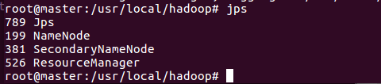
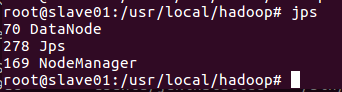
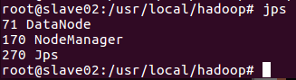

# 使用Docker搭建Hadoop分布式集群

 罗道文 2017年1月1日 http://dblab.xmu.edu.cn/blog/1233/

---

[Hadoop 2.7分布式集群环境搭建](http://dblab.xmu.edu.cn/blog/1177-2/)已经分享了如何在本地搭建Hadoop集群；这篇博客分析下如何在Docker上搭建Hadoop集群；首先，我们需要在Ubuntu上安装Docker;


## 安装Docker

安装Docker，首先必须保证是64位Linux系统，其次内核版本必须大于3.10；我们可以用如下命令来检测Ubuntu内核版本:

```bash
$ uname -r
```


比如笔者电脑执行结果如下：

```
4.4.0-53-generic
```

在安装Docker之前，首先需要先更新apt，安装CA证书，因为访问Docker用的是https协议；

```bash
$ sudo apt-get update
$ sudo apt-get install apt-transport-https ca-certificates
```


添加新的GPG key；

```bash
$ sudo apt-key adv \               
	--keyserver hkp://ha.pool.sks-keyservers.net:80 \               
	--recv-keys 58118E89F3A912897C070ADBF76221572C52609D
```


Ubuntu系统添加Docker源:

```bash
$ echo deb https://apt.dockerproject.org/repo ubuntu-xenial main | sudo tee /etc/apt/sources.list.d/docker.list
```


更新apt包索引:

```bash
$ sudo apt-get update
```


接着可以用如下方式验证下是否从正确的仓库拉取安装包:

```bash
$ apt-cache policy docker-engine
```


如果有类似于下面的输出，则说明从正确的仓库获取包；

```properties
  docker-engine:
    Installed: 1.12.2-0~trusty
    Candidate: 1.12.2-0~trusty
    Version table:
   *** 1.12.2-0~trusty 0
          500 https://apt.dockerproject.org/repo/ ubuntu-trusty/main amd64 Packages
          100 /var/lib/dpkg/status
       1.12.1-0~trusty 0
          500 https://apt.dockerproject.org/repo/ ubuntu-trusty/main amd64 Packages
       1.12.0-0~trusty 0
          500 https://apt.dockerproject.org/repo/ ubuntu-trusty/main amd64 Packages
```

接下来可以直接安装Docker，命令如下:

```bash
$ sudo apt-get install docker-engine
```


等这个命令结束之后，Docker即安装成功；我们可以通过下面命令开启Docker服务:

```bash
$ sudo service docker start
```


然后我们也可以运行Docker官方提供的hello-world程序检测Docker安装运行成功:

```bash
$ sudo docker run hello-world
```


这个命令会输出一堆文字，其中有段文字是

```properties
Hello from Docker!
This message shows that your installation appears to be working correctly.
```

则表示安装成功!

docker默认是只有root才能执行Docker命令，因此我们还需要添加用户权限：
创建docker用户组:

```bash
$ sudo groupadd docker
```


添加当前用户到Docker用户组:

```bash
$ sudo usermod -aG docker $USER
```


$USER表示当前用户名，例如，当前用户是hadoop，则把$USER替换成hadoop即可；然后注销，再次登录即可方便使用Docker了；

## 在Docker安装Ubuntu系统

安装好Docker之后，接下来就要在Docker上安装Ubuntu，其实和安装其他镜像一样，只需运行一个命令足矣，如下:

```bash
$ docker pull ubuntu
```


docker pull命令表示从Docker hub上拉取Ubuntu镜像到本地；这时可以在终端运行以下命令查看是否安装成功,

```bash
$ docker images
```


有如下输出则表示安装成功:

```properties
REPOSITORY          TAG                 IMAGE ID            CREATED             SIZE
ubuntu              latest              4ca3a192ff2a        11 days ago         128.2 MB
```

docker images表示列出Docker上所有的镜像；镜像也是一堆文件，我们需要在Docker上开启这Ubuntu系统；在启动Ubuntu镜像时，需要先在个人文件下创建一个目录，用于向Docker内部的Ubuntu系统传输文件；命令如下:

```bash
$ cd ~
$ mkdir build
```


然后再在Docker上运行Ubuntu系统；

```bash
$ docker run -it -v /home/hadoop/build:/root/build --name ubuntu ubuntu
```


这里解析下这个命令参数：
* docker run 表示运行一个镜像；
* -i表示开启交互式；-t表示分配一个tty，可以理解为一个控制台；因此-it可以理解为在当前终端上与docker内部的ubuntu系统交互；
* -v 表示docker内部的ubuntu系统/root/build目录与本地/home/hadoop/build共享；这可以很方便将本地文件上传到Docker内部的Ubuntu系统；
* –name ubuntu 表示Ubuntu镜像启动名称，如果没有指定，那么Docker将会随机分配一个名字；
* ubuntu 表示docker run启动的镜像文件；

## Ubuntu系统初始化

刚安装好的Ubuntu系统，是一个很纯净的系统，很多软件是没有安装的，所以我们需要先更新下Ubuntu系统的源以及安装一些必备的软件；

#### 更新系统软件源

更新系统源命令如下:

```bash
$ apt-get update
```


#### 安装vim

然后我们安装下经常会使用到的vim软件:

```bash
$ apt-get install vim
```


#### 安装sshd

接着安装sshd，因为在开启分布式Hadoop时，需要用到ssh连接slave:

```bash
$ apt-get install ssh
```


然后运行如下脚本即可开启sshd服务器:

```bash
$ /etc/init.d/ssh start
```


但是这样的话，就需要每次在开启镜像时，都需要手动开启sshd服务，因此我们把这启动命令写进~/.bashrc文件，这样我们每次登录Ubuntu系统时，都能自动启动sshd服务;

```bash
$ vim ~/.bashrc
```


在该文件中最后一行添加如下内容：

```shell
/etc/init.d/ssh start
```

#### 配置sshd

安装好sshd之后，我们需要配置ssh无密码连接本地sshd服务，如下命令:

```bash
$ ssh-keygen -t rsa #一直按回车键即可
$ cat id_dsa.pub >> authorized_keys
```


执行完上述命令之后，即可无密码访问本地sshd服务；

#### 安装JDK

因为Hadoop有用到Java，因此还需要安装JDK；直接输入以下命令来安装JDK:

```bash
$ apt-get install default-jdk
```


这个命令会安装比较多的库，可能耗时比较长；等这个命令运行结束之后，即安装成功；然后我们需要配置环境变量，打开~/.bashrc文件，在最后输入如下内容；

```bash
export JAVA_HOME=/usr/lib/jvm/java-8-openjdk-amd64/
export PATH=$PATH:$JAVA_HOME/bin
```


接着执行如下命令使~/.bashrc生效即可;

```bash
$ source ~/.bashrc
```


#### 保存镜像文件

我们在Docker内部的容器做的修改是不会自动保存到镜像的，也就是说，我们把容器关闭，然后重新开启容器，则之前的设置会全部消失，因此我们需要保存当前的配置；为了达到复用配置信息，我们在每个步骤完成之后，都保存成一个新的镜像，然后开启保存的新镜像即可；首先我们要到这个网址注册一个账号<https://hub.docker.com/>；账号注册成功后，然后在终端输入以下信息：

```bash
$ docker login
```


然后会有如下提示信息，输出相应的用户名和密码即可:

```properties
Login with your Docker ID to push and pull images from Docker Hub. If you don't have a Docker ID, head over to https://hub.docker.com to create one.
Username: daodaowen2017
Password:
Login Succeeded
```

登录之后，即可输入以下命令保存修改后的容器为一个新的镜像；

```bash
$ docker ps
```


查看当前ubuntu的镜像id，如下

```properties
CONTAINER ID        IMAGE               COMMAND             CREATED             STATUS              PORTS               NAMES
fd1fc69d75a3        ubuntu              "/bin/bash"         About an hour ago   Up About an hour                        ubuntu
```

然后保存当前镜像为ubuntu/jdkinstalled，表示jdk安装成功的ubuntu版本，命令如下:

```bash
$ docker commit fd1fc69d75a3 ubuntu/jdkinstalled
```


输出如下:

```bash
sha256:05c9bc2b849359d029d417421d6968bdd239aad447ac6054c429b630378118aa
```

最后输出所有镜像查看是否保存成功:

```bash
$ docker images
```


输出如下:

```properties
REPOSITORY            TAG                 IMAGE ID            CREATED             SIZE
ubuntu/jdkinstalled   latest              05c9bc2b8493        9 seconds ago       899.3 MB
ubuntu                latest              4ca3a192ff2a        12 days ago         128.2 MB
```

以上命令意思如下:

1. docker ps 查看当前运行的容器信息，目前只运行一个ubuntu容器;
2. docker commit 保存fd1fc69d75a3(容器id)容器为一个新的镜像，镜像名称为ubuntu/jdkinstalled
3. docker images 查看当前docker所有镜像，可以看到我们新添加的镜像ubuntu/jdkinstalled

## 安装Hadoop

安装好JDK之后，接下来，我们来安装Hadoop；我们开启保存的那份镜像ubuntu/jdkinstalled：

```bash
$ docker run -it -v /home/hadoop/build:/root/build --name ubuntu-jdkinstalled ubuntu/jdkinstalled
```

我们可以用如下命令查看开启的容器:

```bash
$ docker ps
```

输出如下:

```properties
CONTAINER ID        IMAGE                 COMMAND             CREATED             STATUS              PORTS               NAMES
325a1c2f2f93        ubuntu/jdkinstalled   "/bin/bash"         6 seconds ago       Up 5 seconds                            ubuntu-jdkinstalled
```

ok，开启系统之后，我们把下载下来的Hadoop安装文件放到共享目录/home/hadoop/build下面，然后在Docker内部Ubuntu系统的/root/build目录即可获取到Hadoop安装文件；在Docker内部的Ubuntu系统安装Hadoop和本地安装一样，

```bash
$ cd /root/build
$ tar -zxvf hadoop-2.7.1.tar.gz -C /usr/local
```

如果是单机版Hadoop，到这里已经安装完成了，可以运行如下命令测试下:

```bash
$ cd /usr/local/hadoop
$ ./bin/hadoop version
```

输出如下:

```properties
Hadoop 2.7.1
Subversion https://git-wip-us.apache.org/repos/asf/hadoop.git -r 15ecc87ccf4a0228f35af08fc56de536e6ce657a
Compiled by jenkins on 2015-06-29T06:04Z
Compiled with protoc 2.5.0
From source with checksum fc0a1a23fc1868e4d5ee7fa2b28a58a
This command was run using /usr/local/hadoop/share/hadoop/common/hadoop-common-2.7.1.jar
```

## 配置Hadoop集群

接下来，我们来看下如何配置Hadoop集群；对一些文件的设置和之前教程一样，首先打开hadoop_env.sh文件，修改JAVA_HOME

```bash
#假设现在/usr/local/hadoop目录下
$ vim etc/hadoop/hadoop-env.sh
# 将export JAVA_HOME=${JAVA_HOME}替换成
$ export JAVA_HOME=/usr/lib/jvm/java-8-openjdk-amd64/
```

接着打开core-site.xml，输入一下内容:

```xml
<configuration>
      <property>
          <name>hadoop.tmp.dir</name>
          <value>file:/usr/local/hadoop/tmp</value>
          <description>Abase for other temporary directories.</description>
      </property>
      <property>
          <name>fs.defaultFS</name>
          <value>hdfs://master:9000</value>
      </property>
</configuration>
```

然后再打开hdfs-site.xml输入以下内容:

```xml
<configuration>
    <property>
        <name>dfs.namenode.name.dir</name>
        <value>file:/usr/local/hadoop/namenode_dir</value>
    </property>
    <property>
        <name>dfs.datanode.data.dir</name>
        <value>file:/usr/local/hadoop/datanode_dir</value>
    </property>
    <property>
        <name>dfs.replication</name>
        <value>3</value>
    </property>
</configuration>
```

接下来修改mapred-site.xml(复制mapred-site.xml.template,再修改文件名)，输入以下内容:

```xml
  <configuration>
    <property>
        <name>mapreduce.framework.name</name>
        <value>yarn</value>
    </property>
  </configuration>
```

最后修改yarn-site.xml文件，输入以下内容:

```xml
 <configuration>
  <!-- Site specific YARN configuration properties -->
      <property>
          <name>yarn.nodemanager.aux-services</name>
          <value>mapreduce_shuffle</value>
      </property>
      <property>
          <name>yarn.resourcemanager.hostname</name>
          <value>master</value>
      </property>
  </configuration>
```

到这里Hadoop集群配置就已经差不多了，我们先保存这个镜像，在其他终端输入如下命令:

```bash
$ docker commit a40b99f869ae ubuntu/hadoopinstalled
```

ok，接下来，我们在三个终端上开启三个容器运行ubuntu/hadoopinstalled 镜像，分别表示Hadoop集群中的master,slave01和slave02；

```bash
# 第一个终端
$ docker run -it -h master --name master ubuntu/hadoopinstalled
# 第二个终端
$ docker run -it -h slave01 --name slave01 ubuntu/hadoopinstalled
# 第三个终端
$ docker run -it -h slave02 --name slave02 ubuntu/hadoopinstalled
```

接着配置master,slave01和slave02的地址信息，这样他们才能找到彼此，分别打开/etc/hosts 可以查看本机的ip和主机名信息,最后得到三个ip和主机地址信息如下:

```properties
172.18.0.2      master
172.18.0.3      slave01
172.18.0.4      slave02
```

最后把上述三个地址信息分别复制到 master, slave01和 slave02 的 /etc/hosts 即可，我们可以用如下命令来检测下是否master是否可以连上slave01和slave02

```bash
ssh slave01
ssh slave02
```

到这里，我们还差最后一个配置就要完成hadoop集群配置了，打开master上的slaves文件，输入两个slave的主机名:

```bash
$ vim etc/hadoop/slaves
# 将localhost替换成两个slave的主机名
slave01
slave02
```

ok，Hadoop集群已经配置完成，我们来启动集群；

在master终端上，首先进入/usr/local/hadoop，然后运行如下命令:

```bash
$ cd /usr/local/hadoop
$ bin/hdfs namenode -formats
$ bin/start-all.sh
```

这时Hadoop集群就已经开启，我们可以在master,slave01和slave02上分别运行命令jps查看运行结果;
下面是运行结果图







## 运行Hadoop实例程序grep

到目前为止，我们已经成功启动hadoop分布式集群，接下来，我们通过运行hadoop自带的grep实例来查看下如何在hadoop分布式集群运行程序；这里我们运行的实例是hadoop自带的grep

因为要用到hdfs，所以我们先在hdfs上创建一个目录:

```bash
$ ./bin/hdfs dfs -mkdir -p /user/hadoop/input
```

然后将/usr/local/hadoop/etc/hadoop/目录下的所有文件拷贝到hdfs上的目录:

```bash
$ dfs -put ./etc/hadoop/*.xml /user/hadoop/input
```

然后通过ls命令查看下是否正确将文件上传到hdfs下:

```bash
$ dfs -ls /user/hadoop/input
```

输出如下:

```properties
Found 9 items
-rw-r--r--   3 root supergroup       4436 2016-12-26 07:40 /user/hadoop/input/capacity-scheduler.xml
-rw-r--r--   3 root supergroup       1090 2016-12-26 07:40 /user/hadoop/input/core-site.xml
-rw-r--r--   3 root supergroup       9683 2016-12-26 07:40 /user/hadoop/input/hadoop-policy.xml
-rw-r--r--   3 root supergroup       1133 2016-12-26 07:40 /user/hadoop/input/hdfs-site.xml
-rw-r--r--   3 root supergroup        620 2016-12-26 07:40 /user/hadoop/input/httpfs-site.xml
-rw-r--r--   3 root supergroup       3518 2016-12-26 07:40 /user/hadoop/input/kms-acls.xml
-rw-r--r--   3 root supergroup       5511 2016-12-26 07:40 /user/hadoop/input/kms-site.xml
-rw-r--r--   3 root supergroup        866 2016-12-26 07:40 /user/hadoop/input/mapred-site.xml
-rw-r--r--   3 root supergroup        947 2016-12-26 07:40 /user/hadoop/input/yarn-site.xml
```

接下来，通过运行下面命令执行实例程序:

```bash
$ ./bin/hadoop jar ./share/hadoop/mapreduce/hadoop-mapreduce-examples-*.jar grep /user/hadoop/input output 'dfs[a-z.]+'
```

过一会，等这个程序运行结束之后，就可以在hdfs上的output目录下查看到运行结果:

```bash
$ ./bin/hdfs dfs -cat output/*
1   dfsadmin1   dfs.replication
1   dfs.namenode.name.dir
1   dfs.datanode.data.dir
```

hdfs文件上的output目录下，输出程序正确的执行结果，hadoop分布式集群顺利执行grep程序;

