# 基于Hadoop分布式集群部署Hive2.3

[晓之木初](https://blog.csdn.net/u014454538) 2018-11-03 https://blog.csdn.net/u014454538/article/details/83689763

---

## 1. 基于docker安装mysql
  由于自己以前在Ubuntu kylin 16.04的系统上安装mysql5.7一直有问题，后来学会了使用docker安装mysql。觉得这个方法很方便，所以这次继续使用docker安装mysql。

- ①  安装docker
    参考自己以前撰写的博客：Ubuntu Kylin 16.04 安装docker（使用阿里镜像）

- ② 使用docker安装mysql并完成配置
  参考自己以前撰写的博客：Ubuntu16.04使用docker安装MySQL

- ③ 遇到的问题
  很奇怪的是，自己以前在输入mysql -u root -p，尝试连接mysql时，并没有出现任何问题。这次却出现了以下错误：

> ERROR 2002 (HY000): Can’t connect to local MySQL server through socket ‘/var/run/mysqld/mysqld.sock’ (2)
>

按照百度的各种方法，都不适合自己。后来关闭mysql之后，再重新启动进入，问题得到解决。PS：这就是一个谜一样的问题～

```bash
$ sudo docker stop mysqldb   # 关闭名为mysqldb的容器
$ sudo docker start mysqldb   # 开启并执行名为mysqldb的容器
$ sudo docker exec -it mysqldb /bin/bash
$ mysql -u root -p  # 连接mysql，开启mysql的shell交互模式
```

## 2. 为hive配置mysql
- ① 添加并设置hive用户、数据库
    使用以下命令添加并设置hive用户、数据库：

```bash
mysql> create user hive identified by 'hive';    # 创建一个用户名为hive，密码为hive的数据库
mysql> create database hive;  # 创建一个叫做hive的数据库
mysql> grant all privileges on hive.* to 'hive'@'%';    # 给hive用户授权
mysql> flush privileges;     # 刷盘生效
```

- ② 退出mysql并重启mysql
  使用以下命令退出mysql并重新启动mysql：

```bash
$ exit   # 退出mysql的shell交互模式
$ exit   # 退出名为mysqldb的容器
$ sudo docker stop mysqldb   # 关闭名为mysqldb的容器
$ sudo docker start mysqldb   # 开启并执行名为mysqldb的容器
$ sudo docker exec -it mysqldb /bin/bash
$ mysql -u root -p  # 连接mysql，开启mysql的shell交互模式
```

- ③ 查看刚添加的hive用户授权
  使用以下命令查看刚添加的hive用户授权，已验证是否添加成功：

```bash
mysql> select user,host from mysql.user;
```

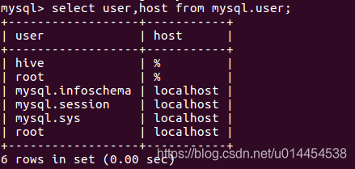

- ④ 设置hive数据库为utf-8编码
  使用以下命令设置hive数据库为utf-8编码，避免后续的乱码问题：

```bash
mysql> alter database hive character set utf8; 
```

## 3. 下载并解压缩hive
- ① 下载hive
    下载地址：Hive镜像下载
    本人选择的是hive-2.3.3 版本，下载的是该目录下的apache-hive-2.3.3-bin.tar.gz。

- ② 解压缩apache-hive-2.3.3-bin.tar.gz
使用以下命令解压缩apache-hive-2.3.3-bin.tar.gz，设置文件权限为0777，并将其放到合适的目录：
```bash
$ sudo tar -zxvf apache-hive-2.3.3-bin.tar.gz
$ sudo chmod -R 0777 apache-hive-2.3.3-bin
$ sudo cp -rf apache-hive-2.3.3-bin /home/cephlee/
```
本人在这之后，还修改了文件名为：`hive-2.3.3`

## 4. 配置hive
- ① 添加hive系统环境变量
    使用 gedit 命令向 ~/.bashrc 中添加hive系统环境变量：
```bash
$ sudo gedit ~/.bashrc
```
添加以下内容：
```bash
export HIVE_HOME=/home/cephlee/hive-2.3.3
export HIVE_CONF_DIR=${HIVE_HOME}/conf
export PATH=${HIVE_HOME}/bin:$PATH
```
使用source 命令使其生效：
```bash
$ source ~/.bashrc
```
使用以下命令，查看hive系统环境变量配置是否生效：
```bash
$ hive --version
```

- ② 在hadoop添加hive的相关文件目录
使用以下命令在hadoop添加hive的相关文件目录，并设置相应权限：
```bash
$ hadoop fs -mkdir /user/hive/warehouse
$ hadoop fs -mkdir /user/hive/tmp
$ hadoop fs -mkdir /user/hive/log
$ hadoop fs -chmod -R 0777 /user/hive
```
- ③ 修改hive-env.sh文件
进入hive-2.3.3/conf目录，执行以下命令：
```bash
$ cp hive-env.sh.template hive-env.sh
```
打开hive-env.sh文件，向其中添加以下内容：
```bash
# Hive Configuration Directory can be controlled by:
export JAVA_HOME=/usr/local/jdk18
export HADOOP_HOME=$HADOOP_HOME
export HIVE_HOME=/home/cephlee/hive-2.3.3
export HIVE_CONF_DIR=${HIVE_HOME}/conf 

# Folder containing extra libraries required for hive compilation/execution can be controlled by:
export HIVE_AUX_JARS_PATH=${HIVE_HOME}/lib
```
- ④ 修改hive-site.xml文件
进入hive-2.3.3/conf目录，执行以下命令：
```bash
$ cp hive-default.xml.template hive-site.xml
```
打开hive-site.xml文件，除了头部的xml信息，其他内容都清空。添加相关配置后，整个文件内容为：
```xml
<?xml version="1.0" encoding="UTF-8" standalone="no"?>
<?xml-stylesheet type="text/xsl" href="configuration.xsl"?><!--
   Licensed to the Apache Software Foundation (ASF) under one or more
   contributor license agreements.  See the NOTICE file distributed with
   this work for additional information regarding copyright ownership.
   The ASF licenses this file to You under the Apache License, Version 2.0
   (the "License"); you may not use this file except in compliance with
   the License.  You may obtain a copy of the License at

       http://www.apache.org/licenses/LICENSE-2.0

   Unless required by applicable law or agreed to in writing, software
   distributed under the License is distributed on an "AS IS" BASIS,
   WITHOUT WARRANTIES OR CONDITIONS OF ANY KIND, either express or implied.
   See the License for the specific language governing permissions and
   limitations under the License.
-->
<configuration>
	<!-- 设置 hive仓库的HDFS上的位置 -->
	<property>
	    <name>hive.exec.scratchdir</name>
	    <value>/user/hive/tmp</value>
	</property>
	<!--资源临时文件存放位置 -->
	<property>
	    <name>hive.metastore.warehouse.dir</name>
	    <value>/user/hive/warehouse</value>
	</property>
	<!-- 设置日志位置 -->
	<property>
	    <name>hive.querylog.location</name>
	    <value>/user/hive/log</value>
	</property>
	<property>
	    <name>javax.jdo.option.ConnectionURL</name>
	    <value>jdbc:mysql://192.168.202.34:3306/hive?createDatabaseIfNotExist=true&amp;characterEncoding=UTF-8&amp;useSSL=false&amp;allowPublicKeyRetrieval=true</value>
	</property>
	<property>
	    <name>javax.jdo.option.ConnectionDriverName</name>
	    <value>com.mysql.jdbc.Driver</value>
	</property>
	<property>
	    <name>javax.jdo.option.ConnectionUserName</name>
	    <value>hive</value>
	</property>
	<property>
	    <name>javax.jdo.option.ConnectionPassword</name>
	    <value>hive</value>
	</property> 
</configuration>
```
- ⑤ 下载JDBC复制到对应目录
前往官网下载JDBC驱动，官方网址 [Download Connector/J ](https://dev.mysql.com/downloads/connector/j/)。
在该页面中，点击下图中的 `Looking for previous GA versions?`，下载历史版本：

选择 `Platform Independent (Architecture Independent), ZIP Archive`进行下载：


解压缩`mysql-connector-java-5.1.47.zip`，将`mysql-connector-java-5.1.47-bin.jar`复制到hive-2.3.3/lib目录。

## 5. 初始化并启动hive
- ① 初始化hive
    从 Hive 2.1 版本开始, 我们需要先运行 schematool 命令来执行初始化操作。
```bash
$ schematool -dbType mysql -initSchema
```
本人第一次初始化失败，遇到以下错误：

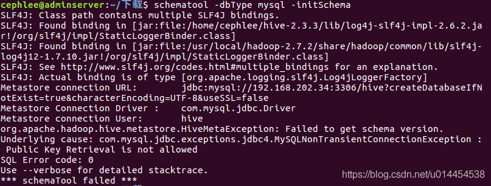

网上百度以后，参考博客：[关于JDBC连接数据库时出现的Public Key Retrieval is not allowed错误](https://blog.csdn.net/Yuriey/article/details/80423504)

使用方法二：`连接数据库的url中，加上allowPublicKeyRetrieval=true参数，在hive-site.xml的<name>javax.jdo.option.ConnectionURL</name>`中的value中，添加`allowPublicKeyRetrieval=true`，
使得该问题得意解决。

> PS：上面的 hive-site.xml 的配置是修改以后的最新配置，读者无需再修改hive-site.xml。

再次执行命令，初始化成功：

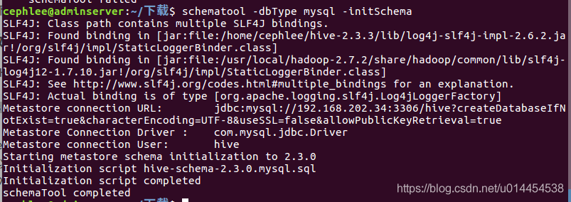

- ② 查看初始化信息
执行以下命令，查看hive初始化信息：
```bash
$ schematool -dbType mysql -initInfo
```

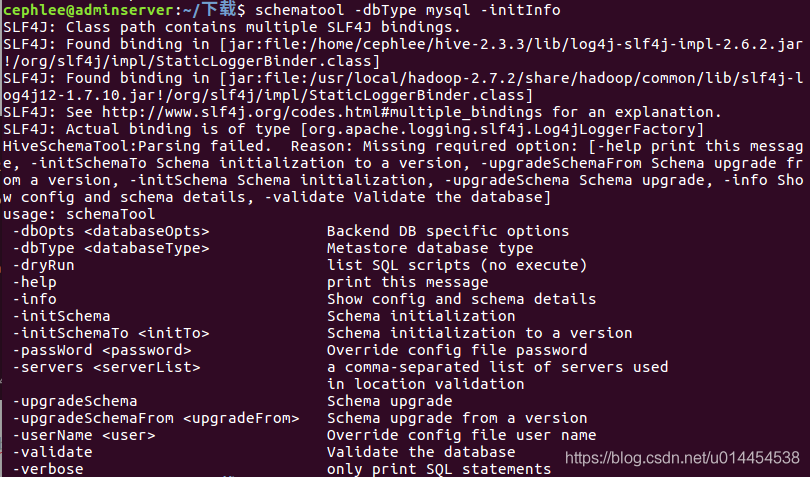

也可以进入mysql，查看hive中的表格信息：

```bash
mysql> use hive;
mysql> show tables;
```
信息如下（只有首尾的部分信息）：

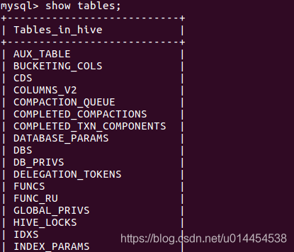

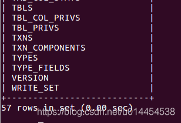


- ③ 启动hive
直接输入hive命令，启动hive：
```bash
$ hive
```
启动信息如下：
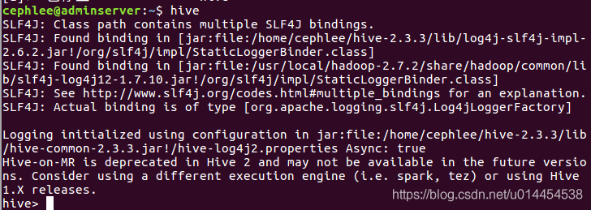

## 6. 简单的使用hive
    在hive中创建一个表格，已验证hive运行是否正常：
```bash
hive> create table testHive(
         id int,
        name string
        );
```
创建成功后，再查看刚刚创建的表格：
```bash
hive> show tables;
```
显示信息如下：

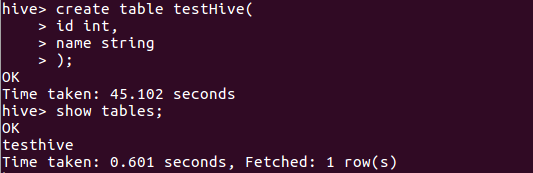


## 7. slaves节点的配置
    之前的步骤1-6均在hadoop的master节点上配置，现在需要配置slaves节点。
- ① 使用scp命令，拷贝hive至salves节点
```bash
$ scp -r hive-2.3.3 monserver:/home/cephlee
$ scp -r hive-2.3.3 osdserver1:/home/cephlee
$ scp -r hive-2.3.3 osdserver2:/home/cephlee
$ scp -r hive-2.3.3 osdserver3:/home/cephlee
```
- ② 添加hive系统环境变量
参考以前的步骤，在slaves节点上的~/.bashrc文件中添加系统环境变量，并使用source命令使其生效。
- ③ 在slaves节点的中hive-site.xml 添加以下配置：
```xml
<property>  
    <name>hive.metastore.uris</name>  
    <value>thrift://192.168.202.34:9083</value>  
</property>
```
- ④ 启动启动 metastore 服务
  在使用slaves节点访问 hive 之前，在master节点中，执行 `hive --service metastore &` 来启动metastore服务 。
 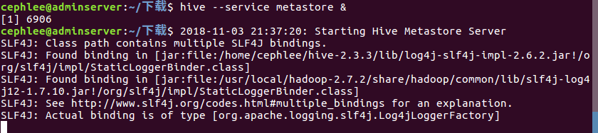

metastore服务对应的进程为`6906 RunJar`：

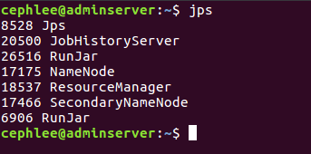

- ⑤ slaves节点启动hive并执行简单的hive命令
```bash
$ hive
hive>show tables;
```
发现在master节点上创建的表，可以在slaves节点中看到：

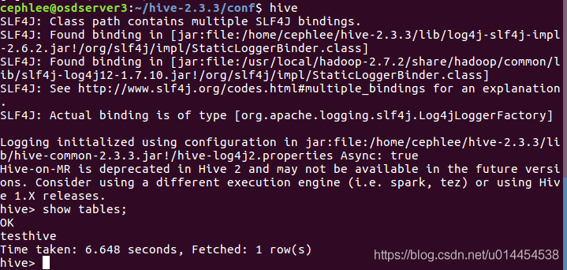

至此，基于Hadoop分布式集群的hive2.3安装成功！！！

---

感谢使用过的参考链接：

- [mysql5.7.18安装、Hive2.1.1安装和配置（基于Hadoop2.7.3集群）](https://blog.csdn.net/quiet_girl/article/details/75092005)
- [hive2.1.1 部署安装](https://blog.csdn.net/u013310025/article/details/70306421)
- [在Hadoop分布式集群中安装hive](https://blog.csdn.net/Lee20093905/article/details/78871336)

---
版权声明：本文为CSDN博主「晓之木初」的原创文章，遵循CC 4.0 BY-SA版权协议，转载请附上原文出处链接及本声明。
原文链接：https://blog.csdn.net/u014454538/article/details/83689763