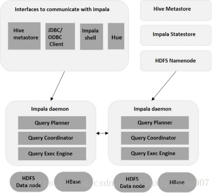

# Impala的简单入门

https://blog.csdn.net/linxiyimeng007/article/details/80943378 2018-07-06

## 一、Impala概述

### 什么是Impala？

Impala是用于处理存储在Hadoop集群中的大量数据的MPP（大规模并行处理）SQL查询引擎。 它是一个用C ++和Java编写的开源软件。 与其他Hadoop的SQL引擎相比，它提供了高性能和低延迟。

换句话说，**Impala是性能最高的SQL引擎（提供类似RDBMS的体验）**，它提供了访问存储在Hadoop分布式文件系统中的数据的最快方法。

### 为什么选择Impala？

- Impala通过使用标准组件（如HDFS，HBase，Metastore，YARN和Sentry）将传统分析数据库的SQL支持和多用户性能与Apache Hadoop的可扩展性和灵活性相结合。

- 使用Impala，与其他SQL引擎（如Hive）相比，用户可以使用SQL查询以更快的方式与HDFS或HBase进行通信。

- Impala可以读取Hadoop使用的几乎所有文件格式，如Parquet，Avro，RCFile。

- Impala将相同的元数据，SQL语法（Hive SQL），ODBC驱动程序和用户界面（Hue Beeswax）用作Apache Hive，为面向批量或实时查询提供熟悉且统一的平台。

- 与Apache Hive不同，Impala不基于MapReduce算法。 它实现了一个基于守护进程的分布式架构，它负责在同一台机器上运行的查询执行的所有方面。因此，它减少了使用MapReduce的延迟，这使Impala比Apache Hive快。

### Impala的优点

以下是 Impala 的一些值得注意的优点的列表。

- 使用 impala，您可以使用传统的SQL知识以极快的速度处理存储在HDFS中的数据。

- 由于在数据驻留（在Hadoop集群上）时执行数据处理，因此在使用Impala时，不需要对存储在Hadoop上的数据进行数据转换和数据移动。

- 使用Impala，您可以访问存储在HDFS，HBase和Amazon s3中的数据，而无需了解Java（MapReduce作业）。您可以使用SQL查询的基本概念访问它们。

- 为了在业务工具中写入查询，数据必须经历复杂的提取 - 变换负载（ETL）周期。但是，使用Impala，此过程缩短了。加载和重组的耗时阶段通过新技术克服，如探索性数据分析和数据发现，使过程更快。

- Impala正在率先使用Parquet文件格式，这是一种针对数据仓库场景中典型的大规模查询进行优化的柱状存储布局。

### Impala的功能

以下是cloudera Impala的功能 

- Impala可以根据Apache许可证作为开源免费提供。

- Impala支持内存中数据处理，即，它访问/分析存储在Hadoop数据节点上的数据，而无需数据移动。

- 您可以使用Impala使用类SQL查询访问数据。

- 与其他SQL引擎相比，Impala为HDFS中的数据提供了更快的访问。

- 使用Impala，您可以将数据存储在存储系统中，如HDFS，Apache HBase和Amazon s3。

- 您可以将Impala与业务智能工具（如Tableau，Pentaho，Micro策略和缩放数据）集成。

- Impala支持各种文件格式，如LZO，序列文件，Avro，RCFile和Parquet。

- Impala使用Apache Hive的元数据，ODBC驱动程序和SQL语法。

### 关系数据库和Impala

Impala使用类似于SQL和HiveQL的Query语言。 下表描述了SQL和Impala查询语言之间的一些关键差异。

| Impala | 关系型数据库 |
|---- | ---- |
|Impala使用类似于HiveQL的类似SQL的查询语言 | 关系数据库使用SQL语言 |
|在Impala中，您无法更新或删除单个记录 | 在关系数据库中，可以更新或删除单个记录 |
|Impala不支持事务 | 关系数据库支持事务 |
|Impala不支持索引 | 关系数据库支持索引 |
|Impala存储和管理大量数据（PB）| 与Impala相比，关系数据库处理的数据量较少（TB）|

### Hive，Hbase和Impala

虽然 Impala使用与Hive相同的查询语言，元数据和用户界面，但在某些方面它与Hive和HBase不同。 下表介绍了HBase，Hive和Impala之间的比较分析。

| HBase | Hive | Impala|
| ---- | ---- | ---- |
|HBase是基于Apache Hadoop的宽列存储数据库。 它使用BigTable的概念 | Hive是一个数据仓库软件。 使用它，我们可以访问和管理基于Hadoop的大型分布式数据集 | Impala是一个管理，分析存储在Hadoop上的数据的工具 |
|HBase的数据模型是宽列存储 | Hive遵循关系模型 | Impala遵循关系模型 |
|HBase是使用Java语言开发的 | Hive是使用Java语言开发的 | Impala是使用C ++开发的 |
| HBase的数据模型是无模式的 | Hive的数据模型是基于模式的 | Impala的数据模型是基于模式的 |
| HBase提供Java，RESTful和Thrift API | Hive提供JDBC，ODBC，Thrift API | Impala提供JDBC和ODBC API |
| 支持C，C＃，C ++，Groovy，Java PHP，Python和Scala等编程语言 | 支持C ++，Java，PHP和Python等编程语言 |  Impala支持所有支持JDBC / ODBC的语言|
| HBase提供对触发器的支持 | Hive不提供任何触发器支持 | Impala不提供对触发器的任何支持 |

- 所有这三个数据库，是NOSQL数据库，可用作开源。

- 支持服务器端脚本。

- 按照ACID属性，如Durability和Concurrency。

- 使用分片进行分区。

### Impala的缺点

- Impala不提供任何对序列化和反序列化的支持。

- Impala只能读取文本文件，而不能读取自定义二进制文件。

- 每当新的记录/文件被添加到HDFS中的数据目录时，该表需要被刷新。

## 二、Impala架构

Impala是在Hadoop集群中的许多系统上运行的MPP（大规模并行处理）查询执行引擎。 与传统存储系统不同，impala与其存储引擎解耦。 它有三个主要组件，即**Impala daemon（Impalad），Impala Statestore和Impala元数据或metastore**。

 

### Impala daemon（Impalad）

Impala daemon（也称为impalad）在安装Impala的每个节点上运行。 它接受来自各种接口的查询，如impala shell，hue browser等...并处理它们。

每当将查询提交到特定节点上的impalad时，该节点充当该查询的“协调器节点”。 Impalad还在其他节点上运行多个查询。 接受查询后，Impalad读取和写入数据文件，并通过将工作分发到Impala集群中的其他Impala节点来并行化查询。 当查询处理各种Impalad实例时，所有查询都将结果返回到中央协调节点。

根据需要，可以将查询提交到专用Impalad或以负载平衡方式提交到集群中的另一Impalad。

### Impala 存储的状态

Impala有另一个称为Impala State存储的重要组件（Impala Statestore），它负责检查每个Impalad的运行状况，然后经常将每个Impala Daemon运行状况中继给其他守护程序。 这可以在运行Impala服务器或群集中的其他节点的同一节点上运行。

Impala State存储守护进程的名称为存储的状态。 Impalad将其运行状况报告给Impala State存储守护程序，即存储的状态。

在由于任何原因导致节点故障的情况下，Statestore将更新所有其他节点关于此故障，并且一旦此类通知可用于其他impalad，则其他Impala守护程序不会向受影响的节点分配任何进一步的查询。

### Impala元数据和元存储

Impala元数据和元存储是另一个重要组件。 Impala使用传统的MySQL或PostgreSQL数据库来存储表定义。 诸如表和列信息和表定义的重要细节存储在称为元存储的集中式数据库中。
每个Impala节点在本地缓存所有元数据。 当处理极大量的数据和/或许多分区时，获得表特定的元数据可能需要大量的时间。 因此，本地存储的元数据缓存有助于立即提供这样的信息。
当表定义或表数据更新时，其他Impala后台进程必须通过检索最新元数据来更新其元数据缓存，然后对相关表发出新查询。

### 查询处理接口
要处理查询，Impala提供了三个接口，如下所示。

- Impala-shell ：使用Cloudera VM设置Impala后，可以通过在编辑器中键入impala-shell命令来启动Impala shell。 我们将在后续章节中更多地讨论Impala shell。

- Hue界面 ：您可以使用Hue浏览器处理Impala查询。 在Hue浏览器中，您有Impala查询编辑器，您可以在其中键入和执行impala查询。 要访问此编辑器，首先，您需要登录到Hue浏览器

- ODBC / JDBC驱动程序 ： 与其他数据库一样，Impala提供ODBC / JDBC驱动程序。 使用这些驱动程序，您可以通过支持这些驱动程序的编程语言连接到impala，并构建使用这些编程语言在impala中处理查询的应用程序。

### 查询执行过程
每当用户使用提供的任何接口传递查询时，集群中的Impalads之一就会接受该查询。 此Impalad被视为该特定查询的协调程序。

在接收到查询后，查询协调器使用Hive元存储中的表模式验证查询是否合适。 稍后，它从HDFS名称节点收集关于执行查询所需的数据的位置的信息，并将该信息发送到其他impalad以便执行查询。

所有其他Impala守护程序读取指定的数据块并处理查询。 一旦所有守护程序完成其任务，查询协调器将收集结果并将其传递给用户。