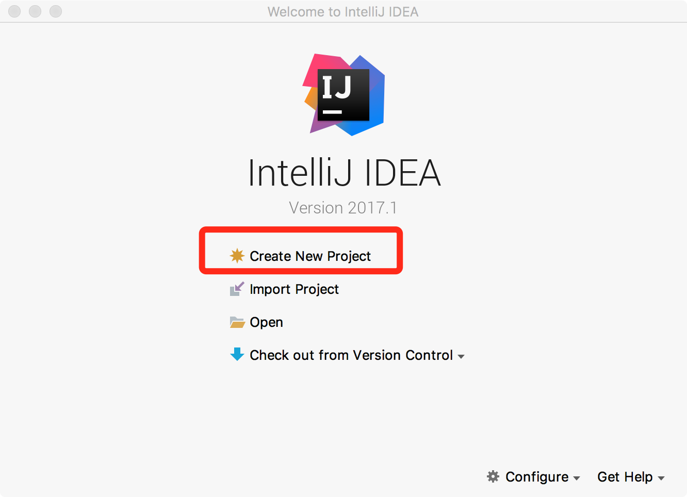
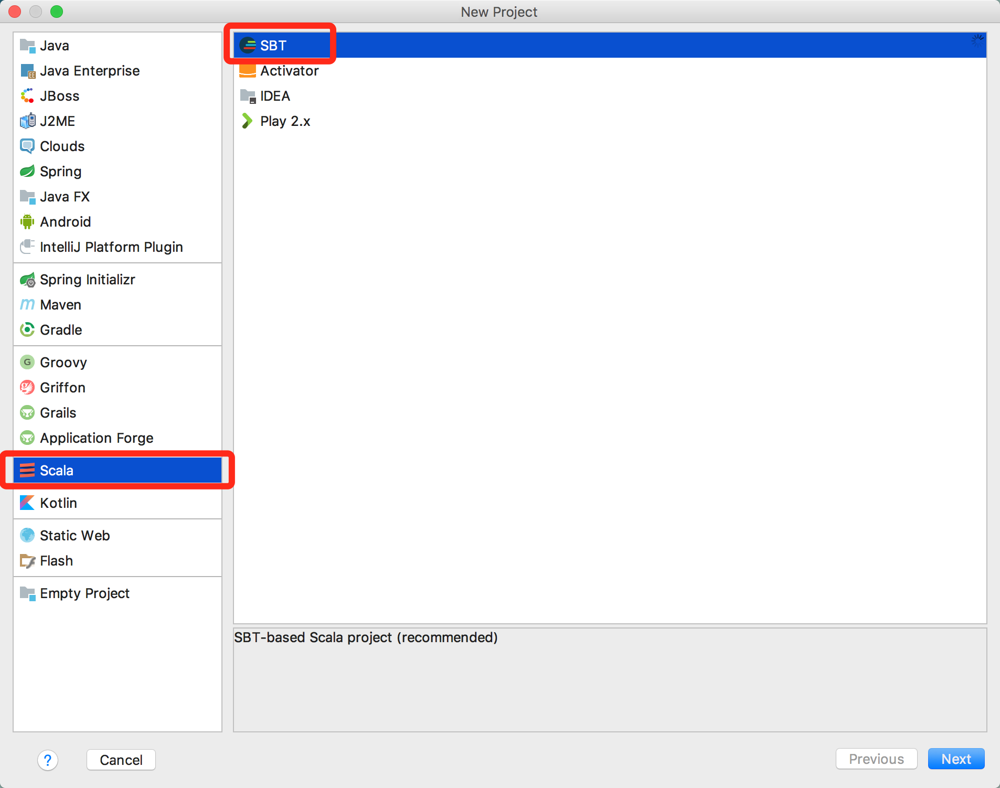
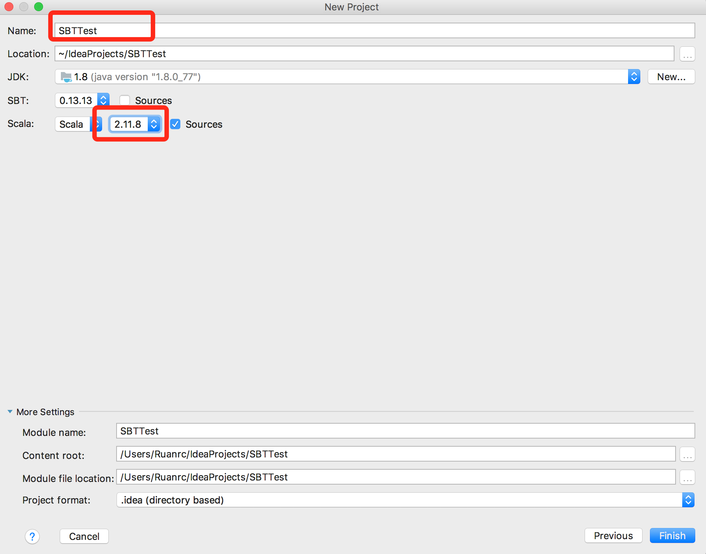
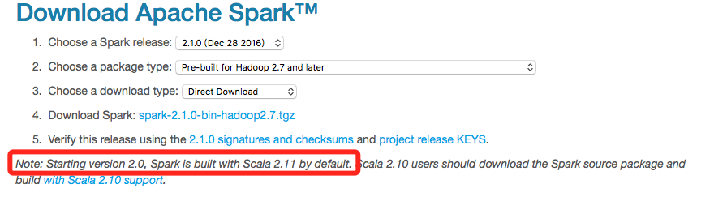
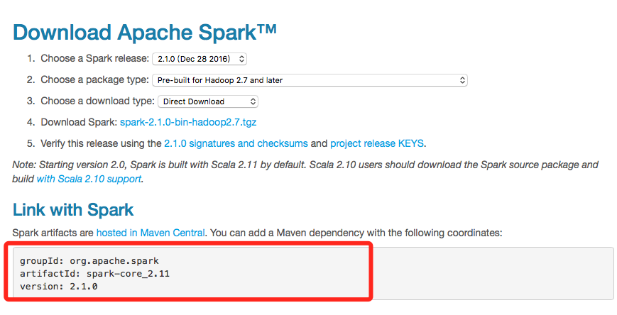
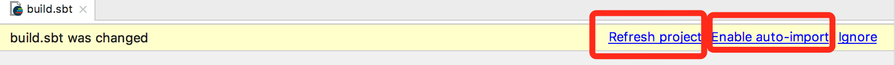
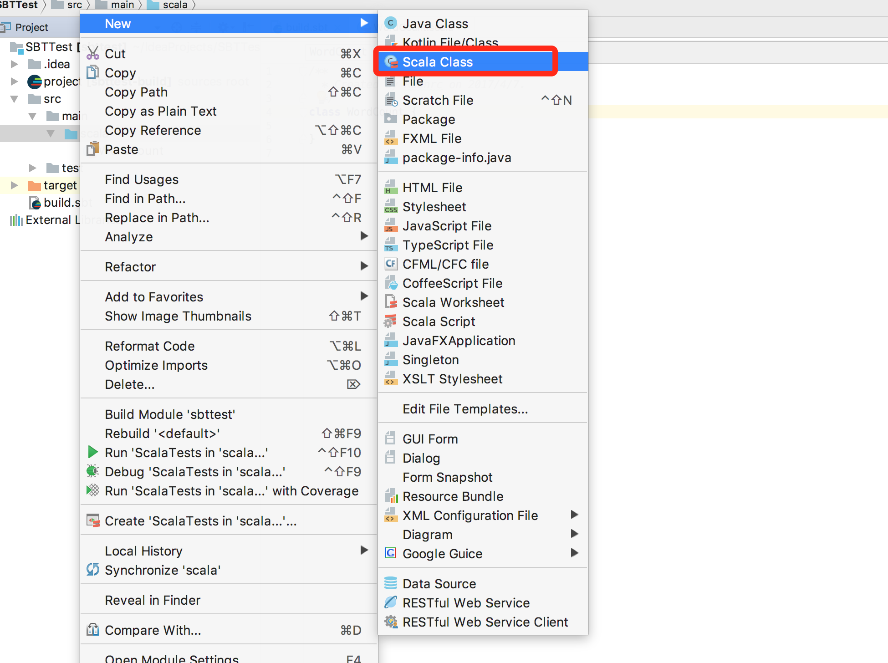

# IDEA编写Spark应用程序（Scala+SBT）

 Ruan Rongcheng 2018年3月26日 http://dblab.xmu.edu.cn/blog/1492-2/

---

对Scala代码进行打包编译时，可以采用Maven，也可以采用SBT，相对而言，业界更多使用SBT。之前有篇博客我们介绍了[使用Intellij Idea编写Spark应用程序(Scala+Maven)](http://dblab.xmu.edu.cn/blog/1327/)，采用的是Maven工具。今天这篇博客同样是使用Intellij Idea编写Spark应用程序，但是使用的是SBT工具。下面开始我们的教程。

# 运行环境

1. Ubuntu 16.04
2. Spark 2.1.0
3. Intellij Idea (Version 2017.1)

# 安装Scala插件

安装Scala插件,该Scala插件自带SBT工具。如果已经安装Scala插件，即可跳过此步骤

# 构建基于SBT的Scala项目

如下图，按顺序执行如下操作:
新建项目



选择Scala—>SBT



设置项目名，点击Finish即可。



> 这里需要设置Scala的版本必须2.11.*的版本号。因为Spark 2.0是基于Scala 2.11构建的。这个可以在Spark的官网查到，如下图：



# 利用SBT 添加依赖包

利用Spark的官网查到Spark artifacts的相关版本号，如下图：

编辑Intellij Idea项目中是build.sbt:

```
name := "SBTTest"

version := "1.0"

scalaVersion := "2.11.8"

libraryDependencies += "org.apache.spark" %% "spark-core" % "2.1.0"
```

编辑后，Intellij Idea弹出提示，如图：



可以选择Refresh Project手动刷新，也可以选择Enable auto-import让Intellij Idea以后每次遇到build.sbt更新后自动导入依赖包。
这里，选择Enable auto-import.

# 创建WordCount实例

在Linux系统中新建一个命令行终端（Shell环境），在终端中执行如下命令,新建word.txt测试文件:

```bash
echo "hadoop hello spark hello world" >> ~/word.txt
```

在Intellij Idea的`src/main/scala`项目目录下新建 WordCount.scala文件，如下图（注意看图下面的备注）：



备注：这里需要注意，在Intellij Idea启动时，会执行“dump project structure from sbt”的操作，也就是把sbt所需要的项目结构从远程服务器拉取到本地，在本地会生成sbt所需要的项目结构。由于是从国外的远程服务器下载，所以，这个过程很慢，笔者电脑上运行了15分钟。这个过程没有结束之前，上图中的“File->New”弹出的子菜单是找不到Scala Class这个选项的。所以，一定要等“dump project structure from sbt”的操作全部执行结束以后，再去按照上图操作来新建Scala Class文件。

新建Scala Class文件的代码如下：

```scala
import org.apache.spark.SparkContext
import org.apache.spark.SparkContext._
import org.apache.spark.SparkConf
import org.apache.log4j.{Level,Logger}
 
object WordCount {
  def main(args: Array[String]) {
    //屏蔽日志
    Logger.getLogger("org.apache.spark").setLevel(Level.WARN)
    Logger.getLogger("org.eclipse.jetty.server").setLevel(Level.OFF)
    val inputFile =  "file:///home/hadoop/word.txt"
    val conf = new SparkConf().setAppName("WordCount").setMaster("local[2]")
    val sc = new SparkContext(conf)
    val textFile = sc.textFile(inputFile)
    val wordCount = textFile.flatMap(line => line.split(" ")).map(word => (word, 1)).reduceByKey((a, b) => a + b)
    wordCount.foreach(println)
  }
}
```

右键WordCount.scala,选择执行 Run 该文件，即可在Intellij Idea下面看到输出结果。