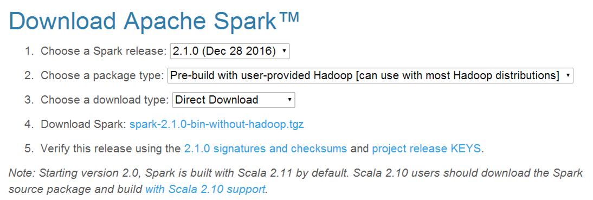
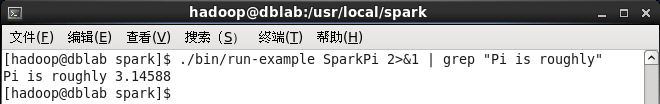
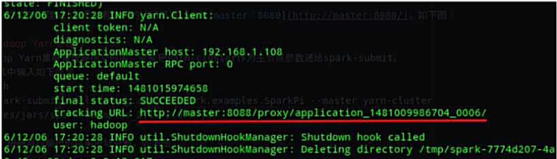
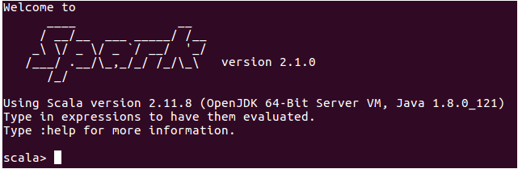
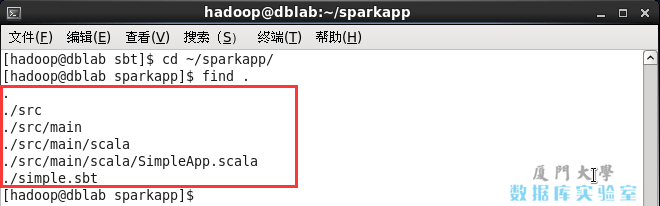

# Spark2.1.0入门：Spark的安装和使用

林子雨老师 2020年5月29日 http://dblab.xmu.edu.cn/blog/1307-2/

---

Spark可以独立安装使用，也可以和Hadoop一起安装使用。本教程中，我们采用和Hadoop一起安装使用，这样，就可以让Spark使用HDFS存取数据。

> **需要说明的是，当安装好Spark以后，里面就自带了scala环境，不需要额外安装scala**

因此，“Spark安装” 这个部分的教程，假设读者的计算机上，没有安装Scala，也没有安装Java（当然了，如果已经安装Java和Scala，也没有关系，依然可以继续按照本教程进行安装），也就是说，你的计算机目前只有Linux系统，其他的软件和环境都没有安装（没有Java，没有Scala，没有Hadoop，没有Spark），需要从零开始安装所有大数据相关软件。下面，需要你在自己的Linux系统上（笔者采用的Linux系统是Ubuntu16.04），

首先安装 Java 和 Hadoop，然后再安装 Spark（**Spark安装好以后，里面就默认包含了Scala解释器**）。

本教程的具体运行环境如下：

- Ubuntu16.04以上
- Hadoop 2.7.1以上
- Java JDK 1.8以上
- Spark 2.1.0
- scala(spark 自带)

## 一、安装Hadoop

如果你的计算机上已经安装了Hadoop，本步骤可以略过。这里假设没有安装。如果没有安装Hadoop，请访问[Hadoop安装教程_单机/伪分布式配置_Hadoop2.6.0/Ubuntu14.04](http://dblab.xmu.edu.cn/blog/install-hadoop/), 依照教程学习安装即可。注意，在这个Hadoop安装教程中，就包含了Java的安装，所以，按照这个教程，就可以完成JDK和Hadoop这二者的安装。

## 二、安装 Spark

在Linux系统中打开浏览器，访问[Spark官方下载地址](http://spark.apache.org/downloads.html)，按照如下图下载。

由于我们已经自己安装了Hadoop，所以，在`“Choose a package type”`后面需要选择`“Pre-build with user-provided Hadoop [can use with most Hadoop distributions]”`，然后，点击`“Download Spark”`后面的 `“spark-2.1.0-bin-without-hadoop.tgz”` 下载即可。下载的文件，默认会被浏览器保存在“/home/hadoop/下载”目录下。需要说明的是，Pre-build with user-provided Hadoop: 属于“Hadoop free”版，这样，下载到的Spark，可应用到任意Hadoop 版本。

> 注意：src 纯源码下载，可以支持 hive

Spark部署模式主要有四种：

- Local模式（单机模式）
- Standalone模式（使用Spark自带的简单集群管理器）、
- YARN模式（使用YARN作为集群管理器）
- Mesos模式（使用Mesos作为集群管理器
- k8s模式（2.3版本以后支持）

这里介绍Local模式（单机模式）的 Spark安装。我们选择Spark 2.1.0版本，并且假设当前使用用户名hadoop登录了Linux操作系统。

```bash
$ sudo tar -zxf ~/下载/spark-2.1.0-bin-without-hadoop.tgz -C /usr/local/
$ cd /usr/local
$ sudo mv ./spark-2.1.0-bin-without-hadoop/ ./spark
$ sudo chown -R hadoop:hadoop ./spark          # 此处的 hadoop 为你的用户名
```

配置环境变量

vim ~/.bashrc

```properties
export SPARK_HOME=/jrtz/spark
export PATH=$PATH:$SPARK_HOME/bin:$SPARK_HOME/sbin
```

立即生效   

```bash
$ source ~/.bashrc
```

安装后，还需要修改Spark的配置文件 `spark-env.sh`

```bash
$ cd /usr/local/spark
$ cp ./conf/spark-env.sh.template ./conf/spark-env.sh
```

集群需要编辑 slaves

```bash
$ cp slaves.template slaves
$ vim slaves
----------
vmsrv-010-214
vmsrv-010-148
```

编辑spark-env.sh文件(vim ./conf/spark-env.sh)，在第一行添加以下配置信息:

```bash
export SPARK_DIST_CLASSPATH=$(/usr/local/hadoop/bin/hadoop classpath)
export HADOOP_CONF_DIR=/usr/local/hadoop/etc/hadoop
# 集群需要配置
export SPARK_MASTER_IP=192.168.10.225
```

有了上面的配置信息以后，Spark就可以把数据存储到Hadoop分布式文件系统HDFS中，也可以从HDFS中读取数据。如果没有配置上面信息，Spark就只能读写本地数据，无法读写HDFS数据。
配置完成后就可以直接使用，不需要像Hadoop运行启动命令。
通过运行Spark自带的示例，验证Spark是否安装成功。

```bash
$ cd /usr/local/spark
$ bin/run-example SparkPi
```

执行时会输出非常多的运行信息，输出结果不容易找到，可以通过 grep 命令进行过滤（命令中的 2>&1 可以将所有的信息都输出到 stdout 中，否则由于输出日志的性质，还是会输出到屏幕中）:

```bash
$ bin/run-example SparkPi 2>&1 | grep "Pi is"
```

这里涉及到Linux Shell中管道的知识，详情可以参考[Linux Shell中的管道命令](http://dblab.xmu.edu.cn/blog/824-2/)
过滤后的运行结果如下图示，可以得到π 的 5 位小数近似值：


### 启动spark集群

- 首先在master 节点上启动 hadoop 集群

  ```bash
  $ cd /usr/local/hadoop
  # 启动 hdfs, 启动 yarn
  $ sbin/start-all.sh
  ```

- 在Master节点启动 spark Master节点和Worker节点

  ```bash
  # $ cd /usr/local/spark
  $ cd /jrtz/spark
  $ sbin/start-master.sh
  $ sbin/start-slaves.sh
  ```
### spark集群测试

- 自带样例测试 pi

```bash
$ cd /jrtz/spark
$ bin/spark-submit --class org.apache.spark.examples.SparkPi --master spark://vmsrv-010-225:7077 examples/jars/spark-examples_2.11-2.2.0.jar 100 2>&1 | grep "Pi is roughly"
```

- 集群中运行 spark-shell

```bash
$ cd /jrtz/spark
$ bin/spark-shell --master spark://vmsrv-010-225:7077
```

先 hdfs 上传文件

```bash
$ /jrtz/hadoop/bin/hdfs dfs -put /jrtz/spark/README.md /
```

scala 命令

```bash
scala> val textFile = sc.textFile("hdfs://vmsrv-010-225:9000/README.md")
textFile: org.apache.spark.rdd.RDD[String] = hdfs://vmsrv-010-225:9000/README.md MapPartitionsRDD[1] at textFile at <console>:24
scala> textFile.count()
res1: Long = 103 
scala> textFile.first()
res2: String = # Apache Spark
```

### spark yarn管理器集群测试

- 自带样例测试 pi, 主要修改 --master spark://yarn-cluster
```bash
$ bin/spark-submit --class org.apache.spark.examples.SparkPi --master spark://yarn-cluster examples/jars/spark-examples_2.11-2.2.0.jar 100 2>&1 | grep "Pi is roughly"
```

- 运行后，根据在shell中得到输出的结果地址查看



- 集群中运行 spark-shell

```bash
$ bin/spark-shell --master yarn
```

### 关闭spark集群

- 在Master节点关闭 spark Master和Worker节点

  ```bash
  $ cd /usr/local/spark
  $ sbin/stop-master.sh
  $ sbin/stop-slaves.sh
  ```

- 在master 节点上关闭 hadoop 集群

  ```bash
  $ cd /usr/local/hadoop
  # 关闭 hdfs, 关闭 yarn
  $ sbin/stop-all.sh
  ```

## 三、在 Spark Shell 中运行代码

学习Spark程序开发，建议首先通过spark-shell交互式学习，加深Spark程序开发的理解。

这里介绍Spark Shell 的基本使用。Spark shell 提供了简单的方式来学习 API，并且提供了交互的方式来分析数据。你可以输入一条语句，Spark shell会立即执行语句并返回结果，这就是我们所说的REPL（Read-Eval-Print Loop，交互式解释器），为我们提供了交互式执行环境，表达式计算完成就会输出结果，而不必等到整个程序运行完毕，因此可即时查看中间结果，并对程序进行修改，这样可以在很大程度上提升开发效率。

Spark Shell 支持 Scala 和 Python，这里使用 Scala 来进行介绍。

前面已经安装了Hadoop和Spark，如果Spark不使用HDFS和YARN，那么就不用启动Hadoop也可以正常使用Spark。如果在使用Spark的过程中需要用到 HDFS，就要首先启动 Hadoop（启动Hadoop的方法可以参考上面给出的Hadoop安装教程）。

这里假设不需要用到HDFS，因此，就没有启动Hadoop。现在我们直接开始使用Spark。
spark-shell命令及其常用的参数如下：

```
./bin/spark-shell --master <master-url>
```

Spark的运行模式取决于传递给 SparkContext 的 Master URL 的值。Master URL 可以是以下任一种形式：
* local 使用一个Worker线程本地化运行SPARK(完全不并行)
* local[*] 使用逻辑CPU个数数量的线程来本地化运行Spark
* local[K] 使用K个Worker线程本地化运行Spark（理想情况下，K应该根据运行机器的CPU核数设定）
* spark://HOST:PORT 连接到指定的Spark standalone master。默认端口是7077.
* yarn-client   以客户端模式连接YARN集群。集群的位置可以在HADOOP_CONF_DIR 环境变量中找到。
* yarn-cluster 以集群模式连接YARN集群。集群的位置可以在HADOOP_CONF_DIR 环境变量中找到。
* mesos://HOST:PORT 连接到指定的Mesos集群。默认接口是5050。

需要强调的是，这里我们采用“本地模式”（local）运行Spark，关于如何在集群模式下运行Spark，可以参考后面的“[在集群上运行Spark应用程序](http://dblab.xmu.edu.cn/blog/1217-2/)”。

在Spark中采用本地模式启动Spark Shell的命令主要包含以下参数：

- --master：这个参数表示当前的 Spark Shell 要连接到哪个 master，如果是 local[*]，就是使用本地模式启动spark-shell，其中，中括号内的星号表示需要使用几个CPU核心(core)；
- --jars： 这个参数用于把相关的JAR包添加到 CLASSPATH 中；如果有多个 jar 包，可以使用逗号分隔符连接它们；

比如，要采用本地模式，在4个CPU核心上运行spark-shell：

```bash
$ cd /usr/local/spark
$ ./bin/spark-shell --master local[4]
```

或者，可以在CLASSPATH中添加code.jar，命令如下：

```bash
$ cd /usr/local/spark
$ ./bin/spark-shell --master local[4] --jars code.jar 
```

可以执行“spark-shell –help”命令，获取完整的选项列表，具体如下：

```bash
$ cd /usr/local/spark
$ ./bin/spark-shell --help
```

上面是命令使用方法介绍，下面正式使用命令进入spark-shell环境，可以通过下面命令启动spark-shell环境：

```bash
$ bin/spark-shell
```

该命令省略了参数，这时，系统默认是`“bin/spark-shell --master local[*]”`，也就是说，是采用本地模式运行，并且使用本地所有的CPU核心。

启动 spark-shell 后，就会进入“scala>”命令提示符状态,如下图所示：

现在，你就可以在里面输入scala代码进行调试了。

比如，下面在命令提示符后面输入一个表达式“8 * 2 + 5”，然后回车，就会立即得到结果：

```scala
scala> 8*2+5
res0: Int = 21
```

最后，可以使用命令“:quit”退出Spark Shell，如下所示：

```scala
scala>:quit
```

或者，也可以直接使用“Ctrl+D”组合键，退出Spark Shell。

## 四、Spark独立应用程序编程

接着我们通过一个简单的应用程序 SimpleApp 来演示如何通过 Spark API 编写一个独立应用程序。

- 使用 Scala 编写的程序需要使用 sbt 进行编译打包，
- 相应的，Java 程序使用 Maven 编译打包，
- 而 Python 程序通过 spark-submit 直接提交。

### （一）编写Scala独立应用程序

1. 安装sbt
   (备注：本部分内容林子雨于2020年2月23日测试过，sbt最新版本1.3.8可以成功使用)
   sbt（Simple Build Tool）是对Scala或Java语言进行编译的一个工具，类似于Maven或Ant，需要JDK1.8或更高版本的支持，并且可以在 Windows 和 Linux 两种环境下安装使用。sbt需要下载安装，可以访问“http://www.scala-sbt.org”下载安装文件 sbt-1.3.8.tgz，保存到下载目录。假设下载目录为“～/Downloads”，安装目录为“/usr/local/sbt”，则执行如下命令将下载后的文件拷贝至安装目录中：

```bash
$ sudo mkdir /usr/local/sbt             　　　# 创建安装目录
$ cd ~/Downloads 
$ sudo tar -zxvf ./sbt-1.3.8.tgz -C /usr/local
$ cd /usr/local/sbt sudo chown -R hadoop /usr/local/sbt  　　 # 此处的hadoop为系统当前用户名
$ cp ./bin/sbt-launch.jar ./  #把bin目录下的sbt-launch.jar复制到sbt安装目录下
```

接着在安装目录中使用下面命令创建一个Shell脚本文件，用于启动sbt：

```bash
$ vim /usr/local/sbt/sbt
```

该脚本文件中的代码如下：

```shell
#!/bin/bash
SBT_OPTS="-Xms512M -Xmx1536M -Xss1M -XX:+CMSClassUnloadingEnabled -XX:MaxPermSize=256M"
java $SBT_OPTS -jar `dirname $0`/sbt-launch.jar "$@"
```

保存后，还需要为该Shell脚本文件增加可执行权限：

```bash
$ chmod u+x /usr/local/sbt/sbt
```

然后，可以使用如下命令查看sbt版本信息：

```bash
$ cd /usr/local/sbt
$ ./sbt sbtVersion
```

```
    上述查看版本信息的命令，可能需要执行几分钟，执行成功以后就可以看到版本为1.3.8。
```

```shell
Java HotSpot(TM) 64-Bit Server VM warning: ignoring option MaxPermSize=256M; support was removed in 8.0
[warn] No sbt.version set in project/build.properties, base directory: /usr/local/sbt
[info] Set current project to sbt (in build file:/usr/local/sbt/)
[info] 1.3.8
```

2. 编写Scala应用程序
在终端中执行如下命令创建一个文件夹 sparkapp 作为应用程序根目录：

```bash
$ cd ~           # 进入用户主文件夹
$ mkdir ./sparkapp        # 创建应用程序根目录
$ mkdir -p ./sparkapp/src/main/scala     # 创建所需的文件夹结构
```

在 ./sparkapp/src/main/scala 下建立一个名为 SimpleApp.scala 的文件（`vim ./sparkapp/src/main/scala/SimpleApp.scala`），添加代码如下（目前不需要理解代码的具体含义，只需要理解如何编译运行代码就可以）：

```scala
/* SimpleApp.scala */
import org.apache.spark.SparkContext
import org.apache.spark.SparkContext._
import org.apache.spark.SparkConf

object SimpleApp {
    def main(args: Array[String]) {
        val logFile = "file:///usr/local/spark/README.md" // Should be some file on your system
        val conf = new SparkConf().setAppName("Simple Application")
        val sc = new SparkContext(conf)
        val logData = sc.textFile(logFile, 2).cache()
        val numAs = logData.filter(line => line.contains("a")).count()
        val numBs = logData.filter(line => line.contains("b")).count()
        println("Lines with a: %s, Lines with b: %s".format(numAs, numBs))
    }
}
```

该程序计算 /usr/local/spark/README 文件中包含 "a" 的行数 和包含 "b" 的行数。代码第8行的 /usr/local/spark 为 Spark 的安装目录，如果不是该目录请自行修改。不同于 Spark shell，独立应用程序需要通过 `val sc = new SparkContext(conf)` 初始化 SparkContext，SparkContext 的参数 SparkConf 包含了应用程序的信息。


3. 使用sbt打包Scala程序

该程序依赖 Spark API，因此我们需要通过 sbt 进行编译打包。 请在./sparkapp 中新建文件 simple.sbt（`vim ./sparkapp/simple.sbt`），添加内容如下，声明该独立应用程序的信息以及与 Spark 的依赖关系：

```properties
name := "Simple Project"
version := "1.0"
scalaVersion := "2.11.8"
libraryDependencies += "org.apache.spark" %% "spark-core" % "2.1.0"
```

文件 simple.sbt 需要指明 Spark 和 Scala 的版本。在上面的配置信息中，scalaVersion用来指定scala的版本，sparkcore用来指定spark的版本，这两个版本信息都可以在之前的启动 Spark shell 的过程中，从屏幕的显示信息中找到。下面就是笔者在启动过程当中，看到的相关版本信息（备注：屏幕显示信息会很长，需要往回滚动屏幕仔细寻找信息）。

```
Welcome to
      ____              __
     / __/__  ___ _____/ /__
    _\ \/ _ \/ _ `/ __/  '_/
   /___/ .__/\_,_/_/ /_/\_\   version 2.4.8
      /_/
         
Using Scala version 2.11.12 (Java HotSpot(TM) 64-Bit Server VM, Java 1.8.0_191)
Type in expressions to have them evaluated.
Type :help for more information.
```

为保证 sbt 能正常运行，先执行如下命令检查整个应用程序的文件结构：

```bash
$ cd ~/sparkapp    
$ find .
```

文件结构应如下图所示：



SimpleApp的文件结构

接着，我们就可以通过如下代码将整个应用程序打包成 JAR（首次运行同样需要下载依赖包 ）：

```bash
$ /usr/local/sbt/sbt package
```

对于刚安装好的 Spark 和 sbt 而言，第一次运行上面的打包命令时，会需要几分钟的运行时间，因为系统会自动从网络上下载各种文件。后面再次运行上面命令，就会很快，因为不再需要下载相关文件。
打包成功的话，会输出如下内容：

```bash
hadoop@dblab:~/sparkapp$ /usr/local/sbt/sbt package
OpenJDK 64-Bit Server VM warning: ignoring option MaxPermSize=256M; support was removed in 8.0
[info] Set current project to Simple Project (in build file:/home/hadoop/sparkapp/)
[success] Total time: 2 s, completed 2017-2-19 15:45:29
```

生成的 jar 包的位置为 ~/sparkapp/target/scala-2.11/simple-project_2.11-1.0.jar。

4. 通过 spark-submit 运行程序

最后，我们就可以将生成的 jar 包通过 spark-submit 提交到 Spark 中运行了，命令如下：

```bash
$ /usr/local/spark/bin/spark-submit --class "SimpleApp" ~/sparkapp/target/scala-2.11/simple-project_2.11-1.0.jar
#上面命令执行后会输出太多信息，可以不使用上面命令，而使用下面命令查看想要的结果
$ /usr/local/spark/bin/spark-submit --class "SimpleApp" ~/sparkapp/target/scala-2.11/simple-project_2.11-1.0.jar 2>&1 | grep "Lines with a:"
```

最终得到的结果如下：

```
Lines with a: 62, Lines with b: 30
```

自此，你就完成了你的第一个 Spark 应用程序了。

### （二）Java独立应用编程

1. 安装maven
   ubuntu中没有自带安装maven，需要手动安装maven。可以访问[maven官方下载](https://maven.apache.org/download.cgi#Files)自己下载。这里直接给出[apache-maven-3.3.9-bin.zip的下载地址](http://apache.fayea.com/maven/maven-3/3.3.9/binaries/apache-maven-3.3.9-bin.zip),直接点击下载即可。
   选择安装在/usr/local/maven中：

```bash
$ sudo unzip ~/下载/apache-maven-3.3.9-bin.zip -d /usr/local
$ cd /usr/local
$ sudo mv apache-maven-3.3.9/ ./maven
$ sudo chown -R hadoop ./maven
```

2. Java应用程序代码
   在终端执行如下命令创建一个文件夹sparkapp2作为应用程序根目录

```bash
$ cd ~ #进入用户主文件夹
$ mkdir -p ./sparkapp2/src/main/java
```

在 ./sparkapp2/src/main/java 下建立一个名为 SimpleApp.java 的文件（vim ./sparkapp2/src/main/java/SimpleApp.java），添加代码如下：

```java
/*** SimpleApp.java ***/
import org.apache.spark.api.java.*;
import org.apache.spark.api.java.function.Function;

public class SimpleApp {
    public static void main(String[] args) {
        String logFile = "file:///usr/local/spark/README.md"; // Should be some file on your system
        JavaSparkContext sc = new JavaSparkContext("local", "Simple App",
                                                   "file:///usr/local/spark/", new String[]{"target/simple-project-1.0.jar"});
        JavaRDD<String> logData = sc.textFile(logFile).cache();

        long numAs = logData.filter(new Function<String, Boolean>() {
            public Boolean call(String s) { return s.contains("a"); }
        }).count();

        long numBs = logData.filter(new Function<String, Boolean>() {
            public Boolean call(String s) { return s.contains("b"); }
        }).count();

        System.out.println("Lines with a: " + numAs + ", lines with b: " + numBs);
    }
}
```

该程序依赖Spark Java API,因此我们需要通过Maven进行编译打包。在./sparkapp2中新建文件pom.xml(vim ./sparkapp2/pom.xml),添加内容如下，声明该独立应用程序的信息以及与Spark的依赖关系：

```xml
<project>
    <groupId>edu.berkeley</groupId>
    <artifactId>simple-project</artifactId>
    <modelVersion>4.0.0</modelVersion>
    <name>Simple Project</name>
    <packaging>jar</packaging>
    <version>1.0</version>
    <repositories>
        <repository>
            <id>Akka repository</id>
            <url>http://repo.akka.io/releases</url>
        </repository>
    </repositories>
    <dependencies>
        <dependency> <!-- Spark dependency -->
            <groupId>org.apache.spark</groupId>
            <artifactId>spark-core_2.11</artifactId>
            <version>2.1.0</version>
        </dependency>
    </dependencies>
</project>
```

关于Spark dependency的依赖关系，可以访问[The Central Repository](http://search.maven.org/)。搜索spark-core可以找到相关依赖关系信息。

3. 使用maven打包 java 程序
   为了保证maven能够正常运行，先执行如下命令检查整个应用程序的文件结构:

```bash
$ cd ~/sparkapp2
$ find .
```

文件结构如下图：


接着，我们可以通过如下代码将这整个应用程序打包成Jar(注意：电脑需要保持连接网络的状态，而且首次运行mvn package命令时，系统会自动从网络下载相关的依赖包，同样消耗几分钟的时间，后面再次运行mvn package命令，速度就会快很多):

```bash
$ /usr/local/maven/bin/mvn package
```

如果运行上面命令后出现类似下面的信息，说明生成Jar包成功：

```properties
[INFO] ------------------------------------------------------------------------
[INFO] BUILD SUCCESS
[INFO] ------------------------------------------------------------------------
[INFO] Total time: 6.583 s
[INFO] Finished at: 2017-02-19T15:52:08+08:00
[INFO] Final Memory: 15M/121M
[INFO] ------------------------------------------------------------------------
```

4. 通过spark-submit 运行程序

可以通过spark-submit提交应用程序，该命令的格式如下：

```bash
./bin/spark-submit 
  --class <main-class>  //需要运行的程序的主类，应用程序的入口点
  --master <master-url>  //Master URL，下面会有具体解释
  --deploy-mode <deploy-mode>   //部署模式
  ... # other options  //其他参数
  <application-jar>  //应用程序JAR包
  [application-arguments] //传递给主类的主方法的参数
```

deploy-mode 这个参数用来指定应用程序的部署模式，部署模式有两种：client和cluster，默认是client。当采用client部署模式时，就是直接在本地运行Driver Program，当采用cluster模式时，会在Worker节点上运行Driver Program。比较常用的部署策略是从网关机器提交你的应用程序，这个网关机器和你的Worker集群进行协作。在这种设置下，比较适合采用client模式，在client模式下，Driver直接在spark-submit进程中启动，这个进程直接作为集群的客户端，应用程序的输入和输出都和控制台相连接。因此，这种模式特别适合涉及REPL的应用程序。另一种选择是，如果你的应用程序从一个和Worker机器相距很远的机器上提交，那么采用cluster模式会更加合适，它可以减少Driver和Executor之间的网络迟延。

Spark的运行模式取决于传递给SparkContext的Master URL的值。Master URL可以是以下任一种形式：
* local 使用一个Worker线程本地化运行SPARK(完全不并行)
* local[*] 使用逻辑CPU个数数量的线程来本地化运行Spark
* local[K] 使用K个Worker线程本地化运行Spark（理想情况下，K应该根据运行机器的CPU核数设定）
* spark://HOST:PORT 连接到指定的Spark standalone master。默认端口是7077.
* yarn-client 以客户端模式连接YARN集群。集群的位置可以在HADOOP_CONF_DIR 环境变量中找到。
* yarn-cluster 以集群模式连接YARN集群。集群的位置可以在HADOOP_CONF_DIR 环境变量中找到。
* mesos://HOST:PORT 连接到指定的Mesos集群。默认接口是5050。

最后，针对上面编译打包得到的应用程序，可以通过将生成的jar包通过spark-submit提交到Spark中运行，如下命令：

```bash
$ /usr/local/spark/bin/spark-submit --class "SimpleApp" ~/sparkapp2/target/simple-project-1.0.jar
#上面命令执行后会输出太多信息，可以不使用上面命令，而使用下面命令查看想要的结果
$ /usr/local/spark/bin/spark-submit --class "SimpleApp" ~/sparkapp2/target/simple-project-1.0.jar 2>&1 | grep "Lines with a"
```

最后得到的结果如下:

```
Lines with a: 62, Lines with b: 30
```