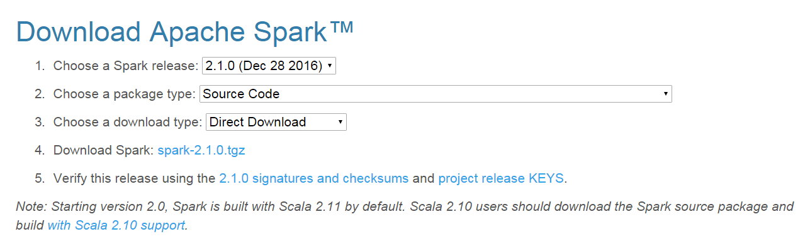

# Spark2.1.0入门：连接Hive读写数据（DataFrame）

 林子雨老师 2017年2月28日 (updated: 2017年3月21日) http://dblab.xmu.edu.cn/blog/1383-2/

---

[[返回Spark教程首页](http://dblab.xmu.edu.cn/blog/spark/)]

Hive是基于Hadoop的数据仓库（要想了解更多数据仓库Hive的知识以及如何安装Hive，可以参考厦门大学数据库实验室的[Hive授课视频](http://dblab.xmu.edu.cn/post/bigdata-online-course/#lesson8)、[Hive安装指南](http://dblab.xmu.edu.cn/blog/install-hive/)）。本节内容介绍Spark如何连接Hive并读写数据。

## 一、让Spark包含Hive支持

为了让Spark能够访问Hive，必须为Spark添加Hive支持。Spark官方提供的预编译版本，通常是不包含Hive支持的，需要采用源码编译，编译得到一个包含Hive支持的Spark版本，然后采用我们之前在“[Spark安装和使用](http://dblab.xmu.edu.cn/blog/931-2/)”部分介绍的方法安装Spark。

### 测试一下电脑上已经安装的Spark版本是否支持Hive

现在让我们测试一下自己电脑上已经安装的Spark版本是否支持Hive。请请登录Linux系统，打开一个终端，然后，执行下面命令：

```bash
$ cd /usr/local/spark
$ ./bin/spark-shell
```

这样就启动进入了spark-shell，然后在scala命令提示符下输入：

```scala
scala> import org.apache.spark.sql.hive.HiveContext
<console>:25: error: object hive is not a member of package org.apache.spark.sql
         import org.apache.spark.sql.hive.HiveContext
                                     ^
```

看到了吧，会返回错误信息，也就是spark无法识别org.apache.spark.sql.hive.HiveContext，这就说明你当前电脑上的Spark版本不包含Hive支持。

如果你当前电脑上的Spark版本包含Hive支持，那么应该显示下面的正确信息：

```scala
scala> import org.apache.spark.sql.hive.HiveContext
import org.apache.spark.sql.hive.HiveContext
```

### 采用源码编译方法得到支持Hive的Spark版本

经过上面测试，如果你当前电脑上的Spark版本包含Hive支持，那就可以不用进行下面的源码编译步骤。如果你当前电脑上的Spark版本不包含Hive支持，请根据下面教程编译一个包含Hive支持的Spark版本。
（备注：笔者已经把我们实验室编译成功的spark-2.1.0-bin-h27hive.tgz文件上传到了百度云盘（文件大小170MB，[下载地址](http://pan.baidu.com/s/1nv8Y2hj)），所以，你或者可以按照下面的方法自己编译，或者可以直接下载我们已经编译成功的版本）
请登录Linux系统，打开一个火狐（Firefox）浏览器。在Linux系统的火狐浏览器中，[请点击这里访问Spark官网](http://spark.apache.org/downloads.html)下载Spark源码版本（或者直接把下载地址复制到火狐浏览器中打开官网，下载地址是http://spark.apache.org/downloads.html）。
进入这个官网后，可以按照下图配置选择“2.1.0(Dec 28, 2016)”和“SourceCode”，然后，在图中红色方框内，有个“Download Spark: spark-2.1.0.tgz”的下载链接，点击该链接就可以下载Spark源码文件了。


如果是在火狐浏览器中下载spark-2.1.0.tgz，这个文件被默认放置在你当前用户的下载目录下，我们教程是统一使用hadoop用户登录Linux系统，所以，下载文件被放到了“/home/hadoop/下载”这个目录下。
由于带有中文名称的目录在进行打包编译时，往往容易出现错误，为了保险起见，我们还是把这个文件解压缩到一个英文目录下。请在Linux系统中打开一个终端，然后执行下面命令进行文件解压：

```bash
$ cd /home/hadoop/下载  //spark-2.1.0.tgz就在这个目录下面
$ ls #可以看到刚才下载的spark-2.1.0.tgz文件
$ sudo tar -zxf ./spark-2.1.0.tgz -C /home/hadoop/
$ cd /home/hadoop
$ ls #这时可以看到解压得到的文件夹spark-2.1.0
```

下面很关键，我们要进行源码编译，并且在编译命令中设置一些选项，从而让Spark支持Hive。
在编译时，需要给出你电脑上之前已经安装好的Hadoop的版本。如何查询Hadoop版本号呢？请使用下面命令查询：

```bash
$ hadoop version
```

运行上面命令后，就会显示Hadoop版本信息。笔者电脑上的Hadoop版本信息是2.7.1。
下面，就可以运行编译命令，对Spark源码进行编译，让它支持Hive，命令如下：

```bash
$ cd /home/hadoop/spark-2.1.0
$ ./dev/make-distribution.sh —tgz —name h27hive -Pyarn -Phadoop-2.7 -Dhadoop.version=2.7.1 -Phive -Phive-thriftserver -DskipTests
```

其中，-Phadoop-2.7 -Dhadoop.version=2.7.1 指定安装spark时的hadoop版本，一定要对应，这个hadoop版本是你当前电脑上已经安装的Hadoop的版本。 -Phive -Phive-thriftserver这两个选项让其支持Hive。 -DskipTests能避免测试不通过时发生的错误。

上面命令中“h27hive”只是我们给编译以后的文件的一个名称，最终编译成功后会得到文件名“spark-2.1.0-bin-h27hive.tgz”，这个就是包含Hive支持的Spark安装文件。
上述编译命令运行时间，根据电脑和网络情况，耗费的时间不一样，笔者实验室电脑编译了3个多小时，网络上其他用户有的也编译了几个小时，而且中间编译过程还会发生网络故障导致编译失败，那就只能重新编译。总之，这个过程有点痛苦，笔者为了编译一个支持Hive的Spark版本，也是耗费了10几个小时。编译成功以后，就可以得到一个文件名为“spark-2.1.0-bin-h27hive.tgz”的文件，这个就是包含Hive支持的Spark安装文件，然后我们就可以参考前面章节讲过的[Spark安装方法](http://dblab.xmu.edu.cn/blog/931-2/)开始安装这个支持Hive的Spark版本。

### 安装支持Hive的Spark版本

本教程目标是“零门槛零障碍”学习Spark知识，所以，下面给出安装的过程。
为了让大家可以顺利安装支持Hive的Spark版本，笔者已经把我们实验室编译成功的spark-2.1.0-bin-h27hive.tgz文件上传到了百度云盘（文件大小170MB，[下载地址](http://pan.baidu.com/s/1nv8Y2hj)），所以，你或者可以自己编译，或者可以直接下载我们已经编译成功的版本。不管是自己编译的，还是从百度云盘下载的，我们这里都假设这个支持Hive的Spark安装文件都被保存在了“/home/hadoop/下载/spark-2.1.0-bin-h27hive.tgz”。而且，需要重点强调的是，根据我们的教程，我们在此前的Spark安装章节已经在电脑上安装了一个Spark版本（不支持Hive），当时的安装目录是“/usr/local/spark”。我们不需要卸载以前这个已经安装成功的Spark版本（不支持Hive），只需要把新的Spark版本（包含Hive支持）安装在另外一个名字为sparkwithhive的目录下即可。而且，安装成功以后，可以分别打开两个终端窗口，第一个终端窗口中启动spark-shell（不支持Hive），同时在第二个终端窗口中启动spark-shell（包含Hive支持），二者可以同时运行。
好的，下面就开始安装新的Spark版本（包含Hive支持），命令如下：

```bash
cd /home/hadoop/下载/
sudo tar -zxf ~/下载/spark-2.1.0-bin-h27hive.tgz -C /usr/local
#执行上面的解压缩命令时需要你输入当前登录用户的登录密码
cd /usr/local
sudo mv ./spark-2.1.0-bin-h27hive ./sparkwithhive
sudo chown -R hadoop:hadoop ./sparkwithhive
cd /usr/local/sparkwithhive/
cp ./conf/spark-env.sh.template ./conf/spark-env.sh
vim ./conf/spark-env.sh
```

上面用vim编辑器打开了spark-env.sh文件，请在这个文件的开头第一行增加一行如下内容：

```shell
export SPARK_DIST_CLASSPATH=$(/usr/local/hadoop/bin/hadoop classpath)
```

然后，保存文件，退出vim编辑器，继续执行下面命令：

```bash
cd /usr/local/spark
cd /usr/local/sparkwithhive
#下面运行一个样例程序，测试是否成功安装
bin/run-example SparkPi 2>&1 | grep "Pi is"
```

如果能够得到下面信息，就说明成功了。

```
Pi is roughly 3.146315731578658
```

为了让Spark能够访问Hive，需要把Hive的配置文件hive-site.xml拷贝到Spark的conf目录下，请在Shell命令提示符状态下操作：

```bash
cd /usr/local/sparkwithhive/conf
cp /usr/local/hive/conf/hive-site.xml .
ls
```

然后，就可以启动进入spark-shell，命令如下：

```bash
cd /usr/local/sparkwithhive
./bin/spark-shell
```

这样就启动了spark-shell，进入了“scala>”命令提示符状态，请输入下面语句：

```scala
scala> import org.apache.spark.sql.hive.HiveContext
import org.apache.spark.sql.hive.HiveContext
```

看到上面的信息，说明你当前启动的Spark版本可以支持Hive，恭喜你，可以进行下面的Hive数据读写实验了。

## 二、在Hive中创建数据库和表

假设目前你已经根据厦门大学数据库实验室的Hive安装指南（要想了解更多数据仓库Hive的知识以及如何安装Hive，可以参考厦门大学数据库实验室的[Hive授课视频](http://dblab.xmu.edu.cn/post/bigdata-online-course/#lesson8)、[Hive安装指南](http://dblab.xmu.edu.cn/blog/install-hive/)），完成了Hive的安装，并且使用的是MySQL数据库来存放Hive的元数据。
下面，请登录Linux系统（本教程统一采用hadoop用户名登录），打开一个终端，进入Shell命令提示符状态。因为需要借助于MySQL保存Hive的元数据，所以，请首先启动MySQL数据库：

```bash
service mysql start  #可以在Linux的任何目录下执行该命令
```

由于Hive是基于Hadoop的数据仓库，使用HiveQL语言撰写的查询语句，最终都会被Hive自动解析成MapReduce任务由Hadoop去具体执行，因此，需要启动Hadoop，然后再启动Hive。
然后执行以下命令启动Hadoop：

```bash
cd /usr/local/hadoop
./sbin/start-all.sh
```

Hadoop启动成功以后，可以再启动Hive：

```bash
cd /usr/local/hive
./bin/hive  #由于已经配置了path环境变量，这里也可以直接使用hive，不加路径
```

通过上述过程，我们就完成了MySQL、Hadoop和Hive三者的启动。

下面我们进入Hive，新建一个数据库sparktest，并在这个数据库下面创建一个表student，并录入两条数据。
下面操作请在Hive命令提示符下操作：

```hive
hive> create database if not exists sparktest;//创建数据库sparktest
hive> show databases; //显示一下是否创建出了sparktest数据库
//下面在数据库sparktest中创建一个表student
hive> create table if not exists sparktest.student(
> id int,
> name string,
> gender string,
> age int);
hive> use sparktest; //切换到sparktest
hive> show tables; //显示sparktest数据库下面有哪些表
hive> insert into student values(1,'Xueqian','F',23); //插入一条记录
hive> insert into student values(2,'Weiliang','M',24); //再插入一条记录
hive> select * from student; //显示student表中的记录
```

通过上面操作，我们就在Hive中创建了sparktest.student表，这个表有两条数据。

## 三、连接Hive读写数据

现在我们看如何使用Spark读写Hive中的数据。注意，操作到这里之前，你一定已经按照前面的各个操作步骤，启动了Hadoop、Hive、MySQL和spark-shell（包含Hive支持）。
在进行编程之前，我们需要做一些准备工作，我们需要修改“/usr/local/sparkwithhive/conf/spark-env.sh”这个配置文件：

```bash
cd /usr/local/sparkwithhive/conf/
vim spark-env.sh
```

这样就使用vim编辑器打开了spark-env.sh这个文件，这文件里面以前可能包含一些配置信息，全部删除，然后输入下面内容：

```bash
export SPARK_DIST_CLASSPATH=$(/usr/local/hadoop/bin/hadoop classpath)
export JAVA_HOME=/usr/lib/jvm/java-8-openjdk-amd64
export CLASSPATH=$CLASSPATH:/usr/local/hive/lib
export SCALA_HOME=/usr/local/scala
export HADOOP_CONF_DIR=/usr/local/hadoop/etc/hadoop
export HIVE_CONF_DIR=/usr/local/hive/conf
export SPARK_CLASSPATH=$SPARK_CLASSPATH:/usr/local/hive/lib/mysql-connector-java-5.1.40-bin.jar
```

保存spark-env.sh这个文件，退出vim编辑器。

好了，经过了前面如此漫长的准备过程，现在终于可以编写调试Spark连接Hive读写数据的代码了。
下面，请在spark-shell（包含Hive支持）中执行以下命令从Hive中读取数据：

```scala
Scala> import org.apache.spark.sql.Row
Scala> import org.apache.spark.sql.SparkSession
 
Scala> case class Record(key: Int, value: String)
 
// warehouseLocation points to the default location for managed databases and tables
Scala> val warehouseLocation = "spark-warehouse"
 
Scala> val spark = SparkSession.builder().appName("Spark Hive Example").config("spark.sql.warehouse.dir", warehouseLocation).enableHiveSupport().getOrCreate()
 
Scala> import spark.implicits._
Scala> import spark.sql
//下面是运行结果
scala> sql("SELECT * FROM sparktest.student").show()
+---+--------+------+---+
| id|    name|gender|age|
+---+--------+------+---+
|  1| Xueqian|     F| 23|
|  2|Weiliang|     M| 24|
+---+--------+------+---+
```

下面，请在spark-shell（包含Hive支持）中执行以下命令向Hive中写入数据。为了对比插入数据前后Hive中的数据变化，首先，请打开一个终端窗口，启动Hive：

```bash
cd /usr/local/hive
./bin/hive
```

启动后就进入了hive命令提示符状态，然后输入如下命令查看sparktest.student表中的数据：

```hive
hive> use sparktest;
OK
Time taken: 0.016 seconds
 
hive> select * from student;
OK
1   Xueqian F   23
2   Weiliang    M   24
Time taken: 0.05 seconds, Fetched: 2 row(s)
```

下面，我们编写程序向Hive数据库的sparktest.student表中插入两条数据，请切换到spark-shell（含Hive支持）终端窗口，输入以下命令：

```scala
scala> import java.util.Properties
scala> import org.apache.spark.sql.types._
scala> import org.apache.spark.sql.Row
 
//下面我们设置两条数据表示两个学生信息
scala> val studentRDD = spark.sparkContext.parallelize(Array("3 Rongcheng M 26","4 Guanhua M 27")).map(_.split(" "))
 
//下面要设置模式信息
scala> val schema = StructType(List(StructField("id", IntegerType, true),StructField("name", StringType, true),StructField("gender", StringType, true),StructField("age", IntegerType, true)))
 
//下面创建Row对象，每个Row对象都是rowRDD中的一行
scala> val rowRDD = studentRDD.map(p => Row(p(0).toInt, p(1).trim, p(2).trim, p(3).toInt))
 
//建立起Row对象和模式之间的对应关系，也就是把数据和模式对应起来
scala> val studentDF = spark.createDataFrame(rowRDD, schema)
 
//查看studentDF
scala> studentDF.show()
+---+---------+------+---+
| id|     name|gender|age|
+---+---------+------+---+
|  3|Rongcheng|     M| 26|
|  4|  Guanhua|     M| 27|
+---+---------+------+---+
//下面注册临时表
scala> studentDF.registerTempTable("tempTable")
 
scala> sql("insert into sparktest.student select * from tempTable")
```

然后，请切换到刚才的hive终端窗口，输入以下命令查看Hive数据库内容的变化：

```hive
hive> select * from student;
OK
1   Xueqian F   23
2   Weiliang    M   24
3   Rongcheng   M   26
4   Guanhua M   27
Time taken: 0.049 seconds, Fetched: 4 row(s)
```

可以看到，插入数据操作执行成功了!

最后，本节内容我们安装了包含Hive支持的Spark版本，只要用在本节练习中就可以了，本节内容结束后，就不要再去碰/usr/local/sparkwithhive这个目录了，也就是不要再使用这个支持Hive的版本了（除非其他地方还有用到需要支持Hive的情形）。在其他章节中，我们还是使用原来不包含Hive支持的Spark版本，也就是目录/usr/local/spark目录下的Spark版本。