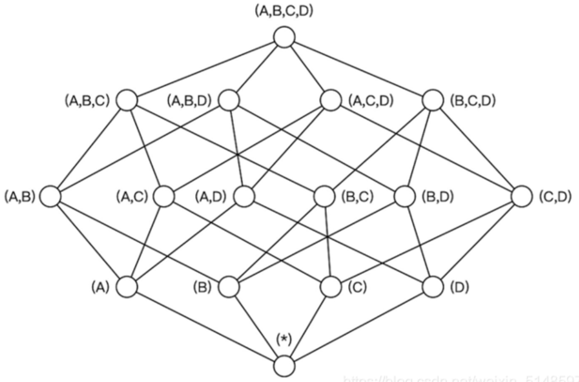
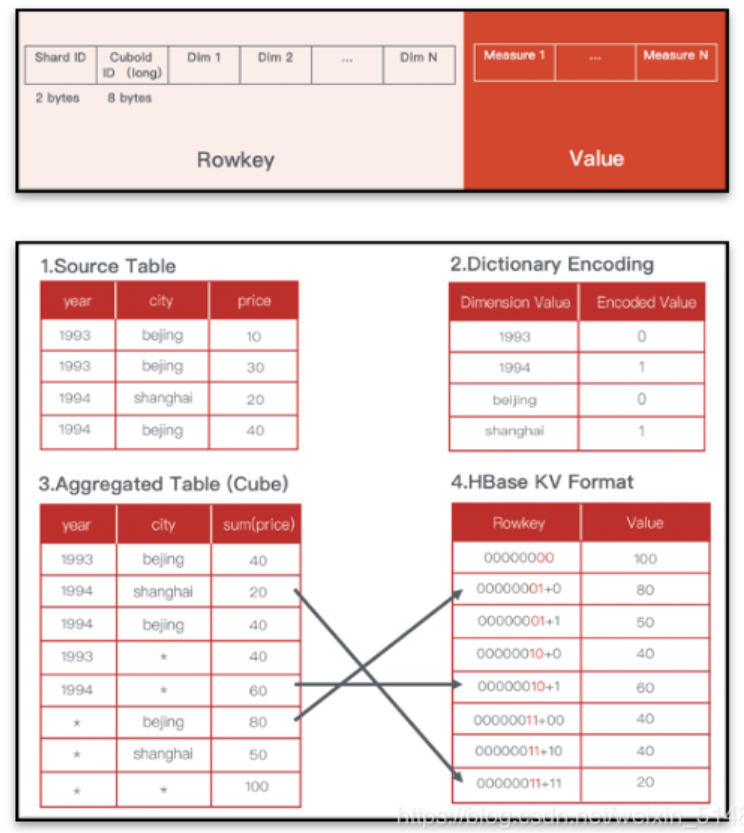
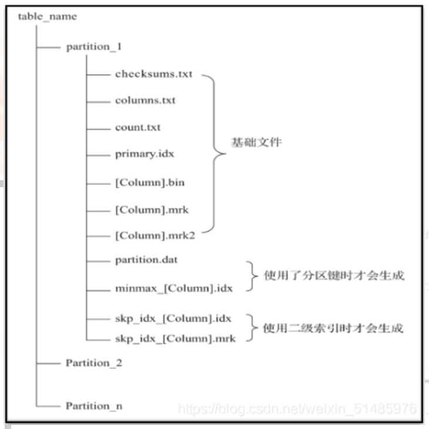
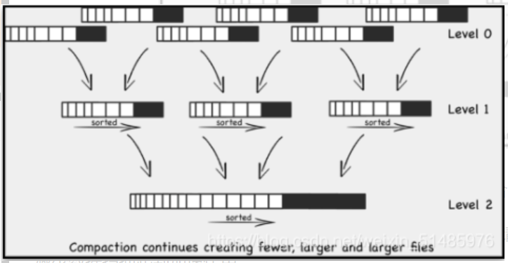
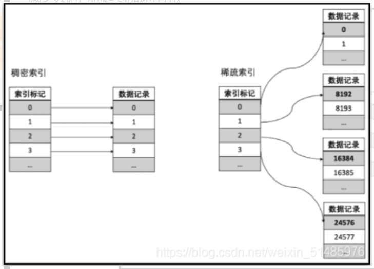
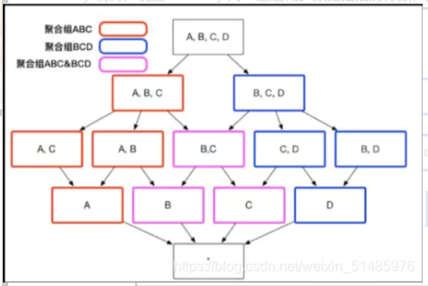
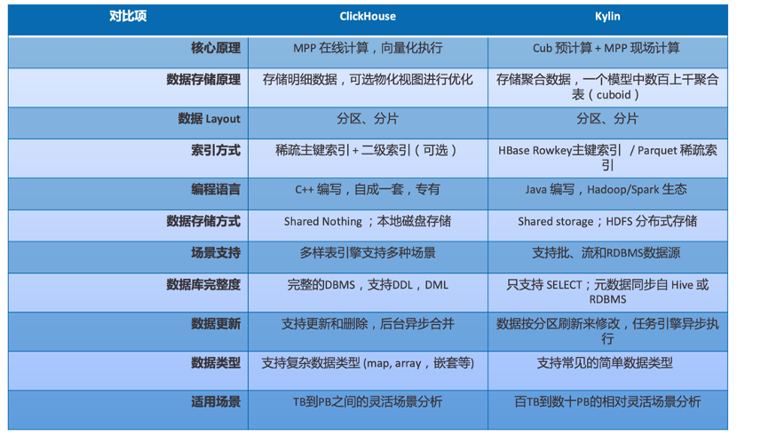

# 浅淡 Apache Kylin 与 ClickHouse 的对比

https://blog.csdn.net/weixin_51485976/article/details/110136882 2020-11-25

---

## 前言
Apache Kylin 和 ClickHouse 都是目前市场流行的大数据 OLAP 引擎；Kylin 最初由 eBay 中国研发中心开发，2014 年开源并贡献给 Apache 软件基金会，凭借着亚秒级查询的能力和超高的并发查询能力，被许多大厂所采用，包括美团，滴滴，携程，贝壳找房，腾讯，58同城等；

OLAP 领域这两年炙手可热的 ClickHouse，由俄罗斯搜索巨头 Yandex 开发，于2016年开源，典型用户包括字节跳动、新浪、腾讯等知名企业。

这两种 OLAP 引擎有什么差异，各自有什么优势，如何选择 ？本文将尝试从技术原理、存储结构、优化方法和优势场景等方面，对比这两种 OLAP 引擎， 为大家的技术选型提供一些参考。

## 1.技术原理
技术原理方面，我们主要从**架构**和**生态**两方面做个比较。
### 1.1 技术架构
**Kylin 是基于 Hadoop 的 MOLAP (Multi-dimensional OLAP) 技术，核心技术是 OLAP Cube**；与传统 MOLAP 技术不同，Kylin 运行在 Hadoop 这个功能强大、扩展性强的平台上，从而可以支持海量 (TB到PB) 的数据；它将预计算（通过 MapReduce 或 Spark 执行）好的多维 Cube 导入到 HBase 这个低延迟的分布式数据库中，从而可以实现亚秒级的查询响应；最近的 Kylin 4 开始使用 **Spark + Parquet** 来替换 HBase，从而进一步简化架构。由于大量的聚合计算在离线任务（Cube 构建）过程中已经完成，所以执行 SQL 查询时，它不需要再访问原始数据，而是直接利用索引结合聚合结果再二次计算，性能比访问原始数据高百倍甚至千倍；由于 CPU 使用率低，它**可以支持较高的并发量**，尤其适合自助分析、固定报表等多用户、交互式分析的场景。 

**ClickHouse 是基于 MPP 架构的分布式 ROLAP （Relational OLAP）分析引擎**，各节点职责对等，各自负责一部分数据的处理（shared nothing），开发了向量化执行引擎，利用日志合并树、稀疏索引与 CPU 的 SIMD（单指令多数据 ，Single Instruction Multiple Data）等特性，充分发挥硬件优势，达到高效计算的目的。因此当 ClickHouse 面对大数据量计算的场景，通常能达到 CPU 性能的极限。

### 1.2 技术生态 

**Kylin 采用 Java 编写，充分融入 Hadoop 生态系统**，使用 HDFS 做分布式存储，计算引擎可选 MapReduce、Spark、Flink；存储引擎可选 HBase、Parquet（结合 Spark)。源数据接入支持 Hive、Kafka、RDBMS 等，多节点协调依赖 Zookeeper；兼容 Hive 元数据，Kylin 只支持 SELECT 查询，schema 的修改等都需要在 Hive 中完成，然后同步到 Kylin；建模等操作通过 Web UI 完成，任务调度通过 Rest API 进行，Web UI 上可以查看任务进度。

**ClickHouse 采用 C++ 编写，自成一套体系**，对第三方工具依赖少。支持较完整的 DDL 和 DML，大部分操作可以通过命令行结合 SQL 就可以完成；分布式集群依赖 Zookeper 管理，单节点不用依赖 Zookeper，大部分配置需要通过修改配置文件完成。

## 2.存储

**Kylin 采用 Hadoop 生态的 HBase 或 Parquet 做存储结构**，依靠 HBase 的 rowkey 索引或 Parquet 的 Row group 稀疏索引来做查询提速，使用 HBase Region Server 或 Spark executor 做分布式并行计算。

**ClickHouse 自己管理数据存储**，它的存储特点包括：MergeTree 作主要的存储结构，数据压缩分块，稀疏索引等。下面将针对两者的引擎做详细对比。

### 2.1 Kylin 的存储结构
Kylin 通过预聚合计算出多维 Cube 数据，查询的时候根据查询条件，动态选择最优的 Cuboid （类似于物化视图），这会极大减小 CPU 计算量和 IO 的读取量。

在 Cube 构建过程中，Kylin 将维度值进行一定的编码压缩如字典编码，力图最小化数据存储；由于 Kylin 的存储引擎和构建引擎都是可插拔式的，对于不同的存储引擎，存储结构也有所差异。

#### 2.1.1 HBase 存储

在使用 HBase 作为存储引擎的情况下，在预计算时会对各个维度进行编码，保证维度值长度固定，并且在生成 hfile 时把计算结果中的维度拼接成 **rowkey**，聚合值作为 **value**。维度的顺序决定 rowkey 的设计，也会直接影响查询的效率。

#### 2.1.2 Parquet 存储引擎

在使用 Parquet 作为存储格式时则会直接存储维度值和聚合值，而不需要进行编码和 rowkey 拼接。在存成 Parquet 之前，计算引擎会根据维度对计算结果进行排序，维度字段越是靠前，那么在其上的过滤效率也就越高。另外在同一个分区下 shard 的数量和 parquet 文件的 row group 数量也同样会影响查询的效率。

### 2.2 ClickHouse 的存储结构

ClickHouse 在创建表结构的时候一般要求用户指定分区列。采用数据压缩和纯粹的列式存储技术， 使用 Mergetree 对每一列单独存储并压缩分块，

同时数据总会以片段的形式写入磁盘，当满足一定条件后 ClickHouse 会通过后台线程定期合并这些数据片段。

当数据量持续增大，ClickHouse，会针对分区目录的数据进行合并，提高数据扫描的效率。

同时 ClickHouse 针对每个数据块，提供稀疏索引。在处理查询请求的时候，就能够利用稀疏索引，减少数据扫描起到加速作用。

## 3.优化策略

Kylin 和 ClickHouse 都是大数据处理系统，当数据量级持续增大的时候，采用合适的优化方法往往能事半功倍，极大地降低查询响应时间，减少存储空间，提升查询性能。由于二者的计算系统和存储系统不同，因此采用的优化方式也不一样，下一小节将着重分析 Kylin 和 ClickHouse 两者的优化方法。

### 3.1 Kylin 的优化方法

Kylin 的核心原理是预计算，正如第一小节技术原理所说：Kylin 的计算引擎用 Apache Spark，MapReduce；存储用 HBase，Parquet；SQL 解析和后计算用 Apache Calcite。**Kylin 的核心技术是研发了一系列的优化方法，来帮助解决维度爆炸和扫描数据过多的问题，**这些方法包括：**设置聚合组，设置联合维度，设置衍生维度，设置维度表快照，设置 Rowkey 顺序，设置 shard by 列**等。

- 设置聚合组：通过聚合组进行剪枝，减少不必要的预计算组合；

- 设置联合维度：将经常成对出现的维度组合放在一起，减少不必要的预计算；

- 设置衍生维度：将能通过其他维度计算出来的维度（例如年，月，日能通过日期计算出来）设置为衍生维度，减少不必要的预计算；

- 设置维度表快照：放入内存现算，减少占用的存储空间；

- 字典编码：减少占用的存储空间；

- RowKey 编码，设置 shard by 列：通过减少数据扫描的行数，加速查询效率

  

### 3.2 ClickHouse 优化方法

MPP 架构的系统最常见的优化方式就是分库分表，类似的，ClickHouse 最常见的优化方式包括设置分区和分片，此外 ClickHouse 也包括一些特有的引擎。总结归纳下来，这些优化方法包括：

1. 用平表结构，代替多表 Join，避免昂贵的 Join 操作和数据混洗
2. 设置合理的分区键，排序键，二级索引，减少数据扫描
3. 搭建 ClickHouse 分布式集群增加分片和副本，添加计算资源
4. 结合物化视图，适当采用 SummingMergetree，AggregateMergetree 等以预计算为核心的引擎

**随着后面性能和并发的要求越来越高，对机器的资源消耗也越来越大。在 [ClickHouse 的官方网站文档](https://clickhouse.com/docs/zh/introduction/performance/)中建议 ClickHouse 的并发数不超过 100，当并发要求高，为减少 ClickHouse 的资源消耗，可以结合 ClickHouse 的一些特殊引擎进行优化。**

特殊引擎中最常用的是 SummingMergetree 和 AggregateMergetree，这两种数据结构是从 Mergetree 中派生而来，本质是通过预计算将需要查询的数据提前算出来，保存在 ClickHouse 中，这样查询的时候就能进一步减少资源消耗。

从使用原理来看 SummingMergetree 和 AggregateMergetree 与 Kylin 的Cube有异曲同工之妙。但是当维度过多的时候，管理很多个物化视图是不现实的做法，存在管理成本高等问题。与 ClickHouse 不同，Kylin 提供一系列简单直接的优化方法，来避免维度爆炸的问题。

可以看到，ClickHouse 和 Kylin 都提供一些方法减少存储占用的空间，降低查询时扫描数据的行数。通常认为：对 ClickHouse 和 Kylin 进行适当优化，都能在大数据量场景下满足业务需求。**ClickHouse 采用 MPP 现算，Kylin 采用预计算，**由于两者采用的技术路线不同因此相应优势场景也不同。

## 4.场景选型优势

Kylin 因为采用预计算技术， 适合有固定模式的聚合查询，例如：SQL 中的 join、group by、where条件模式比较固定等，数据量越大，使用 Kylin 的优势越明显；特别的，**Kylin 在去重（count distinct）、Top N、Percentile 等场景的优势尤为巨大，大量使用在 Dashboard、各类报表、大屏展示、流量统计、用户行为分析等场景**。美团、极光、贝壳找房等使用 Kylin 构建了他们的数据服务平台，每日提供高达数百万到数千万次的查询服务，且大部分查询可以在 2 - 3 秒内完成。**这样的高并发场景几乎没有更好的替代方案。**

**ClickHouse 因为采用 MPP 架构现场计算能力很强，当查询请求比较灵活，或者有明细查询需求，并发量不大的时候比较适用。场景包括：非常多列且 where 条件随意组合的用户标签筛选，并发量不大的复杂即席查询等。如果数据量和访问量较大，需要部署分布式 ClickHouse 集群，这时候对运维的挑战会比较高。**

如果有些查询非常灵活，但不经常查，采用现算就比较节省资源，由于查询量少，即使每个查询消耗计算资源大整体来说也可以是划算的。如果有些查询有固定的模式，查询量较大就更适合 Kylin，因为查询量大，利用大的计算资源将计算结果保存，前期的计算成本能够摊薄每个查询中，因此是最经济的。

## 5.总结
本文就技术原理，存储结构，优化方法及优势场景，对 Kylin 和 ClickHouse 进行了对比。

**技术原理方面：**

- ClickHouse 采用 MPP + Shared nothing 架构，查询比较灵活，安装部署和操作简便，由于数据存储在本地，扩容和运维相对较麻烦；
- Kylin 采用 MOLAP 预计算，基于 Hadoop，计算与存储分离（特别是使用 Parquet 存储后）、Shared storage 的架构，更适合场景相对固定但数据体量很大的场景，基于 Hadoop 便于与现有大数据平台融合，也便于水平伸缩（特别是从 HBase 升级为 Spark + Parquet 后）。

**存储结构方面：**

- ClickHouse 存储明细数据，特点包括MergeTree 存储结构和稀疏索引，在明细之上可以进一步创建聚合表来加速性能；
- Kylin 采用预聚合以及 HBase 或 Parquet 做存储，物化视图对查询透明，聚合查询非常高效但不支持明细查询。

**优化方法方面：**

- ClickHouse 包括分区分片和二级索引等优化手段， 
- Kylin 采用聚合组、联合维度、衍生维度、层级维度，以及 rowkey 排序等优化手段

**优势场景方面：**

- ClickHouse 通常适合几亿~几十亿量级的**灵活查询**（更多量级也支持只是集群运维难度会加大）。

- Kylin 则更适合几十亿~百亿以上的**相对固定**的查询场景。

下图是一个多方面的汇总：

综合下来， Kylin 和 ClickHouse 有各种使用的领域和场景 。现代数据分析领域没有一种能适应所有场景的分析引擎。企业需要根据自己的业务场景，选择合适的工具解决具体问题。希望本文能够帮助企业做出合适的技术选型。
