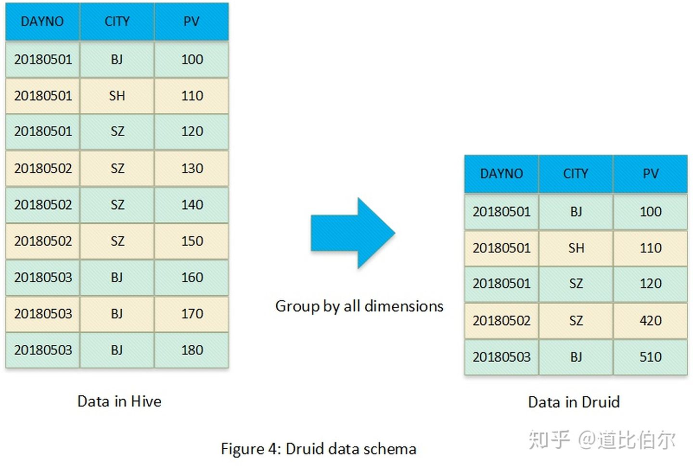
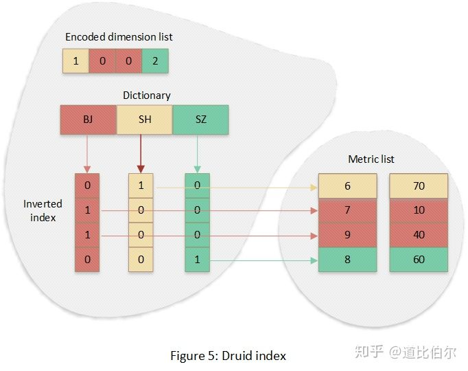
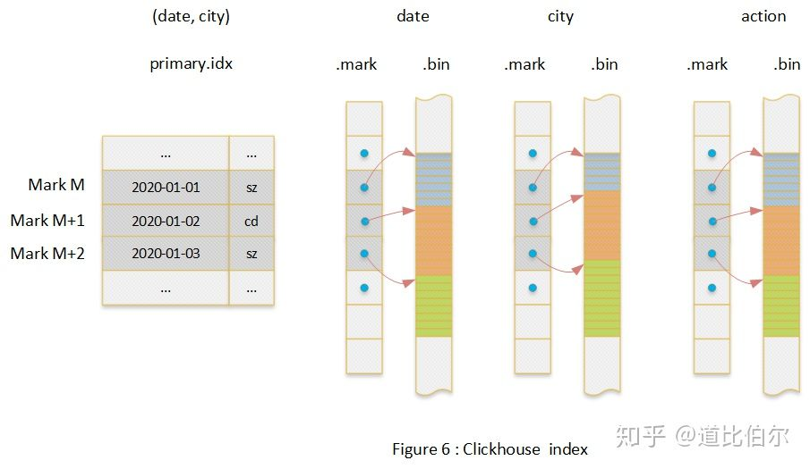
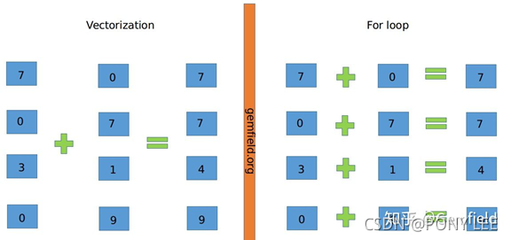

# Kylin、Druid、ClickHouse核心技术对比

https://zhuanlan.zhihu.com/p/267311457 2020-10-21

---

## Kylin的数据模型

Kylin的数据模型本质上是将二维表（Hive表）转换为Cube，然后将Cube存储到HBase表中，也就是**两次转换**。

**第一次转换，**其实就是传统数据库的Cube化，Cube由CuboId组成，下图每个节点都被称为一个CuboId，CuboId表示固定列的数据集合


**第二次转换**，是将Cube中的数据存储到HBase中，转换的时候CuboId和维度信息序列化到rowkey，度量列组成列簇。在转换的时候数据进行了预聚合。下图展示了Cube数据在HBase中的存储方式。


**Kylin的索引结构**

因为Kylin将数据存储到HBase中，所以kylin的数据索引就是HBase的索引。HBase的索引是简化版本的B+树，相比于B+树，HFile没有对数据文件的更新操作。HFile的索引是按照rowkey排序的聚簇索引，索引树一般为二层或者三层，索引节点比MySQL的B+树大，默认是64KB。数据查找的时候通过树形结构定位到节点，节点内部数据是按照rowkey有序的，可以通过二分查找快速定位到目标。


**Kylin小结：**

**适用于聚合查询场景；**因为数据预聚合，Kylin可以说是最快的查询引擎（group-by查询这样的复杂查询，可能只需要扫描1条数据）；kylin查询效率取决于是否命中CuboId，查询波动较大；HBase索引有点类似MySQL中的联合索引，维度在rowkey中的排序和查询维度组合对查询效率影响巨大；所以Kylin建表需要业务专家参与。


## Druid的数据模型

Druid数据模型比较简单，它将数据进行预聚合，只不过预聚合的方式与Kylin不同，kylin是Cube化，Druid的预聚合方式是将所有维度进行Group-by，可以参考下图：



**Druid的索引结构**

Druid索引结构使用自定义的数据结构，整体上它是一种列式存储结构，每个列独立一个逻辑文件（实际上是一个物理文件，在物理文件内部标记了每个列的start和offset）。对于维度列设计了索引，它的索引以Bitmap为核心。下图为“city”列的索引结构：



首先将该列所有的唯一值排序，并生成一个字典，然后对于每个唯一值生成一个Bitmap，Bitmap的长度为数据集的总行数，每个bit代表对应的行的数据是否是该值。Bitmap的下标位置和行号是一一对应的，所以可以定位到度量列，Bitmap可以说是反向索引。同时数据结构中保留了字典编码后的所有列值，其为正向的索引。

**Druid小结：**

**Druid适用于聚合查询场景但是不适合有超高基维度的场景；**存储全维度group-by后的数据，相当于只存储了KYLIN Cube的 Base-CuboID；每个维度都有创建索引，所以每个查询都很快，并且没有类似KYLIN的巨大的查询效率波动。

## ClickHouse的数据模型

**ClickHouse索引结构（只讨论MergeTree引擎）**

因为Clickhouse数据模型就是普通二维表，这里不做介绍，只讨论索引结构。整体上Clickhouse的索引也是列式索引结构，每个列一个文件。Clickhouse索引的大致思路是：

- 首先选取部分列作为索引列，整个数据文件的数据按照索引列排序，这点类似MySQL的联合索引；
- 其次将排序后的数据每隔8192行选取出一行，记录其索引值和序号，**注意这里的序号不是行号，**序号是从零开始并递增的，Clickhouse中序号被称作Mark’s number；
- 然后对于每个列（索引列和非索引列），**记录Mark’s number与对应行的数据的offset**。

下图中以一个二维表（date, city, action）为例介绍了整个索引结构，其中（date,city）是索引列。



该实例中包含了对于列的正反两个方向的查找过程。

反向：查找date=toDate(2020-01-01) and city=’bj’ 数据的行号；

正向：根据行号查找action列的值。

对于反向查找，只有在查找条件匹配最左前缀的时候，才能剪枝掉大量数据，其它时候并不高效。

**Clickhouse小结：**

**MergeTree Family作为主要引擎系列，其中包含适合明细数据的场景和适合聚合数据的场景**；Clickhouse的索引有点类似MySQL的联合索引，当查询前缀元组能命中的时候效率最高，可是一旦不能命中，几乎会扫描整个表，效率波动巨大；所以建表需要业务专家，这一点跟kylin类似。

## 小结：

- **Kylin、Druid只适合聚合场景，ClickHouse适合明细和聚合场景**

- 聚合场景，查询效率排序：Kylin > Druid > ClickHouse

- **Kylin、ClickHouse建表都需要业务专家参与**

- Kylin、ClickHouse查询效率都可能产生巨大差异

- **ClickHouse在向量化方面做得的最好，Druid少量算子支持向量化、Kylin目前还不支持向量化计算。**

---

# 向量化运算

https://blog.csdn.net/weixin_38251332/article/details/120308863  2021-09-15

---

## 向量化运算OLAP
Clickhouse、dorisDB(starrocks)、spark(2.x以后)、 hive（0.13.0以后）、presto

## SIMD
SIMD全称Single Instruction Multiple Data，单指令多数据流，能够复制多个操作数，并把它们打包在大型寄存器的一组指令集。
前提需要支持SIMD的CPU才能发挥其特性。

## 性能上优势
以加法指令为例，单指令单数据（SISD）的CPU对加法指令译码后，执行部件先访问内存，取得第一个操作数；之后再一次访问内存，取得第二个操作数；随后才能进行求和运算。而在SIMD型的CPU中，指令译码后几个执行部件同时访问内存，一次性获得所有操作数进行运算。这个特点使SIMD特别适合于多媒体应用等数据密集型运算。

> 注： 上面的内存指的是CPU寄存器

## 什么是vectorization
向量化计算(vectorization)，向量化计算是一种特殊的并行计算的方式，它可以在同一时间执行多次操作，通常是对不同的数据执行同样的一个或一批指令，或者说把指令应用于一个数组/向量



上图中，左侧为vectorization，右侧为寻常的For loop计算。将多次for循环计算变成一次计算完全仰仗于CPU的SIMD指令集，SIMD指令可以在一条cpu指令上处理2、4、8或者更多份的数据。

因此简单来说，向量化计算就是将一个loop处理一个array的时候每次处理1个数据共处理N次，转化为vectorization处理一个array的时候每次同时处理8个数据共处理N/8次。

## 向量化运算的实例
 在Python的numpy库中使用向量化(Vectorization)计算，速度是非向量化(non-Vectorization)计算（即循环）的700倍（当前开发环境），因为向量化计算使用了python的内建函数，调用了CPU/GPU的SIMD指令集进行计算，大大减少了因为python高级语言执行损耗的时间。

实例:

```python
import numpy as np
import time

cnt=10000000
a = np.random.rand(cnt)
b = np.random.rand(cnt)

tic = time.time()
c = np.dot(a, b)
toc = time.time()
print("c: %f" % c)
print("vectorized version:" + str(1000*(toc-tic)) + "ms")

c = 0
tic = time.time()
for i in range(cnt):
    c += a[i] * b[i]
toc = time.time()
print("c: %f" % c)
print("for loop:" + str(1000*(toc-tic)) + "ms")
```

结果:

```properties
c: 2499089.213332
vectorized version:5.998373031616211ms
c: 2499089.213332
for loop:4685.6348514556885ms
```

