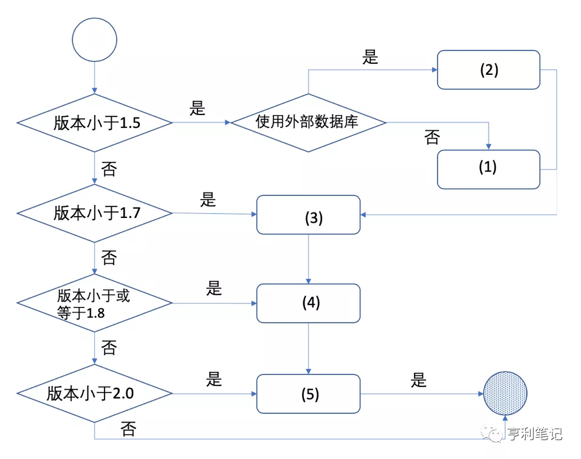

# 生产系统中升级 Harbor 的完整流程 

https://mp.weixin.qq.com/s/dVCxvJRmOs47y0QaxkcGzQ   邓谦 [亨利笔记](javascript:void(0);) *2020-11-09*

软件的版本升级很容易因为操作不当而出错，造成数据丢失或者无法启动这类严重问题，对生产系统中软件的升级应该慎重。除了做好数据备份和恢复预案外，还需要在测试环境中模拟升级验证以及安排停止服务的时间。

本文会从 Harbor 版本升级方案的设计思路、实现细节及历史背景等方面解析版本升级的原理。升级一般分为两个阶段，现有 Harbor 实例的数据迁移和 Harbor 软件升级。

## 数据迁移

在升级 Harbor 版本之前，我们首先需要对现有的数据进行迁移，以适配新的版本。需要迁移的数据有两类：数据库模式（schema）和配置文件数据。

- **数据库模式**，也就是数据库中表的结构，每次新版本发布时新的功能及对老功能、代码的重构都会导致数据库模型的变更，因此几乎每次升级都需要升级数据库模式。
- **配置文件数据**，是指 Harbor 组件的配置文件，在部分新功能或者新的组件出现时，都需要在配置文件中新增其参数；在老功能、组件重构或者废弃时，也会对配置文件进行更新。

如果升级时不做数据迁移，则会导致数据与新版本不兼容而引发问题。而数据迁移是一个高风险操作，操作中出现问题会造成数据丢失等严重后果，所以一定要先进行数据备份，主要就是数据库的数据导出备份。

接下来介绍何进行数据迁移。Harbor 2.0 版本后升级方式较为固定，所以这里以Harbor 2.0 作为我们的例子。

### Harbor 1.9/1.10升级到 2.0 

- 首先是数据库迁移，其实每次启动 Harbor 实例时，它的数据库模式都是**自动升级**的，其原理为：Harbor 在每次启动时都会调用第三方库 **“golang-migrate”**，它会检测当前数据库模式的版本，如果实例的版本比当前数据库的版本更高，则会自动升级。

- 然后是配置的升级，因为数据库升级是自动完成，也就是说，用户其实只需操作配置文件的迁移即可。这里需要用户手动执行升级配置文件的命令行工具包。此工具包与 Harbor 一同发布，被包含在 **“goharbor/prepare:v2.0.0”** 镜像中。用户可以在 Harbor 的离线安装包中找到它，也可以在 Docker Hub 上获取，命令如下：

  ```bash
  $ docker pull goharbor/prepare:v2.0.0
  ```

- 由于 Harbor 2.0 中只支持以 1.9.x 或 1.10.x 两个版本为起点的升级迁移，所以需要先升级到这两个版本，然后再运行以下命令进行配置文件迁移：

```bash
$ docker run -v /:/hostfs goharbor/prepare:v2.0.0 migrate --input /home/dengq/upgrade/harbor-19.yml --output /home/dengq/upgrade/harbor-20.yml --target 2.0.0
```

其中，**“-v /:/hostfs”** 是将主机的根目录 “/”  挂载到容器中的“/hostfs”目录。因为命令是运行在容器中的，而文件是在宿主机上的，为了能在容器中访问到指定的文件，需要这样挂载，之后 prepare 会对 “/hostfs” 这个文件做特殊处理，使得在容器里也能访问主机上的指定文件。

migrate 命令有如下3个参数。

- **--input（缩写形式为“-i”）**：是输入文件的**绝对路径**，也就是需要升级的原配置文件。
- **--output（缩写形式为“-o”）**：是输出文件的**绝对路径**，也是升级后的配置文件，是可选参数，如果取默认值，则升级后的文件会被写回输入文件中。
- **--target（缩写形式为“-t”）**：是目标版本，也就是打算升级到的版本，也是可选参数，如果取默认值，则版本为此工具发布时所支持的最新版本。

所以以上命令是将 Harbor 1.9 的配置文件 “/home/harbor/upgrade/harbor-19.yml” 升级到 Harbor 2.0 版本，并且保存到 “/home/harbor/upgrade/harbor-20.yml” 目录下。若使用缩写和默认的参数，则命令可以简化如下：

```bash
$ docker run -v /:/hostfs goharbor/prepare:v2.0.0 migrate -i /home/harbor/upgrade/harbor.yml
```

如果数据迁移成功，则运行的结果如下：

```properties
migrating to version 1.10.0
migrating to version 2.0.0
Written new values to /home/harbor/upgrade/harbor.yml
```

以上为 Harbor 从 1.9 和 1.10 升级到 2.0 的方法。

而更早的版本则需要先升级到 1.9 或者 1.10 版本，然后才能正常升级到 2.0。这是因为 Harbor 只对往上的两个版本提供支持，再往前的版本虽然官方团队则不再维护但有可能仍能使用。不过由于 2.0 版本比较特殊，引入了大量新功能，更早的版本直接升级会有兼容性问题，所以升级工具会直接让升级失败。

---

### Harbor 1.7/1.8 升级到 1.9/1.10

下面将介绍 2.0 之前的版本要如何升级，因其版本迭代经历了的数据库、配置文件格式、迁移工具等多次变更，所以升级方式略微复杂。


如图所示 1.5、1.7、1.8、2.0 这几个版本引入的变化都会影响数据迁移的方式：

- **1.5：**此版本之前 Harbor 使用 MySQL 作为底层数据库，而之后切换为 PostgreSQL。
  - 如果用户使用的是 Harbor 内部的数据库组件，Harbor 的数据迁移工具就会**自动**处理数据库的升级和变更；
  - 但是如果使用了外部的 MySQL 服务作为数据库，则用户需要自己**手动**迁移数据。
- **1.7：**在此版本之前，Harbor 使用 Python 的 Alembic 库作为数据库迁移工具，之后切换为 **golang-migrate**。所以，
  - 之前的版本需要先使用Harbor迁移工具进行数据迁移；
  - 在之后的版本中，用户**只需迁移配置数据**，不再需要手动操作数据库，因为数据库的数据迁移会在实例启动时自动完成。
- **1.8：**在这个版本中配置文件的格式发生了改变，之前使用的是微软的INI配置文件格式，而之后变更为更现代的 yaml 格式。由于**之前的配置文件迁移都是在原文件上修改的，**但是在 1.8 版本里面输入文件和输出文件的格式不相同，用同样的名字会引起误会，所以**在此版本中的配置文件数据迁移需要同时指定输入文件名与输出文件名。**
- **2.0:**  在此版本中，Harbor 进行了重大升级与重构**，只支持1.9.x与1.10.x版本的升级**，
  - 而 Harbor 的迁移工具的大量的工作都是针对 Harbor 1.9 之前的版本。另外， Harbor 1.9 之前的版本的迁移工具是由 Python 2.7 实现，而 Python 2.7 在 2020 年也停止支持了，所以在Harbor 1.9 之前的版本中迁移工具被 Harbor 废弃，而将其**1.9和1.10版本向后数据迁移功能移至了 Harbor 的 prepare 工具包中**。
  - 所以此版本开始 Harbor 的升级工具发生了改变。如果在此版本之前的 Harbor 想要升级到最新版本，需要先将数据要迁移到此版本需要先升级到 1.9 或者 1.10 版本。


了解这些背景知识后，则想要得到一个稳妥的升级路径可参考下图：



图中的数字序号对应的的升级操作命令如下。

**（1）数据升级到 1.6：**

```bash
$ docker run -it --rm -e DB_USR=root -e DB_PWD=${数据库密码} -v ${数据库文件夹路径}:/var/lib/mysql -v ${配置文件地址}:/harbor-migration/harbor-cfg/harbor.cfg goharbor/harbor-migrator:1.6 up

$ docker run -it --rm -e DB_USR=root -v ${notary数据库路径} /:/var/lib/mysql -v ${harbor数据库路径}:/var/lib/postgresql/data goharbor/harbor-migrator:1.6 --db up

$ docker run -it --rm -v ${clair数据库路径}:/clair-db -v ${harbor数据库路径}:/var/lib/postgresql/data goharbor/harbor-migrator:1.6 --db up
```

**（2）参考 Harbor 的实现，进行外部数据库升级与迁移。**

**（3）配置文件升级到 1.8：**

```bash
$ docker run -it --rm -v ${harbor.cfg路径}:/harbor-migration/harbor-cfg/harbor.cfg -v ${harbor.yml路径}:/harbor-migration/harbor-cfg-out/harbor.yml goharbor/harbor-migrator:1.8 --cfg up
```

**（4）配置文件升级到 1.10：**

```bash
$ docker run -it --rm -v ${harbor.yml路径}:/harbor-migration/harbor-cfg/harbor.yml goharbor/harbor-migrator:1.10 --cfg up
```

**（5）配置文件升级到 2.0：**

```bash
$ docker run -v /:/hostfs goharbor/prepare:v2.0.0 migrate -i ${harbor.yml路径}
```
## Harbor软件的升级

已有数据迁移完毕后，升级 Harbor 软件就十分简单了，步骤如下：

**（1）如果 Harbor 还在运行，则需先将其停止：**

```bash
$ cd harbor
$ docker-compose down
```

**（2）备份当前 Harbor 文件夹（可选）：**

```bash
$ mv harbor /my_backup_dir/harbor
```

**（3）备份数据：**

```bash
$ cp -r /data/database /my_backup_dir/
```

**（4）从 https://github.com/goharbor/harbor/releases 获取最新版本的 Harbor**

**（5）数据迁移（若当前Harbor版本小于1.9，则请参考前文中数据迁移的内容）**

```bash
$ docker run -v /:/hostfs goharbor/prepare:v2.0.0 migrate -i ${harbor.yml路径}
```

**（6）使用新的配置文件安装Harbor：**

```bash
$ cd ${新版本Harbor解压的文件夹}
$ ./install
```

稍等片刻，新版本的 Harbor 就会启动了。

有人可能会疑问，Harbor的小版本升级（如从1.9.1升级至1.9.2 ）并没有在文中提到，对这种情况应该如何处理。其实Harbor的升级遵循一个约定：**小版本的升级不会涉及配置文件和数据库的修改，所以对此种情况就不需要考虑了。**

---

## harbor1.10 部署及升级

https://www.jianshu.com/p/a3c564958bb7  2021.06.24

>  不能大于 2 minor version.  建议版本更新路径 1.10 -> 2.0 -> 2.2 -> 2.3 -> 2.4

1. 备份原安装路径，原数据路径
    mv /data/harbor /data/harbor_bak
2. 下载新版本harbor镜像离线包， 解压镜像
    wget https://github.com/goharbor/harbor/releases/download/v2.3.0/harbor-offline-installer-v2.3.0.tgz
3. copy 原来目录下配置文件、ssl、data数据至当前目录

官方链接：https://goharbor.io/docs/2.2.0/administration/upgrade/

