# 从docker单机到swarm模式的网络变化

https://blog.csdn.net/michaelwoshi/article/details/106062449

## 一、单机网络

```bash
yum  -y install docker 
ip addr list
```

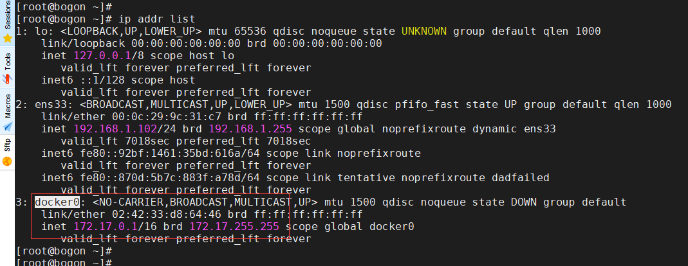


```bash
docker network ls
```
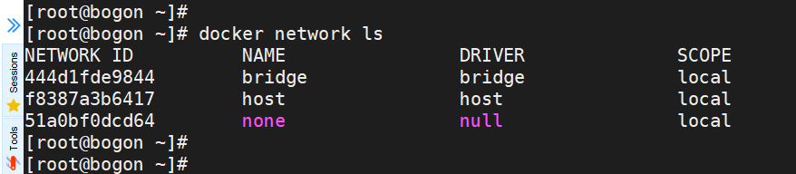

同一个主机不同容器之间，容器和外部网络之间的通讯，用到docker0网桥。

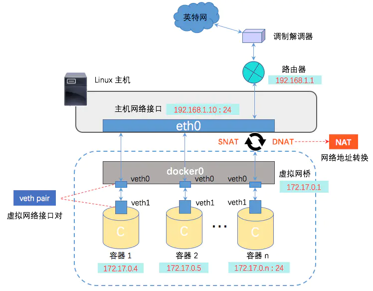

## 二、swarm网络
```bash
docker swarm init --listen-addr 192.168.1.101:2377 --advertise-addr 192.168.1.101 --data-path-addr ens33 
docker swarm join --token SWMTKN-1-56zwr72vftfe03qdl1rvzfy1culzyqlnby8syvi2g6yz7xdx72-biqkbvsyklh15jgp8ma46465p 192.168.1.101:2377
ip addr list
```

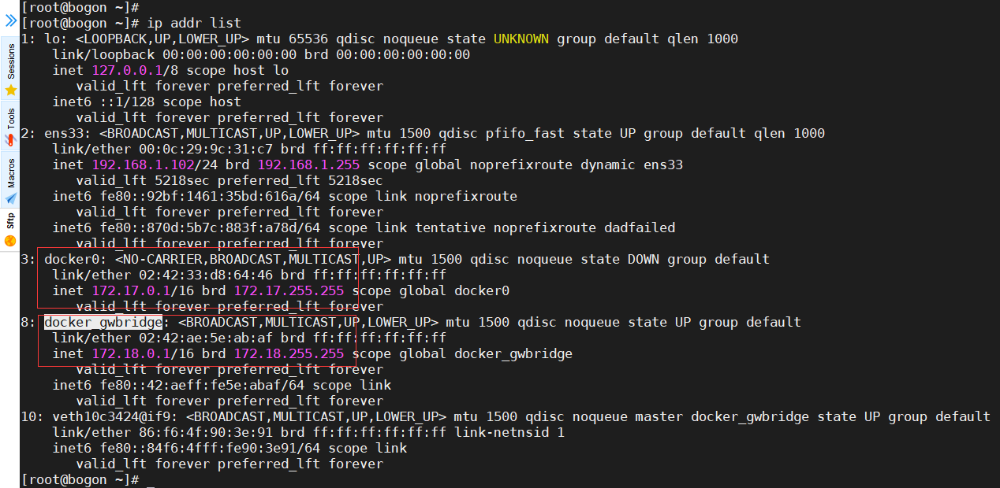

```bash
docker network ls
```

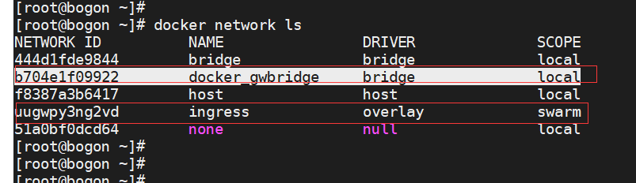

```bash
docker network inspect docker_gwbridge
```

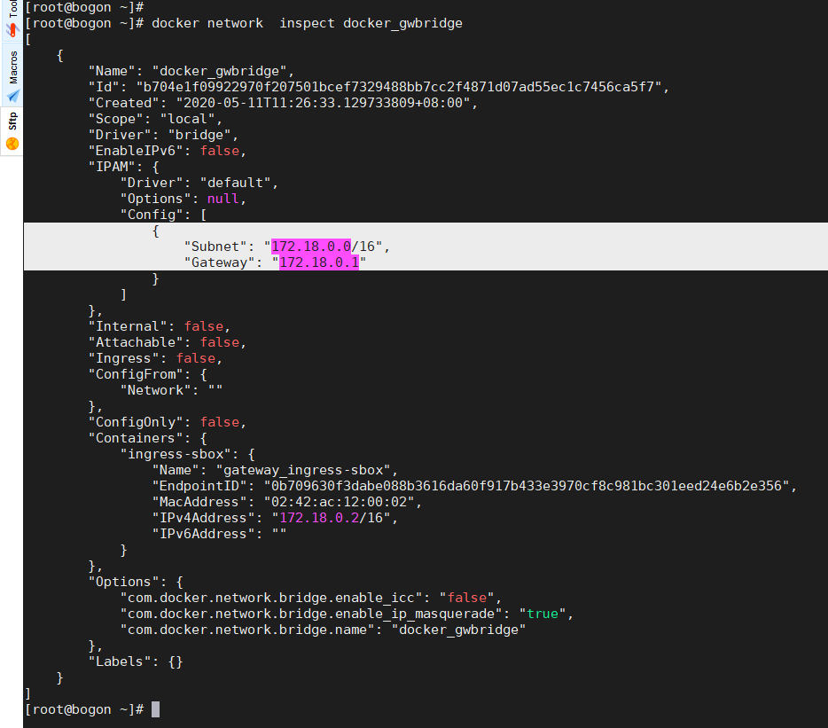

```bash
docker network inspect ingress
```

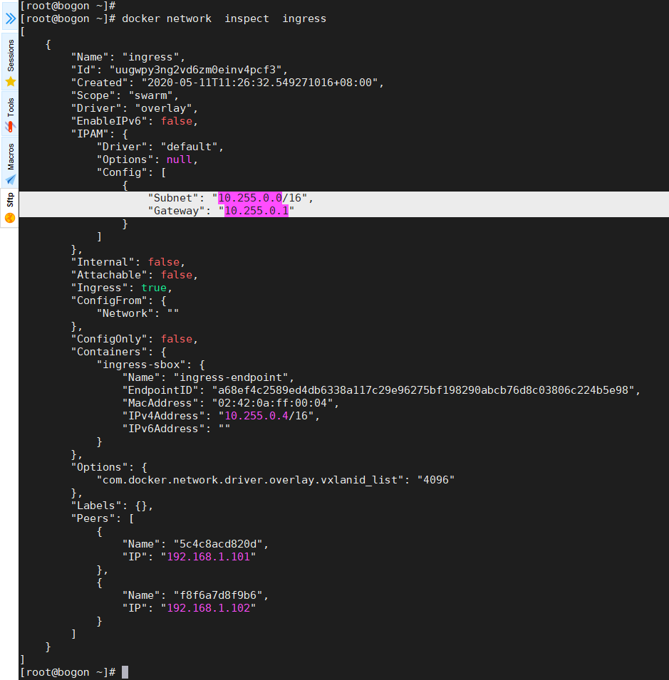


## 三、服务部署后的网络


【ELK】用docker swarm部署ELK日志系统

https://www.jianshu.com/p/ff4811c79985

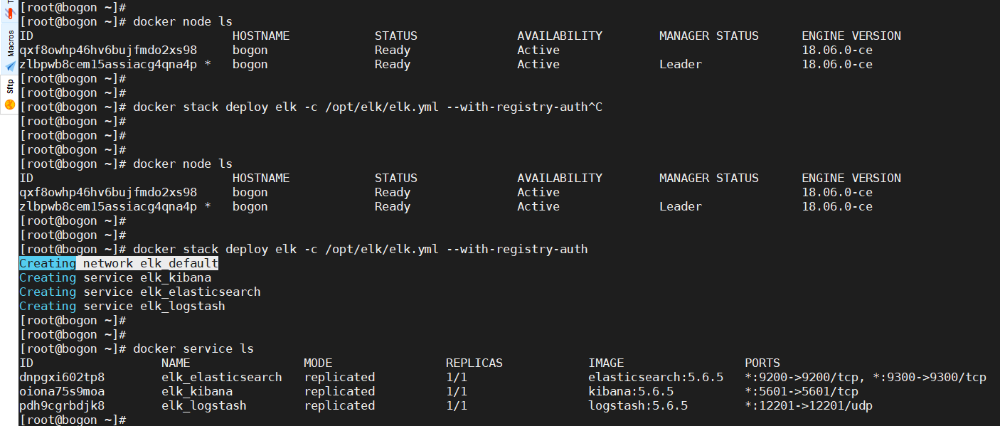

```bash
docker network ls
```

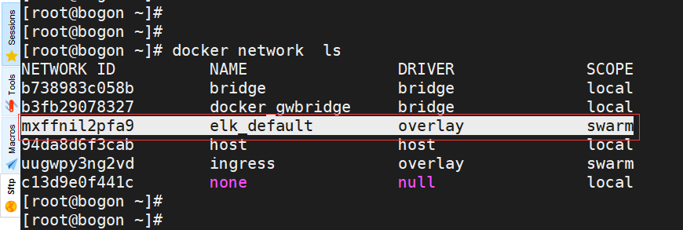


docker network inspect elk_default

 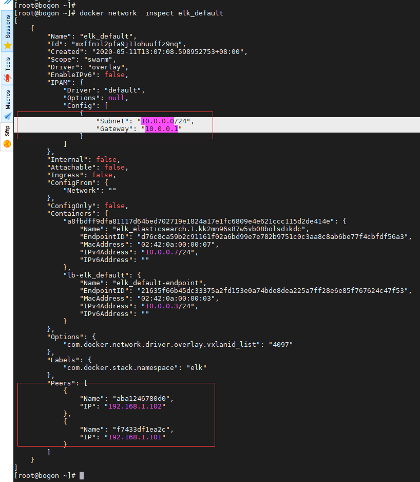

```bash
docker ps
docker exec -it a8fbdff9dfa8 ip addr list
```

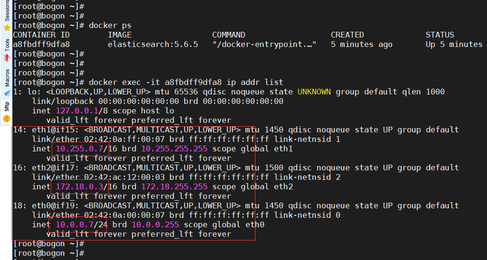

```bash
docker ps -a
docker exec -it 85c06cfadd48 ip addr list
docker exec -it 39db36c87b58 ip addr list
```

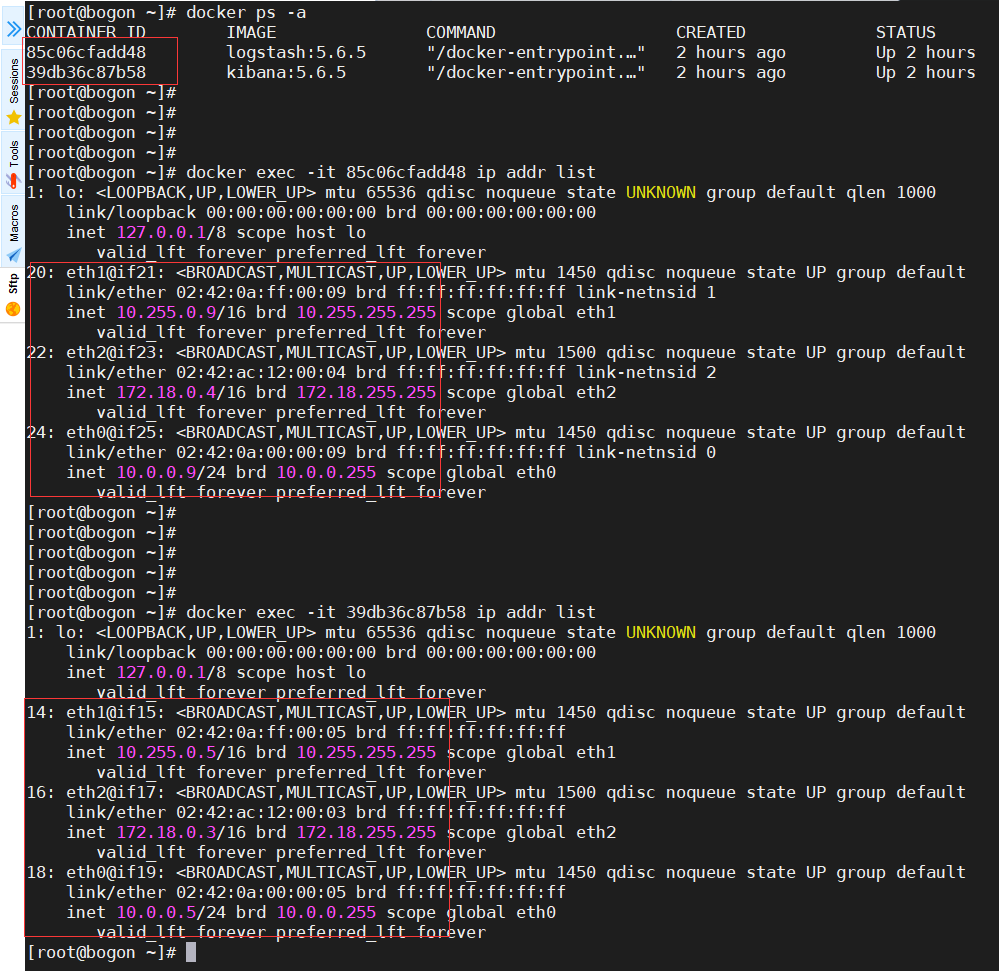

可以看出，集群中每个容器的网络：

关联各自的docker_gwbridge

关联集群中同一个ingress

关联到集群中同一个elk_default

 docker network ls --no-trunc

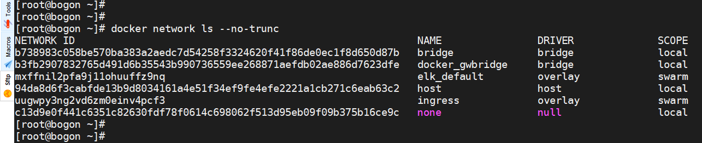

 

我们捋一下各网络的默认子网：

 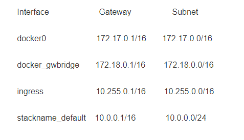


从上我们可以看出：

1. docker swarm 模式，集群容器之间的通讯，没有docker0网桥的参与了，取而代之的是docker_gwbridge网桥。

2. 集群中每1个容器的网络关联到同一个ingress和同一个stackname_default，在两个子网下，集群中的每个容器具体唯一的子网IP。

3. 集群中每个容器的网络关联到各自的docker_gwbridge，不同节点上容器的这个子网IP可以相同。

 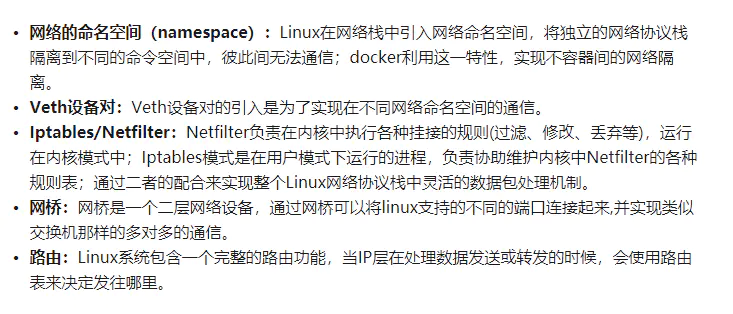


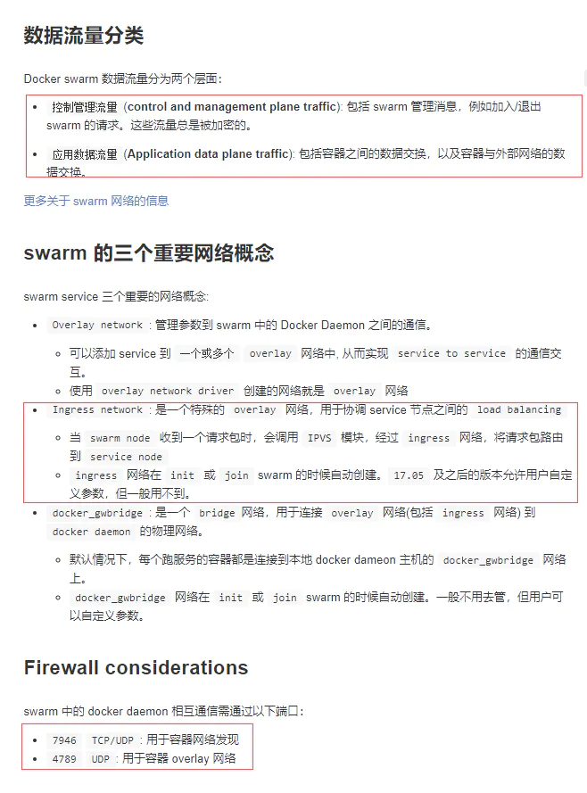

 


ingress network是一个特殊的overlay网络，便于服务的节点直接负载均衡。

当任何swarm节点在发布的端口上接受到请求时，它将该请求转发给调用的IPVS模块，IPVS跟踪参与该服务的所有容器的IP地址，并选择其中一个，通过ingress network将请求路由给它。

 

Swarm mode下，docker会创建一个默认的overlay网络—ingress network。

Docker也会为每个worker节点创建一个特殊的net namespace（sandbox）-- ingress_sbox。

ingress_sbox有两个endpoint，一个用于连接ingress network，另一个用于连接local bridge network docker_gwbridge。

Ingress network的IP空间为10.255.0.0/16，所有router mesh的service都共用此空间。

 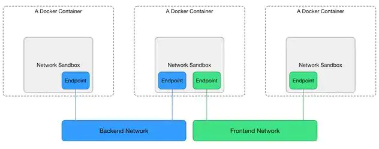

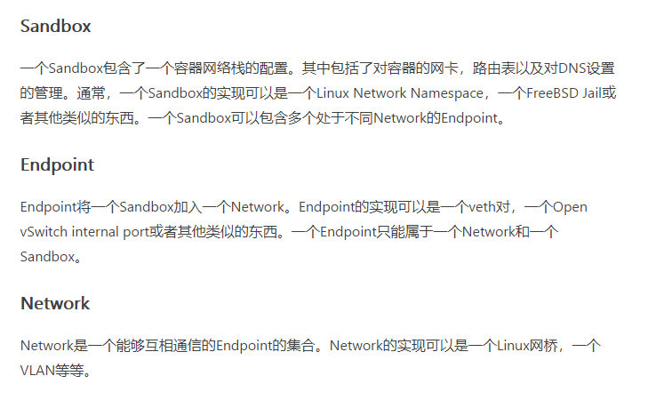

一般情况下我们在swarm中部署service后容器前的网络只有一张网卡使用的是docker0网络。

当我们将服务发布出去后，swarm会做如下操作：

1. **给容器添加三块网卡eth0和eth1，eth2：**

eth0连接overlay类型网络名为ingress用于在不同主机间通信

eth2连接bridge类网络名为docker_gwbridge，用于让容器能访问外网

eth1连接到我们自己创建的stackname_default网络上，同样的作用也是用于容器之间的访问(区别于eth2网络存在dns解析即服务发现功能)

2. **swarm各节点会利用ingress overlay网络负载均衡将服务发布到集群之外。**


## 四、查看网桥

yum -y install bridge-utils
brctl --help

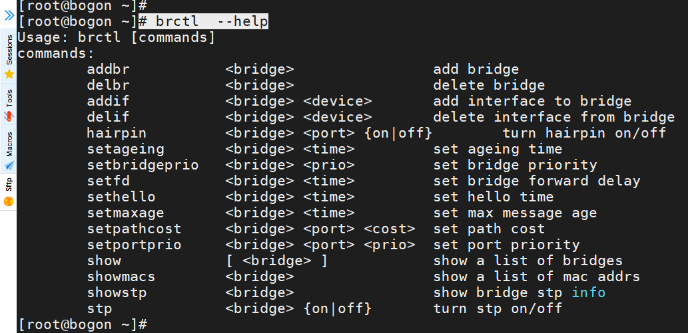

brctl show

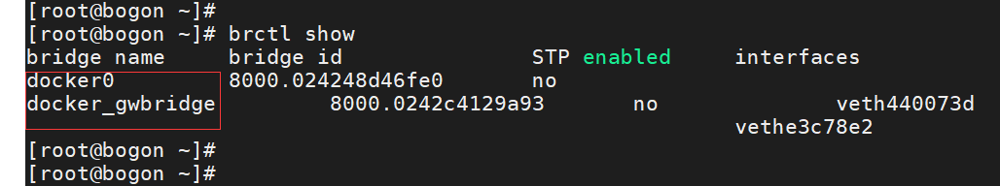

 

## 五、参考

- [docker单机、docker swarm 网络](https://www.jianshu.com/p/c76ecaa08a79)
- [How to delete bridge on Linux？](https://unix.stackexchange.com/questions/62751/cannot-delete-bridge-bridge-br0-is-still-up-cant-delete-it)
- [Manage swarm service networks](https://octowhale.gitbooks.io/docker-doc-cn/engine/swarm/networking)