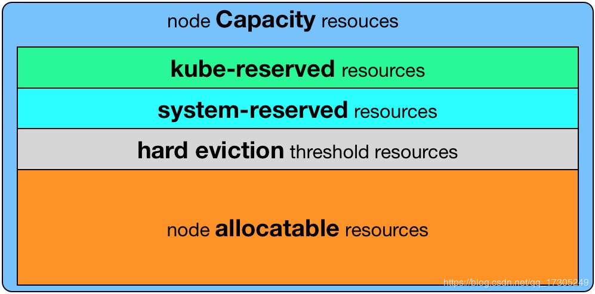
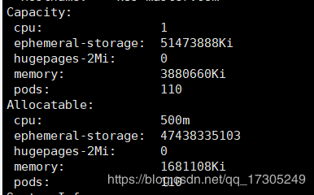
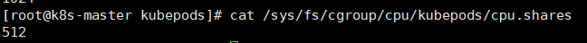
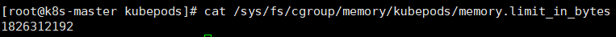
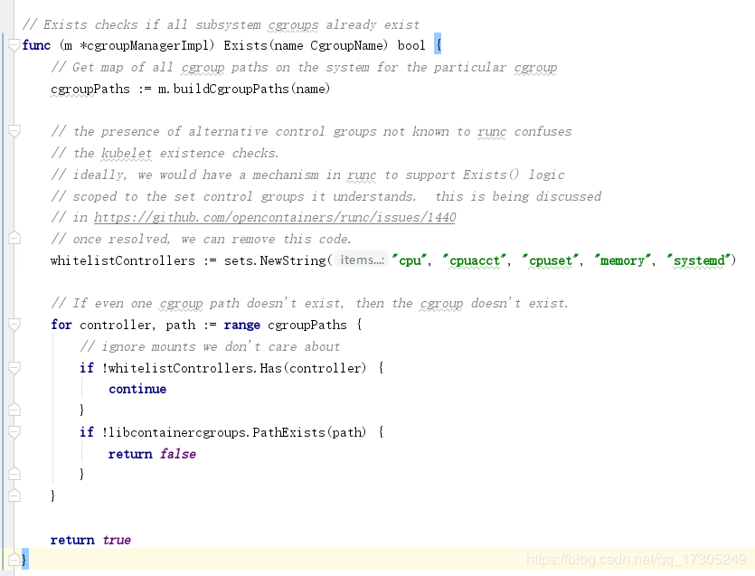
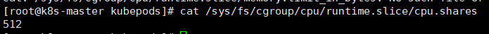
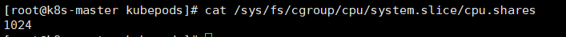
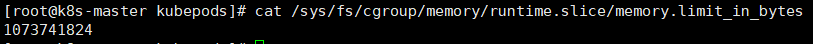
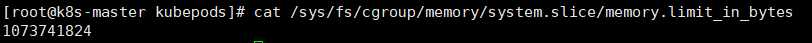

# [K8S实现资源预留分析](https://blog.csdn.net/qq_17305249/article/details/105469790)

### 文章目录

- - [一、kubernetes中关于资源的计算方式](https://blog.csdn.net/qq_17305249/article/details/105469790#kubernetes_1)
  - [二、kubernetes中关于资源预留的配置方式](https://blog.csdn.net/qq_17305249/article/details/105469790#kubernetes_10)
  - [三、资源预留的底层实现](https://blog.csdn.net/qq_17305249/article/details/105469790#_37)
  - [四、官方建议cgroup设置](https://blog.csdn.net/qq_17305249/article/details/105469790#cgroup_87)


## 一、kubernetes中关于资源的计算方式


Kubernetes中通过节点用allocatableKubelet Node Allocatable用来为Kube组件和System进程预留资源，从而保证当节点出现满负荷时也能保证Kube和System进程有足够的资源。


> 节点可为pod分配的资源计算方法：
> Node Allocatable Resource = Node Capacity（资源总大小） - Kube-reserved（kubz组件保留资源） - system-reserved（系统保留资源） - eviction-threshold（用户设置的驱逐阈值）

无论Pod怎么消耗资源，都不会超过分配的Node Allocatable Resource，一旦超过，Pod就会触发驱逐策略。

## 二、kubernetes中关于资源预留的配置方式

在kubelet的启动参数中，可配置kubernetes的资源预留相关参数：

- –enforce-node-allocatable，默认为pods，要为kube组件和System进程预留资源，则需要设置为pods,kube-reserved,system-reserve。
- –cgroups-per-qos，Enabling QoS and Pod level cgroups，默认开启。开启后，kubelet会将管理所有workload Pods的cgroups。
- –cgroup-driver，默认为cgroupfs，另一可选项为systemd。取决于容器运行时使用的cgroup driver，kubelet与其保持一致。比如你配置docker使用systemd cgroup driver，那么kubelet也需要配置–cgroup-driver=systemd，否则kubelet启动会报错。
- –kube-reserved,用于配置为kube组件（kubelet,kube-proxy,dockerd等）预留的资源量，比如—kube-reserved=cpu=1000m,memory=8Gi，ephemeral-storage=16Gi。
- –kube-reserved-cgroup，如果你设置了–kube-reserved，那么请一定要设置对应的cgroup，并且该cgroup目录要事先创建好（/sys/fs/cgroup/{subsystem}/kubelet.slice），否则kubelet将不会自动创建导致kubelet启动失败。比如设置为kube-reserved-cgroup=/kubelet.slice ，需要在每个subsystem的根目录下创建kubelet.slice目录。
- –system-reserved，用于配置为System进程预留的资源量，比如—system-reserved=cpu=500m,memory=4Gi,ephemeral-storage=4Gi。
- –system-reserved-cgroup，如果你设置了–system-reserved，那么请一定要设置对应的cgroup，并且该cgroup目录要事先创建好（/sys/fs/cgroup/{subsystem}/system.slice），否则kubelet将不会自动创建导致kubelet启动失败。比如设置为system-reserved-cgroup=/system.slice，需要在每个subsystem的根目录下创建system.slice目录。
- –eviction-hard，用来配置kubelet的hard eviction条件，只支持memory和ephemeral-storage两种不可压缩资源。当出现MemoryPressure时，Scheduler不会调度新的Best-Effort QoS Pods到此节点。当出现DiskPressure时，Scheduler不会调度任何新Pods到此节点。

下面举例说明：

- kubelet启动参数：

```powershell
--enforce-node-allocatable=pods,kube-reserved,system-reserved
--kube-reserved-cgroup=/kubelet.slice
--system-reserved-cgroup=/system.slice
--kube-reserved=cpu=500m,memory=1Gi
--system-reserved=cpu=500m,memory=1Gi
--eviction-hard=memory.available<500Mi,nodefs.available<10%
1234567
```

4核32G的节点，计算可分配资源：
NodeAllocatable = NodeCapacity - Kube-reserved - system-reserved - eviction-threshold
可分配cpu = 4 - 0.5 - 0.5 = 3
可分配memory = 32 - 1 - 1 - 0.5 = 29.5Gi

## 三、资源预留的底层实现

kubernetes的资源预留和docker类似，底层都是通过Cgroup机制实现的，当设置–kube-reserved和–system-reserved启动参数时，kubelet会计算可分配给Pod的最大资源数，也就是NodeAllocatable，然后在节点系统中创建对应的Cgroup规则。
比如我在kubelet启动配置中设置了kubeReserved和systemReserved的大小：

```powershell
kubeReserved:
 memory: 1Gi
 cpu: 500m
systemReserved:
 memory: 1Gi
12345
```

kubelet启动后，会在kubepods的Cgroups中创建资源限额（1核4G的机器）:

cpu：512 = 500 * 1024/1000

内存：1826312192 = 3880660 * 1024 - 2048 * 1024 * 1024

这样虽然实现了对pod资源的限制，不会因为pod占用资源过大导致系统和kube组件无法正常运行，但是却没有真正实现所谓的kubeReserved和systemReserved（kube组件和系统所使用的资源不受限制，可能会影响节点的pod正常运行）。
因此，要想真正实现kubeReserved和systemReserved，需要加上–kube-reserved-cgroup和–system-reserved-cgroup参数，为kube组件和系统创建对应的cgroup。
我在kubelet启动配置中加上了kubeReservedCgroup、systemReservedCgroup和enforceNodeAllocatable参数：

```powershell
enforceNodeAllocatable:
- "pods"
- "kube-reserved"
- "system-reserved"
kubeReservedCgroup: /runtime.slice
systemReservedCgroup: /system.slice
kubereserved:
 memory: 1Gi
 cpu: 500m
systemReserved:
 memory: 1Gi
1234567891011
```

> 注意：
> 关于systemReservedCgroup 的 system.slice，/sys/fs/cgroup/cpuset/和/sys/fs/cgroup/hugetlb/下默认没有system.slice目录，需要自己手动创建目录。
> 而kubeReservedCgroup 的 runtime.slice 在 /sys/fs/cgroup/中所有的资源（cpu、memory等）下都没有创建，需要手动创建目录。
> 不执行这两步会创建cgroup失败

kubelet检查cgroup是否创建的源码逻辑（pkg/kubelet/cm/cgroup_manager_linux.go）：
kubelet启动后，会在/runtime.slice和/system.slice的Cgroups中创建资源限额（1核4G的机器）:

kube组件保留cpu权重：

system保留cpu权重：
kube组件保留内存：

system保留内存：


## 四、官方建议cgroup设置

参考：<https://github.com/kubernetes/community/blob/master/contributors/design-proposals/node/node-allocatable.md#recommended-cgroups-setup>

建议用户在执行SystemReserved时要格外小心，因为这可能导致关键服务在节点上出现CPU不足或OOM被杀死的情况，建议仅在用户详尽地剖析其节点以得出**精确估计**时强制实施SystemReserved。
因此，**生产上我们一般不建议配置systemReservedCgroup，避免出现系统OOM的风险。**