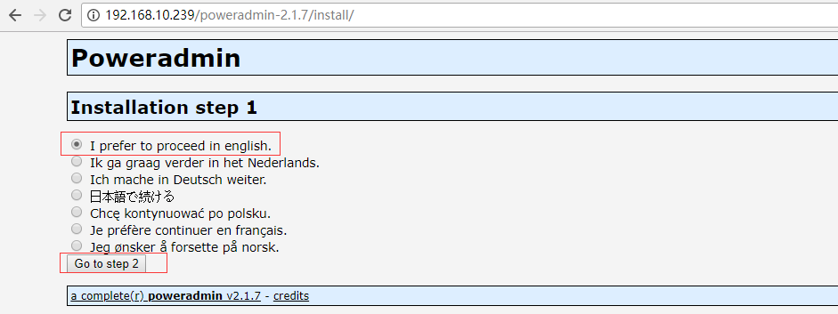
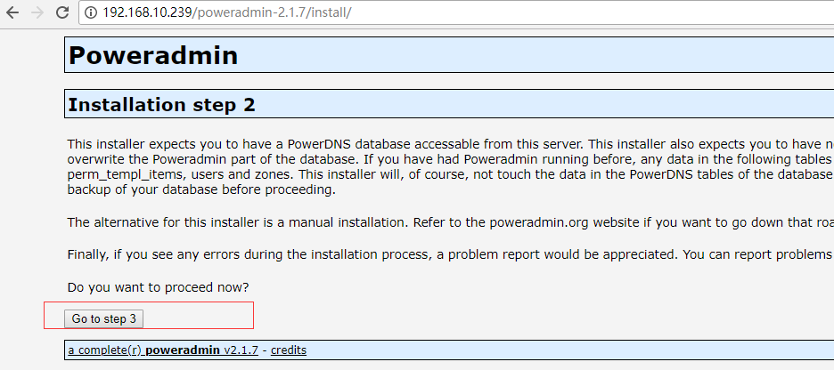
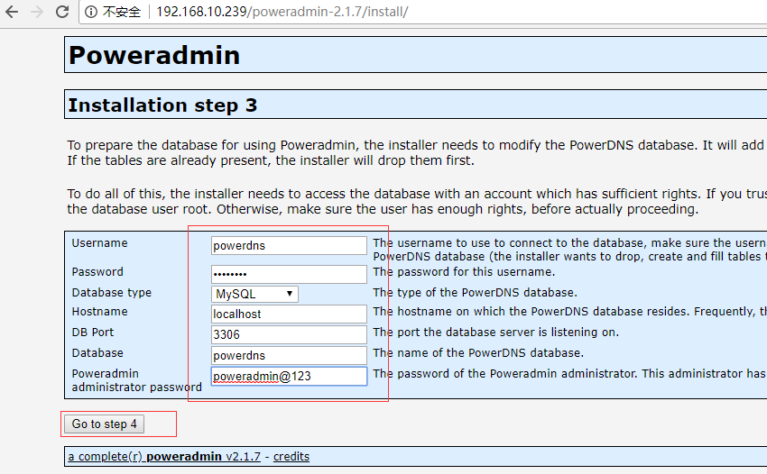
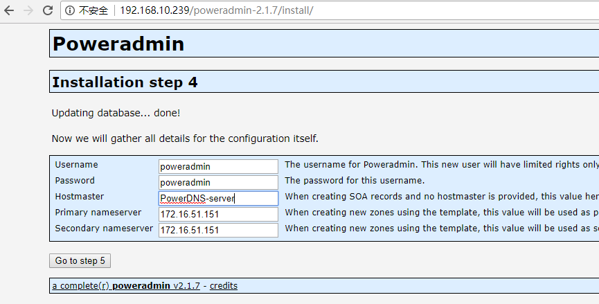
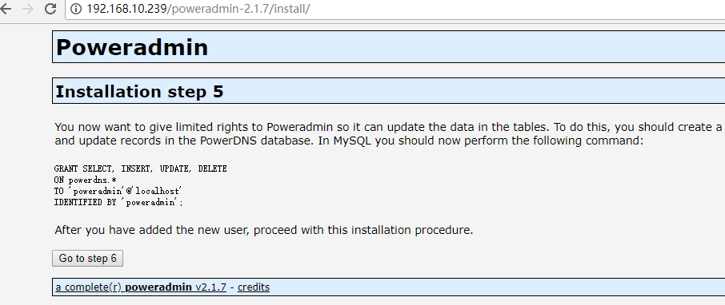
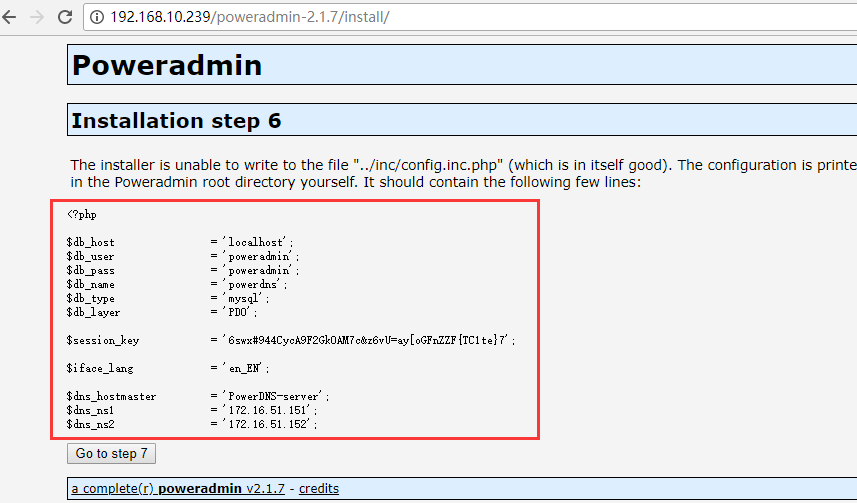
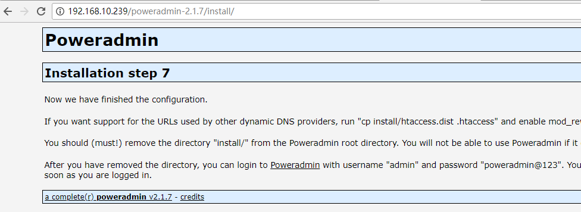
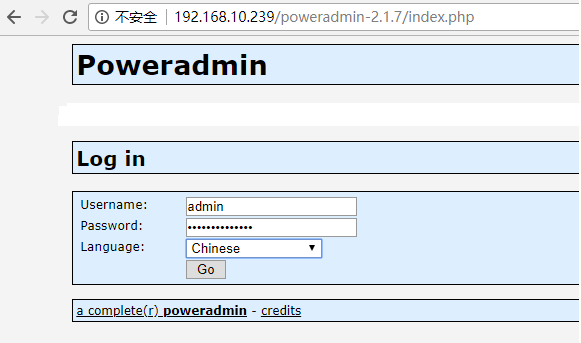
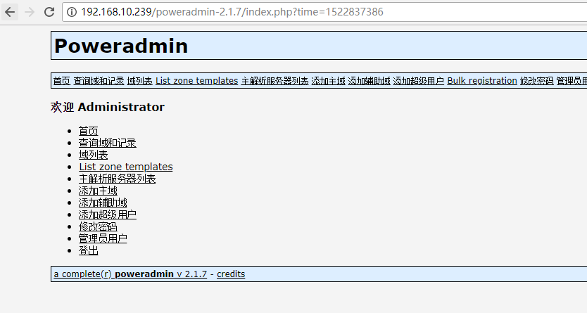

# Centos7.4下部署PowerDNS的操作记录

[原文链接](<https://cloud.tencent.com/developer/article/1098794>)

之前已经介绍了[DNS环境的部署过程](http://www.cnblogs.com/kevingrace/p/5570312.html)，这里说下PowerDNS的使用及部署，PowerDNS 是一个跨平台的开源DNS服务组件，它是高性能的域名服务器，除了支持普通的BIND配置文件，PowerDNS还可以从[MySQL](https://cloud.tencent.com/product/cdb?from=10680),Oracle,[PostgreSQL](https://cloud.tencent.com/product/postgresql?from=10680)等的数据库读取数据。PowerDNS安装了Poweradmin，能实现Web管理DNS记录，非常的方便。

**一、部署以**[**MariaDB**](https://cloud.tencent.com/product/tdsql?from=10680)**作为后端数据的PowerDNS系统**

**1）关闭防火墙和selinux**

```javascript
[root@PowerDNS ~]# cat /etc/redhat-release 
CentOS Linux release 7.4.1708 (Core) 

[root@PowerDNS ~]# setenforce 0
[root@PowerDNS ~]# getenforce 
[root@PowerDNS ~]# cat /etc/sysconfig/selinux |grep "SELINUX=disabled"
SELINUX=disabled

[root@PowerDNS ~]# systemctl stop firewalld 
[root@PowerDNS ~]# systemctl disable firewalld 
Removed symlink /etc/systemd/system/multi-user.target.wants/firewalld.service.
Removed symlink /etc/systemd/system/dbus-org.fedoraproject.FirewallD1.service.
[root@PowerDNS ~]# firewall-cmd --state
not running
```

**2）启用EPEL仓库**

```javascript
[root@PowerDNS ~]# yum install -y epel-release yum-plugin-priorities
```

**3）安装并配置MariaDB服务器**

```javascript
[root@PowerDNS ~]# yum install -y mariadb-server mariadb
[root@PowerDNS ~]# systemctl enable mariadb.service
[root@PowerDNS ~]# systemctl start mariadb.service
[root@PowerDNS ~]# lsof -i:3306

设置密码
[root@PowerDNS ~]# mysql_secure_installation
首先是设置密码，会提示先输入密码
  
Enter current password for root (enter for none):<–初次运行直接回车
  
设置密码
  
Set root password? [Y/n] <– 是否设置root用户密码，输入y并回车或直接回车
New password: <– 设置root用户的密码（比如123456）
Re-enter new password: <– 再输入一次你设置的密码
  
其他配置
Remove anonymous users? [Y/n] <– 是否删除匿名用户，回车
Disallow root login remotely? [Y/n] <–是否禁止root远程登录,回车,
Remove test database and access to it? [Y/n] <– 是否删除test数据库，回车
Reload privilege tables now? [Y/n] <– 是否重新加载权限表，回车

使用密码登录MariaDB，查看字符集
[root@PowerDNS ~]# mysql -p123456
Welcome to the MariaDB monitor.  Commands end with ; or \g.
Your MariaDB connection id is 11
Server version: 5.5.56-MariaDB MariaDB Server

Copyright (c) 2000, 2017, Oracle, MariaDB Corporation Ab and others.

Type 'help;' or '\h' for help. Type '\c' to clear the current input statement.

MariaDB [(none)]> show variables like "%character%";show variables like "%collation%";
+--------------------------+----------------------------+
| Variable_name            | Value                      |
+--------------------------+----------------------------+
| character_set_client     | utf8                       |
| character_set_connection | utf8                       |
| character_set_database   | latin1                     |
| character_set_filesystem | binary                     |
| character_set_results    | utf8                       |
| character_set_server     | latin1                     |
| character_set_system     | utf8                       |
| character_sets_dir       | /usr/share/mysql/charsets/ |
+--------------------------+----------------------------+
8 rows in set (0.00 sec)

+----------------------+-------------------+
| Variable_name        | Value             |
+----------------------+-------------------+
| collation_connection | utf8_general_ci   |
| collation_database   | latin1_swedish_ci |
| collation_server     | latin1_swedish_ci |
+----------------------+-------------------+


接下来配置MariaDB的字符集，设置成utf8:
-> 首先是配置文件/etc/my.cnf，在[mysqld]标签下添加
init_connect='SET collation_connection = utf8_unicode_ci'
init_connect='SET NAMES utf8'
character-set-server=utf8
collation-server=utf8_unicode_ci
skip-character-set-client-handshake
  
-> 接着配置文件/etc/my.cnf.d/client.cnf，在[client]中添加
default-character-set=utf8
  
-> 然后配置文件/etc/my.cnf.d/mysql-clients.cnf，在[mysql]中添加
default-character-set=utf8
  
最后是重启MariaDB，并登陆MariaDB查看字符集
[root@PowerDNS ~]# systemctl restart mariadb.service

再次登录MariaDB，查看字符集，发现已是utf8了
[root@PowerDNS ~]# mysql -p123456
Welcome to the MariaDB monitor.  Commands end with ; or \g.
Your MariaDB connection id is 2
Server version: 5.5.56-MariaDB MariaDB Server

Copyright (c) 2000, 2017, Oracle, MariaDB Corporation Ab and others.

Type 'help;' or '\h' for help. Type '\c' to clear the current input statement.

MariaDB [(none)]> show variables like "%character%";show variables like "%collation%";
+--------------------------+----------------------------+
| Variable_name            | Value                      |
+--------------------------+----------------------------+
| character_set_client     | utf8                       |
| character_set_connection | utf8                       |
| character_set_database   | utf8                       |
| character_set_filesystem | binary                     |
| character_set_results    | utf8                       |
| character_set_server     | utf8                       |
| character_set_system     | utf8                       |
| character_sets_dir       | /usr/share/mysql/charsets/ |
+--------------------------+----------------------------+
8 rows in set (0.00 sec)

+----------------------+-----------------+
| Variable_name        | Value           |
+----------------------+-----------------+
| collation_connection | utf8_unicode_ci |
| collation_database   | utf8_unicode_ci |
| collation_server     | utf8_unicode_ci |
+----------------------+-----------------+
```

**4）接着继续安装PowerDNS**

```javascript
[root@PowerDNS yum.repos.d]# yum install -y pdns pdns-backend-mysql

PowerDNS的配置文件位于/etc/pdns/pdns.conf
[root@PowerDNS ~]# ll /etc/pdns/pdns.conf 
-rw-------. 1 root root 14007 Feb  2 00:33 /etc/pdns/pdns.conf
```

**5）为PowerDNS服务配置一个MariaDB数据库。**

```javascript
[root@PowerDNS ~]# mysql -p123456
Welcome to the MariaDB monitor.  Commands end with ; or \g.
Your MariaDB connection id is 3
Server version: 5.5.56-MariaDB MariaDB Server

Copyright (c) 2000, 2017, Oracle, MariaDB Corporation Ab and others.

Type 'help;' or '\h' for help. Type '\c' to clear the current input statement.

MariaDB [(none)]> CREATE DATABASE powerdns;
MariaDB [(none)]> GRANT ALL ON powerdns.* TO 'powerdns'@'127.0.0.1' IDENTIFIED BY 'powerdns';
MariaDB [(none)]> FLUSH PRIVILEGES;


继续创建PowerDNS要使用的数据库表。像堆积木一样执行以下这些sql语句（即复制下面的语句直接粘贴到MariaDB中一起执行）
use powerdns;

CREATE TABLE domains (
  id                    INT AUTO_INCREMENT,
  name                  VARCHAR(255) NOT NULL,
  master                VARCHAR(128) DEFAULT NULL,
  last_check            INT DEFAULT NULL,
  type                  VARCHAR(6) NOT NULL,
  notified_serial       INT DEFAULT NULL,
  account               VARCHAR(40) DEFAULT NULL,
  PRIMARY KEY (id)
) Engine=InnoDB;

CREATE UNIQUE INDEX name_index ON domains(name);


CREATE TABLE records (
  id                    BIGINT AUTO_INCREMENT,
  domain_id             INT DEFAULT NULL,
  name                  VARCHAR(255) DEFAULT NULL,
  type                  VARCHAR(10) DEFAULT NULL,
  content               TEXT,
  ttl                   INT DEFAULT NULL,
  prio                  INT DEFAULT NULL,
  change_date           INT DEFAULT NULL,
  disabled              TINYINT(1) DEFAULT 0,
  ordername             VARCHAR(255) BINARY DEFAULT NULL,
  auth                  TINYINT(1) DEFAULT 1,
  PRIMARY KEY (id)
) Engine=InnoDB;

CREATE INDEX nametype_index ON records(name,type);
CREATE INDEX domain_id ON records(domain_id);
CREATE INDEX recordorder ON records (domain_id, ordername);


CREATE TABLE supermasters (
  ip                    VARCHAR(64) NOT NULL,
  nameserver            VARCHAR(255) NOT NULL,
  account               VARCHAR(40) NOT NULL,
  PRIMARY KEY (ip, nameserver)
) Engine=InnoDB;


CREATE TABLE comments (
  id                    INT AUTO_INCREMENT,
  domain_id             INT NOT NULL,
  name                  VARCHAR(255) NOT NULL,
  type                  VARCHAR(10) NOT NULL,
  modified_at           INT NOT NULL,
  account               VARCHAR(40) NOT NULL,
  comment               TEXT,
  PRIMARY KEY (id)
) Engine=InnoDB;

CREATE INDEX comments_domain_id_idx ON comments (domain_id);
CREATE INDEX comments_name_type_idx ON comments (name, type);
CREATE INDEX comments_order_idx ON comments (domain_id, modified_at);


CREATE TABLE domainmetadata (
  id                    INT AUTO_INCREMENT,
  domain_id             INT NOT NULL,
  kind                  VARCHAR(32),
  content               TEXT,
  PRIMARY KEY (id)
) Engine=InnoDB;

CREATE INDEX domainmetadata_idx ON domainmetadata (domain_id, kind);


CREATE TABLE cryptokeys (
  id                    INT AUTO_INCREMENT,
  domain_id             INT NOT NULL,
  flags                 INT NOT NULL,
  active                BOOL,
  content               TEXT,
  PRIMARY KEY(id)
) Engine=InnoDB;

CREATE INDEX domainidindex ON cryptokeys(domain_id);


CREATE TABLE tsigkeys (
  id                    INT AUTO_INCREMENT,
  name                  VARCHAR(255),
  algorithm             VARCHAR(50),
  secret                VARCHAR(255),
  PRIMARY KEY (id)
) Engine=InnoDB;

CREATE UNIQUE INDEX namealgoindex ON tsigkeys(name, algorithm);

flush privileges;

执行完之后，检查下：
MariaDB [powerdns]> show databases;
+--------------------+
| Database           |
+--------------------+
| information_schema |
| mysql              |
| performance_schema |
| powerdns           |
+--------------------+
4 rows in set (0.00 sec)

MariaDB [powerdns]> use powerdns;
Database changed
MariaDB [powerdns]> show tables;
+--------------------+
| Tables_in_powerdns |
+--------------------+
| comments           |
| cryptokeys         |
| domainmetadata     |
| domains            |
| records            |
| supermasters       |
| tsigkeys           |
+--------------------+


检查下使用powerdns是否正常登录
[root@PowerDNS ~]# mysql -upowerdns -h127.0.0.1 -ppowerdns;
Welcome to the MariaDB monitor.  Commands end with ; or \g.
Your MariaDB connection id is 5
Server version: 5.5.56-MariaDB MariaDB Server

Copyright (c) 2000, 2017, Oracle, MariaDB Corporation Ab and others.

Type 'help;' or '\h' for help. Type '\c' to clear the current input statement.

MariaDB [(none)]> show databases;
+--------------------+
| Database           |
+--------------------+
| information_schema |
| powerdns           |
+--------------------+
2 rows in set (0.00 sec)

MariaDB [(none)]> use powerdns;
Reading table information for completion of table and column names
You can turn off this feature to get a quicker startup with -A

Database changed
MariaDB [powerdns]> show tables;
+--------------------+
| Tables_in_powerdns |
+--------------------+
| comments           |
| cryptokeys         |
| domainmetadata     |
| domains            |
| records            |
| supermasters       |
| tsigkeys           |
+--------------------+
7 rows in set (0.00 sec)

MariaDB [powerdns]>
```

**6）继续配置PowerDNS，以MariaDB作为后台。**

```javascript
[root@PowerDNS ~]# cp /etc/pdns/pdns.conf /etc/pdns/pdns.conf.bak
[root@PowerDNS ~]# vim /etc/pdns/pdns.conf
#查找类似：#launch= ；添加下面的内容： 
launch=gmysql
gmysql-host=127.0.0.1
gmysql-port=3306
gmysql-dbname=powerdns
gmysql-user=powerdns
gmysql-password=powerdns

# 启用API，需要启用Web服务器和HTTP API
webserver=yes
webserver-address=192.168.10.115
#webserver-password=XXXX #默认没设置
#webserver-allow-from=127.0.0.1,::1   # Default 
webserver-allow-from=127.0.0.1,::1,192.168.10.115/24
#webserver-port=8081   #默认
api=yes
api-key=********
api-logfile=/var/log/pdns-api.log
# 本地ipv4开放地址
local-address=192.168.10.115
将启动并添加PowerDNS到系统开机启动列表：
[root@PowerDNS ~]# systemctl enable pdns.service
[root@PowerDNS ~]# systemctl start pdns.service
----------------------------------------------------------------------------------------
Solved: Unable to bind UDP socket to ‚0.0.0.0:53‘: Address already in use
问题解决：
The other thing to do is edit /etc/powerdns/pdns.conf and change the binding port of IPv4 from 0.0.0.0 to 127.0.0.1 as well as the binding port of IPv6 from :: to ::1
-----------------------------------------------------------------------------------------
[root@PowerDNS ~]# systemctl status pdns.service

[root@PowerDNS ~]# ps -ef|grep pdns
pdns     20036     1  0 16:54 ?        00:00:00 /usr/sbin/pdns_server --daemon
root     20056 18838  0 16:56 pts/1    00:00:00 grep --color=auto pdns
[root@PowerDNS ~]# lsof -i:53
COMMAND     PID USER   FD   TYPE DEVICE SIZE/OFF NODE NAME
pdns_serv 20036 pdns    5u  IPv4  41118      0t0  UDP *:domain 
pdns_serv 20036 pdns    6u  IPv4  41119      0t0  TCP *:domain (LISTEN)

[root@PowerDNS ~]# journalctl -u pdns -f -n 500

到这一步，PowerDNS服务器已经起起并运行了
```

### traefik支持

traefik-ds.yml 启动增加参数

```bash
- --kubernetes
- --kubernetes.ingressendpoint
# 解析的IP
- --kubernetes.ingressendpoint.ip=192.168.10.88
```


> The ingress controller (traefik) needs to know what address to publish into DNS. You can either set a fixed IP or hostname, or set a service to copy the information from. The latter is the more common case, so that's setting the service to copy from to one named `traefik` in the namespace also named `traefik`. Or more generally you are specifying a service object in `namespace/servicename` format :)
>
>  ingress controller (traefik) 需要知道要发布到 DNS 中的地址。 您可以设置一个固定的 IP 或主机名，或者设置一个服务来复制信息。 后者是更常见的情况，因此在namespace 中将服务设置为复制到一个名为 traefik 的名称，也称为 traefik 。 或者更一般地说，您正在以`namespace/servicename`格式指定服务对象：) 。

[详见k8s配置说明](https://github.com/kubernetes-incubator/external-dns/issues/413)

## 二、安装PowerAdmin来管理PowerDNS

**7）PowerAdmin，一个界面友好的PowerDNS服务器的 Web 管理器。由于它是用PHP写的，我们将需要安装PHP和一台网络服务器（Apache）：**

```javascript
[root@PowerDNS html]# yum -y install httpd php php-devel php-gd php-mcrypt php-imap php-ldap php-mysql php-odbc php-pear php-xml php-xmlrpc php-mbstring php-mcrypt php-mhash gettext
 
安装完成后，需要启动并设置Apache开机启动：
[root@PowerDNS ~]# systemctl enable httpd.service
[root@PowerDNS ~]# systemctl start httpd.service
[root@PowerDNS ~]# systemctl status httpd.service
[root@PowerDNS ~]# lsof -i:80
 
由于已经满足PowerAdmin的所有系统要求，可以继续下载软件包，放到Apache默认的网页目录位于/var/www/html/
[root@PowerDNS ~]# cd /var/www/html/
[root@PowerDNS html]#  wget http://downloads.sourceforge.net/project/poweradmin/poweradmin-2.1.7.tgz
[root@PowerDNS html]# tar -zvxf poweradmin-2.1.7.tgz
[root@PowerDNS html]# ls
poweradmin-2.1.7  poweradmin-2.1.7.tgz
 
接着启动PowerAdmin的网页安装器了，只需打开（192.168.10.239为本机ip）：
http://192.168.10.239/poweradmin-2.1.7/install/
```

下面的页面会要求你为PowerAdmin选择语言，请选择你想要使用的那一个，然后点击"进入步骤 2"按钮。



安装器需要PowerDNS数据库：



因为上面已经创建了一个数据库，所以可以继续进入下一步。接着会被要求提供先前配置的数据库详情，同时也需要为Poweradmin设置管理员密码：  



输入这些信息后，进入步骤 4。你将创建为Poweradmin创建一个受限用户。这里你需要输入的字段是：

test/test0755



用户名（Username）：PowerAdmin用户名。 密码（Password）：上述用户的密码。 主机管理员（Hostmaster）：当创建SOA记录而你没有指定主机管理员时，该值会被用作默认值(可以不写)。这里我写的是部署机的主机名 

主域名服务器：该值在创建新的DNS区域时会被用于作为主域名服务器。

 辅域名服务器：该值在创建新的DNS区域时会被用于作为辅域名服务器。 

在下一步中，Poweradmin会要求你在数据库表中创建一个新的受限数据库用户，它会提供你需要在MariaDB控制台输入的代码：



现在打开终端并运行（以下这段命令就是复制上图步骤中的命令，进入数据库粘贴即可。）

```javascript
MariaDB [(none)]> GRANT SELECT,INSERT,UPDATE,DELETE ON powerdns.* TO 'test'@'127.0.0.1' IDENTIFIED BY 'test0755';
MariaDB [(none)]> flush privileges;

测试使用上面权限登录数据库
[root@PowerDNS inc]# mysql -utest -h127.0.0.1 -ptest0755
Welcome to the MariaDB monitor.  Commands end with ; or \g.
Your MariaDB connection id is 17
Server version: 5.5.56-MariaDB MariaDB Server

Copyright (c) 2000, 2017, Oracle, MariaDB Corporation Ab and others.

Type 'help;' or '\h' for help. Type '\c' to clear the current input statement.

MariaDB [(none)]> show databases;
+--------------------+
| Database           |
+--------------------+
| information_schema |
| powerdns           |
+--------------------+
2 rows in set (0.00 sec)

MariaDB [(none)]>
```

现在，回到浏览器中并继续下一步,  注意localhost改成127.0.0.1

> If you connect to `localhost`, it will use the socket connector, but if you connect to `127.0.0.1` the TCP/IP connector will be used. So when the socket connector is not working, try connecting to `127.0.0.1` instead.



安装器将尝试创建配置文件到/var/www/html/poweradmin-2.1.7/inc目录下，文件名是config.inc.php。

```javascript
[root@PowerDNS ~]# cd /var/www/html/poweradmin-2.1.7/inc
[root@PowerDNS inc]# vim config.inc.php
[root@PowerDNS inc]# cat config.inc.php
<?php

$db_host    = '127.0.0.1';
$db_user    = 'test';
$db_pass    = 'test0755';
$db_name    = 'powerdns';
$db_type    = 'mysql';
$db_layer   = 'PDO';

$session_key    = '6swx#944CycA9F2GkOAM7c&z6vU=ay[oGFnZZF{TC1te}7';

$iface_lang   = 'en_EN';

$dns_hostmaster   = 'PowerDNS-server';
$dns_ns1    = '192.168.10.115';
$dns_ns2    = '192.168.10.115';
```

现在，进入最后页面，该页面会告知你安装已经完成以及如何访问安装好的PowerAdmin：



**然后，需要移除从PowerAdmin的根目录中移除"install"文件夹，这一点很重要。使用以下命令：**

```javascript
[root@PowerDNS ~]# ll /var/www/html/poweradmin-2.1.7/install/
[root@PowerDNS ~]# rm -rf /var/www/html/poweradmin-2.1.7/install/
```

在此之后，你可以通过以下方式访问PowerAdmin，访问地址http://192.168.10.239/poweradmin-2.1.7/

如下图，使用admin/poweradmin@123的用户名和密码（上面设置的密码）进行登录



在登录后，你应该会看到PowerAdmin的主页：



本文参与[腾讯云自媒体分享计划](https://cloud.tencent.com/developer/support-plan)，欢迎正在阅读的你也加入，一起分享。

发表于 2018-04-16

