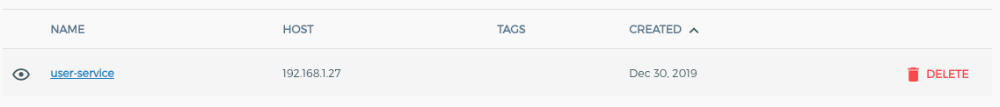
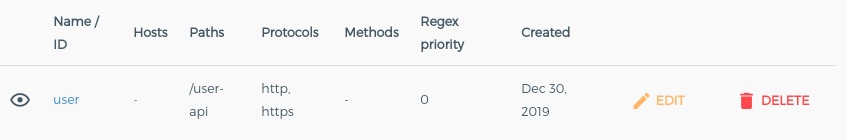
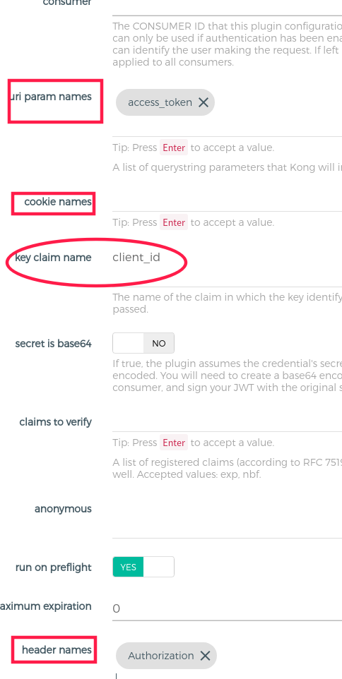
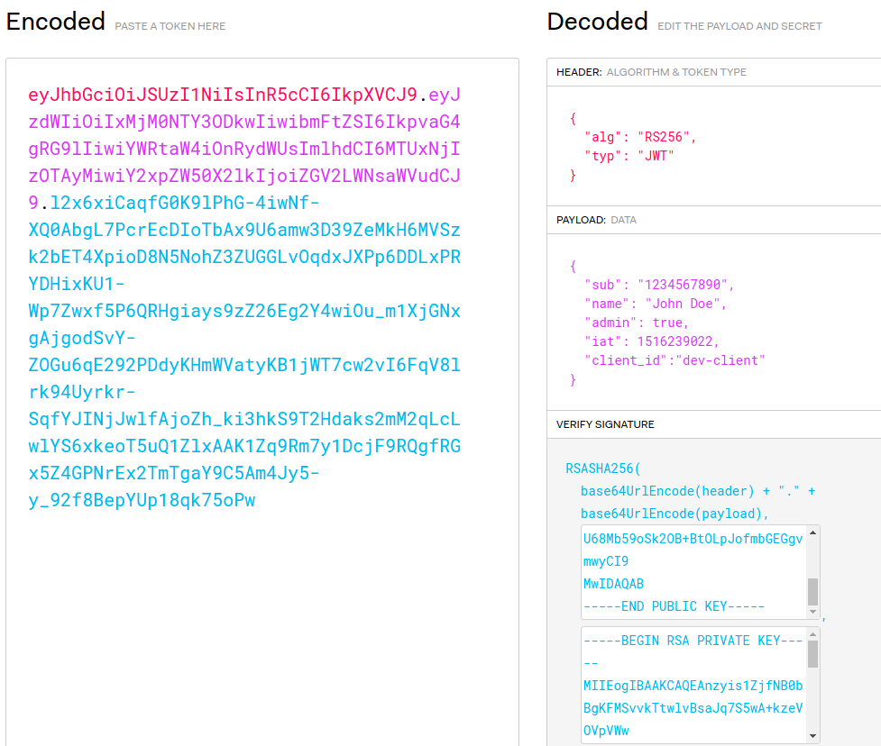
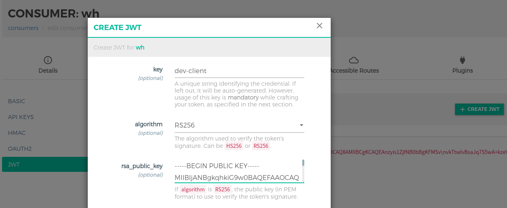
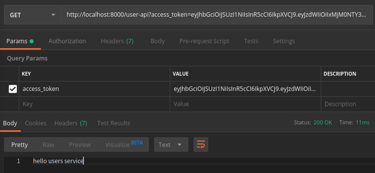

# kong使用jwt插件

**阅读本文建立在能搭建kong运行环境，熟悉简单插件的使用，熟悉konga UI管理页面或admin api，熟悉jwt token基础之上。本文重点阐释让人疑惑的key claim name参数。**

### 插件的作用

可以从url param，header，cookie中获取token，并且验证签名有效，如果有效，Kong将把请求代理到上游服务，如果没有找到token或验证失败则丢弃请求。


### 环境准备

- Kong相关环境
- Konga
- <https://jwt.io/>
- 测试服务user-service

```java
@RequestMapping("/users")
@RestController
@Slf4j
public class UserController {
    @GetMapping
    public ResponseEntity<String> hello() {
        return ResponseEntity.ok("hello users service");
    }
}
```

### 开始使用

1. 使用Konga创建service ,指向本地开启的user-service：<http://192.168.1.27:8080/users>



2. 为第一步的service创建routes，path 为 /user-api



3. 创建一个jwt插件，其中 `uri param names, cookie names,header names` 是http请求不同位置放置token的参数名称，一般是放在header中。注意`key claim name`参数，这里默认值是iss，也就是jwt官方字段iss (issuer)签发人，这个参数必填,是jwt原始数据中的key name，作用是，当使用后面配置的consumer 公钥解析出来jwt的元数据后，要验证的字段，这里自己改写为client_id。



4. 使用<https://jwt.io/> 生成一个jwt token，手动在 payload 里面加上 自定义的 key claim name 字段 `client_id =dev-client`，公钥和私钥会自动生成，如下图所示：



5. 也可以利用openssl命令生成RSA 私钥和公钥
- 生成私钥，这次生成的 jwtRS256.key.pub 不是我们想要的
```bash
 # 生产位数应该在2048以上
 ssh-keygen -t rsa -b 4096 -f jwtRS256.key
 # Don't add passphrase, 不需要设置密码
```
- 利用私钥生成公钥
```bash
 openssl rsa -in jwtRS256.key -pubout -outform PEM -out jwtRS256.key.pub
```
6. 创建一个consumer，创建你的jwt credentials，注意，前三项必填。看到第4步中的页面，将数据依次填入，key为我们自定义的client_id的值，加密算法为 生成jwt的 header的 alg：RS256，rsa_public_key为public key 。



**也就是说这里的key字段的值就是第3步中key claim name 要校验的值，如果这里采用默认的iss，默认生成该值，则jwt的payload中必须要有iss=自己填写或默认产生的值。**

### 测试

- 直接请求<http://localhost:8000/user-api> 返回`{ "message": "Unauthorized" }`
- 添加access_token参数，复制第4步中生成的token，请求成功。



------

- 本文链接 https://www.yht7.com/news/14826
- 若本号内容有做得不到位的地方（比如：涉及版权或其他问题），请及时联系我们进行整改即可，会在第一时间进行处理。

### 附件

payload 中一些固定参数名称的意义, 同时可以在payload中自定义参数
- iss   【issuer】发布者的url地址
- aud 【audience】接受者的url地址
- exp 【expiration】 该jwt销毁的时间；unix时间戳
- nbf  【not before】 该jwt的使用时间不能早于该时间；unix时间戳
- iat   【issued at】 该jwt的发布时间；unix 时间戳
- jti    【JWT ID】 该jwt的唯一ID编号，不是常用的字段
- sub 【subject】该JWT所面向的用户，用于处理特定应用，不是常用的字段
- name  自定义的参数
- data  自定义的参数

headers 中一些固定参数名称的意义
- jku: 发送JWK的地址；最好用HTTPS来传输
- jwk: 就是之前说的JWK
- kid: jwk的ID编号
- x5u: 指向一组X509公共证书的URL
- x5c: X509证书链
- x5t：X509证书的SHA-1指纹
- x5t#S256: X509证书的SHA-256指纹
- typ: 在原本未加密的JWT的基础上增加了 JOSE 和 JOSE+ JSON。JOSE序列化后文会说及。适用于JOSE标头的对象与此JWT混合的情况。
- crit: 字符串数组，包含声明的名称，用作实现定义的扩展，必须由 this -> JWT的解析器处理。不常见。