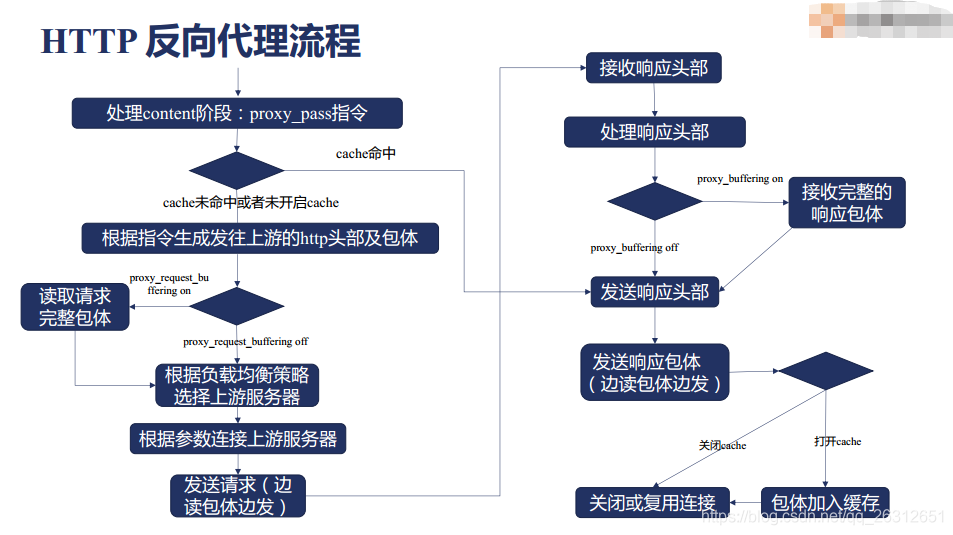
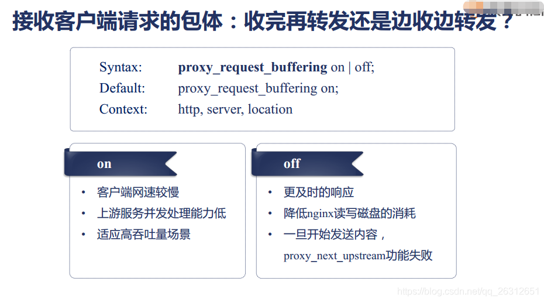
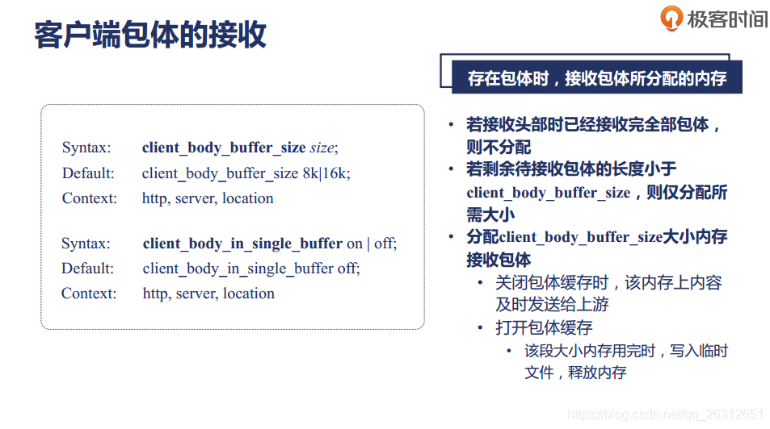

# nginx反向代理的流程

 2019-02-14 https://blog.csdn.net/qq_26312651/article/details/87257745

nginx反向代理的流程如下：

- proxy_request_buffering 指令：on表示nginx接收完完整的body后才和upstream建立连接，off则是先建立连接，然后发送请求的时，一遍从下游读取body，一遍往上游转发。默认情况下是on，即nginx先生成要发往上游的包体，然后才去和上游建立连接。这样做是为了不耽误时间，不占用较长时间连接。因为一边读一边转发的问题是，一般下游和nginx之间的网速较慢，而nginx和upstream的网速较快(内网)，这样边读边发会浪费很多时间。

- proxy_buffering 指令： on表示nginx先接收到完整的响应包体，然后向客户端发送响应头部和响应包体。off表示一边接收一边向下游发送，为了不受限于下游的网速，默认开启。

- client_body_buffer_size指令和client_body_in_single_buffer指令

- client_max_body_size 指令： 最大body大小设置