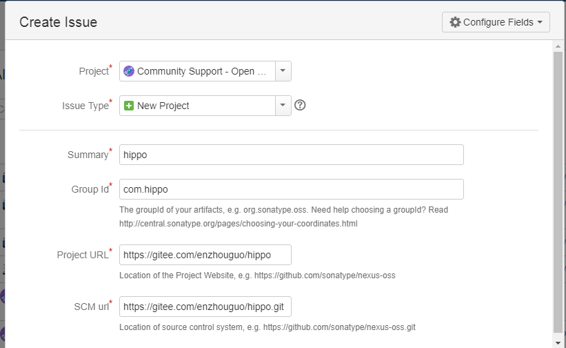
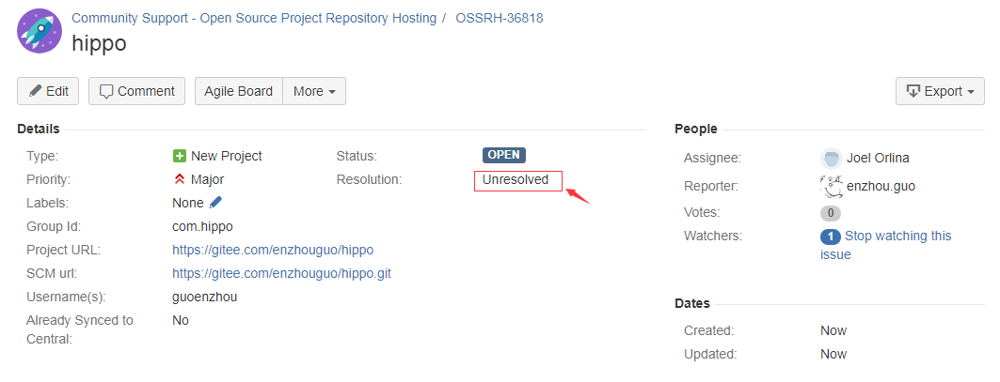
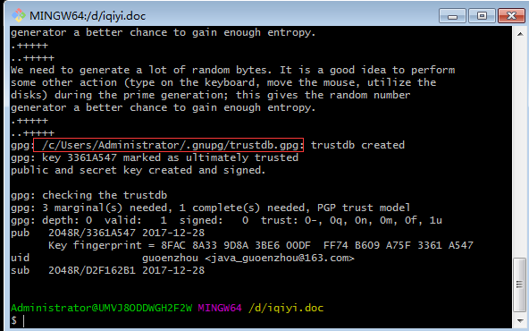
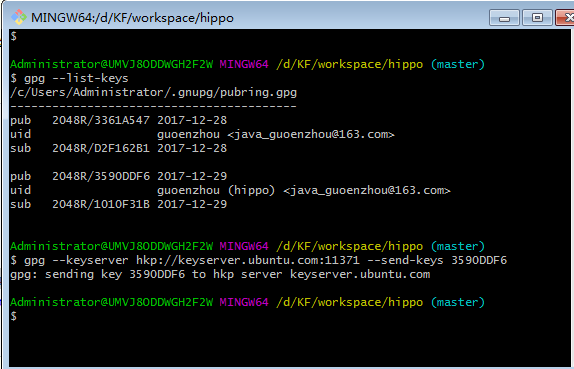
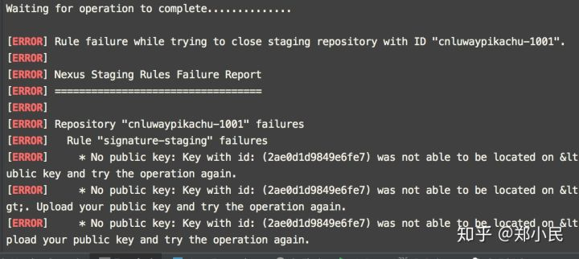

# 如何发布jar包到maven中央仓库详细教程

## 总结
```bash
# 查询本地 key
$ gpg --list-keys
----------------------------------------------------
pub   rsa2048 2020-05-07 [SC] [expires: 2022-05-07]
      F567CD89B5ABCAD48BEFDCD0B3D8917CD3C11679
uid           [ultimate] marvinpan <pantj@investoday.com.cn>
sub   rsa2048 2020-05-07 [E] [expires: 2022-05-07]
# 发送key到服务器(不做)
$ gpg --keyserver hkp://keyserver.ubuntu.com:11371 --send-keys F567CD89B5ABCAD48BEFDCD0B3D8917CD3C11679
# 验证key
$ gpg --keyserver hkp://keyserver.ubuntu.com:11371 --recv-keys F567CD89B5ABCAD48BEFDCD0B3D8917CD3C11679
# 发布到中央仓库
$ mvn clean install deploy -P nexus-release -Darguments="gpg.passphrase=XXXXXXXXXXXXX"
# 查看地址 https://oss.sonatype.org/#welcome
```

## 介绍

java开发中没少用各种jar包，特别是使用maven，gradle 构建工具，方便有效。总是只取不予，也应该懂得奉献，当你写好了一个十分好用的jar包，想贡献出去给大家使用的时候，应该怎么做呢？当然是发布到maven的中央仓库了

**开始要注意这个几个Maven相关地址**：

- **工单管理**：[https://issues.sonatype.org](https://issues.sonatype.org/)

> 就是申请上传资格和groupId 的地方,注册账号、创建和管理issue，Jar包的发布是以解决issue的方式起步的

- **构件仓库** : <https://oss.sonatype.org/#welcome>

> 把jar包上传到这里，Release 之后就会同步到maven中央仓库。

- **仓库镜像**: <http://search.maven.org/>

> 最终工件可以在这里搜索到。

## 操作

### 注册工单管理(register sonatype)

第一访问[工单管理](https://issues.sonatype.org/)界面，需要提前注册（sign up)， 它是工单管理和构建仓库身份验证.点击"Sign up "

## 创建工单（nexus)

```
点击header 头 “create”按钮创建一个工单，主要用途注册你上传jar包基本信息，主要groupid，通过审核有两个目的：1.防止重复，约束groupid规范，定义grupid最好有所属的域名
```

比如：你申请 com.hippo 那么你最有有hippo.com 这个域名的所有权。如果你不符合还有一个解决办法，groupid 申请以：com.github.{账号名来定义}



创建成功后，接下来等待后台管理员审核，一般一个工作日以内，当Issue的Status变为RESOLVED后，就可以进行下一步操作了，否则，就等待… 

审批通过后，通常管理员会给你留言配置方法，大体文字如下：

```
Configuration has been prepared, now you can:
Deploy snapshot artifacts into repository https://oss.sonatype.org/content/repositories/snapshots
Deploy release artifacts into the staging repository https://oss.sonatype.org/service/local/staging/deploy/maven2
Promote staged artifacts into repository 'Releases'
Download snapshot and release artifacts from group https://oss.sonatype.org/content/groups/public
Download snapshot, release and staged artifacts from staging group https://oss.sonatype.org/content/groups/staging
please comment on this ticket when you promoted your first release, thanks
```

> 翻译：
>
> 配置已经准备好了，现在你可以： 将快照构件部署到存储库<https://oss.sonatype.org/content/repositories/snapshots>将发布工件部署到分段存储库中<https://oss.sonatype.org/service/local/staging/deploy/maven2> 将分阶段的工件推入存储库“发布” 从组[https://oss.sonatype.org/content/groups/public](https://oss.sonatype.org/content/groups/public%E4%B8%8B%E8%BD%BD%E5%BF%AB%E7%85%A7%E5%B9%B6%E5%8F%91%E5%B8%83%E5%B7%A5%E4%BB%B6) 下载快照并发布工件从暂存组[https://oss.sonatype.org/content/groups/staging](https://oss.sonatype.org/content/groups/staging%E4%B8%8B%E8%BD%BD%E5%BF%AB%E7%85%A7%EF%BC%8C%E5%8F%91%E5%B8%83%E5%92%8C%E6%9A%82%E5%AD%98%E7%9A%84%E5%B7%A5%E4%BB%B6)  下载快照，发布和暂存的工件,
>
> 请在您宣传第一个版本时对此票发表评论，谢谢

## 配置项目工程pom.xml

在工程的pom.xml文件中，引入Sonatype官方的一个通用配置oss-parent，这样做的好处是很多pom.xml的发布配置不需要自己配置了

```xml
<parent>
    <groupId>org.sonatype.oss</groupId>
    <artifactId>oss-parent</artifactId>
    <version>7</version>
</parent>
```

并增加Licenses、SCM、Developers信息

```xml
<licenses>
    <license>
        <name>The Apache Software License, Version 2.0</name>
        <url>http://www.apache.org/licenses/LICENSE-2.0.txt</url>
        <distribution>repo</distribution>
    </license>
</licenses>
<scm>
    <tag>master</tag>
    <url>git@github.com:cloudnil/marathon-client.git</url>
    <connection>scm:git:git@github.com:cloudnil/marathon-client.git</connection>
    <developerConnection>scm:git:git@github.com:cloudnil/marathon-client.git</developerConnection>
</scm>
<developers>
    <developer>
        <name>cloudnil</name>
        <email>cloudnil@126.com</email>
        <organization>CloudNil</organization>
    </developer>
</developers>
```

- **完整pom.xml**

pom.xml 中必须包括：name、description、url、licenses、developers、scm 等基本信息

```xml
<distributionManagement>
    <repository>
        <id>repository</id>
        <url>https://oss.sonatype.org/service/local/staging/deploy/maven2/</url>
    </repository>
    <snapshotRepository>
        <id>ossrh</id>
        <url>https://oss.sonatype.org/content/repositories/snapshots</url>
    </snapshotRepository>
</distributionManagement>


<profiles>
    <profile>
        <id>disable-javadoc-doclint</id>
        <activation>
            <jdk>[1.8,)</jdk>
        </activation>
        <!-- java8版本导致javadoc打包编译失败时候，添加-->
        <properties>
            <javadoc.opts>-Xdoclint:none</javadoc.opts>
        </properties>
    </profile>

    <profile>
        <id>release</id>
        <build>
            <plugins>
                <plugin>
                    <groupId>org.sonatype.plugins</groupId>
                    <artifactId>nexus-staging-maven-plugin</artifactId>
                    <version>1.6.3</version>
                    <extensions>true</extensions>
                    <configuration>
                        <serverId>ossrh</serverId>
                        <nexusUrl>https://oss.sonatype.org/</nexusUrl>
                        <autoReleaseAfterClose>true</autoReleaseAfterClose>
                    </configuration>
                </plugin>
                <plugin>
                    <groupId>org.apache.maven.plugins</groupId>
                    <artifactId>maven-release-plugin</artifactId>
                    <version>2.3.2</version>
                    <configuration>
                        <autoVersionSubmodules>true</autoVersionSubmodules>
                        <useReleaseProfile>false</useReleaseProfile>
                        <releaseProfiles>release</releaseProfiles>
                        <goals>deploy</goals>
                    </configuration>
                </plugin>
                <plugin>
                    <groupId>org.apache.maven.plugins</groupId>
                    <artifactId>maven-compiler-plugin</artifactId>
                    <version>3.0</version>
                    <configuration>
                        <source>1.8</source>
                        <target>1.8</target>
                    </configuration>
                </plugin>
                <plugin>
                    <groupId>org.apache.maven.plugins</groupId>
                    <artifactId>maven-gpg-plugin</artifactId>
                    <version>1.5</version>
                    <executions>
                        <execution>
                            <id>sign-artifacts</id>
                            <phase>verify</phase>
                            <goals>
                                <goal>sign</goal>
                            </goals>
                        </execution>
                    </executions>
                </plugin>
                <plugin>
                    <groupId>org.apache.maven.plugins</groupId>
                    <artifactId>maven-source-plugin</artifactId>
                    <version>2.2.1</version>
                    <executions>
                        <execution>
                            <id>attach-sources</id>
                            <goals>
                                <goal>jar-no-fork</goal>
                            </goals>
                        </execution>
                    </executions>
                </plugin>
                <plugin>
                    <groupId>org.apache.maven.plugins</groupId>
                    <artifactId>maven-javadoc-plugin</artifactId>
                    <version>2.10.4</version>
                    <executions>
                        <execution>
                            <id>attach-javadocs</id>
                            <phase>package</phase>
                            <goals>
                                <goal>jar</goal>
                            </goals>
                            <!-- java8版本导致javadoc打包编译失败时候，添加-->
                            <configuration>
                                <additionalparam>${javadoc.opts}</additionalparam>
                            </configuration>
                        </execution>
                    </executions>
                </plugin>
            </plugins>
        </build>
    </profile>
</profiles>
<licenses>
    <license>
        <name>The Apache Software License, Version 2.0</name>
        <url>http://www.apache.org/licenses/LICENSE-2.0.txt</url>
        <distribution>repo</distribution>
    </license>
</licenses>

<scm>
    <url>https://gitee.com/ironzheng/pikachu.git</url>
    <connection>https://gitee.com/ironzheng/pikachu.git</connection>
    <developerConnection>http://pikachu.luway.cn</developerConnection>
</scm>

<developers>
    <developer>
        <name>yourname</name>
        <email>youremail</email>
        <url>yoururl</url>
    </developer>
</developers>
```

## 配置Maven setting.xml

setting.xml放在Maven安装文件/conf目录下

```xml
<servers>
    <server>
        <id>sonatype-nexus-snapshots</id>
        <username>Sonatype 账号</username>
        <password>Sonatype 密码</password>
    </server>
    <server>
        <id>sonatype-nexus-staging</id>
        <username>Sonatype 账号</username>
        <password>Sonatype 密码</password>
    </server>
</servers>
```

## 配置gpg-key

如果是使用的 windows,建议下载git客户端，可以在git bash 提供窗口操作,在命令行中执行  `gpg --gen-key` 生成，过程中需要填写名字、邮箱等，其他步骤可以使用默认值，不过有个叫：Passphase的参数需要记住，这个相当于是是密钥的密码，下一步发布过程中进行签名操作的时候会用到



## Deploy部署

这步就简单了，就是一套命令：

```bash
mvn clean deploy -P sonatype-oss-release -Darguments="gpg.passphrase=密钥密码"
```

默认启动：maven-javadoc-plugin 插件 如果要忽略，可以跟参数：

```bash
-Dmaven.javadoc.skip=true
```

## Release发行

进入[https://oss.sonatype.org/#stagingRepositories](https://oss.sonatype.org/#stagingRepositories%E6%9F%A5%E7%9C%8B%E5%8F%91%E5%B8%83%E5%A5%BD%E7%9A%84%E6%9E%84%E4%BB%B6%EF%BC%8C%E7%82%B9%E5%87%BB%E5%B7%A6%E4%BE%A7%E7%9A%84Staging)  查看发布好的构件，点击左侧的Staging Repositories，一般最后一个就是刚刚发布的jar了，此时的构件状态为open。 打开命令行窗口，查看gpg key并上传到第三方的key验证库：

- 创建秘钥并发布

运行命令 `gpg --gen-key` 生成密钥对，按照提示输入真实姓名，邮箱等。然后生成秘钥时候，会让你输入两次密码，这个密码要记住。后续会用到。

完成后运行命令gpg --list-keys ，查看本地秘钥

然后发布秘钥至秘钥服务器。使用上面最后两个命令发布和验证。

```bash
gpg --list-keys
---------------------
C:/Users/VF/AppData/Roaming/gnupg/pubring.gpg
---------------------------------------------
pub   2048R/824B4D7A 2016-01-06
uid       [ultimate] cloudnil <cloudnil@126.com>
sub   2048R/7A10AD69 2016-01-06

gpg --keyserver hkp://keyserver.ubuntu.com:11371 --send-keys 824B4D7A
-------------------
gpg: sending key 824B4D7A to hkp server keyserver.ubuntu.com
```



以上操作完成回到 [https://oss.sonatype.org/#stagingRepositories](https://oss.sonatype.org/#stagingRepositories) 选中刚才发布的构件，

- 并点击上方的 `close–>Confirm`，在下边的Activity选项卡中查看状态，
- 当状态变成 closed 后，执行 `Release–>Confirm`，
- 并在下边的Activity选项卡中查看状态，成功后构件自动删除，一小段时间（约1-2个小时）后即可同步到maven的中央仓库。

## 查看中央仓库

<https://oss.sonatype.org/#nexus-search;quick~jrtzcloud>

https://repo1.maven.org/maven2/com/jrtzcloud/

## gpg 常用的命令

- `gpg --version` 检查安装成功没
- `gpg --gen-key` 生成密钥对
- `gpg --list-keys` 查看公钥
- `gpg --keyserver hkp://keyserver.ubuntu.com:11371 --send-keys 公钥ID` 将公钥发布到 PGP 密钥服务器
- `gpg --keyserver hkp://keyserver.ubuntu.com:11371 --recv-keys 公钥ID` 查询公钥是否发布成功

## **问题总结**

开发时候总会遇到各种各样的问题，这里持续做些总结。

1. **自动发布时候遇到这个问题。**



这个一般是秘钥不对导致的，处理办法是重新生成秘钥和上传验证。再试一次应该可以解决。

2. **发布秘钥时候，no route to host**

这个可能是由于网络问题导致无法访问秘钥服务器，办法是翻墙或者换个网络，和换个秘钥服务器地址。下面是候选地址

- [pool.sks-keyservers.net](https://link.zhihu.com/?target=https%3A//link.jianshu.com/%3Ft%3Dhttp%3A//pool.sks-keyservers.net)
- [ha.pool.sks-keyservers.net](https://link.zhihu.com/?target=https%3A//link.jianshu.com/%3Ft%3Dhttp%3A//ha.pool.sks-keyservers.net)
- [p80.pool.sks-keyservers.net:80](https://link.zhihu.com/?target=https%3A//link.jianshu.com/%3Ft%3Dhttp%3A//p80.pool.sks-keyservers.net%3A80)

3. **javadoc问题**

由于java8版本可能会导致注解的一些不符合规范，可以添加我示例pom.xml中的注释来解决这个问题。

```xml
<profile>
    <id>disable-javadoc-doclint</id>
    <activation>
    	<jdk>[1.8,)</jdk>
    </activation>
    <!-- java8版本导致javadoc打包编译失败时候，添加-->
    <properties>
    	<javadoc.opts>-Xdoclint:none</javadoc.opts>
    </properties>
</profile>
```

4. **如果遇到 Java home路径问题，可以手动指定java路径来解决。**

```xml
<properties>
    <log4j.version>2.5</log4j.version>
    <javadocExecutable>${java.home}/../bin/javadoc</javadocExecutable>
</properties
```

### 我的pom.xml,参考aliyun

```xml
<?xml version="1.0"?>
<project xmlns="http://maven.apache.org/POM/4.0.0" xmlns:xsi="http://www.w3.org/2001/XMLSchema-instance" xsi:schemaLocation="http://maven.apache.org/POM/4.0.0 http://maven.apache.org/xsd/maven-4.0.0.xsd">
  <modelVersion>4.0.0</modelVersion>
  <groupId>com.jrtzcloud</groupId>
  <artifactId>jrtzcloud-java-sdk-cust</artifactId>
  <version>1.0.1</version>
  <packaging>jar</packaging>
  <name>jrtzcloud-java-sdk-cust</name>
  <url>https://help.investoday.net/</url>
  <description>Jrtz Cloud Open API SDK for Java Custom</description>

  <dependencies>
    <dependency>
      <groupId>com.jrtzcloud</groupId>
      <artifactId>jrtzcloud-java-sdk-core</artifactId>
      <version>1.0.2</version>
    </dependency>
  </dependencies>

  <properties>
    <project.build.sourceEncoding>UTF-8</project.build.sourceEncoding>
    <!--先屏蔽javadoc的严谨告警，后续再优化 -->
    <additionalparam>-Xdoclint:none</additionalparam>
  </properties>

  <licenses>
    <license>
      <name>Apache License, Version 2.0</name>
      <url>http://www.apache.org/licenses/LICENSE-2.0</url>
      <distribution>repo</distribution>
      <comments>Jrtz Cloud Open API SDK for Java Custom</comments>
    </license>
  </licenses>

  <scm>
    <connection>scm:git:git://github.com/jrtzcloud/jrtzcloud-openapi-java-sdk.git</connection>
    <developerConnection>scm:git:git@github.com:jrtzcloud/jrtzcloud-openapi-java-sdk.git</developerConnection>
    <url>https://github.com/jrtzcloud/jrtzcloud-openapi-java-sdk</url>
  </scm>

  <developers>
    <developer>
      <id>jrtzcloudproducts</id>
      <name>Jrtzcloud SDK</name>
      <email>pantj@investoday.com.cn</email>
    </developer>
  </developers>

  <distributionManagement>
    <snapshotRepository>
      <id>sonatype-nexus-snapshots</id>
      <url>https://oss.sonatype.org/content/repositories/snapshots</url>
    </snapshotRepository>
    <repository>
      <id>sonatype-nexus-staging</id>
      <url>https://oss.sonatype.org/service/local/staging/deploy/maven2/</url>
    </repository>
  </distributionManagement>

  <build>
    <!--    <resources>-->
    <!--      <resource>-->
    <!--        <directory>src/main/resources</directory>-->
    <!--        <filtering>true</filtering>-->
    <!--        <includes>-->
    <!--          <include>project.properties</include>-->
    <!--          <include>endpoints.json</include>-->
    <!--          <include>regions.txt</include>-->
    <!--        </includes>-->
    <!--      </resource>-->
    <!--    </resources>-->
    <sourceDirectory>src/main/java</sourceDirectory>
    <plugins>
      <plugin>
        <groupId>org.apache.maven.plugins</groupId>
        <artifactId>maven-compiler-plugin</artifactId>
        <version>2.3.2</version>
        <configuration>
          <source>1.6</source>
          <target>1.6</target>
          <encoding>UTF-8</encoding>
        </configuration>
      </plugin>
      <plugin>
        <groupId>org.apache.maven.plugins</groupId>
        <artifactId>maven-jar-plugin</artifactId>
        <version>3.2.0</version>
        <configuration>
        </configuration>
      </plugin>
      <plugin>
        <groupId>org.apache.maven.plugins</groupId>
        <artifactId>maven-source-plugin</artifactId>
        <executions>
          <execution>
            <id>jrtzcloud-java-sdk-cust</id>
            <goals>
              <goal>jar</goal>
            </goals>
          </execution>
        </executions>
      </plugin>
      <plugin>
        <groupId>org.apache.maven.plugins</groupId>
        <artifactId>maven-javadoc-plugin</artifactId>
        <executions>
          <execution>
            <id>jrtzcloud-java-sdk-cust</id>
            <goals>
              <goal>jar</goal>
            </goals>
          </execution>
        </executions>
        <!--        <version>3.1.1</version>-->
        <!--        <configuration>-->
        <!--          <encoding>UTF-8</encoding>-->
        <!--          <doclint>none</doclint>-->
        <!--        </configuration>-->
      </plugin>
      <plugin>
        <groupId>org.apache.maven.plugins</groupId>
        <artifactId>maven-gpg-plugin</artifactId>
        <version>1.6</version>
        <executions>
          <execution>
            <id>sign-artifacts</id>
            <phase>verify</phase>
            <goals>
              <goal>sign</goal>
            </goals>
          </execution>
        </executions>
      </plugin>
      <plugin>
        <groupId>org.sonatype.plugins</groupId>
        <artifactId>nexus-staging-maven-plugin</artifactId>
        <version>1.6.8</version>
        <extensions>true</extensions>
        <configuration>
          <serverId>sonatype-nexus-staging</serverId>
          <nexusUrl>https://oss.sonatype.org/</nexusUrl>
          <autoReleaseAfterClose>true</autoReleaseAfterClose>
        </configuration>
      </plugin>
      <plugin>
        <groupId>org.apache.maven.plugins</groupId>
        <artifactId>maven-surefire-plugin</artifactId>
        <version>2.22.2</version>
        <configuration>
          <systemPropertyVariables>
            <jacoco-agent.destfile>${project.build.directory}/coverage.exec</jacoco-agent.destfile>
          </systemPropertyVariables>
        </configuration>
      </plugin>
      <plugin>
        <groupId>org.jacoco</groupId>
        <artifactId>jacoco-maven-plugin</artifactId>
        <version>0.8.5</version>
        <executions>
          <execution>
            <id>default-instrument</id>
            <goals>
              <goal>instrument</goal>
            </goals>
          </execution>
          <execution>
            <id>default-restore-instrumented-classes</id>
            <!-- default phase is pre-package, move up here -->
            <phase>test</phase>
            <goals>
              <goal>restore-instrumented-classes</goal>
            </goals>
          </execution>
          <!-- keep after maven-surefire-plugin, report will use coverage.exec generated by maven-surefire-plugin-->
          <execution>
            <id>report</id>
            <phase>test</phase>
            <goals>
              <goal>report</goal>
            </goals>
            <configuration>
              <dataFile>${project.build.directory}/coverage.exec</dataFile>
            </configuration>
          </execution>

        </executions>
      </plugin>
    </plugins>
  </build>
</project>
```


# 参考资料

- <http://www.cnblogs.com/softidea/p/6743108.html>
- <http://www.sojson.com/blog/250.html>
- <https://segmentfault.com/a/1190000009450347>