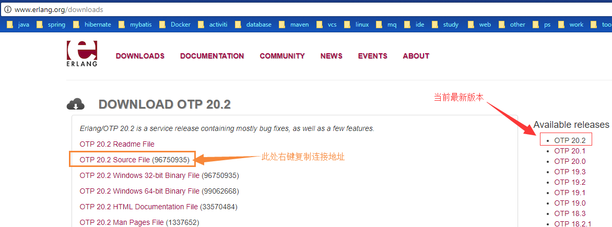
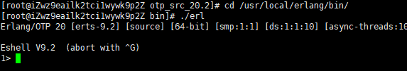
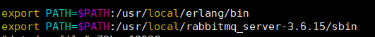

# [Centos7 上安装配置 RabbitMQ](https://www.cnblogs.com/xrog/p/8519967.html)

## 前言：    

　　最近服务器上搭建了一下rabbitmq， 网上找了很多教程, 采了灰常灰常多的坑。

　　现在终于从坑里面爬出来了。赶紧写下来，避免下次掉坑里面

## 一、安装Erlang环境必须与RabbitMQ版本匹配

[官方版本匹配查询](<https://www.rabbitmq.com/which-erlang.html>)

　　网上百度了不少安装erlang的教程，大部分都是安装到一半就他丫的翻车了，搞得我好心累　

　　1、在安装erlang之前先安装下依赖文件(这一步不要忘掉了， 不然后面`./configure`的时候要报错)：

```bash
[root@iZwz9eailk2tci1wywk9p2Z local]# yum install gcc glibc-devel make ncurses-devel openssl-devel xmlto
```

　　2、到erlang官网去下载erlang安装包

　　　　官网地址：<http://www.erlang.org/downloads>

　　　　作为一名强迫症患者，我当然是选择现在最新版本啦。右键复制连接地址，用wget进行下载

```bash
　# 注意，最新匹配版本是otp_src_20.3.tar.gz
　[root@iZwz9eailk2tci1wywk9p2Z local]# wget -c http://erlang.org/download/otp_src_20.3.tar.gz　
```

　　　　

　　　　接下来解压：
```bash
[root@iZwz9eailk2tci1wywk9p2Z local]# tar -zxvf otp_src_20.3.tar.gz
[root@iZwz9eailk2tci1wywk9p2Z local]# cd otp_src_20.3/
```

　　3、编译安装( 我这里指定编译安装后放在/usr/local/erlang目录里面，这个你们可以改成其他的 )：
　　
```bash
[root@iZwz9eailk2tci1wywk9p2Z otp_src_20.2]# ./configure --prefix=/usr/local/erlang
[root@iZwz9eailk2tci1wywk9p2Z otp_src_20.2]# make && make install
```
　　4、测试安装是否成功：

```bash
[root@iZwz9eailk2tci1wywk9p2Z erlang]# cd /usr/local/erlang/bin/ 
[root@iZwz9eailk2tci1wywk9p2Z bin]# ./erl
```
　　　　若出现以下界面，则说明我们erlang配置OK了

　　　　　

　　　　输入 halt().  退出控制台， 注意，halt后面有个点哈

　　5、配置环境变量（ps:这个跟java的环境变量配置是差不多的）
```bash
[root@iZwz9eailk2tci1wywk9p2Z local]# vim /etc/profile
# 在末尾加入这么一行即可：export PATH=$PATH:/usr/local/erlang/bin　
#更新配置文件：[root@iZwz9eailk2tci1wywk9p2Z local]# source /etc/profile
```
更新之后在任意地方输入erl能进入命令行， 那么就说明配置成功了。
接下来进入我们的核心部分：配置rabbitmq 

## 二、方式一，原始安装rabbitmq,（不推荐） 

　　1、到官网下载最新安装包：<http://www.rabbitmq.com/releases/rabbitmq-server/> 
```bash
[root@iZwz9eailk2tci1wywk9p2Z local]# wget -c http://www.rabbitmq.com/releases/rabbitmq-server/v3.6.15/rabbitmq-server-generic-unix-3.6.15.tar.xz
# 解压：
[root@iZwz9eailk2tci1wywk9p2Z local]# xz -d rabbitmq-server-generic-unix-3.6.15.tar.xz 
[root@iZwz9eailk2tci1wywk9p2Z local]# tar -xvf rabbitmq-server-generic-unix-3.6.15.tar
```
　　2、配置rabbitmq的环境变量（这个跟上面的erlang配置以及java的环境变量差不多）
```bash
[root@iZwz9eailk2tci1wywk9p2Z local]# vim /etc/profile
#在末尾加入以下配置：
export PATH=$PATH:/usr/local/rabbitmq_server-3.6.15/sbin
#更新配置文件：
[root@iZwz9eailk2tci1wywk9p2Z local]# source /etc/profile
```
　　　　

　　3、rabbitmq的基本操作：

　　　　启动：`rabbitmq-server -detached`

　　　　关闭：`rabbitmqctl stop`

　　　　查看状态：`rabbitmqctl status`

## 二、方式二，rpm安装rabbitmq ,推荐

- 下载地址 https://github.com/rabbitmq/rabbitmq-server/releases/tag/rabbitmq_v3_6_15

- 安装

  ```bash
  rpm -ivh --nodeps rabbitmq-server-3.6.15-1.el6.noarch.rpm
  ##生成配置文件
  cp /usr/share/doc/rabbitmq-server-3.6.15/rabbitmq.config.example /etc/rabbitmq/rabbitmq.config
  ##启动rabbitmq
  service rabbitmq-server start 
  ```

- 注意事项

1.  rpm -ivh rabbitmq-server-3.6.12-1.el6.noarch.rpm时报以下错误？

error: Failed dependencies: erlang >= R16B-03 is needed by rabbitmq-server-3.6.6-1.el6.noarch socat is needed by rabbitmq-server-3.6.6-1.el6.noarch

解决方案：http://blog.csdn.net/yunfeng482/article/details/72853983

2.  运行service rabbitmq-server start一直无法启动，提示'/usr/lib/rabbitmq/bin/rabbitmq-server: line 50: erl: command not found'？

解决方法：

是因为环境变量不同，导致无法找到相应命令，按照指引将erlang的erl软连接到/usr/bin目录下，运行以下命令。
```bash
[root@rabbitmqserver bin]# ln -s /usr/erlang/bin/erl /usr/bin/erl
```

- 开机自启动

  ```bash
  [root@rabbitmqserver bin]# chkconfig rabbitmq-server on
  ```

- 常用命令

  ```bash
  service rabbitmq-server start #启动
  service rabbitmq-server stop #停止
  service rabbitmq-server restart #重启
  service rabbitmq-server status #查看状态
  service rabbitmq-server etc #查看有哪些命令可以使用
  ```

## 配置rabbitmq网页管理插件

　　　　启用插件：
```bash
root@iZwz9eailk2tci1wywk9p2Z local]# rabbitmq-plugins enable rabbitmq_management
```
 　　　   访问管理页面：http://localhost:15672  端口默认为15672

　　　　　　

　　　　默认来宾用户：guest， 来宾用户密码：guest,  只能用localhost访问

　　**5、开启rabbitmq远程访问**

　　　　添加用户: `rabbitmqctl add_user jrtz jrtz0731`　　//jrtz是用户名， jrtz0731是用户密码

​               修改用户的密码:  `rabbitmqctl change_password jrtz investoday`

​               删除一个用户:  `rabbitmqctl delete_user Username`

​               查看当前用户列表: `rabbitmqctl list_users`

　　　　添加权限:  `rabbitmqctl set_permissions -p "/" jrtz ".*" ".*" ".*"`

　　　　修改用户角色:  `rabbitmqctl set_user_tags jrtz administrator`

　　　　然后就可以远程访问了，然后可直接配置用户权限等信息

​         6、用户权限

​       用户权限指的是用户对exchange，queue的操作权限，包括配置权限，读写权限。配置权限会影响到exchange，queue的声明和删除。读写权限影响到从queue里取消息，向exchange发送消息以及queue和exchange的绑定(bind)操作。

例如： 将queue绑定到某exchange上，需要具有queue的可写权限，以及exchange的可读权限；向exchange发送消息需要具有exchange的可写权限；从queue里取数据需要具有queue的可读权限。详细请参考[官方文档](http://www.rabbitmq.com/access-control.html)中"How permissions work"部分。

相关命令为：

(1) 设置用户权限

```
rabbitmqctl  set_permissions  -p  VHostPath  User  ConfP  WriteP  ReadP
```

(2) 查看(指定hostpath)所有用户的权限信息

```
rabbitmqctl  list_permissions  [-p  VHostPath]
```

(3) 查看指定用户的权限信息

```
rabbitmqctl  list_user_permissions  User
```

(4)  清除用户的权限信息

```
rabbitmqctl  clear_permissions  [-p VHostPath]  User
```

## 安装rabbitmq_delayed_message_exchange插件

```bash
# 检查是否有rabbitmq_delayed_message_exchange插件
rabbitmq-plugins list
```

- 下载rabbitmq_delayed_meaage_exchange

```bash
# 下载地址：http://www.rabbitmq.com/community-plugins.html 
$ wget https://dl.bintray.com/rabbitmq/community-plugins/3.6.x/rabbitmq_delayed_message_exchange/rabbitmq_delayed_message_exchange-20171215-3.6.x.zip
$ unzip rabbitmq_delayed_message_exchange-20171215-3.6.x.zip
$ mv rabbitmq_delayed_message_exchange-20171215-3.6.x.ez /usr/lib/rabbitmq/lib/rabbitmq_server-3.6.15/plugins/
```
- 安装插件

```bash
rabbitmq-plugins enable rabbitmq_delayed_message_exchange
```


#### rabbitmq常用命令

```bash
　　　　add_user        <UserName> <Password>

　　　　delete_user    <UserName>

　　　　change_password <UserName> <NewPassword>

　　　　list_users

　　　　add_vhost    <VHostPath>

　　　　delete_vhost <VHostPath>

　　　　list_vhostsset_permissions  [-p <VHostPath>] <UserName> <Regexp> <Regexp> <Regexp>

　　　　clear_permissions [-p <VHostPath>] <UserName>

　　　　list_permissions  [-p <VHostPath>]

　　　　list_user_permissions <UserName>

　　　　list_queues    [-p <VHostPath>] [<QueueInfoItem> ...]

　　　　list_exchanges [-p <VHostPath>] [<ExchangeInfoItem> ...]

　　　　list_bindings  [-p <VHostPath>]

　　　　list_connections [<ConnectionInfoItem> ...]
```


参考：<https://www.linuxidc.com/Linux/2016-03/129557.htm>