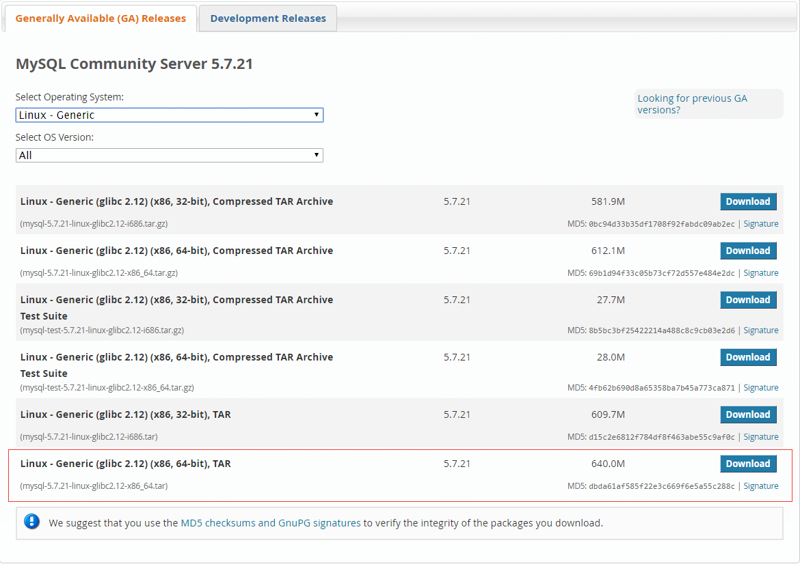

# [CentOS 7离线安装MySQL 5.7](https://www.jellythink.com/archives/14)

2018-03-03 分类：[环境配置](https://www.jellythink.com/system-operation-maintenance/env-configuration) / [系统运维](https://www.jellythink.com/system-operation-maintenance) 阅读(30774)	评论(23)

# 前言

网上已经有那么多的关于CentOS 7如何安装MySQL的文章了， 那为什么我还要写这没一篇关于CentOS 7安装MySQL的文章呢？主要有以下几个原因：

- 网上很多都是在线安装；由于很多时候，在生产环境进行部署时，生产机器都是不可能直接连公网的，导致网上很多的文章没有借鉴意义；
- 网上很多文章都比较旧，安装的MySQL版本也比较旧，没有进行更新，导致很多步骤在新的MySQL版本安装上不适用；
- 网上很多文章本身就是错的，很容易误导读者；我曾经就被误导过；

为了总结一篇实用的，不误导大家的文章，也让搜索到我这篇文章的读者们不用再浪费时间去搜索别的安装教程，节省大家的时间，所以抽点时间把如何在CentOS 7下离线安装MySQL的步骤进行详细的总结；为大家图个方便，也为自己做个笔记和总结。

# 前期准备

1. MySQL 5.7 Linux安装包下载：https://dev.mysql.com/downloads/mysql/

   

2. 查询并卸载系统自带的Mariadb

   ```bash
   rpm -qa | grep mariadb
   rpm -e --nodeps 文件名
   ```

# 安装实施

1. 为了方便数据库管理，对于安装的MySQL数据库，生产上我们都会建立一个mysql用户和mysql用户组：

   ```bash
   # 添加mysql用户组
   groupadd mysql
   # 添加mysql用户
   useradd -g mysql mysql -d /home/mysql
   # 修改mysql用户的登陆密码
   passwd mysql
   ```

2. 创建临时目录、数据目录和日志目录

   ```bash
   mkdir -p /home/mysql/3306/data
   mkdir -p /home/mysql/3306/log
   mkdir -p /home/mysql/3306/tmp
   chown -R mysql:mysql 3306
   ```

3. 将下载的 `mysql-5.7.21-linux-glibc2.12-x86_64.tar` **安装包上传至服务器 `/usr/local`目录下**；

   ```bash
   cd /usr/local
   # 解压缩
   tar -xvf mysql-5.7.21-linux-glibc2.12-x86_64.tar
   # 会得到一个mysql-5.7.21-linux-glibc2.12-x86_64.tar.gz文件，再解压缩
   tar -zxvf mysql-5.7.21-linux-glibc2.12-x86_64.tar.gz
   # 建立软链接，便于以后版本升级
   ln -s mysql-5.7.21-linux-glibc2.12-x86_64 mysql
   # 修改mysql文件夹下所有文件的用户和用户组
   chown -R mysql:mysql mysql/
   ```

4. 创建配置文件

   ```bash
   # 创建配置文件,在my.cnf文件中添加对应的配置项，
   # 文章末尾会提供一个默认的my.cnf配置
   vi /etc/my.cnf
   ```

5. 安装数据库

   ```bash
   # 初始化数据库，并指定启动mysql的用户
   ./mysqld --initialize --user=mysql
   ```

   > 这里最好指定启动mysql的用户名，否则就会在启动MySQL时出现权限不足的问题

   安装完成后，在my.cnf中配置的 /home/mysql/3306/log 目录下生成一个error.log文件，里面记录了**root用户的随机密码**。比如下面的 XXXXXXX

   ```
   2020-11-01T08:57:13.261711Z 1 [Note] A temporary password is generated for root@localhost: XXXXXXX
   ```

   

6. 设置开机自启动服务

   ```bash
   # 复制启动脚本到资源目录
   cp ./support-files/mysql.server /etc/rc.d/init.d/mysqld
   # 增加mysqld服务控制脚本执行权限
   chmod +x /etc/rc.d/init.d/mysqld
   # 将mysqld服务加入到系统服务
   chkconfig --add mysqld
   # 检查mysqld服务是否已经生效
   chkconfig --list mysqld
   # 切换至mysql用户，启动mysql
   service mysqld start
   ```

7. 配置环境变量

   为了更好的操作mysql，配置环境变量。

   ```bash
   # 切换至mysql用户
   su - mysql
   # 修改配置文件，增加export PATH=$PATH:/usr/local/mysql/bin
   vi .bash_profile
   # 立即生效
   source .bash_profile
   ```

8. 登陆，修改密码

   ```bash
   # 登陆mysql
   mysql -uroot -p
   # 修改root用户密码
   set password for root@localhost=password("invest0755");
   ```

# 总结

好了，到此关于CentOS 7离线安装MySQL5.7的总结完毕。如果大家有任何疑问，或者在安装过程中卡住了，都可以在下方留言。希望我的这篇文章对大家有帮助。

# 附录

下述的 /etc/my.cnf 配置仅供参考，如果你有更好的建议，请告诉我。

```properties
[client]                                        # 客户端设置，即客户端默认的连接参数
port = 3306                                    # 默认连接端口
socket = /home/mysql/3306/tmp/mysql.sock                        # 用于本地连接的socket套接字，mysqld守护进程生成了这个文件

[mysqld]                                        # 服务端基本设置
# 基础设置
server-id = 1                                  # Mysql服务的唯一编号 每个mysql服务Id需唯一
port = 3306                                    # MySQL监听端口
basedir = /usr/local/mysql                      # MySQL安装根目录
datadir = /home/mysql/3306/data                      # MySQL数据文件所在位置
tmpdir  = /home/mysql/3306/tmp                                  # 临时目录，比如load data infile会用到
socket = /home/mysql/3306/tmp/mysql.sock        # 为MySQL客户端程序和服务器之间的本地通讯指定一个套接字文件
pid-file = /home/mysql/3306/log/mysql.pid      # pid文件所在目录
skip_name_resolve = 1                          # 只能用IP地址检查客户端的登录，不用主机名
character-set-server = utf8mb4                  # 数据库默认字符集,主流字符集支持一些特殊表情符号（特殊表情符占用4个字节）
transaction_isolation = READ-COMMITTED          # 事务隔离级别，默认为可重复读，MySQL默认可重复读级别
collation-server = utf8mb4_general_ci          # 数据库字符集对应一些排序等规则，注意要和character-set-server对应
init_connect='SET NAMES utf8mb4'                # 设置client连接mysql时的字符集,防止乱码
lower_case_table_names = 1                      # 是否对sql语句大小写敏感，1表示不敏感
max_connections = 400                          # 最大连接数
max_connect_errors = 1000                      # 最大错误连接数
explicit_defaults_for_timestamp = true          # TIMESTAMP如果没有显示声明NOT NULL，允许NULL值
max_allowed_packet = 128M                      # SQL数据包发送的大小，如果有BLOB对象建议修改成1G
interactive_timeout = 1800                      # MySQL连接闲置超过一定时间后(单位：秒)将会被强行关闭
wait_timeout = 1800                            # MySQL默认的wait_timeout值为8个小时, interactive_timeout参数需要同时配置才能生效
tmp_table_size = 16M                            # 内部内存临时表的最大值 ，设置成128M；比如大数据量的group by ,order by时可能用到临时表；超过了这个值将写入磁盘，系统IO压力增大
max_heap_table_size = 128M                      # 定义了用户可以创建的内存表(memory table)的大小
query_cache_size = 0                            # 禁用mysql的缓存查询结果集功能；后期根据业务情况测试决定是否开启；大部分情况下关闭下面两项
query_cache_type = 0

# 用户进程分配到的内存设置，每个session将会分配参数设置的内存大小
read_buffer_size = 2M                          # MySQL读入缓冲区大小。对表进行顺序扫描的请求将分配一个读入缓冲区，MySQL会为它分配一段内存缓冲区。
read_rnd_buffer_size = 8M                      # MySQL的随机读缓冲区大小
sort_buffer_size = 8M                          # MySQL执行排序使用的缓冲大小
binlog_cache_size = 1M                          # 一个事务，在没有提交的时候，产生的日志，记录到Cache中；等到事务提交需要提交的时候，则把日志持久化到磁盘。默认binlog_cache_size大小32K

back_log = 130                                  # 在MySQL暂时停止响应新请求之前的短时间内多少个请求可以被存在堆栈中；官方建议back_log = 50 + (max_connections / 5),封顶数为900

# 日志设置
log_error = /home/mysql/3306/log/error.log                          # 数据库错误日志文件
slow_query_log = 1                              # 慢查询sql日志设置
long_query_time = 1                            # 慢查询时间；超过1秒则为慢查询
slow_query_log_file = /home/mysql/3306/log/slow.log                  # 慢查询日志文件
log_queries_not_using_indexes = 1              # 检查未使用到索引的sql
log_throttle_queries_not_using_indexes = 5      # 用来表示每分钟允许记录到slow log的且未使用索引的SQL语句次数。该值默认为0，表示没有限制
min_examined_row_limit = 100                    # 检索的行数必须达到此值才可被记为慢查询，查询检查返回少于该参数指定行的SQL不被记录到慢查询日志
expire_logs_days = 5                            # MySQL binlog日志文件保存的过期时间，过期后自动删除

# 主从复制设置
log-bin = mysql-bin                            # 开启mysql binlog功能
binlog_format = ROW                            # binlog记录内容的方式，记录被操作的每一行
binlog_row_image = minimal                      # 对于binlog_format = ROW模式时，减少记录日志的内容，只记录受影响的列

# Innodb设置
innodb_open_files = 500                        # 限制Innodb能打开的表的数据，如果库里的表特别多的情况，请增加这个。这个值默认是300
innodb_buffer_pool_size = 64M                  # InnoDB使用一个缓冲池来保存索引和原始数据，一般设置物理存储的60% ~ 70%；这里你设置越大,你在存取表里面数据时所需要的磁盘I/O越少
innodb_log_buffer_size = 2M                    # 此参数确定写日志文件所用的内存大小，以M为单位。缓冲区更大能提高性能，但意外的故障将会丢失数据。MySQL开发人员建议设置为1－8M之间
innodb_flush_method = O_DIRECT                  # O_DIRECT减少操作系统级别VFS的缓存和Innodb本身的buffer缓存之间的冲突
innodb_write_io_threads = 4                    # CPU多核处理能力设置，根据读，写比例进行调整
innodb_read_io_threads = 4
innodb_lock_wait_timeout = 120                  # InnoDB事务在被回滚之前可以等待一个锁定的超时秒数。InnoDB在它自己的锁定表中自动检测事务死锁并且回滚事务。InnoDB用LOCK TABLES语句注意到锁定设置。默认值是50秒
innodb_log_file_size = 32M                      # 此参数确定数据日志文件的大小，更大的设置可以提高性能，但也会增加恢复故障数据库所需的时间
```

### 性能测试（仅测试，不推荐常用）

```properties
sync_binlog = 0 #表示binlog不实时刷盘，由操作系统控制什么时候刷新缓存持久化
innodb_flush_log_at_trx_commit = 0  #表示不是每一个事务提交时写一次redo
innodb_buffer_pool_size = 内存的70%   #调大缓冲池
```

### 基本命令

查看配置变量

```bash
show global variables;
show variables like 'innodb_buffer_pool_size%'; 

```

创建用户, 可以使用通配符%

```bash
CREATE USER 'username'@'192.168.1%' IDENTIFIED BY 'password';
# 查看
SELECT host, user FROM user;
# 修改用户host
UPDATE user SET host = '%' WHERE user = 'root';
# 修改密码
SET PASSWORD FOR 'username'@'host' = PASSWORD('newpassword');
# 删除用户
DROP USER 'username'@'host';
```

授权

```bash
GRANT all privileges ON jrtz_hg.* TO 'username'@'192.168.1%'' identified by '密码';
GRANT select,INSERT,update,delete ON jrtz_hg.* TO 'username'@'192.168.1%' identified by '密码';
flush privileges;
# 查看
show grants;
# 撤销授权
REVOKE ALL ON jrtz_hg.* TO 'username'@'192.168.1%'' identified by '密码';
```


# 安装错误说明

一、在安装过程中出现`./mysqld: error while loading shared libraries: libaio.so.1: cannot open shared object file: No such file or directory`错误时，请切回root用户，执行以下命令即可：

```bash
yum install libaio
```

---

### 备份常用指令
```
/usr/local/mysql/bin/mysqldump --all-databases --single-transaction --master-data=2 --set-gtid-purged=off -F --triggers --routines --events  --user=root -p --socket=/data/mysql3306/logs/mysql.sock > all111_0423.sql
```