# [Spark在Windows下的环境搭建](https://www.cnblogs.com/xuliangxing/p/7279662.html)

本文主要是讲解Spark在Windows环境是如何搭建的

# 一、JDK的安装

#### 1、1 下载JDK

　　首先需要安装JDK，并且将环境变量配置好，如果已经安装了的老司机可以忽略。**JDK**（全称是JavaTM Platform Standard Edition Development Kit）的安装，去Oracle官网下载，下载地址是[Java SE Downloads](http://www.oracle.com/technetwork/java/javase/downloads/index.html) 。

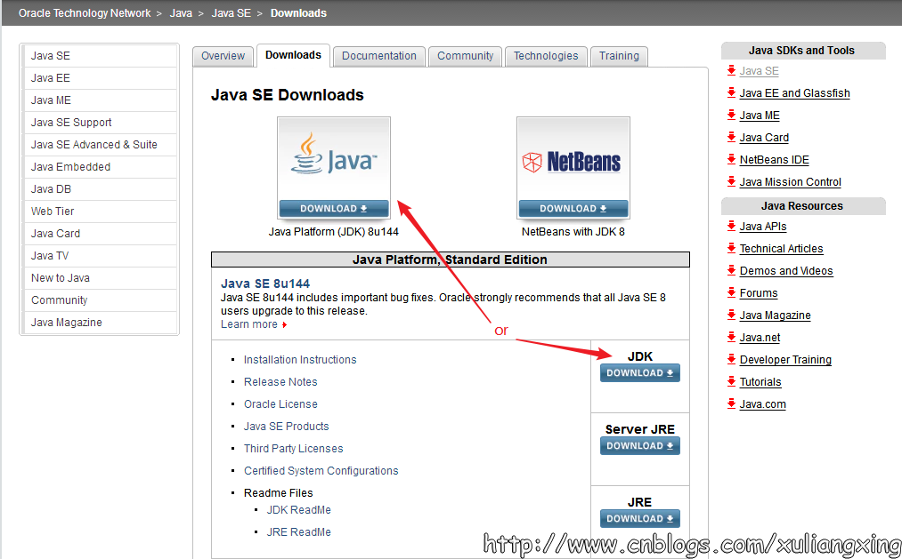

　　上图中两个用红色标记的地方都是可以点击的，点击进去之后可以看到这个最新版本的一些更为详细的信息，如下图所示：

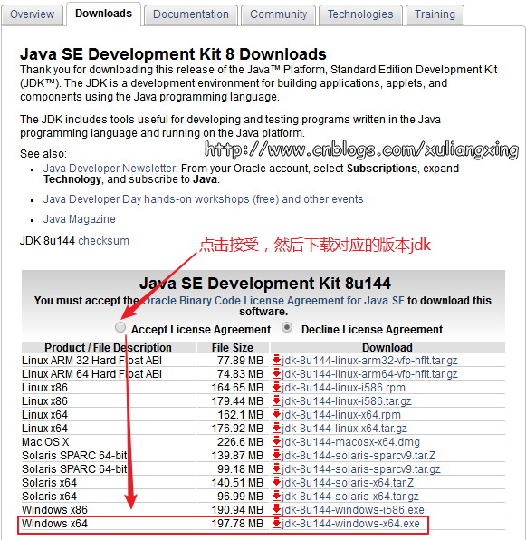

　　下载完之后，我们安装就可以直接JDK，JDK在windows下的安装非常简单，按照正常的软件安装思路去双击下载得到的exe文件，然后设定你自己的安装目录（这个安装目录在设置环境变量的时候需要用到）即可。

#### 1、2 JDK环境变量设置

　　接下来设置相应的环境变量，设置方法为：在桌面右击【计算机】－－【属性】－－【高级系统设置】，然后在系统属性里选择【高级】－－【环境变量】，然后在系统变量中找到**“Path”**变量，并选择**“编辑”**按钮后出来一个对话框，可以在里面添加上一步中所安装的JDK目录下的bin文件夹路径名，我这里的bin文件夹路径名是：C:\Program Files\Java\jre1.8.0_92\bin，所以将这个添加到path路径名下，注意用英文的分号“;”进行分割。如图所示：


　　这样设置好后，便可以在任意目录下打开的cmd命令行窗口下运行下面命令。查看是否设置成功。

```
java -version
```

　　观察是否能够输出相关java的版本信息，如果能够输出，说明JDK安装这一步便全部结束了。如图所示：

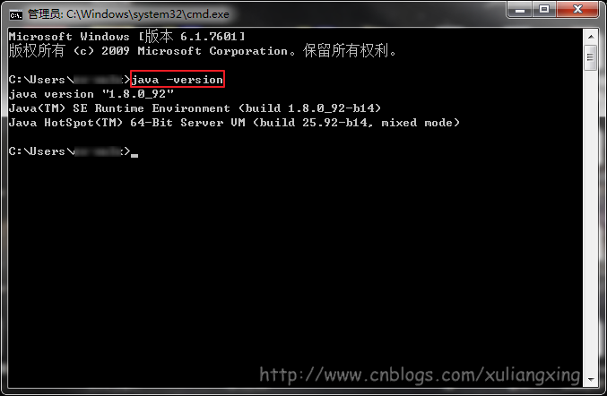

# 二、Scala的安装

　　我们从官网：<http://www.scala-lang.org/> 下载Scala，最新的版本为2.12.3，如图所示

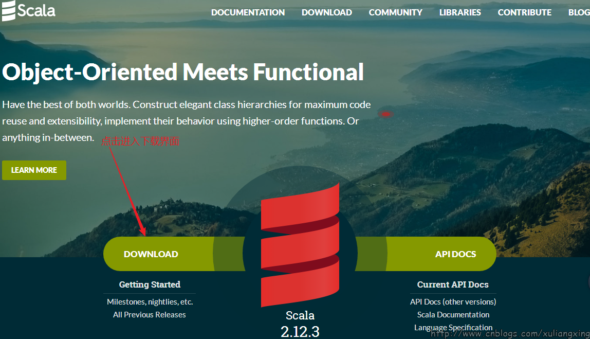

因为我们是在Windows环境下，这也是本文的目的，我们选择对应的Windows版本下载，如图所示：

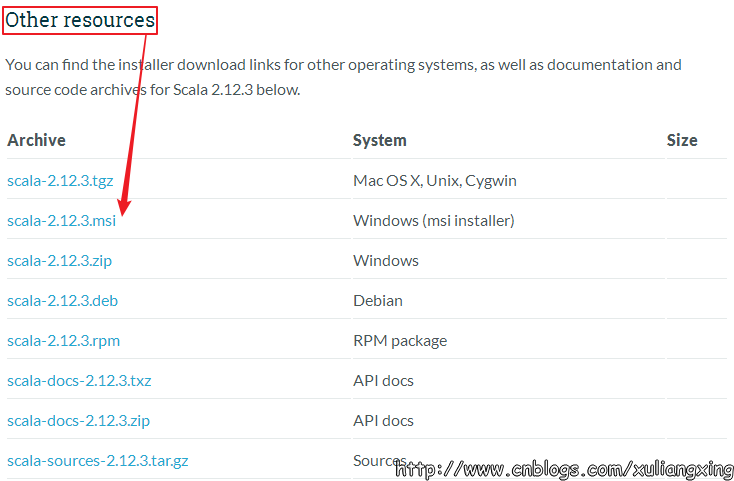

　　下载得到Scala的msi文件后，可以双击执行安装。安装成功后，默认会将Scala的bin目录添加到**PATH**系统变量中去（如果没有，和上面JDK安装步骤中类似，将Scala安装目录下的bin目录路径，添加到系统变量**PATH**中），为了验证是否安装成功，开启一个新的cmd窗口，输入`scala`然后回车，如果能够正常进入到Scala的交互命令环境则表明安装成功。如下图所示：

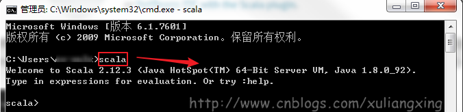

备注：如果不能显示版本信息，并且未能进入Scala的交互命令行，通常有两种可能性： 
1、Path系统变量中未能正确添加Scala安装目录下的bin文件夹路径名，按照JDK安装中介绍的方法添加即可。 
2、Scala未能够正确安装，重复上面的步骤即可。

# 三、Spark的安装

我们到Spark官网进行下载：<http://spark.apache.org/> ，我们选择带有Hadoop版本的Spark，如图所示：

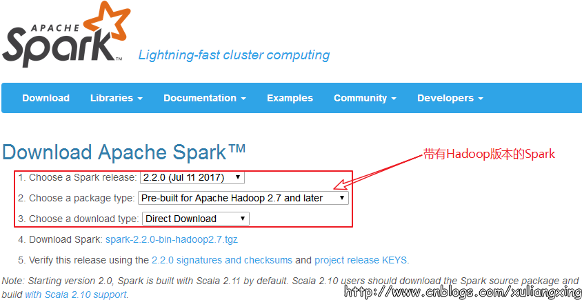

　　下载后得到了大约200M的文件： spark-2.2.0-bin-hadoop2.7

　　这里使用的是Pre-built的版本，意思就是已经编译了好了，下载来直接用就好，Spark也有源码可以下载，但是得自己去手动编译之后才能使用。下载完成后将文件进行解压（可能需要解压两次），最好解压到一个盘的根目录下，并重命名为Spark，简单不易出错。并且需要注意的是，在Spark的文件目录路径名中，不要出现空格，类似于“Program Files”这样的文件夹名是不被允许的。我们在C盘新建一个Spark文件夹存放，如图所示：


　　解压后基本上就差不多可以到cmd命令行下运行了。但这个时候每次运行spark-shell（spark的命令行交互窗口）的时候，都需要先`cd`到Spark的安装目录下，比较麻烦，因此可以将Spark的bin目录添加到系统变量**PATH**中。例如我这里的Spark的bin目录路径为`D:\Spark\bin`，那么就把这个路径名添加到系统变量的**PATH**中即可，方法和JDK安装过程中的环境变量设置一致，设置完系统变量后，在任意目录下的cmd命令行中，直接执行`spark-shell`命令，即可开启Spark的交互式命令行模式。

　　系统变量设置后，就可以在任意当前目录下的cmd中运行spark-shell，但这个时候很有可能会碰到各种错误，这里主要是因为Spark是基于hadoop的，所以这里也有必要配置一个Hadoop的运行环境。错误如图所示：

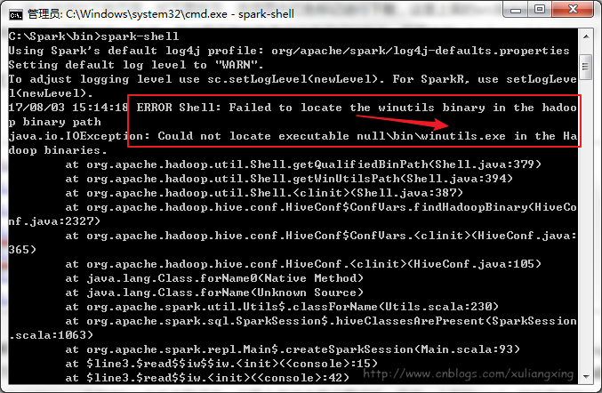

接下来，我们还需要安装Hadoop。

# 四、Hadoop的安装

　　在[Hadoop Releases](https://archive.apache.org/dist/hadoop/common/)里可以看到Hadoop的各个历史版本，这里由于下载的Spark是基于Hadoop 2.7的（在Spark安装的第一个步骤中，我们选择的是`Pre-built for Hadoop 2.7`），我这里选择2.7.1版本，选择好相应版本并点击后，进入详细的下载页面，如下图所示：

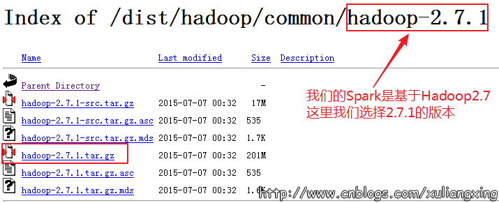

　　选择图中红色标记进行下载，这里上面的src版本就是源码，需要对Hadoop进行更改或者想自己进行编译的可以下载对应src文件，我这里下载的就是已经编译好的版本，即图中的“hadoop-2.7.1.tar.gz”文件。

下载并解压到指定目录，，我这里是C:\Hadoop，如图所示：


然后到环境变量部分设置**HADOOP_HOME**为Hadoop的解压目录，如图所示：


然后再设置该目录下的bin目录到系统变量的**PATH**下，我这里也就是C:\Hadoop\bin，如果已经添加了**HADOOP_HOME**系统变量，也可用%HADOOP_HOME%\bin来指定bin文件夹路径名。这两个系统变量设置好后，开启一个新的cmd窗口，然后直接输入`spark-shell`命令。如图所示：


　　正常情况下是可以运行成功并进入到Spark的命令行环境下的，但是对于有些用户可能会遇到空指针的错误。这个时候，主要是因为Hadoop的bin目录下没有winutils.exe文件的原因造成的。这里的解决办法是： 

　　可以去 <https://github.com/steveloughran/winutils> 选择你安装的Hadoop版本号，然后进入到bin目录下，找到`winutils.exe`文件，下载方法是点击`winutils.exe`文件，进入之后在页面的右上方部分有一个`Download`按钮，点击下载即可。 如图所示：


下载winutils.exe文件

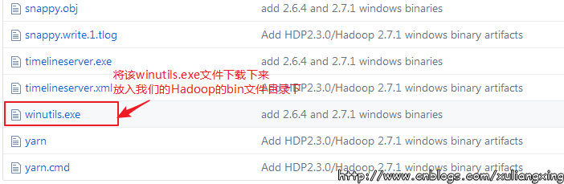
　　将下载好`winutils.exe`后，将这个文件放入到Hadoop的bin目录下，我这里是C:\Hadoop\hadoop-2.7.1\bin。

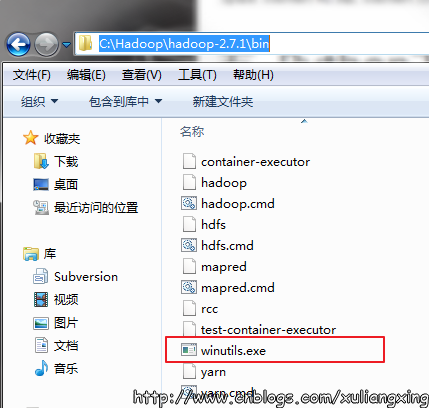
在打开的cmd中输入 

```
C:\Hadoop\hadoop-2.7.1\bin\winutils.exe chmod 777 /tmp/Hive  //修改权限，777是获取所有权限
```

但是我们发现报了一些其他的错(Linux环境下也是会出现这个错误)

```
1 <console>:14: error: not found: value spark
2        import spark.implicits._
3               ^
4 <console>:14: error: not found: value spark
5        import spark.sql
```

其原因是没有权限在spark中写入metastore_db 这个文件。

处理方法：我们授予777的权限

**Linux环境**，我们在root下操作：

```
1 sudo chmod 777 /home/hadoop/spark
2 
3 #为了方便，可以给所有的权限
4 sudo chmod a+w /home/hadoop/spark
```

**window环境下：**

存放Spark的文件夹不能设为只读和隐藏，如图所示：


授予完全控制的权限，如图所示：


经过这几个步骤之后，然后再次开启一个新的cmd窗口，如果正常的话，应该就可以通过直接输入`spark-shell`来运行Spark了。正常的运行界面应该如下图所示：

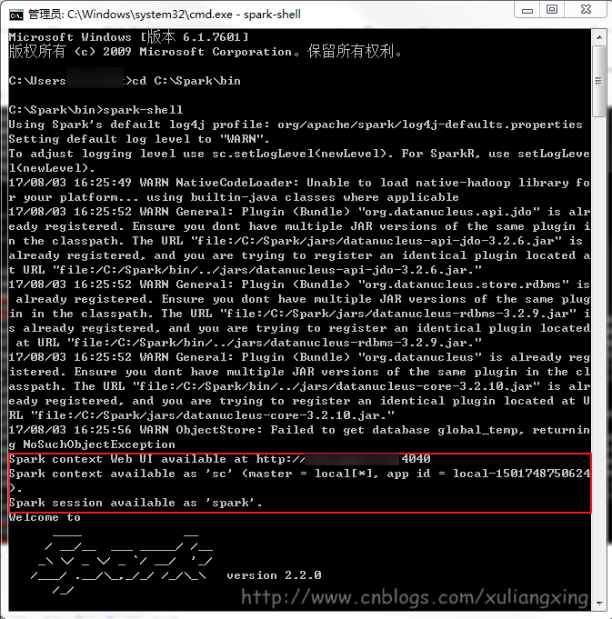

六、**Python下Spark开发环境搭建**

 下面简单讲解Python下怎么搭建Spark环境

1、将spark目录下的pyspark文件夹（C:\Spark\python\pyspark）复制到python安装目录C:\Python\Python35\Lib\site-packages里。如图所示

spark的pysaprk

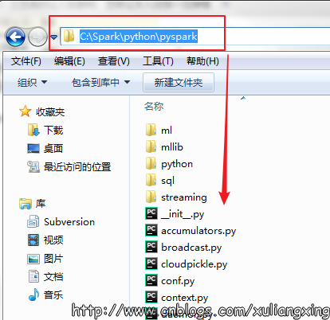

将pyspark拷贝至Python的安装的packages目录下。

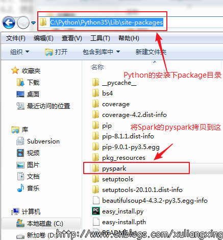
2、然后使用cd命令，进入目录D:\python27\Scripts，运行pip install py4j安装py4j库。如图所示：

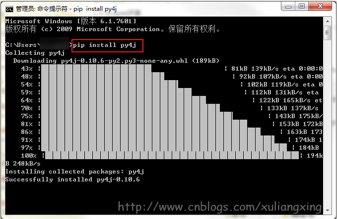

如果需要在python中或者在类似于IDEA IntelliJ或者PyCharm(笔者用的就是PyCharm)等IDE中使用PySpark的话，需要在系统变量中新建一个PYTHONPATH的系统变量，然后设置好下面变量值就可以了

```
PATHONPATH=%SPARK_HOME%\python;%SPARK_HOME%\python\lib\py4j-0.10.4-src.zip
```

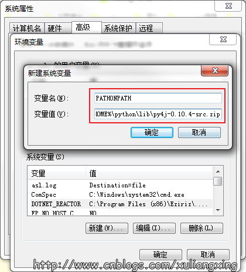

后面的事情就交给PyCharm了。

至此，Spark在Windows环境下的搭建讲解已结束。