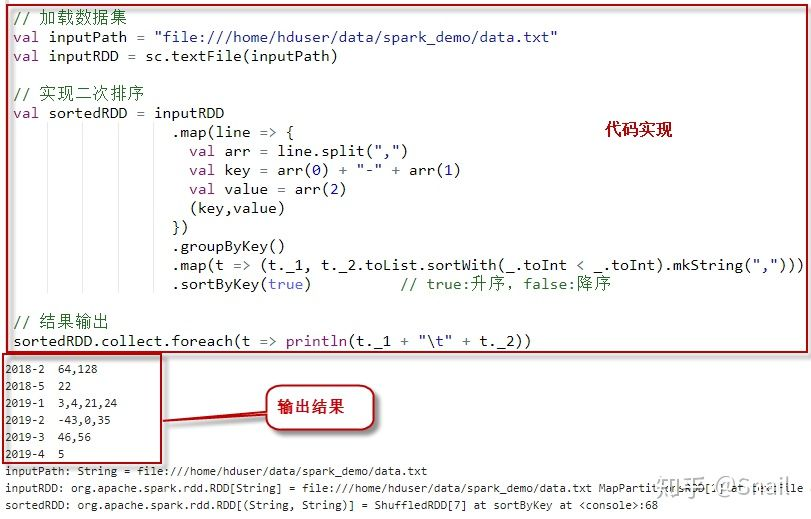
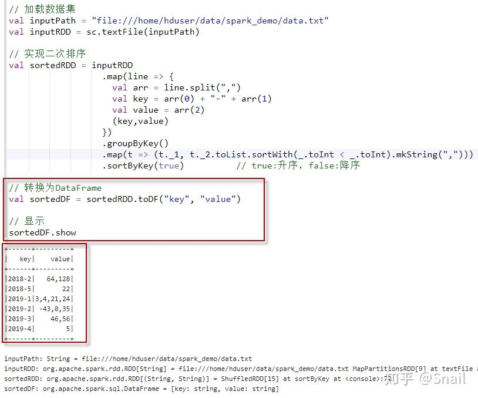
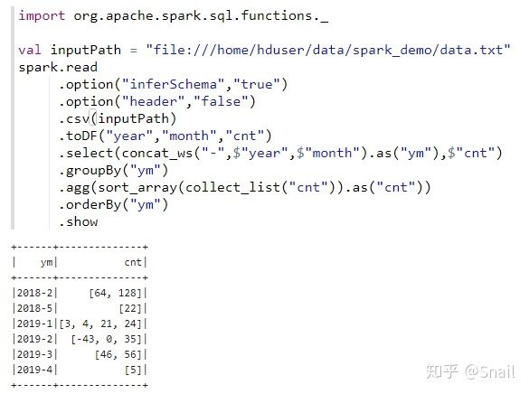

# Spark实现二次排序

2020-05-13 https://zhuanlan.zhihu.com/p/140418693

## 何为二次排序？

二次排序就是对于<key,value>类型的数据，不但按key排序，而且每个Key对应的value也是有序的。比如说，我们有这样的销售数据（年，月，销售额），我们希望在显示的时候，不但按年月升序或降序排列，而且还希望对于相同年月的销售额，也排序显示。

例如，假设我们有以下输入文件data.txt（逗号分割的分别是“年，月，总数”）：

```text
    2018,5,22
    2019,1,24
    2018,2,128
    2019,3,56
    2019,1,3
    2019,2,-43
    2019,4,5
    2019,3,46
    2018,2,64
    2019,1,4
    2019,1,21
    2019,2,35
    2019,2,0
```

我们期望的输出如下的结果：

```text
    2018-2  64,128
    2018-5  22
    2019-1  3,4,21,24
    2019-2  -43,0,35
    2019-3  46,56
    2019-4  5
```

Spark 二次排序解决思路

我们知道，Spark（包括Hadoop、Flink等）的算子都提供有默认按key进行排序的功能。所以我们只需要将年和月组合起来构成一个Key，将第三列作为value，并使用 groupByKey 函数将同一个Key的所有Value全部分组到一起，然后对同一个Key的所有Value再进行排序即可。

## 使用Spark RDD实现二次排序

```scala
// 加载数据集
val inputPath = "file:///home/hduser/data/spark/data.txt"
val inputRDD = sc.textFile(inputPath)

// 实现二次排序
val sortedRDD = inputRDD
                  .map(line => {
                    val arr = line.split(",")
                    val key = arr(0) + "-" + arr(1)
                    val value = arr(2)
                    (key,value)
                  })
                  .groupByKey()
                  .map(t => (t._1, t._2.toList.sortWith(_.toInt < _.toInt).mkString(",")))
                  .sortByKey(true)          // true:升序，false:降序

// 结果输出
sortedRDD.collect.foreach(t => println(t._1 + "\t" + t._2))
```

执行上述代码。输出结果如下：

```text
2018-2	64,128
2018-5	22
2019-1	3,4,21,24
2019-2	-43,0,35
2019-3	46,56
2019-4	5
```

执行过程截图：



最后的显示，当然也可以转换为DataFrame。如下：

```scala
// 加载数据集
val inputPath = "file:///home/hduser/data/spark_demo/data.txt"
val inputRDD = sc.textFile(inputPath)

// 实现二次排序
val sortedRDD = inputRDD
                  .map(line => {
                    val arr = line.split(",")
                    val key = arr(0) + "-" + arr(1)
                    val value = arr(2)
                    (key,value)
                  })
                  .groupByKey()
                  .map(t => (t._1, t._2.toList.sortWith(_.toInt < _.toInt).mkString(",")))
                  .sortByKey(true)          // true:升序，false:降序

// 转换为DataFrame
val sortedDF = sortedRDD.toDF("key", "value")

// 显示
sortedDF.show
```

执行上述代码。输出结果如下：

```text
+------+---------+
|   key|    value|
+------+---------+
|2018-2|   64,128|
|2018-5|       22|
|2019-1|3,4,21,24|
|2019-2| -43,0,35|
|2019-3|    46,56|
|2019-4|        5|
+------+---------+
```

执行过程截图：



## 使用Spark DataFrame实现二次排序

1、加载数据集。

```scala
// 加载数据集
val inputPath = "file:///home/hduser/data/spark_demo/data.txt"
val inputDF = spark.read 
                   .option("inferSchema","true")
                   .option("header","false")
                   .csv(inputPath)
                   .toDF("year","month","cnt")

inputDF.show
```

查看结果：

```text
+----+-----+---+
|year|month|cnt|
+----+-----+---+
|2018|    5| 22|
|2019|    1| 24|
|2018|    2|128|
|2019|    3| 56|
|2019|    1|  3|
|2019|    2|-43|
|2019|    4|  5|
|2019|    3| 46|
|2018|    2| 64|
|2019|    1|  4|
|2019|    1| 21|
|2019|    2| 35|
|2019|    2|  0|
+----+-----+---+
```

2、 查看schema。注意，因为使用了类型推断，所以 cnt 列的数据类型推断为整数类型。

```scala
df2.printSchema
```

查看结果：

```text
root
 |-- ym: string (nullable = false)
 |-- cnt: integer (nullable = true)
```

3、组合year和month为一列，并取别名"ym"。

```scala
import org.apache.spark.sql.functions._

val df2 = inputDF.select(concat_ws("-",$"year",$"month").as("ym"),$"cnt")
df2.show
```

查看结果：

```text
+------+---+
|    ym|cnt|
+------+---+
|2018-5| 22|
|2019-1| 24|
|2018-2|128|
|2019-3| 56|
|2019-1|  3|
|2019-2|-43|
|2019-4|  5|
|2019-3| 46|
|2018-2| 64|
|2019-1|  4|
|2019-1| 21|
|2019-2| 35|
|2019-2|  0|
+------+---+
```

4、对每一组的cnt列进行排序，然后对ym排序，并输出

```scala
df2.groupBy("ym")
   .agg(sort_array(collect_list("cnt")).as("cnt"))
   .orderBy("ym")
   .show
```

查看结果：

```text
+------+--------------+
|    ym|           cnt|
+------+--------------+
|2018-2|     [64, 128]|
|2018-5|          [22]|
|2019-1|[3, 4, 21, 24]|
|2019-2|  [-43, 0, 35]|
|2019-3|      [46, 56]|
|2019-4|           [5]|
+------+--------------+
```

5、最后，我们可以把上面的代码写到一步当中。

