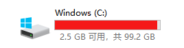
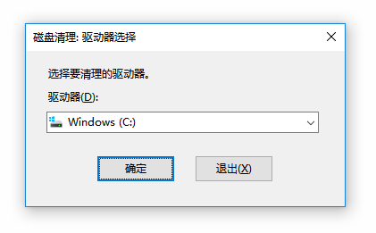
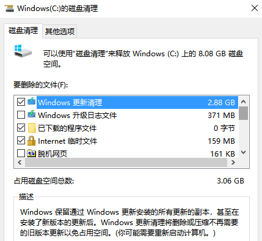
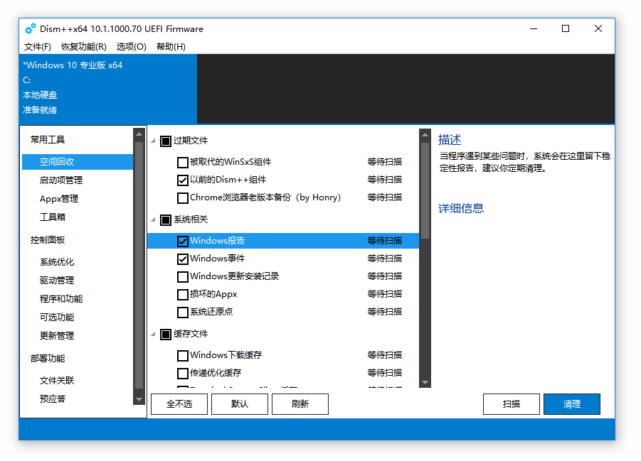
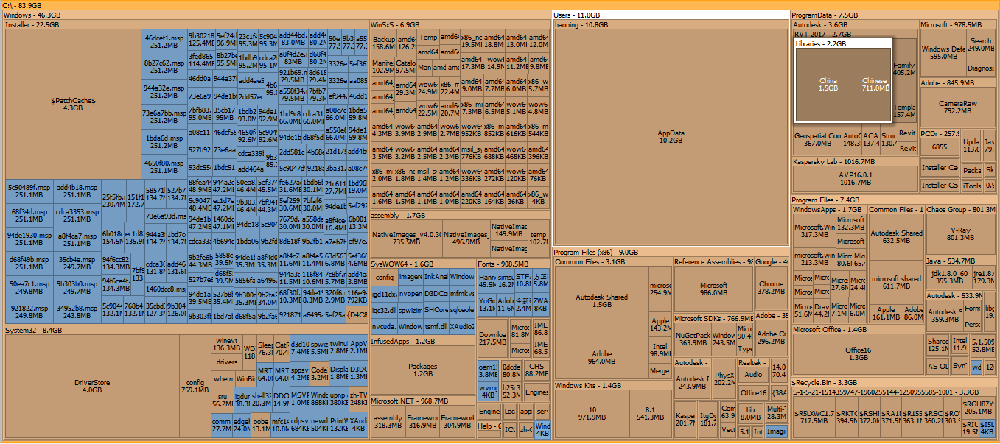
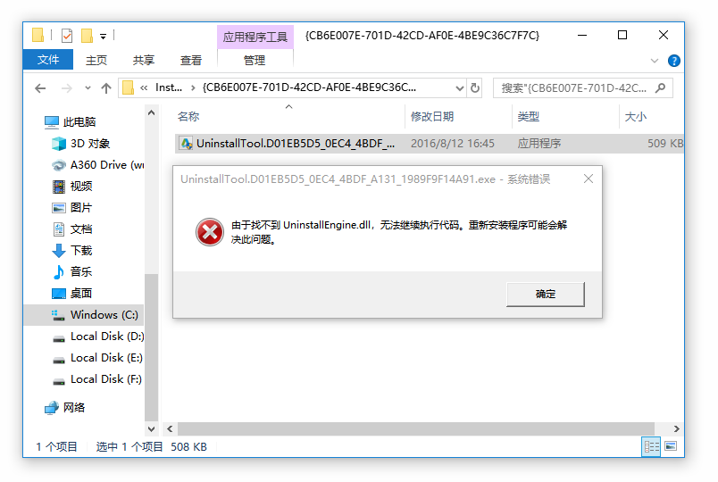
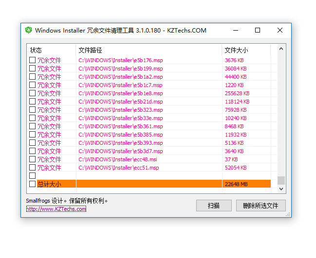
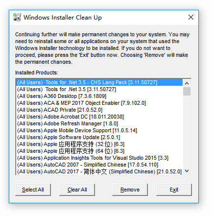

# [C盘“瘦身”计划](https://www.nousbuild.org/codeu/clean-up-windows-c-disk/)

*为什么给C盘分了100多个G，依然不够用？为什么整个128G的固态硬盘作为系统盘，不到一年C盘就用掉90%空间？你是否有这样的疑问，那么请细细看这篇文章，事实证明确实能够让你的C盘真正清理。*

先来介绍几个好朋友：

| **名称**                                | **清理率**  | **风险性** |
| --------------------------------------- | ----------- | ---------- |
| Windows 自带磁盘清理工具                | 10%左右     | 极低       |
| 开源清理工具 Dism++                     | 12%左右     | 低         |
| 磁盘分析工具 SpaceSniffer               | 8%左右      | **中**     |
| Windows Installer目录清理工具 Wicleanup | **70%以上** | **偏高**   |
| 强制删除工具 Windows Install Clean Up   | 无          | 低         |

下面开始一步一步介绍各个工具，并帮你建立独立分析的过程：

## 一、Windows 自带磁盘清理工具

Windows 磁盘清理工具是 Windows 自带的最好、最安全的清理工具，使用其方法是：

进入 **磁盘属性** → **磁盘清理** 或者直接使用**运行**：

> cleanmgr ⏎

打开之后，别忘了点击 **清理系统清理** 再次扫描。

**建议清理：**Windows 更新清理、Internet 临时文件等；

**不建议清理：**Windows 升级日志文件

完成第一步，实际上并没有清理多少，对于100G的C盘占用90多G来说，是杯水车薪的。下面开始第二步清理：

## 二、开源清理工具 Dism++

**Dism++** 是一个微软Dism的一个GUI版，能够固化补丁、Installer清理、离线集成更新、驱动等，**体积小巧、无须安装，完全免费。**

你可以根据自己的情况来选择要清理的项目，点击每一个项目，右侧栏会告诉你该项目清理的建议，可以作为一个参考。

> Dism++官网：[点击进入](https://www.chuyu.me/zh-Hans/index.html)
>
> Github 项目：[点击进入](https://github.com/Chuyu-Team)

使用 **Dism++** 清理后，你的 Windows 系统应该说是比较干净的了。但是，C盘又不是全是 Windows系统占用空间，除了 **C:\Windows 以外**，还有 **Program Files (x86)** 、**Program Files** 和 **AppData** 这几个大头。

这些文件大部分与 Windows 无关联，属于个人文件，清理工具肯定不能判断你的个人文件是否有用，这些都得你自己来决定。

## 三、磁盘分析工具 SpaceSniffer

是一款磁盘占用空间分析工具，可你帮助你清理磁盘多余文件，尤其是对于系统C盘那些不能够被各类清理软件所搞定的内容。分析完整个磁盘，你就会看见各文件/文件夹的占用情况，并根据自己的经验进行清理。

点击图片看大图，你可能会发现 **Windows Installer** 和 **Appdata** 等大文件和大文件夹，根据自己的经验，删除无用的文件。一般来说，你主要关注的文件夹就是：**Common Files、ProgranData**。

> SpaceSniffer 页面：[点击进入](https://www.nousbuild.org/codeu/space-sniffer/)
>
> SpaceSniffer官网：[点击进入](http://www.uderzo.it/main_products/space_sniffer/)

注意：一定不要动 **Windows Installer** 目录

第三步的清理，因人而异，一般来说，依旧只能清理几百兆或者几G的文件。如果清理到这一步，你觉得C盘空间差不多够用了，不用再清理了，那么你可以就此收手了。

## 清理结束 !🙂

如果你的C盘空间依旧告急，那么请你决定是否使用 **Wicleanup**，这是一个清理 Windows Installer 安装技术中产生的相关包的工具，具有一定的风险性。

## 你决定继续清理吗？

Windows Installer 安装技术是很厉害的技术，它可以将各种软件安装在 Windows系统上并稳定运行，但是 Windows Installer 安装技术有一个最大的问题，就是软件每更新、重装、升级等过程中，系统都会复制一份 **.exe**、**.msi** 或 **.msp** 等格式的包，用于软件日后的修复和卸载。

很多软件可能有好几个文件夹有卸载程序，比如我的 Autodesk AutoCAD 卸载程序，你进入 **C:\Windows\installer** 目录下会发现很多文件夹中有同一个软件的卸载程序，双击执行发现无法执行，那么此文件一定就是**冗余文件**。

## 决定了，那就开始吧！

## 四、Windows Installer目录清理工具 Wicleanup

> 下载地址：[点击下载](http://oss.nousbuild.org/download/wicleanup.zip)

运行软件，开始扫描：然后你就可以挨个删除。此软件没有多选，你可以选择第一项，然后按住 Shift 选择最后一项，再按 **空格** 进行打勾选择，然后删除所选文件。

这一次清理，应该能让你的C盘瘦身成功。一般来说 **Wicleanup** 的副作用不会太多，但是总是有风险的，所以我将建议评级设置为：**偏高风险**。但这不代表一定会产生副作用。副作用就是软件 **修复/卸载** 无法进行。如果真的遇到了这种情况，那么还有最后一个小伙伴：**Windows Install Clean Up**。

## 五、强制删除工具 Windows Install Clean Up

不能删除的软件，就使用 **Windows Install Clean Up**，只要是基于 Windows Installer 安装技术安装的软件，都可以进行暴力删除；换句话说，没有删不了的软件。

> 下载地址：[点击下载](http://oss.nousbuild.org/download/msicuu2.exe)

安装需要管理员权限，右键**以管理员的身份运行。**

安装完成后，打开来删除使用卸载程序无法删除的软件：

好了，你已经看到了文章结尾，你的C盘也应该瘦身成功了吧 🙂