# 最简单有效的Win10清理C盘的多个方法

原文链接：<https://blog.csdn.net/weixin_41024483/article/details/87550359>

> 最近发现C盘出现红色预警，在卸载了一些不常用的软件后，发现收效甚微，于是在网上寻找各种清理C盘的方法，下面是几个我找到的比较有效的方法，进行了一些整理。需要用到的工具我都上传了[链接](https://pan.baidu.com/s/1VWqvF8NgcaiNZIJT5BCagQ)
>
> 1. windows自带磁盘清理
> 2. 旧版本驱动清理
> 3. installer文件夹清理
> 4. winSxS文件夹清理
> 5. 批处理代码
> 6. 附：spacesniffer

## windows自带磁盘清理

> win10自带，安全不用说，不过清理效果并不是很好，可能也就清理几百兆。主要是为了清理windows更新带来的`windows.old`文件夹，虽然显示这个文件夹有十几个G，但是清理之后发现C盘空闲内存并没有增大多少，只有几十兆。

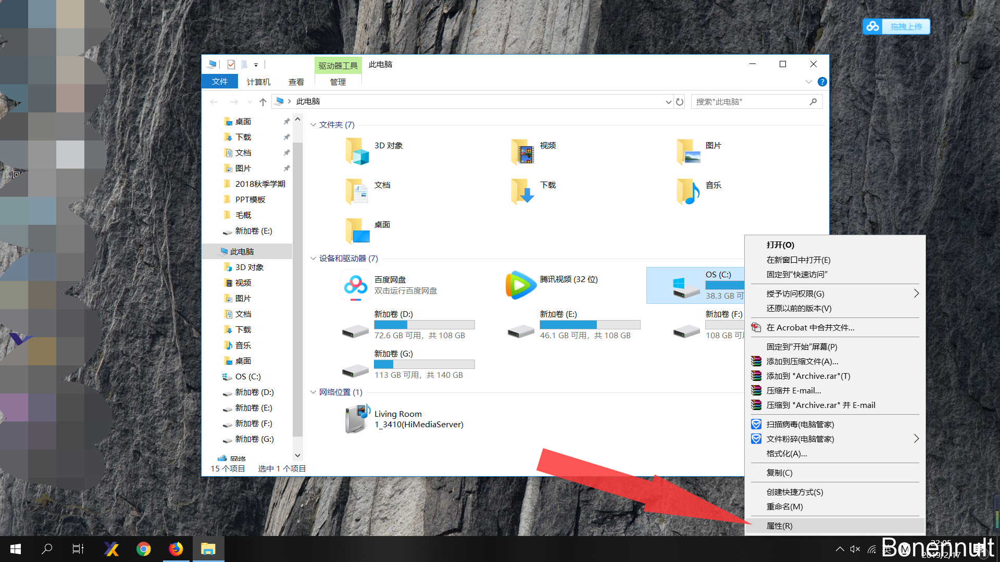
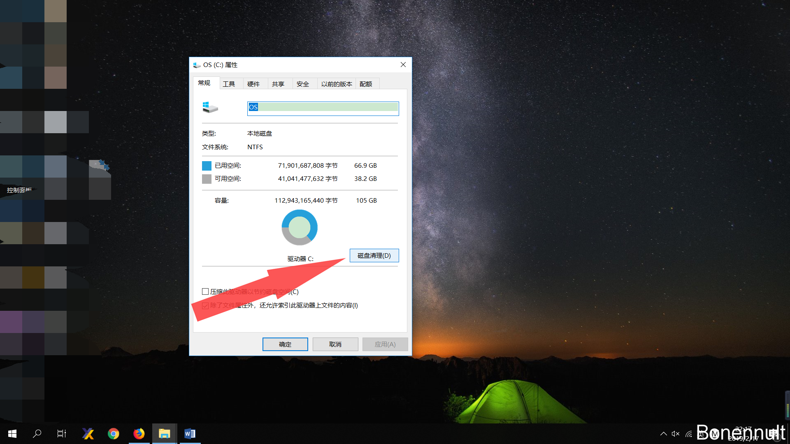
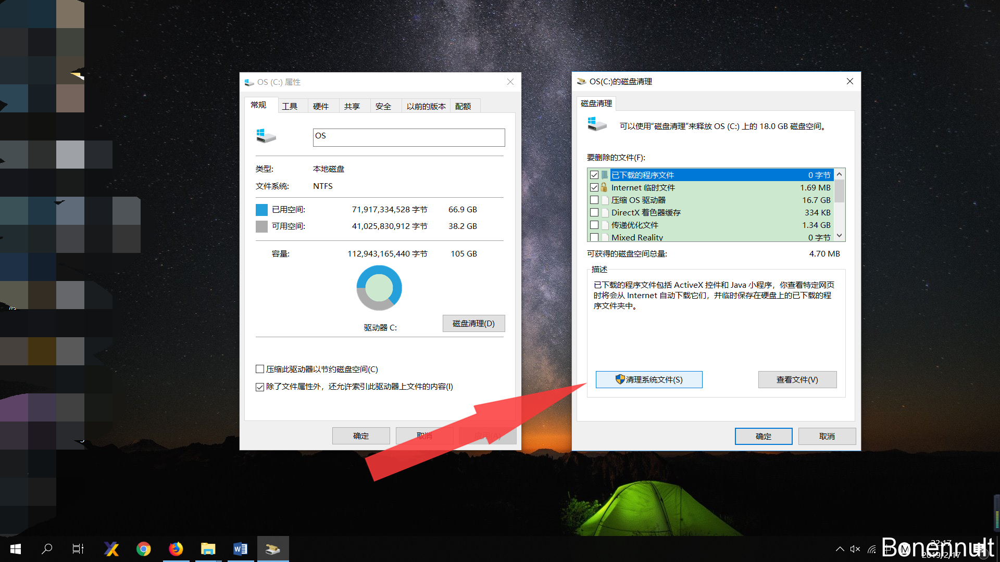
在红框里选择需要清理的文件，由于我这里之前已经清理过了，没有需要清理的大文件
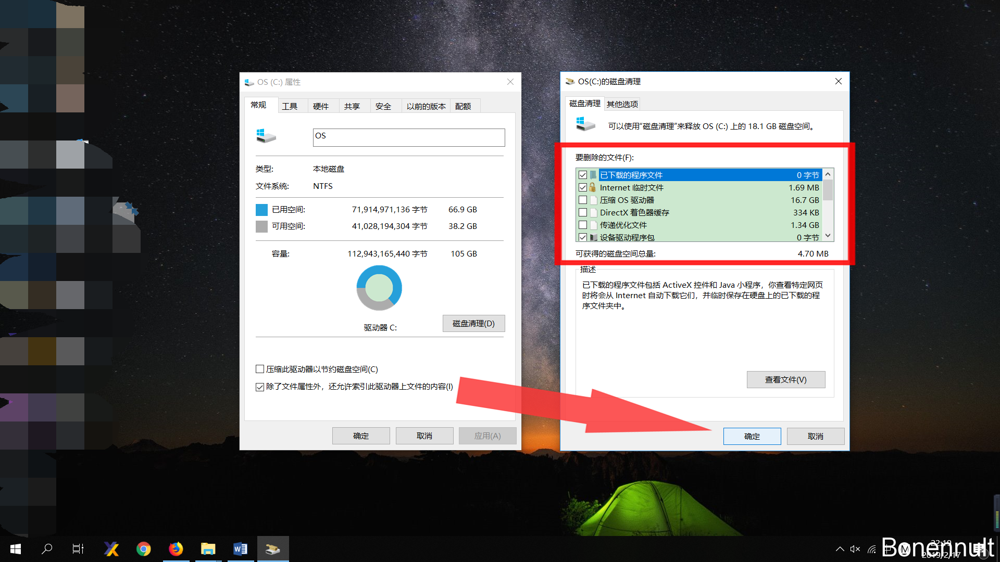

## 旧版本驱动清理

> 工具：DriverStoreExplore
> 各种驱动更新过程中，为了防止之后出问题便于回滚，并不会删除旧版本。使用这个工具可以方便的列出各种驱动及详细信息，并进行删除。

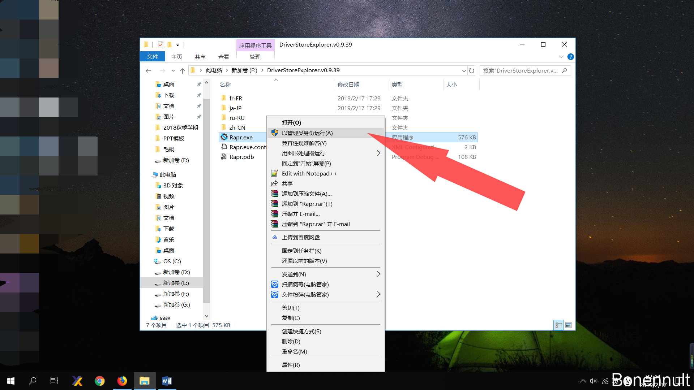

可以看到各种驱动的详细信息包括日期和大小都列了出来，可以自主选择删除哪些没用的驱动，为了方便可以直接点击“选取旧的驱动”并点击“删除驱动包”。

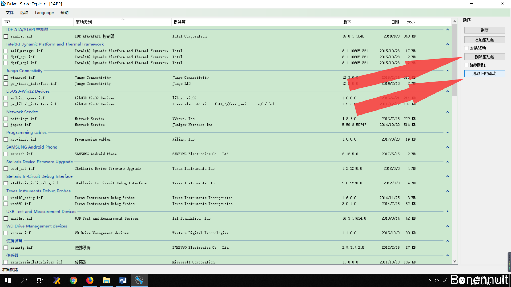

## installer文件夹清理

> 工具：WICleanup（不保证安全）
> 这里主要针对`windows/installer/`文件夹中的内容，我用spacesniffer看到这个文件夹中的内容居然有30G，清理后几乎找不到了，看来大部分内容都是没用的。

首先下载WICleanup，解压后有如下两个文件
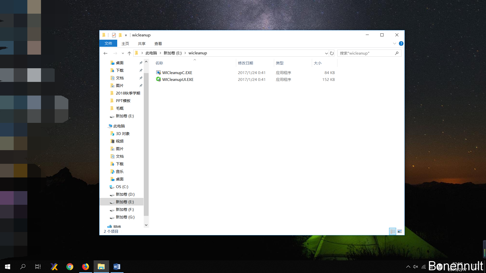使用快捷键win+R，打开cmd命令行，首先进入上面两个文件的文件夹，然后运行如下命令即可

```shell
WICleanupC.EXE -s
```

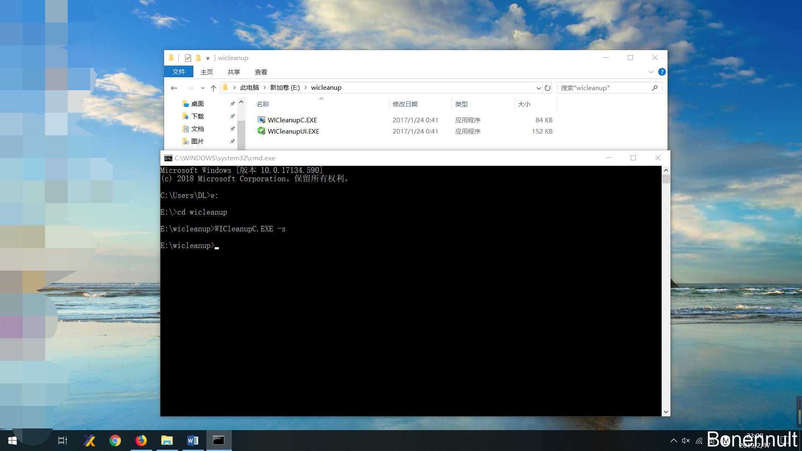

## winSxS文件夹清理

> 工具：winSxS清理工具
> 作者提醒，这个程序不能保证绝对的安全，所有后果概不承担（溜走…）

下载后解压文件如下，双击运行
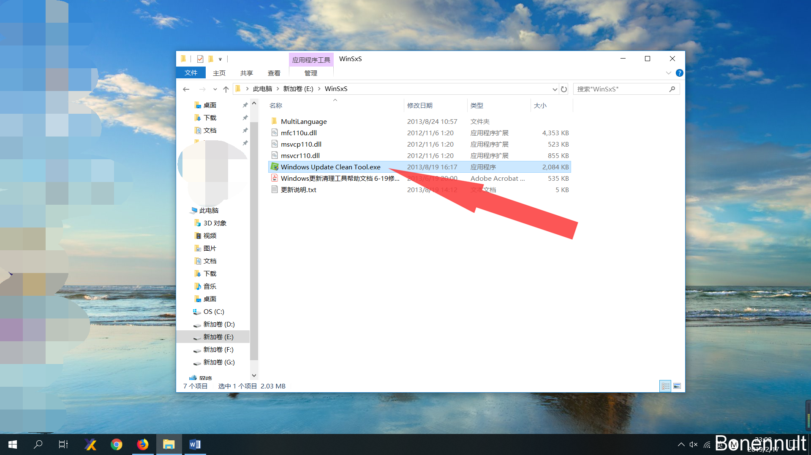
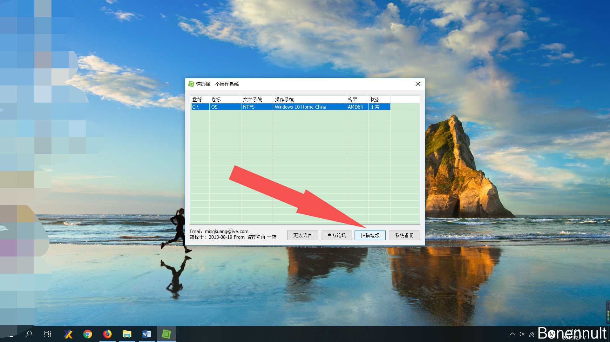
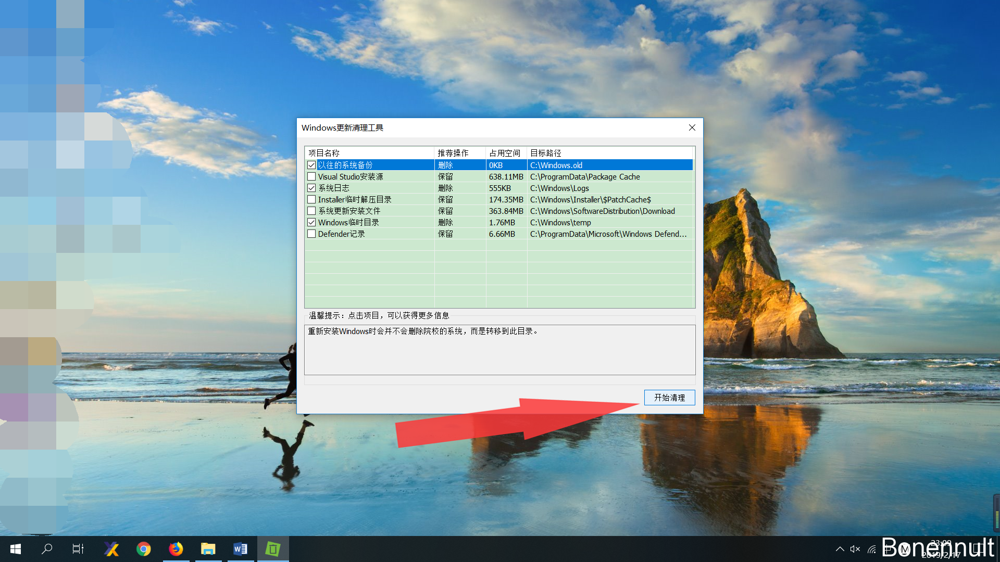
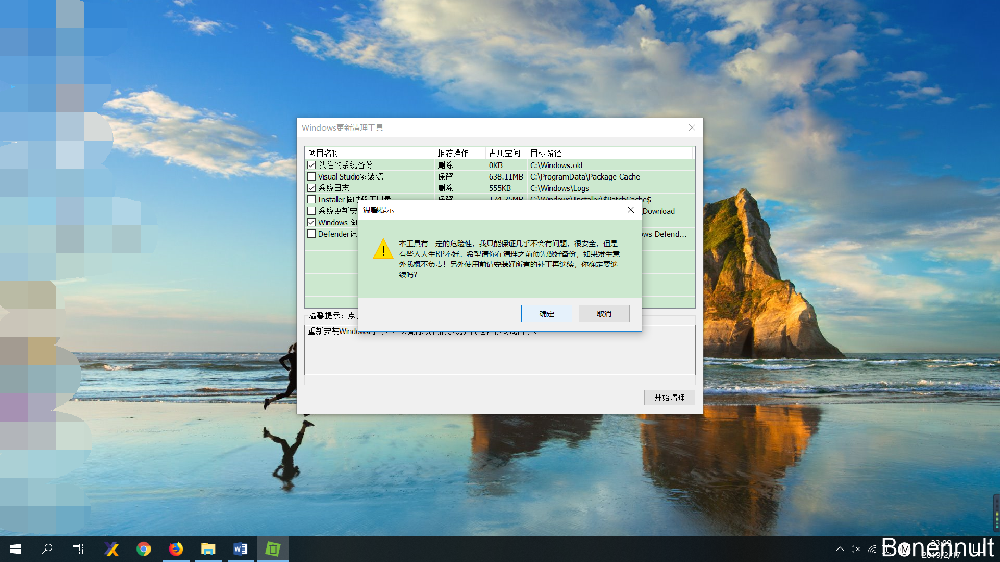
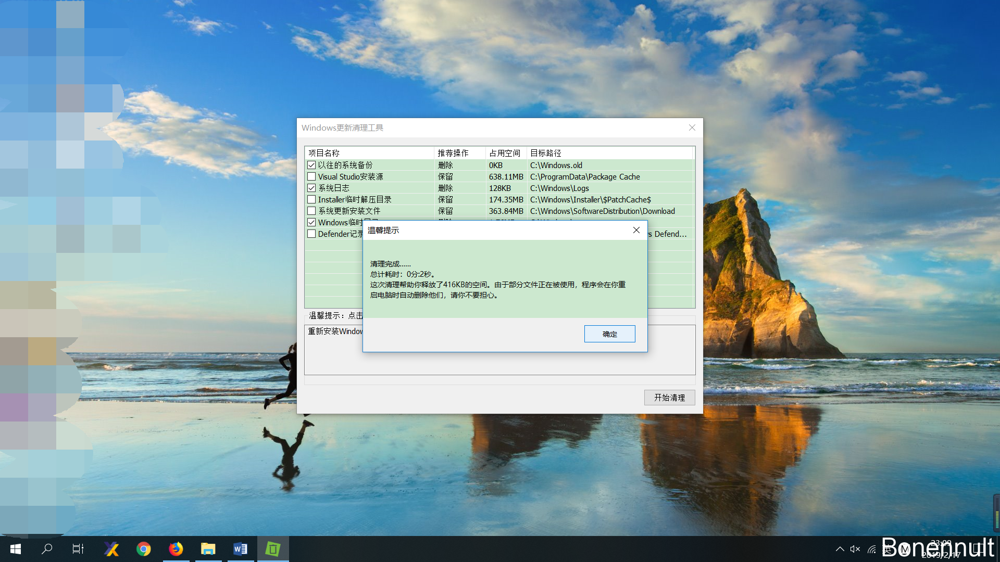
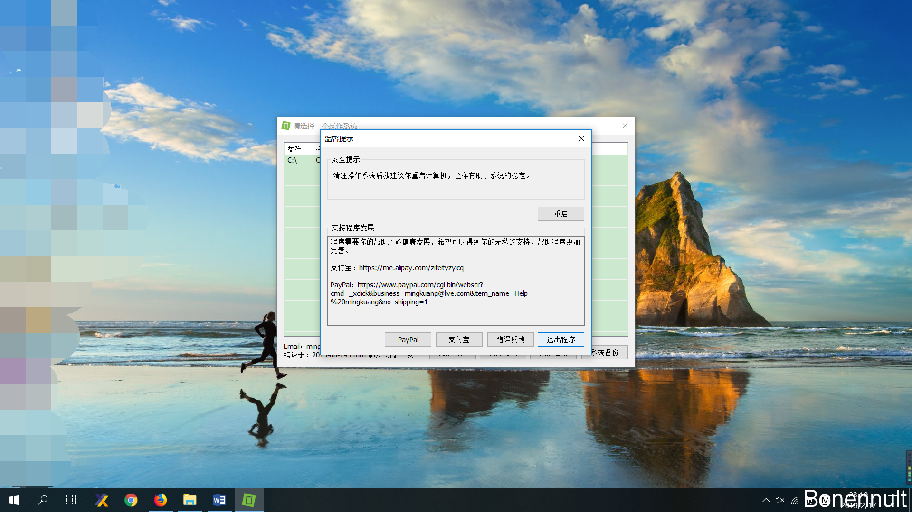

## 批处理代码

> 在网上看到一位大神写的代码，可以清理C盘中的无用文件

可以将下面的代码保存至`LJ.bat`（文件名并不关键）放在桌面，双击运行即可

```
@echo off
echo 正在清除系统垃圾文件，请稍等......
del /f /s /q %systemdrive%\*.tmp
del /f /s /q %systemdrive%\*._mp
del /f /s /q %systemdrive%\*.log
del /f /s /q %systemdrive%\*.gid
del /f /s /q %systemdrive%\*.chk
del /f /s /q %systemdrive%\*.old
del /f /s /q %systemdrive%\recycled\*.*
del /f /s /q %windir%\*.bak
del /f /s /q %windir%\prefetch\*.*
rd /s /q %windir%\temp & md %windir%\temp
del /f /q %userprofile%\cookies\*.*
del /f /q %userprofile%\recent\*.*
del /f /s /q "%userprofile%\Local Settings\Temporary Internet Files\*.*"
del /f /s /q "%userprofile%\Local Settings\Temp\*.*"
del /f /s /q "%userprofile%\recent\*.*"
echo 清除系统LJ完成！
echo. & pause
12345678910111213141516171819
```

## 附：Spacesniffer查看磁盘存储

> 工具：spacesniffer
> spacesniffer可以方便的查看磁盘中各个文件/文件夹占用的内存空间大小，具体的使用很简单，网上也有很多教程了，这里就不再赘述。