# 基于 Hudi 和 Kylin 构建准实时高性能数据仓库

https://zhuanlan.zhihu.com/p/129304060  2020-04-12

---

在近期的 [Apache Kylin × Apache Hudi Meetup ](https://link.zhihu.com/?target=https%3A//kyligence.io/zh/blog/apache-kylin-x-apache-hudi-meetup/)直播上，Apache Kylin PMC Chair 史少锋和 Kyligence 解决方案工程师刘永恒就 Hudi + Kylin 的准实时数仓实现进行了介绍与演示。下文是分享现场的回顾。我的分享主题是《基于 Hudi 和 Kylin 构建准实时、高性能数据仓库》，除了讲义介绍，还安排了 Demo 实操环节。下面是今天的日程：

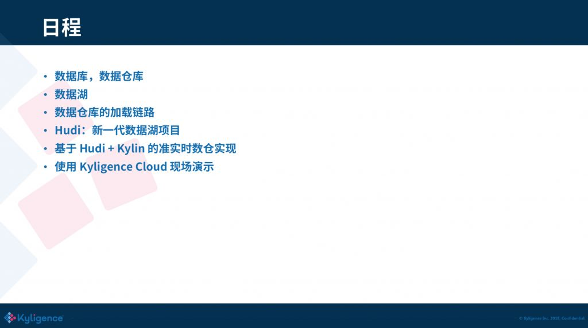

##  01 数据库、数据仓库

先从基本概念开始。我们都知道数据库和数据仓库，这两个概念都已经非常普遍了。数据库 Database，简称 DB，主要是做 OLTP（online transaction processing），也就是在线的交易，如增删改；数据仓库 Data Warehouse，简称 DW，主要是来做OLAP（online analytics processing），也就是在线数据分析。OLTP 的典型代表是 Oracle、MySQL，OLAP 则像 Teradata、Greenplum，近些年有 **ClickHouse、Kylin** 等。

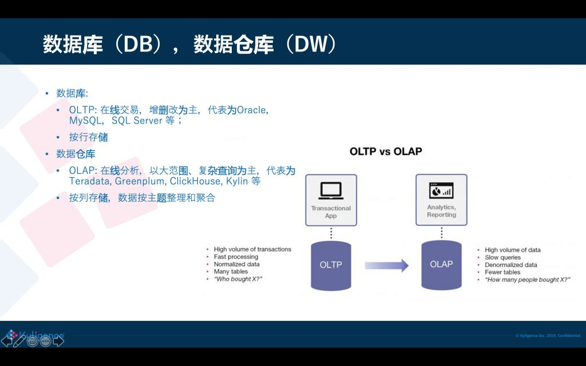

数据库和数据仓库两者在存储实现上是不一样的，数据库一般是按行存，这样可以按行来增加、修改；数据仓库是按列来存储，是为了分析的时候可以高效访问大量的数据，同时跳过不需要的列；这种存储差异导致两个系统难以统一，数据从数据库进入到数据仓库需要一条链路去处理。

##  02 数据湖

近些年出现了数据湖（Data Lake）的概念，简单来说数据湖可以存储海量的、不同格式、汇总或者明细的数据，数据量可以达到 PB 到 EB 级别。企业不仅可以使用数据湖做分析，还可以用于未来的或未曾预判到的场景，因此需要的原始数据存储量是非常大的，而且模式是不可预知的。数据湖产品典型的像 Hadoop 就是早期的数据湖了，现在云上有很多的数据湖产品，比方 Amazon S3，Azure Blob store，阿里云 OSS，以及各家云厂商都有自己的存储服务。有了数据湖之后，企业大数据处理就有了一个基础平台，非常多的数据从源头收集后都会先落到数据湖上，基于数据湖再处理和加载到不同的分析库去。

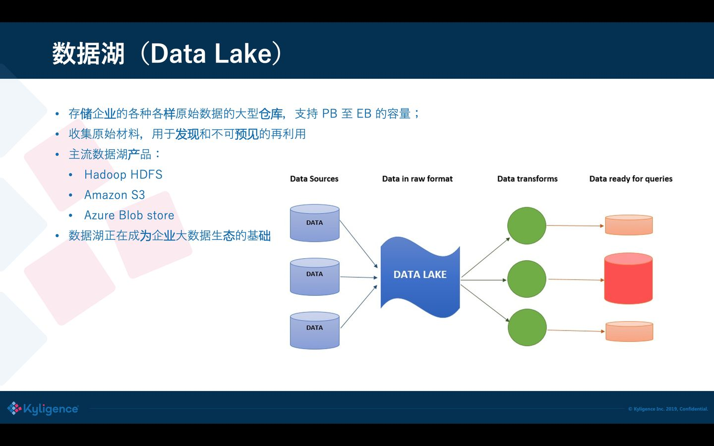

但是，数据湖开始设计主要是用于数据的存储，解决的是容量的水平扩展性、数据的持久性和高可用性，没有太多考虑数据的更新和删除。例如 HDFS 上通常是将文件分块（block）存储，一个 block 通常一两百兆；S3 同样也是类似，大的 block 可以节省管理开销，并且这些文件格式不一，通常没有高效的索引。如果要修改文件中的某一行记录，对于数据湖来说是非常难操作的，因为它不知道要修改的记录在哪个文件的哪个位置，它提供的方式仅仅是做批量替换，代价比较大。

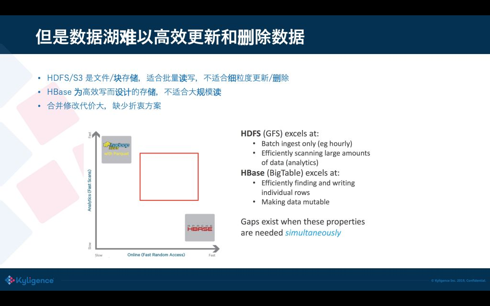

另外一个极端的存储则是像 HBase 这样的，提供高效的主键索引，基于主键就可以做到非常快的插入、修改和删除；但是 HBase 在大范围读的效率比较低，因为它不是真正的列式存储。对于用户来说面临这么两个极端：一边是非常快的读存储（HDFS/S3），一边是非常快速的写存储；如果取中间的均衡比较困难。有的时候却需要有一种位于两者之间的方案：读的效率要高，但写开销不要那么大。

##  03 数据仓库的加载链路

在有这么一个方案之前，我们怎样能够支撑到数据的修改从 OLTP 到 OLAP 之间准实时同步呢？通常大家会想到，通过 CDC/binlog 把修改增量发出来，但 binlog 怎么样进入到 Hive 中去呢？我们知道 Hive 很难很快地修改一条记录，修改只能把整张表或者整个分区重新写一遍。为了接收和准实时消费 binlog，可能需要引入一个只读的 Database 或 MPP 数据库，专门复制上游业务库的修改；然后再从这个中间的数据库导出数据到数据湖上，供下一个阶段使用。这个方案可以减少对业务库的压力和影响，但依然存在一些问题。

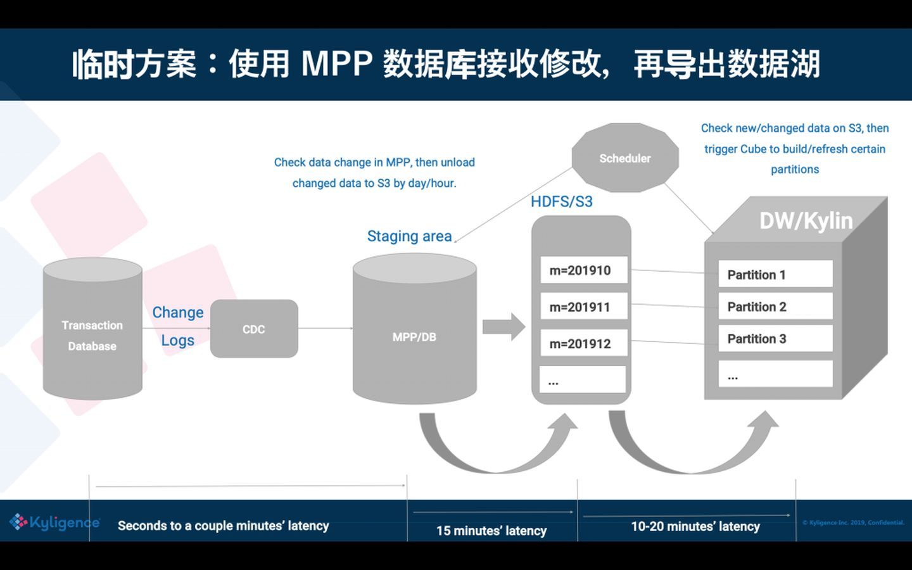

这里有一个生动的例子，是前不久从一个朋友那里看到的，各位可以感受一下。

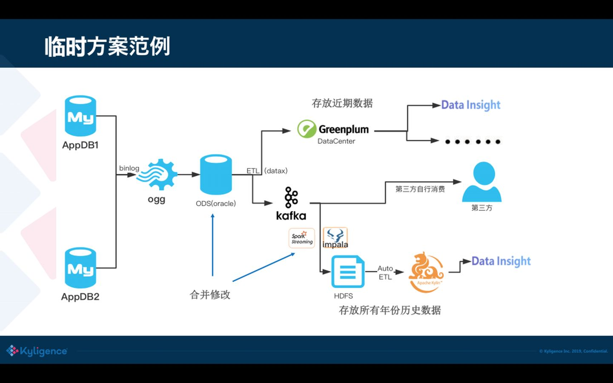

可以看到在过去的方案是非常复杂的，又要用 MPP 又要用数据湖，还要用 Kylin，在这中间数据频繁的被导出导入，浪费是非常严重的，而且维护成本高，容易出错，因为数据湖和数据库之间的文件格式往往还存在兼容性问题。

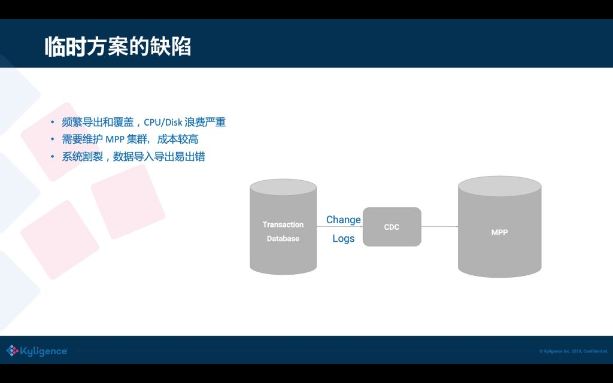

##  04 Hudi：新一代数据湖项目

后来我们注意到 Hudi 这个项目，它的目的就是要在大数据集上支持 Upsert（update+insert）。Hudi 是在大数据存储上的一个数据集，可以将 Change Logs 通过 upsert 的方式合并进 Hudi；Hudi 对上可以暴露成一个普通的 Hive 或 Spark 的表，通过 API 或命令行可以获取到增量修改的信息，继续供下游消费；Hudi 还保管了修改历史，可以做时间旅行或回退；Hudi 内部有主键到文件级的索引，默认是记录到文件的布隆过滤器，高级的有存储到 HBase 索引提供更高的效率。

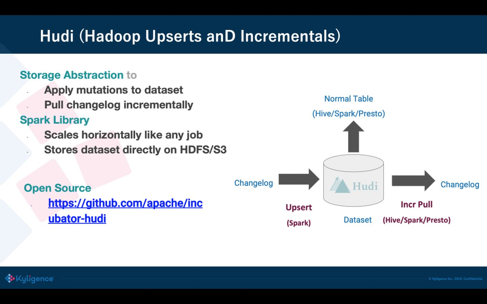

##  05 基于 Hudi+Kylin 的准实时数仓实现

有了 Hudi 之后，可以跳过使用中间数据库或 MPP，直接微批次地增量消费 binlog，然后插入到 Hudi；Hudi 内的文件直接存放到 HDFS/S3 上，对用户来说存储成本可以大大降低，不需要使用昂贵的本地存储。Hudi 表可以暴露成一张 Hive 表，这对 Kylin 来说是非常友好，可以让 Kylin 把 Hudi 当一张普通表，从而无缝使用。Hudi 也让我们更容易地知道，从上次消费后有哪些 partition 发生了修改，这样 Kylin 只要刷新特定的 partition 就可以，从而端到端的数据入库的延迟可以降低到1小时以内。从 Uber 多年的经验来说，**对大数据的统计分析，入库小于 1 小时在大多数场景下都是可以接受的。**

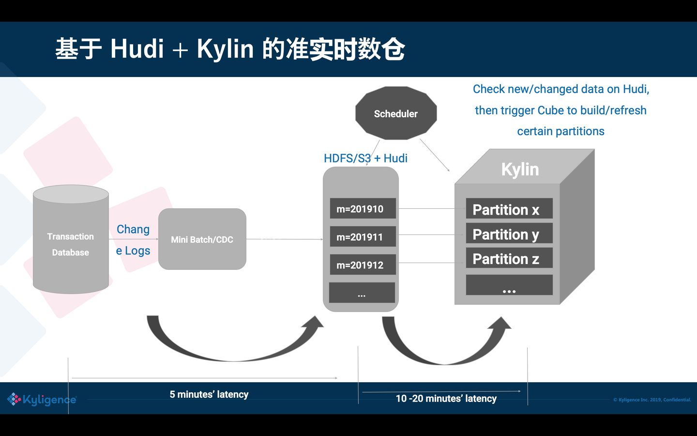

这里再总结一下，使用 Hudi 来做 DW 数据加载的前置存储给我们带来的诸多的好处：首先，它可以支持准实时的插入、修改和删除，对保护用户数据隐私来说是非常关键的（例如 GDPR ）；它还可以控制小文件，减少对 HDFS 的压力；第二，Hudi 提供了多种访问视图，可以根据需要去选择不同的视图；第三，Hudi 是基于开放生态的，存储格式使用 Parquet 和 Avro，目前主要是使用 Spark 来做数据操作，未来也可以扩展；支持多种查询引擎，所以在生态友好性上来说，Hudi 是远远优于另外几个竞品的。

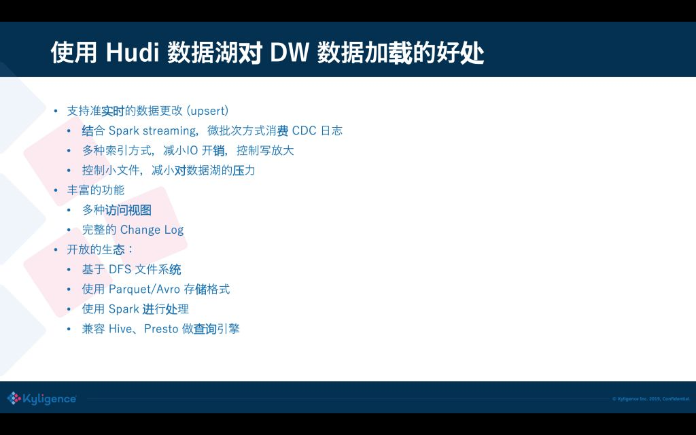

##  06 使用 Kyligence Cloud 现场演示

前面是一个基本的介绍，接下来我们做一个 Live Demo，用到 Kyligence Cloud（基于 Kylin 内核）这个云上的大数据分析平台；你可以一键在 Azure/AWS 上来启动分析集群，内置多种大数据组件来做建模加速，可直接从云上存储或云上的数据库抽取数据，提供了自动的监控和运维。

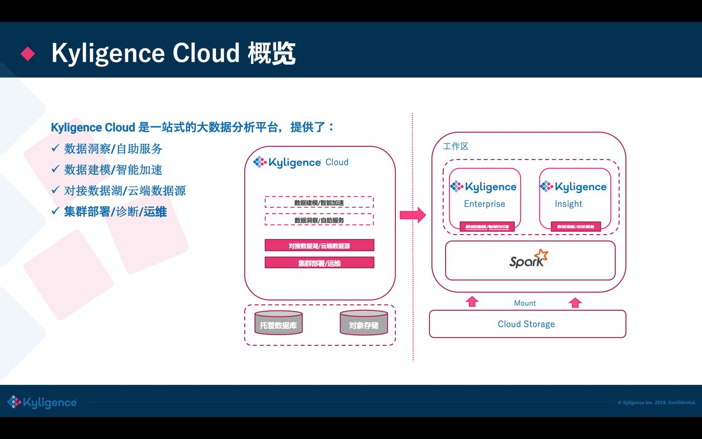

目前 Kyligence Cloud 已经不需要依赖 Hadoop 了，直接使用 VM 来做集群的计算力，内置了 Spark 做分布式计算，使用 S3 做数据存储；还集成了 Kylignece Insight 做可视化分析，底层可以对接常见的数据源，也包括 Hudi，在最新发布版的 Hudi 已经被集成进来了。

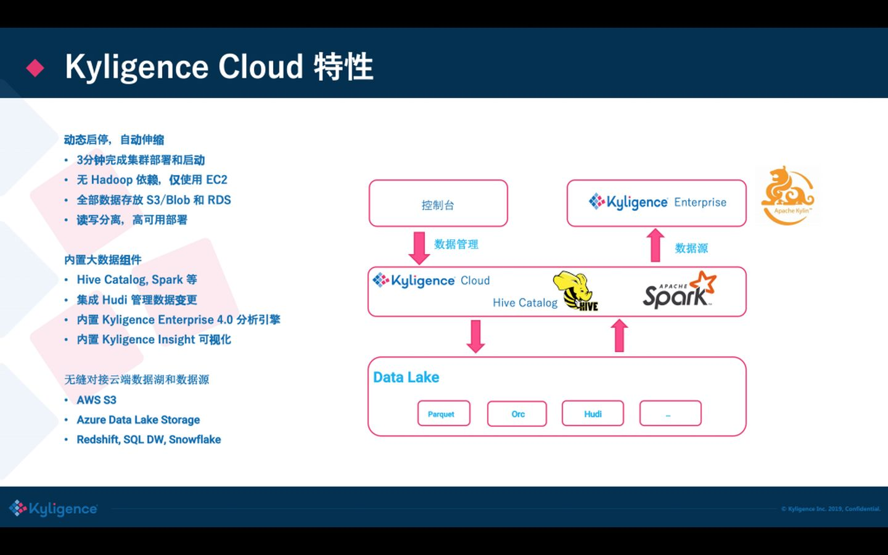

接下来，刘永恒将带来 Live Demo，他是从业务库到处数据加载到 Hudi 中，然后 Hudi 随后就可以从这当中来被访问。接下来他会演示做一些数据修改，再把这个数据修改合并到 Hudi，在 Hudi 中就可以看到这些数据的改变，接下来的时间就交给刘永恒。

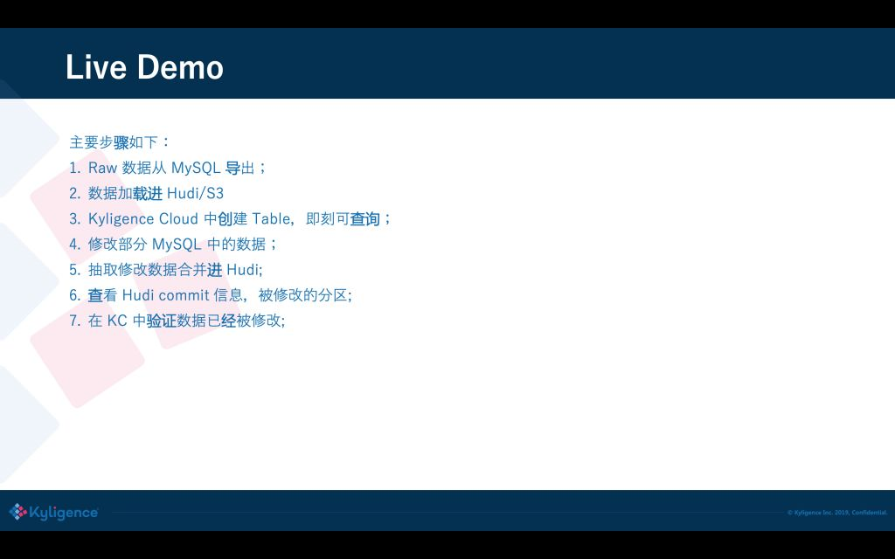

**想了解刘永恒老师的 Demo 详情？**请点击播放下方现场回顾视频，拖动进度条至 19:50 的位置，即可开始观看。

[点击链接观看](https://video.zhihu.com/video/1232715681394565120?player={%22autoplay%22:false,%22shouldShowPageFullScreenButton%22:true})