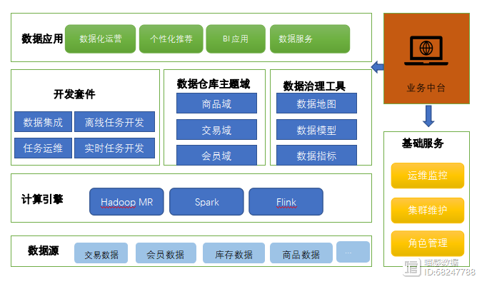
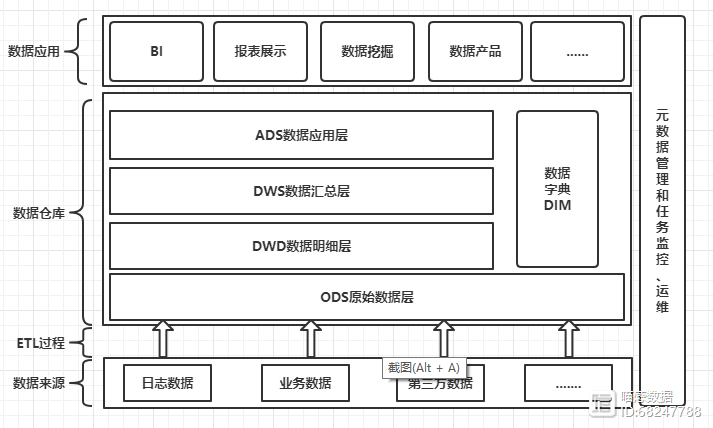
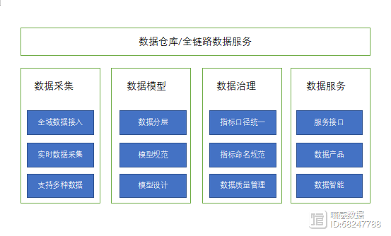

# 数据仓库系统架构和数仓分层体系介绍

http://www.360doc.com/showweb/0/0/999583938.aspx

## 一、数据仓库体系架构

公司借助的第三方数据平台，在此平台之上建设数据仓库。因为第三方平台集成了很多东西，所以省去了不少功夫。

数据仓库的体系架构，无外乎就是**数据源、数据采集方式、计算存储系统、数据应用层**，这几个方面。

### 1、数据源：

内部数据：如交易数据、会员数据，日志数据，由公司业务系统产生的数据。

外部数据：互联网数据和第三方服务商数据等。互联网数据就是我们使用爬虫爬取的互联网数据，而第三方数据，一般多指公司合作方产生的数据。

### 2、采集方式

离线采集，包括**全量同步**和**增量同步**。实时采集，顾名思义就是采用实时的策略采集数据，如我们想统计实时的交易数据。当产生一笔订单存入业务库时，我们可以通过Binlog等多种方式感知数据的变化，把新产生的数据同步的kafka其他消息队列，实时的消费使用数据。

第三方采集，跟公司商务合作的其他公司，他们暴露接口给我们，我们通过接口取数据，当然这只是其中一种方式，不同公司取数据的策略是不一样的。

数据仓库的体系架构图

### 3、存储计算

通过集群的分布式计算能力和分布式文件系统，来计算和存储数据。我们使用的阿里云服务，把业务数据存储到hive中，然后划分为不同的层级，来规划整合数据。借助分布式文件系统可以存储大数据量的数据，包括久远之前的历史数据。

### 4、数据应用

使用HQL、Mapreduce、SparkSql、UDF函数等多种处理方式，对各种业务数据进行处理，形成一定规范模式的数据。把这些建模成型的数据提供给外界使用。如BI应用、挖掘分析、算法模型、可视化大屏系统。

当然最重要的是对数据的管理，数据就是我们的资产，只有管理的有条不紊，使用起来才能得手应心。我们可以建立**数据地图、数据规范、数据质量系统**，配置完整的**任务调度(如Oozie**)。

当然运维方面是必不可少的，如果一个任务失败了，我们需要第一时间知道，这时就需要告警系统。**另外还可以设置角色权限，**整个系统有一个最高权限，还有开发权限，访问权限等等，这个需要根据公司需求来做。

## 二、数据仓库分层

数据仓库分层

### 1、数据仓库分层模式作用

#### 1.1、数据结构化更清晰
对于不同层级的数据，他们作用域不相同，每一个数据分层都有它的作用域，这样我们在使用表的时候能更方便地定位和理解。

#### 1.2、数据血缘追踪
提供给外界使用的是一张业务表，但是这张业务表可能来源很多张表。如果有一张来源表出问题了，我们可以快速准确的定位到问题，并清楚每张表的作用范围。

#### 1.3、减少重复开发
数据分层规范化，开发一些通用的中间层数据，能够减少重复计算，提高单张业务表的使用率。

#### 1.4、简化复杂的问题
把一个复杂的业务分成多个步骤实现，每一层只处理单一的步骤，比较简单和容易理解。而且便于维护数据的准确性，当数据出现问题之后，可以不用修复所有的数据，只需要从有问题的步骤开始修复。有点类似Spark RDD的容错机制。

#### 1.5、减少业务的影响
业务可能会经常变化，这样做就不必改一次业务就需要重新接入数据。

### 2、数据仓库分层介绍

#### 2.1、ODS原始数据层

ODS: Operation Data Store 数据准备区，也称为贴源层。该层保存所有操作数据，不对原始数据做任何处理。在业务系统和数据仓库之间形成一个隔离，源系统数据结构的变化不影响其他数据分层。减轻业务系统被反复抽取的压力，由ODS统一进行抽取和分发。记住ODS层数据要保留数据的原始性。

**处理原则：**

根据源业务系统表的情况以增量或全量方式抽取数据；

ODS层以**流水表和快照表**为主，按日期对数据进行分区保存，不使用拉链表；

ODS层的数据不做清洗和转换，数据的表结构和数据粒度与原业务系统保持一致。

#### 2.2、DWD数据明细层

DWD：Data Warehouse Details 细节数据层，是业务层与数据仓库的隔离层。该层的数据是经由ODS层数据经过清洗、转换后的明细数据，满足对标准化数据需求。如对NULL值处理，对数据字典解析，对日期格式转换，字段合并、脏数据处理、超过极限范围的等。

**处理原则：**

数据结构与ODS层一致，但可以对表结构进行裁剪和汇总等操作；

对数据做清洗、转换；

DWD层的数据不一定要永久保存，具体保存周期视业务情况而定。

#### 2.3、DWS数据汇总层

DWS：Data Warehouse Service 数据服务层数据 按主题对数据进行抽象、归类，提供业务系统细节数据的长期沉淀。这一层是一些汇总后的宽表，是根据DWD层数据按照各种维度或多种维度组合，把需要查询的一些事实字段进行汇总统计。可以满足一些特定查询、数据挖掘应用，面向业务层面，根据需求进行汇总。

**处理原则：**

面向全局、数据整合；

存放最全的历史数据，业务发生变化时易于扩展，适应复杂的实际业务情况；

尽量减少数据访问时的计算量，优化表的关联。维度建模，星形模型；

事实拉宽，度量预先计算， 基本都是快照表。反规范化，有数据冗余。

#### 2.4、ADS数据明细层

ADS：ApplicationData Service，该应用层是根据业务需要，由DWD、DWS数据统计而出的结果，可以直接提供查询展现，或导入至Oracle等关系型数据库中使用。这一层的数据会面向特定的业务部门，不同的业务部门使用不同的数据，支持数据挖掘。

**处理原则：**

形式各式，主要按不同的业务需求来处理；

保持数据量小，定时刷新数据；

数据同步到不同的关系型数据库或hbase等其他数据库中。

提供最终数据，来满足业务人员、数据分析人员的数据需求。