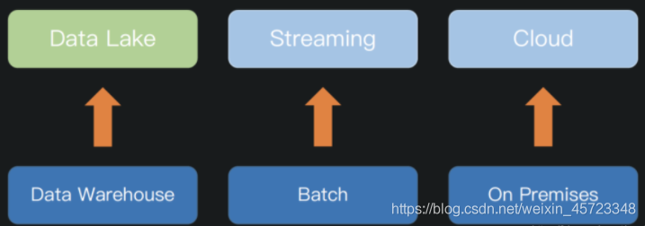
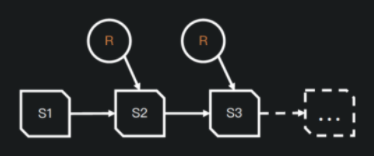
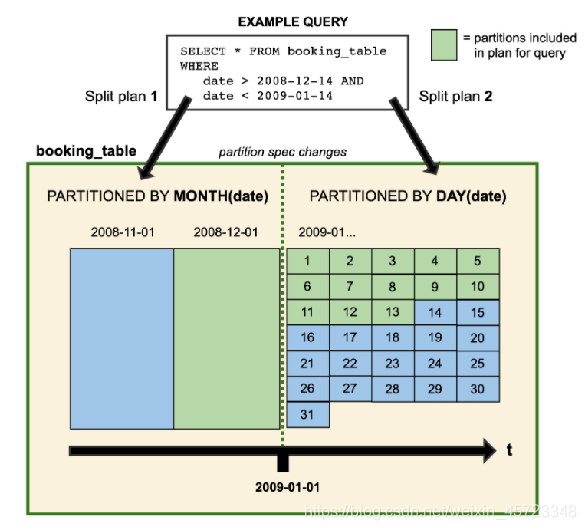
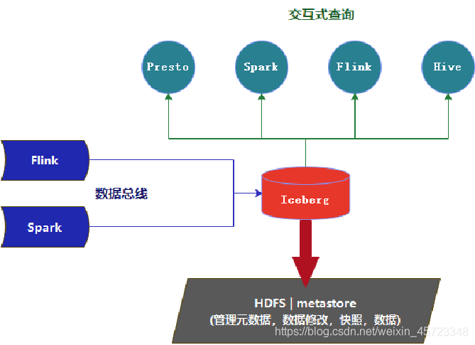
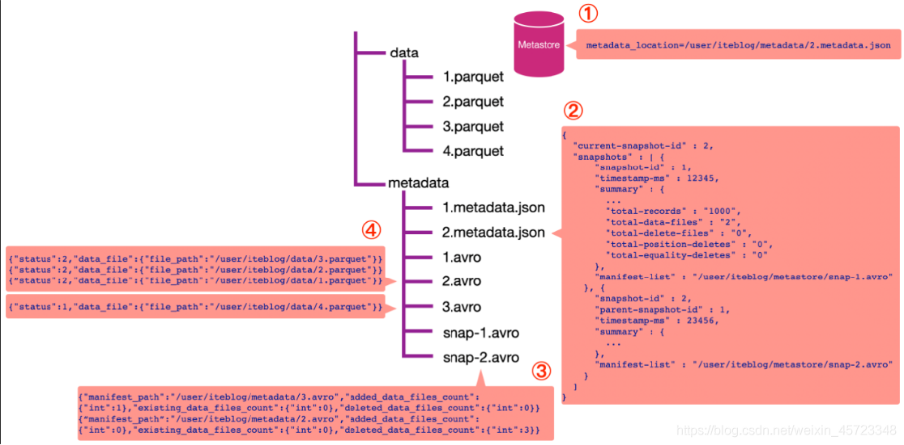
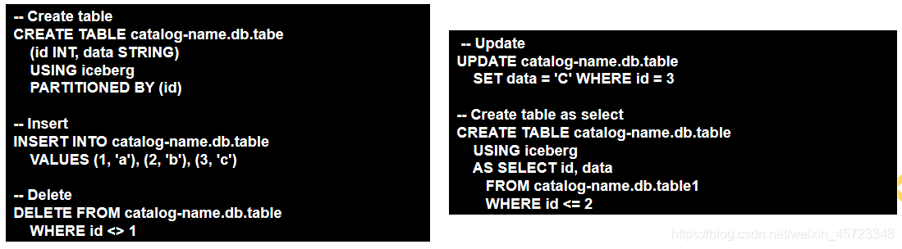
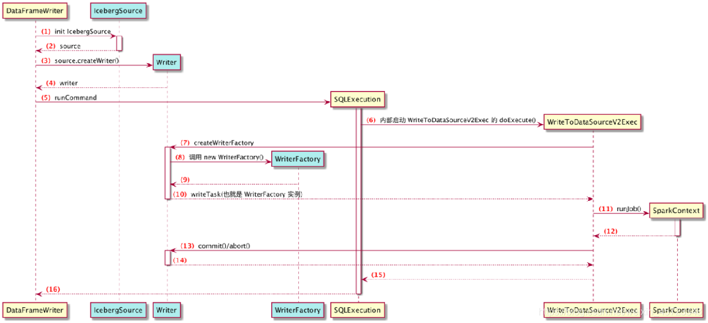
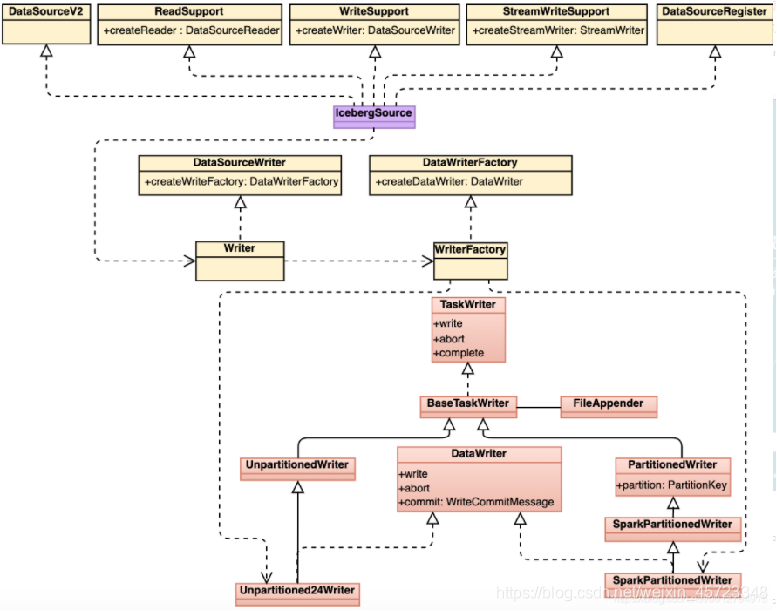

# Apache Iceberg分享

https://blog.csdn.net/weixin_45723348/article/details/115328406   2021-03-30 

---

## 1. Iceberg概念与原理
### 1.1 大数据的趋势



**当前大数据发展的三大趋势：**

- 数据仓库往数据湖方向发展
- 批处理往流式处理发展
- 本地部署往云模式发展

**数据湖具备哪些特性呢？**

- 同时支持流批处理
- 支持数据更新
- 支持事务（ACID）
- 可扩展的元数据
- 数据质量保障
- 支持多种存储引擎
- 支持多种计算引擎
## 1.2 Apache Iceberg的原理
一种用于跟踪超大规模表的新格式，是专门为对象存储（如S3）而设计的。

**核心思想：在时间轴上跟踪表的所有变化。**

### 1.2.1 Iceberg原理简介
**优化数据入库流程：**Iceberg 提供 ACID 事务能力，上游数据写入即可见，不影响当前数据处理任务，这大大简化了 ETL；Iceberg 提供了 upsert、merge into 能力，可以极大地缩小数据入库延迟；

**支持更多的分析引擎：**目前 Iceberg 支持的计算引擎有 Spark、Flink、Presto 以及 Hive。

**统一数据存储和灵活的文件组织：**提供了基于流式的增量计算模型和基于批处理的全量表计算模型。批处理和流任务可以使用相同的存储模型，数据不再孤立；Iceberg 支持隐藏分区和分区进化，方便业务进行数据分区策略更新。支持 Parquet、Avro 以及 ORC 等存储格式。

**增量读取处理能力**：Iceberg 支持通过流式方式读取增量数据，支持 Structed Streaming 以及 Flink table Source。




- 快照隔离
- 基于文件列表的所有修改都是原子操作
- 实现基于快照的跟踪方式
- 表的元数据是不可修改的，并且始终向前迭代
- 当前的快照可以回退。

### 1.2.2 Iceberg简介
Apache Iceberg is an open table format for huge analytic datasets. Iceberg adds tables to Trino and Spark that use a high-performance format that works just like a SQL table.

**——设计初衷是:以类似于SQL的形式高性能的处理大型的开放式表。**


**特点：**

- 格式演变：支持添加，删除，更新或重命名，并且没有副作用
- 隐藏分区：可以防止导致错误提示或非常慢查询的用户错误
- 分区布局演变：可以随着数据量或查询模式的变化而更新表的布局
- 快照控制：可实现使用完全相同的表快照的可重复查询，或者使用户轻松检查更改
- 版本回滚：使用户可以通过将表重置为良好状态来快速纠正问题
- 快速扫描数据：无需使用分布式SQL引擎即可读取表或查找文件
- 数据修剪优化 ：使用表元数据使用分区和列级统计信息修剪数据文件
- 兼容性好 ：可以存储在任意的云存储系统和HDFS中
- 支持事务 ：序列化隔离，表更改是原子性的，读取操作永远不会看到部分更改或未提交的更改
- 高并发：高并发写入使用乐观并发，即使写入冲突，也会重试以确保兼容更新成功

### 1.2.3 Iceberg中常用术语

#### 数据文件（data files）

数据文件（data files）是 Apache Iceberg 表真实存储数据的文件，一般是在表的数据存储目录的 data 目录下。每次更新会产生多个数据文件。

#### 清单文件（Manifest file）

清单文件其实是**元数据文件**，其里面列出了组成某个快照（snapshot）的数据文件列表。每行都是每个数据文件的详细描述，包括数据文件的状态、文件路径、分区信息、列级别的统计信息（比如每列的最大最小值、空值数等）、文件的大小以及文件里面数据的行数等信息。其中列级别的统计信息在 Scan 的时候可以为算子下推提供数据，以便可以过滤掉不必要的文件。每次更新会产生多个清单文件。

#### 清单列表（Manifest list）

清单列表也是**元数据文件**，其里面存储的是清单文件的列表，每个清单文件占据一行。每行中存储了清单文件的路径、清单文件里面存储数据文件的分区范围、增加了几个数据文件、删除了几个数据文件等信息。这些信息可以用来在查询时提供过滤。每次更新都会产生一个清单列表文件。

#### 快照（Snapshot）

快照代表一张表在某个时刻的状态。每个快照里面会列出表在某个时刻的所有**数据文件列表**。Data files 是存储在不同的 manifest files 里面， manifest files 是存储在一个 Manifest list 文件里面，**而一个 Manifest list 文件代表一个快照。**

### 1.2.4 Iceberg优化点

#### 隐藏分区

Iceberg不需要用户维护的分区列，所以它可以隐藏分区。分区值每次都会正确生成，并在可能时始终用于加速查询。生产者和消费者甚至都看不到event_date。

最重要的是，查询不再取决于表的物理布局。通过物理和逻辑之间的分隔，Iceberg表可以随着数据量的变化随着时间的推移发展分区方案。错误配置的表可以得到修复，而无需进行昂贵的迁移。



#### 表优化-列信息收集

- 隐式分区优化表结构 , 可以灵活快速的处理表数据 。
- Iceberg使用唯一的ID来跟踪表中的每一列。添加列时，将为其分配新的ID，因此不会错误地使用现有数据。
- Iceberg中的**每次操作都会记录成快照和时间戳**,方便数据更新和增量查询。
- 修改后的表结构和修改前的表结构是可以**共存**的。
- 分区演变是**一个元数据操作**，不会急于重写文件。

## 2. Iceberg实战

### 2.1 安装

Iceberg 使用嵌入式程序的方式工作, 在使用的时候只需要添加响应的 jar包,指定响应的工作类即可运行工作。

下载地址: http://iceberg.apache.org/releases/



### 2.2 读流程

**查询最新快照的数据：**



1. 通过数据库名和表名，从 Hive 的 MetaStore 里面拿到表的信息。从表的属性里面其实可以拿到
   **metadata_location** 属性，通过这个属性可以拿到 iteblog 表的 Iceberg 的 metadata相关路径，这个也就是上图步骤①的 **/user/iteblog/metadata/2.metadata.json**。
2. 解析 **/user/iteblog/metadata/2.metadata.json** 文件，里面可以拿到当前表的快照id（current-snapshot-id），以及这张表的所有快照信息，也就是 JOSN 信息里面的 snapshots数组对应的值。从上图可以看出，当前表有两个快照，id 分别为 1 和 2。
    - 快照 1 对应的清单列表文件为 **/user/iteblog/metastore/snap-1.avro**；
    - 快照 2 对应的清单列表文件为 **/user/iteblog/metastore/snap-2.avro**。
3. 如果我们想读取表的最新快照数据，从 **current-snapshot-id** 可知，当前最新快照的 ID 等于 2，所以我们只需要解析 **/user/iteblog/metastore/snap-2.avro** 清单列表文件即可。从上图可以看出，snap-2.avro 这个**清单列表**文件里面有两个**清单文件**，分别为
    - /user/iteblog/metadata/3.avro
    - /user/iteblog/metadata/2.avro
> 注意，除了清单文件的路径信息，还有 三个属性: 
> - added_data_files_count
> - existing_data_files_count
> - deleted_data_files_count

Iceberg 其实是根据 **deleted_data_files_count** 大于 0 来判断对应的清单文件里面是不是被删除的数据。由于上图 **/user/iteblog/metadata/2.avro** 清单文件的 **deleted_data_files_count** 大于 0 ，所以读数据的时候就无需读这个**清单文件**里面对应的**数据文件**。在这个场景下，读取最新快照数据只需要看下 **/user/iteblog/metadata/3.avro** 清单文件里面对应的数据文件即可。

5. 这时候 Iceberg 会解析 **/user/iteblog/metadata/3.avro** 清单文件，里面其实就只有一行数据，也就是 **/user/iteblog/data/4.parquet**，所以我们读 iteblog 最新的数据其实只需要读 **/user/iteblog/data/4.parquet** 数据文件就可以了。

**查询某个快照的数据：**

在 Spark 中这么写–>

```java
spark.read
	.option("snapshot-id", 1L)
    .format("iceberg")
    .load("path/to/table")
```

**根据时间戳查看某个快照的数据：**
在 Spark 中这么写–>

```java
spark.read
	.option("as-of-timestamp", 123456)
    .format("iceberg")
    .load("path/to/table")
```

## 2.3 写流程

**Spark 写 Iceberg 表的过程：**

Spark2.4 可以通过 DataFrameWriter 并指定 iceberg 作为 format 来写入 Iceberg table，并支持 **append 和overwrite 两种模式：**


Spark 3.0可以省去 DataFrameReader 和创建 local temporary view 的步骤，直接通过Spark SQL进行操作：



Spark 2.4 可以通过DataFrame读取或修改已经存在的Iceberg table中的数据，**但建表、删表等DDL操作只能通过Iceberg API完成**；

Spark 3.0 访问Iceberg table的能力是Spark 2.4的超集，可以通过Spark SQL配合catalog，进行SELECT、DDL和DML等更多的操作。

**Spark Driver端流程：**



DataSourceV2Strategy#apply() --> case WriteToDataSourceV2 --> WriteToDataSourceV2Exec#run() --> V2TableWriteExec#writeWithV2（sparkContext.runJob(））--> DataWritingSparkTask#run(里面有commit,abort,close标配方法) --> writerFactory.createWriter(partId, taskId)

写数据到 Iceberg 使用了 Spark 的 DataSourceV2 相关读写 API，读写的入口类为 org.apache.iceberg.spark.source.IcebergSource

**Spark Executor端流程：**




DataWritingSparkTask#run -->  writerFactory.createWriter(创建分为分区与不分区的writer)

