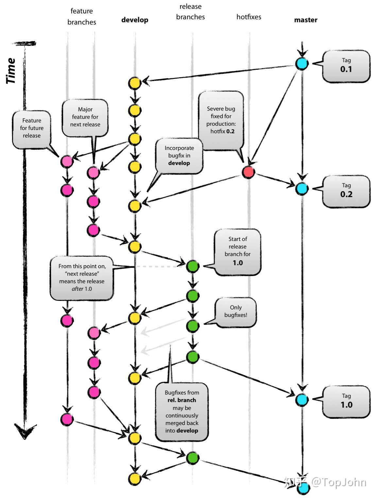
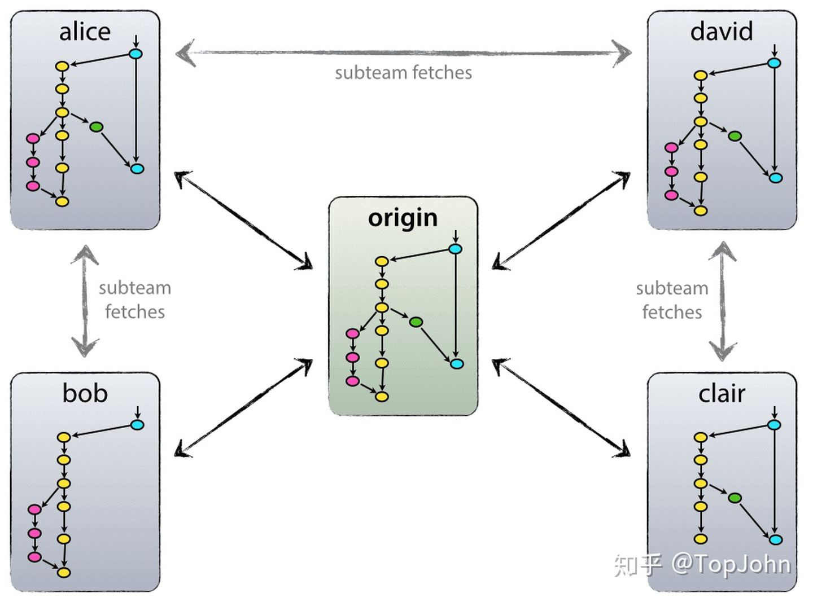
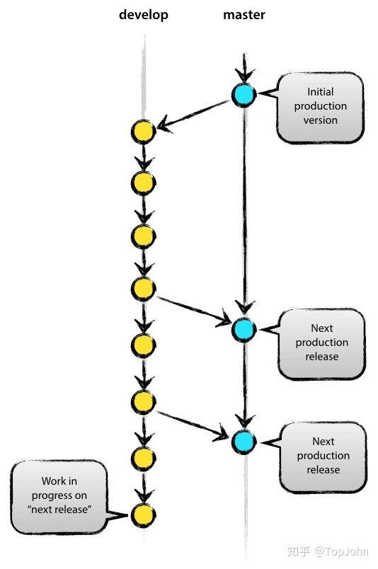
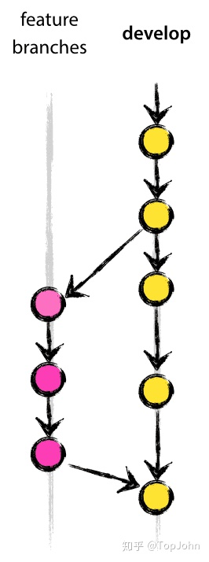
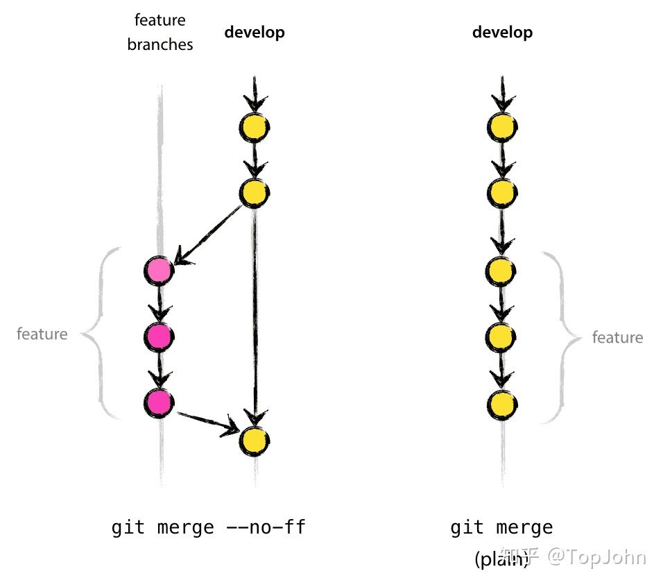
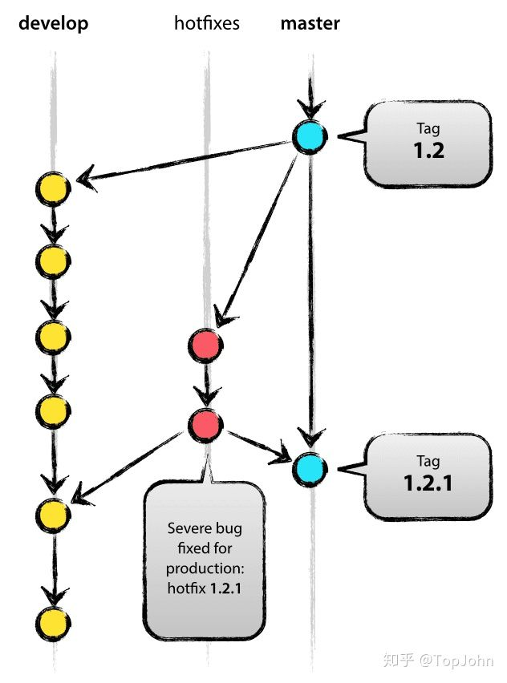

# 一个成功的Git分支模型

> 本文翻译至：[https://nvie.com/posts/a-successful-git-branching-model/](https://link.zhihu.com/?target=https%3A//nvie.com/posts/a-successful-git-branching-model/)
>
> 版权归作者所有，商业使用请联系作者

在这篇文章中，我将介绍一下在一年前非常成功的不仅是工作也包括私人项目的开发模型。我一直想写关于开发模型相关的内容，但是从来没有像现在这么强烈。在这里，我并不想将任何项目的细节，仅仅是想表达关于分支策略以及发布管理相关的内容。




## 为什么选择git?

有关Git与集中式源代码控制系统的优缺点讨论，请参阅[网站](https://git.wiki.kernel.org/index.php/GitSvnComparsion)。在代码的控制系统中，硝烟弥漫。作为一个开发者，在今天，相比于其他工具我更喜欢Git。Git真的改变了开发者对合并和分支的想法。从我来看经典的CVS/Subversion世界，合并/分支通常被认为是令人害怕的（“小心合并冲突，它们会咬你！”），而且是每过一段时间都会做的事情。

但是对于Git来说，这些操作是极其廉价和简单的，它们真的被认为是您日常工作流程中的核心部分之一。例如，在CVS/Subversion[书籍](https://svnbook.red-bean.com/)中，分支和合并在后续的章节中首次讨论（而且是对于高级用户），但是在[Git](https://pragprog.com/titles/tsgit/pragmatic-version-control-using-git)书籍中，它们在第三章中就出现了（基础部分）。

由于其简单和重复的性质，分支和合并变得不再那么可怕。版本控制工具应该比其他任何东西更有助于分支/合并。

当我们有了足够的了解，让我们进入开发模型中去。我将在这里呈现的模型实质上只是一套每个团队成员都应该遵循的软件开发模式。

## 分散但集中

我们使用的仓库和分支模型配合得不错，是一个可信的中心化的仓库，这里指的是初始化的远程仓库。不过要注意，这是唯一的一个被认为是中央库的仓库（因为Git是一个分布式的版本管理系统，在技术层面上来讲没有一个中心化的仓库）。我们会把这个仓库称为origin（原始库），因为它的名字对所有用户来说都比较熟悉。





每一个开发者将代码拉取或者推送到origin（原始库）中。但是除了集中式的推拉关系之外，每个开发者也可以从其他节点获取变更来形成子团队。举个例子，当两个或者更多的开发者一起开发一个新特性，这将变得非常有用，可以避免过早地将代码推送到原始库中。在上图中，Alice和Bob是一个子团队，Alice和David是一个子团队，Clair和David是一个子团队。

在技术上，这意味着Alice定义了一个远程分支，叫做bob，指向了Bob的仓库，反之亦然。

## 主分支

在核心部分，开发模式很大程度受到了传统模型的影响。中央库一直维护2个可以无限延伸的分支：

- master 分支
- develop 分支





在原始库中，master分支应该被所有用户所熟知。和master分支并行的还有另一个分支叫做develop分支。

我们把 origin/maste r分支作为主分支，这个分支代码的HEAD指针总是指向**生产版本**代码的一个准备状态。

我们把 origin/develop 分支作为一个反映下一次需要交付的代码变更的分支。有人会叫develop分支为“集成分支”。这是所有夜间自动构建的出处。

当源代码在develop分支中到达一个稳定的状态之后，已经准备好发布了，那么所有的变更应该以某种方式被**合并回 master 分支。同时打上版本号**。这个操作会在后续进行详细讲解。

因此，**每次当变更被合并到主分支的时候，将定义一个新的生产版本。我们对此非常严格，**因此从理论上来说，我们可以使用Git hook脚本在每次对 maste r分支进行提交代码的时候进行构建和在你的生产服务器上发布你的软件。

## 辅助分支

接下来，除了 master 分支和 develop 分支你的开发模型上需要使用一系列的辅助分支来帮助团队的成员平行地开发，轻松地追踪一些特性，为生产发布做准备，并帮助快速修复生产版本代码的问题。不像主分支，这些分支的生命周期是有限的，因为**它们最终将会被移除。**

我们使用不同类型的分支：

- Feature 分支
- Release 分支
- Hotfix 分支

这些分支每一个都有特定的目的以及严格的规则，例如什么分支可以作为它们的原始分支，什么分支可以作为他们合并的目标。接下来我们将展开讨论。

从技术角度来讲，这些分支绝对不是“特殊的”。这些分支的类型取决于我们如何去使用它们。它们同样是平凡的Git分支。

## 功能分支（feature branches）

**功能分支可能从develop分支分离出来，但是必须合并到develop分支中去**。

**功能分支的命名规范：**

**除了master, develop, release-*****,或者 hotfix-*** **之外的名字都可以。**




功能分支（或者有时候叫做主题分支）是被用来开发即将发布或者未来版本的新功能的分支。在开发新功能的时候，目标的需要合并的发布版本可能在那个时候还不确定。功能分支的本质是它存在于新功能开发的过程中，最终将被合并到develop开发分支中去（为一个发布版本添加一个新特性）或者被丢弃（在实验情况令人失望的情况下）。

**功能分支通常仅存在于开发人员的仓库中，而不是远程的原始库中**。


### 创建一个功能分支

当要开发一个新功能的时候，一般都是从develop分支检出一个新分支。

```bash
$ git checkout -b myfeature develop Switched to a new branch "myfeature" 
```


### 合并一个已经完成的分支到develop分支

完成的功能将会被合并到develop分支，以确保将它们添加到即将发布的版本中；

```bash
$ git checkout develop 
Switched to branch 'develop' 
$ git merge --no-ff myfeature 
Updating ea1b82a..05e9557 (Summary of changes) 
$ git branch -d myfeature 
Deleted branch myfeature (was 05e9557). 
$ git push origin develop 
```

**--no-ff** 标志-将导致创建一个新的 commit 标志，即使合并可以使用 fast-forward 模式。这可以**避免丢失功能分支的历史信息**并将新特性和所有的提交合并到一起。比较：



在后一种情况，是不可能从Git历史中看到哪些提交记录实现了这个功能，你必须通过手动读取所有的 log 记录才能获取到相关信息。**恢复整个功能（即一组提交）**，在后一种情况下是真的很头疼，但是如果使用了--no-ff标志就很容易完成。

虽然将多处几个（空的）提交记录，但是它的收益远大于成本。


## 发布分支（Release branches）


可能一个release分支是从develop分支切出来的，但是它必须被合并到 develop 或者maste r分支上去，分支的命名惯例一般是：`release-*`

**Release分支用于支持新的生产版本的发布**。**它允许在最后做一些点缀或者小修改**。**此外，它们允许修复小错误并且准备发布的元数据（例如版本号，构建日期等**）。通过在发布分支上完成所有这些工作，develop分支将更明确地准备下一个大版本的发布。

从 develop 分支创建 release 分支的关键时刻是 develop 分支达到了一个想要发布的理想状态。至少这次想要发布的特性必须被合并到 develop 分支在切出 release 分支之前。所有打算在未来发布的版本中特性需要在 release 分支切出来之后在合并进去。

在release分支开始的时候为即将发布的版本分配一个版本号，而不是在release分支之前。直到那一刻，develop分支反映的变化都是为了下一次发版，但是在release分支切出来之前，至于下一次发版是 0.3 还是 1.0 是不清楚的。**这个决定是在release分支开始的时候根据项目的规定定的，版本号也是根据项目的要求定的。**


### 创建一个release分支

Release分支从develop分支创建。举个例子，假设 1.1.5 版本是当前的生产分支，我们即将推出一个大版本。目前 develop 分支的状态是已经好为下一个 release 做好了准备，并且决定下一个版本将是1.2 版（而不是1.1.6 或者 2.0）。所以我们切出分支，并且附上一个新的版本号：

```bash
$ git checkout -b release-1.2 develop 
Switched to a new branch "release-1.2" 

$ ./bump-version.sh 1.2 
Files modified successfully, version bumped to 1.2. 

$ git commit -a -m "Bumped version number to 1.2" 
[release-1.2 74d9424] Bumped version number to 1.2 1 files changed, 1 insertions(+), 1 deletions(-) 
```

在创建并切换到 release分支之后，我们设置了版本号。这里，bump-version.sh 虚构了一个shell脚本，改变一些文件来指向一个新的版本。（这里当然可以手动修改一些文件来表明某些文件变了）然后，设置的版本号就被提交了。

这个新分支会存在一段时间，直到发布版本被正式推出。在这段时间，问题修复将在这个分支进行（而不是在develop分支）。**在这里进行一些大的新特性的添加是不被允许的。它们必须被合并到develop分支，等待下一次大版本的发布**。


### 完成release分支

当release分支的状态到达了一个真正的发布版本的时候，我们需要进行一些操作，以便完成这次发布。首先，release分支需要被合并到master分支中（**因为根据定义 master 上的每一次提交都是一次新的发布，记住**）。接下来，在master上的这个提交必须被打上标记，以便将来参考此历史版本。最终，在release分支上的变更需要合并到develop分支上去，以便后续的发布能够包含这些问题修复。

Git 中的前两步是：

```bash
$ git checkout master 
Switched to branch 'master'

$ git merge --no-ff release-1.2 
Merge made by recursive. (Summary of changes) 

$ git tag -a 1.2 
```

这次发布就算完成了，标记将用于未来的引用。

> 编辑：你可能还想以加密方式用 -s 或者 -u  标志来对标记进行签名。


在Git中，为了保持这次发布中的变更，我们需要将这些变更合并到develop分支中去：

```bash
$ git checkout develop
Switched to branch 'develop'

$ git merge --no-ff release-1.2 
Merge made by recursive. (Summary of changes) 
```

这个步骤可能导致一些合并冲突（可能由于我们改变了版本号）。如果发生了，需要修复重新提交。

现在我们已经完成，发布分支或许需要被移除，因为我们不再需要这个分支：

```bash
$ git branch -d release-1.2 
Deleted branch release-1.2 (was ff452fe). 
```


## 热修复分支（Hotfix branches）

热修复分支可能来源于 master 分支，但是必须被合并到 develop 和 master 分支，

分支命名惯例：**hotfix-***



Hotfix分支非常像release分支，它们都是为一个新的生产分支做准备的，尽管Hotfix是计划之外的。它们源于生产版本一些不被期望的状态。在生产版本出现了严重的错误需要立刻被修复，一个热修复分支需要根据 master 分支上生产版本的标记进行切出。

**本质是团队的其他成员可以继续在 develop 分支上开发，与此同时需要有一个人来在Hotfix分支上进行bugfix。**


### 创建热修复分支（hotfix branch）

热修复分支从 master 分支上创建。举个例子，1.2 版本是当前运行的生产版本，由于严重的错误导致了一些问题。但是现在 develop 分支是不稳定的。我们需要切出一个hotfix分支开始修复问题：

```bash
$ git checkout -b hotfix-1.2.1 master 
Switched to a new branch "hotfix-1.2.1" 

$ ./bump-version.sh 1.2.1 
Files modified successfully, version bumped to 1.2.1. 

$ git commit -a -m "Bumped version number to 1.2.1" 
[hotfix-1.2.1 41e61bb] Bumped version number to 1.2.1 1 files changed, 1 insertions(+), 1 deletions(-) 
```

在创建完分支之后**不要忘记更新版本号！**


接下来，修复错误，提交一个或者多个记录。

```bash
$ git commit -m "Fixed severe production problem" 
[hotfix-1.2.1 abbe5d6] Fixed severe production problem 5 files changed, 32 insertions(+), 17 deletions(-) 
```


### 完成热修复分支

当完成了，bugfix需要合并到master分支，但是为了保障下次发布版本能够包含bugfix，**同样需要被合并到develop分支**。 这和 release 分支的实现是类似的。

首先，更新master分支并打上发布标签：

```bash
$ git checkout master 
Switched to branch 'master' 

$ git merge --no-ff hotfix-1.2.1 
Merge made by recursive. (Summary of changes) 

$ git tag -a 1.2.1 
```

> 编辑：你可能还想以加密方式用 -s 或者 -u 标志来对标记进行签名。


接下来，将bugfix合并到开发分支，同样：

```bash
$ git checkout develop 
Switched to branch 'develop' 

$ git merge --no-ff hotfix-1.2.1 
Merge made by recursive. (Summary of changes) 
```

规则的一个**例外是**：**当一个 release 分支已经存在的情况下，热修复分支的变动需要合并到release分支中，而不是develop分支**。 在release分支发布完成的时候，如果将错误修复合并到了 release 分支同样也会反映到 develop 分支中。（如果develop分支立刻需要这个问题修复而且等不及release分支修复，那么你可以安然地合并问题修复到develop分支中。）

最终，移除这个临时的hotfix分支：

```bash
$ git branch -d hotfix-1.2.1 
Deleted branch hotfix-1.2.1 (was abbe5d6). 
```


## 总结

虽然这个分支模型没有什么令人震惊的地方，但是在文章开头的这张大图在你的项目中是非常有用的。这形成了一个优雅的思维模型，而且是非常容易让人理解的，允许团队成员建立一个共同的分支和发布的模型。


此处提供一个高质量的[PDF版本](https://link.zhihu.com/?target=https%3A//nvie.com/files/Git-branching-model.pdf)。把它挂墙上以便随时参考。

更新：如果有人需要的话：这里是文章中Git图片的源文件[gitflow-model.src.key](https://link.zhihu.com/?target=http%3A//github.com/downloads/nvie/gitflow/Git-branching-model-src.key.zip)

[作者GitHub项目](https://github.com/nvie/gitflow)

---

# git-flow

A collection of Git extensions to provide high-level repository operations for Vincent Driessen's [branching model](http://nvie.com/git-model).

## Getting started

For the best introduction to get started with `git flow`, please read Jeff Kreeftmeijer's blog post:

<http://jeffkreeftmeijer.com/2010/why-arent-you-using-git-flow/>

Or have a look at one of these screen casts:

- [How to use a scalable Git branching model called git-flow](http://buildamodule.com/video/change-management-and-version-control-deploying-releases-features-and-fixes-with-git-how-to-use-a-scalable-git-branching-model-called-gitflow) (by Build a Module)
- [A short introduction to git-flow](http://vimeo.com/16018419) (by Mark Derricutt)
- [On the path with git-flow](http://codesherpas.com/screencasts/on_the_path_gitflow.mov) (by Dave Bock)

## Installing git-flow

See the Wiki for up-to-date [Installation Instructions](https://github.com/nvie/gitflow/wiki/Installation).

## Integration with your shell

For those who use the [Bash](http://www.gnu.org/software/bash/) or [ZSH](http://www.zsh.org/) shell, please check out the excellent work on the [git-flow-completion](http://github.com/bobthecow/git-flow-completion) project by [bobthecow](http://github.com/bobthecow). It offers tab-completion for all git-flow subcommands and branch names.

## FAQ

See the [FAQ](http://github.com/nvie/gitflow/wiki/FAQ) section of the project Wiki.